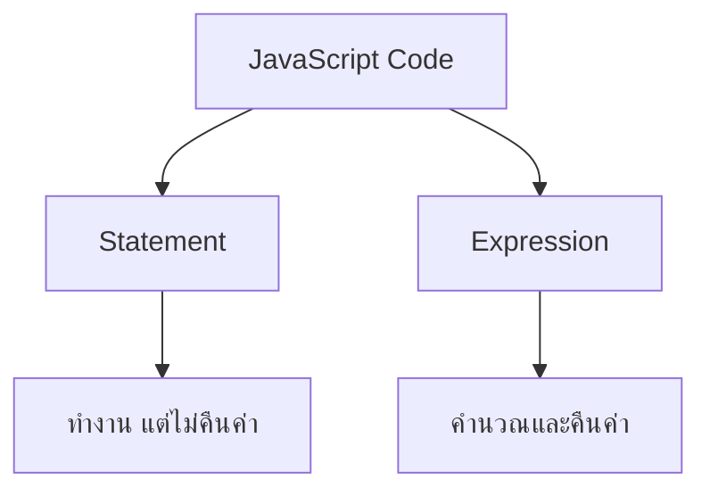

# ทบทวนการใช้งาน JavaScript สำหรับ Cypress และ K6

## 📋 สารบัญ
- [การติดตั้งและตั้งค่าโปรเจค](#การติดตั้งและตั้งค่าโปรเจค)
- [ตัวแปรและการประกาศ](#ตัวแปรและการประกาศ)
- [Statement vs Expression](#statement-vs-expression)
- [Template Literal](#template-literal)
- [Object และ Array](#object-และ-array)
- [Functions และ Arrow Functions](#functions-และ-arrow-functions)
- [Destructuring](#destructuring)
- [Rest และ Spread Operators](#rest-และ-spread-operators)
- [Optional Chaining และ Nullish Coalescing](#optional-chaining-และ-nullish-coalescing)
- [ES Modules](#es-modules)

---

## 🚀 การติดตั้งและตั้งค่าโปรเจค

### สร้างโปรเจค Node.js
```bash
# สร้างโฟลเดอร์โปรเจค
mkdir JS_Demo
cd JS_Demo

# สร้างไฟล์ package.json
npm init
```

### ตั้งค่า ES Modules
**📝 ปรับปรุงจากเดิม:** เพิ่มการอธิบายความแตกต่างระหว่าง CommonJS และ ES Modules

ใน `package.json` เพิ่ม:
```json
{
  "type": "module",
  "scripts": {
    "dev": "node --watch main.mjs"
  }
}
```

**🔍 เหตุผลที่ใช้ ES Modules:**
- ✅ เป็นมาตรฐานสากล (ECMAScript)
- ✅ syntax ที่ทันสมัยและอ่านง่าย
- ✅ รองรับ static analysis ได้ดี
- ❌ CommonJS เป็นระบบเก่าของ Node.js เท่านั้น

### สร้างไฟล์หลัก
สร้างไฟล์ `main.mjs`:
```javascript
console.log("Hello World");
```

### รันโปรเจค
```bash
# รันแบบปกติ
node main.mjs

# รันแบบ watch mode (รีสตาร์ทอัตโนมัติเมื่อไฟล์เปลี่ยน)
npm run dev
```

---

## 📦 ตัวแปรและการประกาศ

### วิธีการประกาศตัวแปร
**📝 ปรับปรุงจากเดิม:** เพิ่มตารางเปรียบเทียบและตัวอย่างที่ชัดเจน

| ประเภท | สามารถเปลี่ยนค่า | Block Scope | แนะนำให้ใช้ |
|--------|------------------|-------------|-------------|
| `var` | ✅ | ❌ | ❌ หลีกเลี่ยง |
| `let` | ✅ | ✅ | ✅ เมื่อต้องเปลี่ยนค่า |
| `const` | ❌ | ✅ | ⭐ แนะนำมากที่สุด |

### ตัวอย่างการใช้งาน

```javascript
// ❌ หลีกเลี่ยงการใช้ var
var oldStyle = "ไม่แนะนำ";

// ✅ ใช้ const เมื่อไม่ต้องเปลี่ยนค่า
const name = "สมชาย";
const age = 25;

// ✅ ใช้ let เมื่อต้องเปลี่ยนค่า
let counter = 0;
counter = 1; // เปลี่ยนค่าได้
```

### Block Scope
**📝 ปรับปรุงจากเดิม:** เพิ่มการแสดงผลและอธิบายให้เข้าใจง่าย

```javascript
const a = 1;

{
  const a = 2; // ตัวแปรใหม่ในบล็อกนี้
  console.log(a); // แสดง: 2
}

console.log(a); // แสดง: 1 (ไม่เปลี่ยน)

// ❌ จะ Error - ไม่สามารถประกาศซ้ำในบล็อกเดียวกัน
// const a = 3;
```

**💡 เคล็ดลับ:** ใช้ `const` เป็นหลัก ถ้าต้องเปลี่ยนค่าค่อยเปลี่ยนเป็น `let`

---

## 🎭 Statement vs Expression

### ความแตกต่างพื้นฐาน
**📝 ปรับปรุงจากเดิม:** เพิ่มการแยกประเภทและตัวอย่างที่หลากหลาย



### Statement (คำสั่ง)
```javascript
// Declaration Statement
const name = "สมชาย";

// If Statement
if (1 > 0) {
  console.log("1 มากกว่า 0");
}

// Loop Statement
for (let i = 0; i < 3; i++) {
  console.log(i);
}
```

### Expression (นิพจน์)
```javascript
// Arithmetic Expression
1 + 2        // คืนค่า: 3

// Comparison Expression
5 > 3        // คืนค่า: true

// Ternary Expression
1 > 0 ? "มากกว่า" : "น้อยกว่า"  // คืนค่า: "มากกว่า"
```

### การใช้งานใน Template Literal
```javascript
const greeting = "Hello";
const result = `${greeting} ${1 + 1} World`; // "Hello 2 World"

// ❌ ใส่ Statement ไม่ได้
// const wrong = `${const x = 1}`;

// ✅ ใส่ Expression ได้
const correct = `${Math.max(1, 2, 3)}`; // "3"
```

---

## 📝 Template Literal

### Syntax พื้นฐาน
**📝 ปรับปรุงจากเดิม:** เพิ่มตัวอย่างการใช้งานจริงและเปรียบเทียบ

```javascript
const name = "สมชาย";
const age = 25;

// วิธีเก่า (String Concatenation)
const oldWay = "สวัสดี " + name + " อายุ " + age + " ปี";

// วิธีใหม่ (Template Literal)
const newWay = `สวัสดี ${name} อายุ ${age} ปี`;
```

### Multi-line String
```javascript
// วิธีเก่า
const oldMultiline = "บรรทัดที่ 1\n" +
                     "บรรทัดที่ 2\n" +
                     "บรรทัดที่ 3";

// วิธีใหม่
const newMultiline = `บรรทัดที่ 1
บรรทัดที่ 2
บรรทัดที่ 3`;
```

### ตัวอย่างการใช้งานจริง
```javascript
const user = { name: "สมหญิง", score: 85 };

const reportCard = `
=== รายงานผลการเรียน ===
ชื่อ: ${user.name}
คะแนน: ${user.score}
เกรด: ${user.score >= 80 ? 'A' : user.score >= 70 ? 'B' : 'C'}
สถานะ: ${user.score >= 60 ? 'ผ่าน' : 'ไม่ผ่าน'}
`;

console.log(reportCard);
```

---

## 🏗️ Object และ Array

### Object (วัตถุ)
**📝 ปรับปรุงจากเดิม:** เพิ่มการอธิบาย Reference vs Value และตัวอย่างที่ใช้งานได้จริง

```javascript
// การสร้าง Object
const person = {
  name: "สมชาย",
  age: 25,
  city: "กรุงเทพ"
};

// การเข้าถึงข้อมูล
console.log(person.name);        // สมชาย
console.log(person["age"]);      // 25

// การแก้ไขข้อมูล
person.age = 26;
person["city"] = "เชียงใหม่";
```

### Array (อาร์เรย์)
```javascript
const fruits = ["แอปเปิล", "กล้วย", "ส้ม"];

// การเข้าถึงข้อมูล
console.log(fruits[0]);    // แอปเปิล
console.log(fruits.length); // 3

// การแก้ไขข้อมูล
fruits[1] = "มะม่วง";
console.log(fruits);       // ["แอปเปิล", "มะม่วง", "ส้ม"]
```

### Reference vs Value
**📝 เพิ่มใหม่:** อธิบายเรื่องที่สำคัญแต่มักเข้าใจผิด

```javascript
// Primitive Types (เก็บค่าจริง)
let a = 5;
let b = a;    // copy ค่า
a = 10;
console.log(b); // ยังคงเป็น 5

// Objects (เก็บ reference)
const obj1 = { count: 5 };
const obj2 = obj1;    // copy reference
obj1.count = 10;
console.log(obj2.count); // เป็น 10 ด้วย!

// ใช้ const แต่ยังแก้ไขได้
const settings = { theme: "dark" };
settings.theme = "light"; // ✅ ทำได้
// settings = {}; // ❌ Error!
```

### การแสดงผลด้วยไดอะแกรม
```mermaid
graph LR
    A[obj1] --> C[Object in Memory]
    B[obj2] --> C
    C --> D[{count: 10}]
```

---

## ⚡ Functions และ Arrow Functions

### Function Declaration
**📝 ปรับปรุงจากเดิม:** เพิ่มการเปรียบเทียบรูปแบบต่างๆ และข้อดีข้อเสีย

```javascript
// Traditional Function
function add(a, b) {
  return a + b;
}

// Function Expression
const add2 = function(a, b) {
  return a + b;
};

// Arrow Function
const add3 = (a, b) => {
  return a + b;
};

// Arrow Function (Short form)
const add4 = (a, b) => a + b;
```

### การเปรียบเทียบ Arrow Function

| รูปแบบ | เหมาะสำหรับ | ข้อจำกัด |
|--------|-------------|----------|
| Function Declaration | ฟังก์ชันหลัก, Hoisting | ยาว |
| Arrow Function | Callback, Short function | ไม่มี `this` binding |

### ตัวอย่างการใช้งานจริง
```javascript
const numbers = [1, 2, 3, 4, 5];

// Traditional way
const doubled1 = numbers.map(function(num) {
  return num * 2;
});

// Arrow function way
const doubled2 = numbers.map(num => num * 2);
const doubled3 = numbers.map(num => {
  console.log(`Processing: ${num}`);
  return num * 2;
});

console.log(doubled2); // [2, 4, 6, 8, 10]
```

### เมื่อไหร่ควรใช้ Arrow Function
```javascript
// ✅ ดีสำหรับ callback functions
const filtered = users.filter(user => user.age > 18);

// ✅ ดีสำหรับ simple operations
const calculate = (x, y) => x * y + 10;

// ❌ ไม่เหมาะสำหรับ methods ที่ต้องใช้ this
const obj = {
  name: "test",
  // ❌ จะไม่ทำงานตามที่คาดหวัง
  getName: () => this.name,
  // ✅ ใช้ function ปกติ
  getName2: function() { return this.name; }
};
```

---

## 🎯 Destructuring

### Object Destructuring
**📝 ปรับปรุงจากเดิม:** เพิ่มตัวอย่างซับซ้อนและการใช้งานจริง

```javascript
const person = {
  name: "สมเสร็จ",
  age: 99,
  sex: "male",
  address: {
    city: "กรุงเทพ",
    zipcode: "10110"
  }
};

// Basic destructuring
const { name, age } = person;

// กับ default values
const { height = 170, weight = 65 } = person;

// เปลี่ยนชื่อตัวแปร
const { sex: gender } = person;

// Nested destructuring
const { address: { city, zipcode } } = person;

console.log(name, age, gender, city); // สมเสร็จ 99 male กรุงเทพ
```

### Array Destructuring
```javascript
const colors = ["แดง", "เขียว", "น้ำเงิน", "เหลือง"];

// Basic destructuring
const [first, second] = colors;

// Skip elements
const [, , third] = colors;

// กับ default values
const [a, b, c, d, e = "ม่วง"] = colors;

// Swap variables
let x = 1, y = 2;
[x, y] = [y, x]; // x=2, y=1

console.log(first, third, e); // แดง น้ำเงิน ม่วง
```

### การใช้ในฟังก์ชัน
**📝 เพิ่มใหม่:** ตัวอย่างการใช้งานจริงในฟังก์ชัน

```javascript
// Object destructuring ใน parameters
function createUser({ name, age, email = "ไม่ระบุ" }) {
  return {
    fullName: name,
    userAge: age,
    contact: email
  };
}

const userData = createUser({
  name: "สมหญิง",
  age: 28
});

// Array destructuring กับ return multiple values
function getCoordinates() {
  return [13.7563, 100.5018]; // lat, lng ของกรุงเทพ
}

const [latitude, longitude] = getCoordinates();
```

---

## 🎛️ Rest และ Spread Operators

### Rest Operator (...)
**📝 ปรับปรุงจากเดิม:** เพิ่มตัวอย่างการใช้งานใน functions และ best practices

```javascript
// Object rest
const person = { name: "สมชาย", age: 25, city: "กรุงเทพ", job: "โปรแกรมเมอร์" };
const { name, ...otherInfo } = person;

console.log(name);      // สมชาย
console.log(otherInfo); // { age: 25, city: "กรุงเทพ", job: "โปรแกรมเมอร์" }

// Array rest
const [first, ...remaining] = [1, 2, 3, 4, 5];
console.log(first);     // 1
console.log(remaining); // [2, 3, 4, 5]
```

### Function Parameters กับ Rest
```javascript
// Traditional way
function sum() {
  let total = 0;
  for (let i = 0; i < arguments.length; i++) {
    total += arguments[i];
  }
  return total;
}

// Modern way with rest
function sum(...numbers) {
  return numbers.reduce((total, num) => total + num, 0);
}

console.log(sum(1, 2, 3, 4, 5)); // 15

// Mixed parameters
function greet(greeting, ...names) {
  return `${greeting} ${names.join(", ")}`;
}

console.log(greet("สวัสดี", "สมชาย", "สมหญิง")); // สวัสดี สมชาย, สมหญิง
```

### Spread Operator (...)
```javascript
// Array spreading
const arr1 = [1, 2, 3];
const arr2 = [4, 5, 6];
const combined = [...arr1, ...arr2]; // [1, 2, 3, 4, 5, 6]

// Object spreading
const defaults = { theme: "dark", language: "th" };
const userPrefs = { language: "en", fontSize: 14 };
const finalSettings = { ...defaults, ...userPrefs };
// { theme: "dark", language: "en", fontSize: 14 }

// Function arguments
const numbers = [1, 8, 9, 11, 2];
const maxNumber = Math.max(...numbers); // 11

// Copy arrays/objects
const originalArray = [1, 2, 3];
const copiedArray = [...originalArray]; // shallow copy

const originalObject = { a: 1, b: 2 };
const copiedObject = { ...originalObject }; // shallow copy
```

### ตัวอย่างการใช้งานจริง
**📝 เพิ่มใหม่:** สถานการณ์จริงที่ใช้ใน development

```javascript
// API Response handling
const apiResponse = {
  data: { name: "สมชาย", age: 25 },
  meta: { page: 1, total: 100 },
  status: "success"
};

const { data, ...metadata } = apiResponse;

// Configuration merging
const defaultConfig = {
  timeout: 5000,
  retries: 3,
  baseURL: "https://api.example.com"
};

function createClient(userConfig = {}) {
  return { ...defaultConfig, ...userConfig };
}

const client = createClient({ timeout: 10000 });
// { timeout: 10000, retries: 3, baseURL: "https://api.example.com" }
```

---

## 🔍 Optional Chaining และ Nullish Coalescing

### Optional Chaining (?.)
**📝 ปรับปรุงจากเดิม:** เพิ่มตัวอย่างซับซ้อนและการใช้งานกับ APIs

```javascript
const user = {
  name: "สมชาย",
  social: {
    line: "somchai_line",
    facebook: "somchai.fb"
  }
};

// ❌ แบบเก่า - อาจเกิด Error
// console.log(user.social.twitter.handle); // TypeError!

// ✅ แบบใหม่ - ปลอดภัย
console.log(user.social?.twitter?.handle); // undefined

// ใช้กับ Arrays
const users = [
  { name: "สมชาย", contacts: ["email", "phone"] },
  { name: "สมหญิง" } // ไม่มี contacts
];

console.log(users[0]?.contacts?.[0]); // "email"
console.log(users[1]?.contacts?.[0]); // undefined

// ใช้กับ Functions
const api = {
  auth: {
    login: (user) => `Logging in ${user}`
  }
};

console.log(api.auth?.login?.("สมชาย")); // "Logging in สมชาย"
console.log(api.auth?.logout?.("สมชาย")); // undefined
```

### Nullish Coalescing (??)
```javascript
// ความแตกต่างระหว่าง || และ ??

const config = {
  timeout: 0,
  retries: null,
  debug: false,
  apiKey: ""
};

// ❌ ใช้ || - ปัญหากับ falsy values
const timeout1 = config.timeout || 5000;        // 5000 (ไม่ใช่ 0!)
const debug1 = config.debug || true;             // true (ไม่ใช่ false!)

// ✅ ใช้ ?? - เฉพาะ null/undefined เท่านั้น
const timeout2 = config.timeout ?? 5000;        // 0 ✓
const retries2 = config.retries ?? 3;           // 3 ✓
const debug2 = config.debug ?? true;             // false ✓
const apiKey2 = config.apiKey ?? "default-key"; // "" ✓
```

### การใช้งานร่วมกัน
**📝 เพิ่มใหม่:** แพทเทิร์นที่ใช้บ่อยใน real-world applications

```javascript
// API Response handling
async function fetchUserProfile(userId) {
  try {
    const response = await fetch(`/api/users/${userId}`);
    const data = await response.json();
    
    return {
      name: data?.user?.name ?? "ไม่ระบุชื่อ",
      email: data?.user?.email ?? "ไม่มีอีเมล",
      avatar: data?.user?.profile?.avatar ?? "/default-avatar.png",
      lastLogin: data?.user?.lastLogin ?? "ไม่เคยล็อกอิน"
    };
  } catch (error) {
    return {
      name: "ไม่ระบุชื่อ",
      email: "ไม่มีอีเมล",
      avatar: "/default-avatar.png",
      lastLogin: "ไม่เคยล็อกอิน"
    };
  }
}

// Configuration with nested defaults
const appConfig = {
  theme: userPrefs?.theme ?? systemTheme?.theme ?? "light",
  language: userPrefs?.language ?? browserLanguage ?? "th",
  notifications: {
    email: userPrefs?.notifications?.email ?? true,
    push: userPrefs?.notifications?.push ?? false
  }
};
```

---

## 📦 ES Modules

### Export แบบต่างๆ
**📝 ปรับปรุงจากเดิม:** เพิ่มโครงสร้างไฟล์และ best practices

#### Named Export
```javascript
// utils.mjs
export const PI = 3.14159;
export const DEFAULT_COLOR = "white";

export function calculateArea(radius) {
  return PI * radius * radius;
}

export class Circle {
  constructor(radius) {
    this.radius = radius;
  }
  
  getArea() {
    return calculateArea(this.radius);
  }
}
```

#### Default Export
```javascript
// Calculator.mjs
export default class Calculator {
  add(a, b) { return a + b; }
  subtract(a, b) { return a - b; }
  multiply(a, b) { return a * b; }
  divide(a, b) { return b !== 0 ? a / b : null; }
}
```

### Import แบบต่างๆ

```javascript
// main.mjs

// Named imports
import { PI, calculateArea, Circle } from './utils.mjs';

// Default import
import Calculator from './Calculator.mjs';

// Namespace import
import * as Utils from './utils.mjs';

// Mixed import
import Calculator, { PI, DEFAULT_COLOR } from './Calculator.mjs';

// Rename imports
import { calculateArea as getCircleArea } from './utils.mjs';

// ตัวอย่างการใช้งาน
const calc = new Calculator();
const circle = new Circle(5);

console.log(`π = ${PI}`);
console.log(`5 + 3 = ${calc.add(5, 3)}`);
console.log(`พื้นที่วงกลม = ${circle.getArea()}`);
console.log(`ใช้ namespace: ${Utils.PI}`);
```

### โครงสร้างไฟล์แนะนำ
**📝 เพิ่มใหม่:** การจัดระเบียบไฟล์ในโปรเจคจริง

```
project/
├── src/
│   ├── components/
│   │   ├── Button.mjs
│   │   └── Modal.mjs
│   ├── utils/
│   │   ├── math.mjs
│   │   ├── string.mjs
│   │   └── index.mjs  // barrel export
│   ├── services/
│   │   ├── api.mjs
│   │   └── auth.mjs
│   └── main.mjs
├── tests/
└── package.json
```

#### Barrel Export Pattern
```javascript
// utils/index.mjs
export * from './math.mjs';
export * from './string.mjs';
export { default as ApiService } from '../services/api.mjs';

// การใช้งาน
import { calculateArea, capitalize, ApiService } from './utils/index.mjs';
```

### Best Practices
**📝 เพิ่มใหม่:** คำแนะนำสำหรับการใช้งานจริง

#### ✅ ควรทำ
```javascript
// ชื่อไฟล์สื่อความหมาย
import UserService from './services/UserService.mjs';
import { validateEmail, formatPhone } from './utils/validators.mjs';

// Group imports
import React from 'react';
import ReactDOM from 'react-dom';

import UserService from './services/UserService.mjs';
import { validateEmail } from './utils/validators.mjs';

// ใช้ default export สำหรับ main class/function
export default class UserManager { }

// ใช้ named export สำหรับ utilities
export const CONFIG = { };
export function helper() { }
```

#### ❌ ไม่ควรทำ
```javascript
// ❌ import ทั้งหมดโดยไม่จำเป็น
import * as Everything from './large-library.mjs';

// ❌ ชื่อไฟล์ไม่สื่อความหมาย
import Thing from './stuff.mjs';

// ❌ มี default export หลายตัว (ไม่ได้)
export default class A { }
export default class B { } // Error!
```

---

## 🎯 สรุปสำหรับทีม

### ✨ สิ่งที่ปรับปรุงเพิ่มเติมจากเดิม

1. **📊 เพิ่มตารางเปรียบเทียบ** - ทำให้เห็นความแตกต่างได้ชัดเจน
2. **🎨 เพิ่ม Mermaid diagrams** - แสดงความสัมพันธ์ได้เข้าใจง่าย
3. **💼 ตัวอย่างการใช้งานจริง** - ไม่ใช่แค่ syntax แต่เป็นโค้ดที่ใช้ได้จริง
4. **⚠️ เพิ่ม Best Practices** - บอกว่าควรทำและไม่ควรทำอะไร
5. **🔍 อธิบาย Reference vs Value** - แนวคิดสำคัญที่มักเข้าใจผิด
6. **📁 โครงสร้างโปรเจค** - แนะนำการจัดระเบียบไฟล์
7. **🚀 การตั้งค่า Development Environment** - ครบทุกขั้นตอน

### 🎯 การประยุกต์ใช้กับ Cypress และ K6

**สำหรับ Cypress:**
- ใช้ Arrow Functions ใน commands
- Destructuring สำหรับ response data
- Optional Chaining กับ DOM elements
- ES Modules สำหรับ custom commands

**สำหรับ K6:**
- Template Literals สำหรับ dynamic URLs
- Spread Operator สำหรับ merge configurations
- ES Modules สำหรับ shared utilities
- Rest parameters สำหรับ flexible test data

### 📚 แหล่งข้อมูลเพิ่มเติม

- [MDN JavaScript Guide](https://developer.mozilla.org/en-US/docs/Web/JavaScript/Guide)
- [ES6 Features](https://github.com/lukehoban/es6features)
- [Node.js ES Modules](https://nodejs.org/docs/latest-v18.x/api/esm.html)

---

**💡 หมายเหตุ:** เอกสารนี้ปรับปรุงจากเนื้อหาต้นฉบับ โดยเพิ่มความละเอียด ตัวอย่างการใช้งานจริง และ best practices เพื่อให้ทีมสามารถนำไปประยุกต์ใช้ได้ทันที
