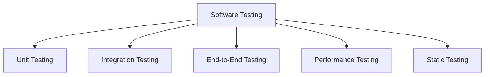
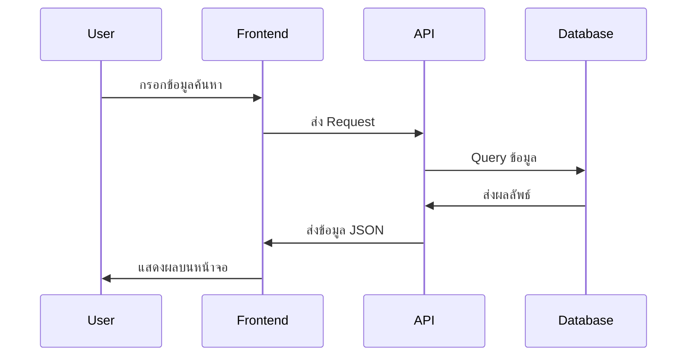
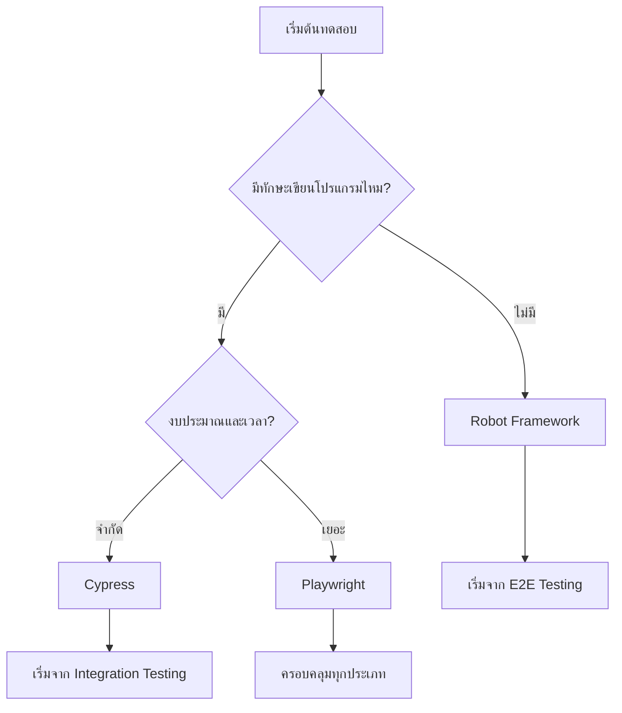

# Software Testing Techniques (เทคนิคการทดสอบซอฟต์แวร์)

## 📋 สารบัญ
- [รูปแบบการทดสอบต่างๆ](#รูปแบบการทดสอบต่างๆ)
- [Component Testing และ Unit Testing](#component-testing-และ-unit-testing)
- [Integration Testing](#integration-testing)
- [End-to-End Testing](#end-to-end-testing)
- [Testing Pyramid vs Testing Trophy](#testing-pyramid-vs-testing-trophy)
- [Static Testing](#static-testing)
- [เครื่องมือทดสอบแต่ละประเภท](#เครื่องมือทดสอบแต่ละประเภท)

---

## 🔍 รูปแบบการทดสอบต่างๆ

ในการพัฒนาซอฟต์แวร์ เรามีรูปแบบการทดสอบหลายประเภท แต่ละประเภทมีความสำคัญและเลเวลการทดสอบที่แตกต่างกัน:



### 📱 ตัวอย่างหน้าจอเว็บแอปพลิเคชัน

สมมติเรามีหน้าจอแบบนี้:

```
┌─────────────────────────────────┐
│  🔍 [Search Box Component]      │
├─────────────────────────────────┤
│  📄 Article List Component      │
│  • บทความที่ 1                  │
│  • บทความที่ 2                  │
│  • บทความที่ 3                  │
└─────────────────────────────────┘
```

---

## 🧩 Component Testing และ Unit Testing

### Unit Testing คืออะไร?
**Unit Testing** = การทดสอบแค่ **หน่วยเดียว** (ส่วนเล็กที่สุด)

#### ✅ การปรับแก้เพิ่มเติม: ตัวอย่างการทดสอบแต่ละประเภท

**1. การทดสอบ Function**
```javascript
// ฟังก์ชันที่ต้องการทดสอบ
function calculateTotal(price, tax) {
  return price + (price * tax);
}

// Unit Test
test('calculateTotal should return correct total', () => {
  expect(calculateTotal(100, 0.07)).toBe(107);
});
```

**2. การทดสอบ Component**
```javascript
// ทดสอบเฉพาะ Search Box Component
test('Search Box should render correctly', () => {
  render(<SearchBox />);
  expect(screen.getByPlaceholderText('ค้นหา...')).toBeInTheDocument();
});
```

### 🔐 กฎสำคัญ: ไม่ทดสอบ Private Methods

```javascript
class Person {
  constructor(firstName, lastName) {
  this.firstName = firstName;
  this.lastName = lastName;
  }

  // ❌ Private method - ไม่ต้องทดสอบ
  #fullName() {
  return `${this.firstName} ${this.lastName}`;
  }

  // ✅ Public method - ต้องทดสอบ
  printDetail() {
  console.log(this.#fullName());
  }
}
```

**เหตุผลที่ไม่ทดสอบ Private Methods:**
- เมื่อทดสอบ Public method มันจะเรียก Private method อยู่แล้ว
- Private method ถูก "ซ่อน" ไว้ แสดงว่าไม่มี Interface สำหรับเข้าถึง
- หากไม่ถูกใช้งาน = ไม่มีค่าต่อการทดสอบ

---

## 🔗 Integration Testing

### การปรับแก้เพิ่มเติม: อธิบายความแตกต่างระหว่าง Integration Testing แบบเก่าและแบบใหม่

### Integration Testing แบบดั้งเดิม
```
Component A + Component B = Integration Test
```

### Integration Testing แบบใหม่ (Modern Approach)
```
┌─────────────────────┐    ┌─────────────────────┐
│   Frontend (Unit)   │◄──►│   Mock API (Unit)   │
│                     │    │                     │
│ • Search Component  │    │ • Fake Data         │
│ • Article Component │    │ • Simulated Network │
└─────────────────────┘    └─────────────────────┘
```

### 🎯 วิธีการทำงานของ Mock Data

```javascript
// ตัวอย่าง Integration Test
test('Search should display articles from API', async () => {
  // 1. Mock API response
  mockAPI.get('/articles').returns([
  { id: 1, title: 'บทความที่ 1' },
  { id: 2, title: 'บทความที่ 2' }
  ]);

  // 2. Render ทั้งเว็บ
  render(<App />);

  // 3. กรอกข้อมูลในช่องค้นหา
  fireEvent.change(screen.getByRole('searchbox'), {
  target: { value: 'บทความ' }
  });

  // 4. ตรวจสอบผลลัพธ์
  await waitFor(() => {
  expect(screen.getByText('บทความที่ 1')).toBeInTheDocument();
  expect(screen.getByText('บทความที่ 2')).toBeInTheDocument();
  });
});
```

**ข้อดี Integration Testing:**
- ✅ เร็วกว่า E2E (ใช้ Mock Data)
- ✅ ใกล้เคียงการใช้งานจริง
- ✅ ไม่ต้องพึ่งพา Backend

---

## 🌐 End-to-End Testing

### การปรับแก้เพิ่มเติม: แผนภาพ Flow การทำงาน E2E



### 🌍 การทดสอบข้าม Browser

```yaml
# ตัวอย่าง Cross-Browser Testing Plan
browsers:
  - name: Chrome
  versions: [90+, 95+, 100+]
  - name: Firefox  
  versions: [88+, 92+, 95+]
  - name: Safari
  versions: [14+, 15+]
  - name: Edge
  versions: [90+, 95+]
```

### 🔄 Regression Testing

การปรับแก้เพิ่มเติม: อธิบาย Regression Testing แบบเข้าใจง่าย

**สถานการณ์:** Developer เพิ่มฟีเจอร์ใหม่ (ฟีเจอร์ที่ 101)

```
┌─────────────────────────────────────────┐
│          Regression Testing             │
├─────────────────────────────────────────┤
│ ✅ ทดสอบฟีเจอร์เก่า (1-100)            │
│ ✅ ทดสอบฟีเจอร์ใหม่ (101)              │
│ ✅ ทดสอบทุก Browser                    │
│ ✅ ทดสอบทุก Device                     │
└─────────────────────────────────────────┘
```

**ทำไมต้องทดสอบของเก่าด้วย?**
- 🛡️ การันตีว่าฟีเจอร์เก่ายังทำงานได้
- 🔍 ป้องกัน Side Effects
- 💯 รักษาคุณภาพระบบโดยรวม

---

## 🏗️ Testing Pyramid vs Testing Trophy

### การปรับแก้เพิ่มเติม: เปรียบเทียบแนวคิดเก่าและใหม่

### Testing Pyramid (แนวคิดแบบเก่า)
```
    /\
   /E2E\     ← น้อย (ช้า แต่ใกล้เคียง User)
  /____\
   /      \
  /Integration\  ← ปานกลาง
 /__________\
/            \
|  Unit Test  |  ← เยอะ (เร็ว แต่ไกล User)
|____________|
```

### Testing Trophy (แนวคิดแบบใหม่ - Kent C. Dodds)
```
  🏆
   /E2E\     ← ปานกลาง (ช้า แต่ใกล้เคียง User)
  /____\
 /      \
|Integration|  ← เยอะที่สุด (เร็ว + ใกล้เคียง User)
|__________|
/          \
| Unit Test |  ← น้อย
|__________|
|  Static   |  ← พื้นฐาน (เร็วที่สุด)
|__________|
```

### 💡 เหตุผลการเปลี่ยนแปลง

**ปัญหาของ Unit Testing:**
- ❌ ไม่ใกล้เคียงการใช้งานจริง
- ❌ ทดสอบฟังก์ชันที่อาจไม่ถูกใช้
- ❌ ไม่การันตีว่าระบบรวมทำงานได้

**ข้อดีของ Integration Testing (แบบใหม่):**
- ✅ ใกล้เคียงการใช้งานจริง
- ✅ เร็วกว่า E2E
- ✅ ครอบคลุมหลาย Component

---

## 🔧 Static Testing

### การปรับแก้เพิ่มเติม: ตัวอย่างการใช้งาน Static Testing

**Static Testing** = ตรวจสอบโค้ดโดยไม่ต้องรันโปรแกรม

### TypeScript Example
```typescript
// ❌ จะเกิด Error ก่อนรัน
function greet(name: string): string {
  return "Hello " + name;
}

greet(123); // Type Error: Expected string, got number
```

### ESLint Example
```javascript
// ❌ ESLint จะเตือน
var x = 1; // Warning: Use 'const' or 'let' instead of 'var'
console.log(x)  // Warning: Missing semicolon
```

**ประโยชน์:**
- 🚨 จับ Bug ก่อนรันโปรแกรม
- 📏 รักษามาตรฐานโค้ด
- ⚡ เร็วที่สุด (ไม่ต้องรัน)

---

## 🛠️ เครื่องมือทดสอบแต่ละประเภท

### การปรับแก้เพิ่มเติม: ตารางเปรียบเทียบเครื่องมือ

| เครื่องมือ | ประเภทการทดสอบ | ภาษา | ความยาก | เหมาะกับ |
|-----------|-----------------|------|----------|---------|
| **Robot Framework** | E2E | Python + Keywords | ⭐⭐ | Tester มือใหม่ |
| **Cypress** | Unit, Integration, E2E | JavaScript/TypeScript | ⭐⭐⭐ | Developer + Tester |
| **Playwright** | E2E, Integration | JavaScript/Python/Java/C# | ⭐⭐⭐⭐ | Advanced Tester |
| **Jest** | Unit, Integration | JavaScript/TypeScript | ⭐⭐⭐ | Developer |
| **JUnit** | Unit | Java | ⭐⭐⭐ | Java Developer |

### 🤖 Robot Framework
```robot
*** Test Cases ***
Search Article Test
  Open Browser    https://example.com    chrome
  Input Text      id=search-box    บทความ
  Click Button    id=search-btn
  Wait Until Element Is Visible    class=article-list
  Element Should Contain    class=article-list    บทความที่ 1
```

**ข้อดี:**
- ✅ ไม่ต้องมีทักษะเขียนโปรแกรม
- ✅ ใช้ Keywords ง่ายๆ
- ✅ ขยายได้ด้วย Python

### ⚡ Cypress
```javascript
describe('Article Search', () => {
  it('should display search results', () => {
  cy.visit('https://example.com');
  cy.get('#search-box').type('บทความ');
  cy.get('#search-btn').click();
  cy.get('.article-list').should('contain', 'บทความที่ 1');
  });
});
```

**ข้อดี:**
- ✅ Real-time Browser Preview
- ✅ Time Travel Debugging
- ✅ ครอบคลุมทุกประเภทการทดสอบ

### 🎭 Playwright
```javascript
test('search functionality', async ({ page }) => {
  await page.goto('https://example.com');
  await page.fill('#search-box', 'บทความ');
  await page.click('#search-btn');
  await expect(page.locator('.article-list')).toContainText('บทความที่ 1');
});
```

**ข้อดี:**
- ✅ รองรับ async/await เต็มรูปแบบ
- ✅ Cross-browser testing
- ✅ เร็วที่สุดในปัจจุบัน

---

## 🎯 สรุปและข้อแนะนำ

### การปรับแก้เพิ่มเติม: แนวทางการเลือกใช้เครื่องมือ



### 📊 สัดส่วนการทดสอบที่แนะนำ (Testing Trophy)

```
Static Testing:     20% 📏
Unit Testing:       20% 🧩
Integration Testing: 50% 🔗
E2E Testing:        10% 🌐
```

### 💼 ตลาดงานในประเทศไทย (ณ ปัจจุบัน)

1. **Cypress** - 🔥 ความต้องการสูง
2. **Robot Framework** - 💼 นิยมในองค์กรขนาดใหญ่
3. **Playwright** - 🚀 เติบโตเร็ว แต่ยังน้อย

---

## 📚 สิ่งที่ปรับปรุงเพิ่มเติมในเอกสารนี้

✅ **เพิ่มโครงสร้างและสารบัญ** - เพื่อความเป็นระเบียบ

✅ **เพิ่ม Visualization ด้วย Mermaid** - แผนภาพการทำงาน, Flowchart

✅ **เพิ่มตัวอย่างโค้ดจริง** - แต่ละประเภทการทดสอบ

✅ **เพิ่มตารางเปรียบเทียบ** - เครื่องมือต่างๆ

✅ **อธิบายแนวคิด Testing Trophy** - แบบละเอียดกว่าเดิม

✅ **เพิ่มส่วน Regression Testing** - อธิบายความสำคัญ

✅ **เพิ่มแนวทางการเลือกเครื่องมือ** - Flowchart การตัดสินใจ

✅ **เพิ่มข้อมูลตลาดงาน** - สำหรับการวางแผนเรียนรู้

✅ **ใช้ Emoji และ Icon** - เพื่อความน่าสนใจ

✅ **แปลศัพท์เทคนิค** - อธิบายให้เข้าใจง่าย
