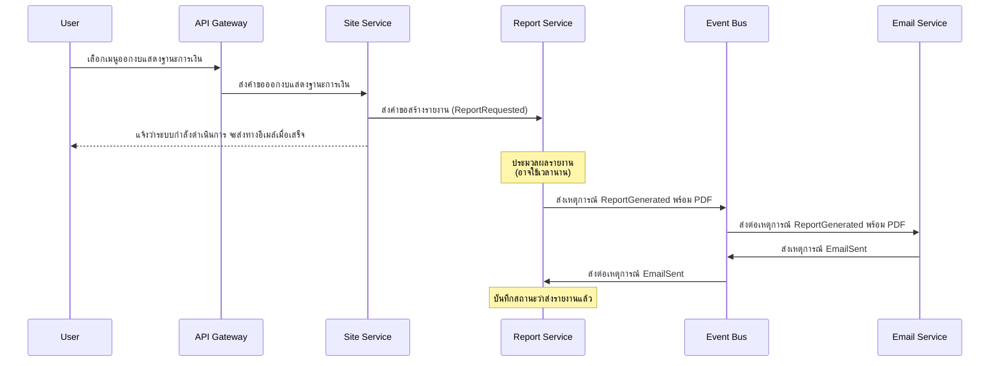

# Microservices Workshop

กำหนดให้ส่วนหนึ่งของระบบบัญชีประกอบด้วย Services ต่าง ๆ ดังนี้

- **Site**: เซอร์วิสสำหรับการแสดงผล UI บนเว็บเบราว์เซอร์
- **Revenue Cycle**: เป็นเซอร์วิสเกี่ยวกับวงจรรายได้ของบัญชี เช่น รายได้จากการขาย รายได้จากการให้บริการ เป็นต้น
- **Tax Calculator**: เซอร์วิสสำหรับการคำนวณภาษาประเภทต่าง ๆ เช่น ภาษีหัก ณ ที่จ่าย ภาษีมูลค่าเพิ่ม เป็นต้น
- **Report**: เซอร์วิสสำหรับการออกรายงานทางการเงินประเภทต่าง ๆ เช่น งบแสดงฐานะการเงิน งบกำไรขาดทุน เป็นต้น
- **Email**: เซอร์วิสสำหรับการจัดส่งอีเมล์ไปยังปลายทาง

## กำหนดสถานการณ์ของการใช้งานระบบบัญชี 2 สถานการณ์ต่อไปนี้

### สถานการณ์ที่ 1: การออกใบกำกับภาษี
ผู้ใช้งานเรียกใช้งานเซอร์วิส Site ผ่าน API Gateway โดยเลือกเมนู **ออกใบกำกับภาษี** เมนูดังกล่าวจะทำการออกใบเสร็จรับเงินในรูปแบบ PDF ซึ่งจะทำการดาวน์โหลดได้ในทันที เซอร์วิส Site ต้องทำการเรียกเซอร์วิส **Revenue Cycle** เนื่องจากการออกใบกำกับภาษีดังกล่าวเป็นวงจรรายได้ของบัญชี การออกใบกำกับภาษีนี้จะต้องมีการคำนวณภาษีมูลค่าเพิ่มจาก **Tax Calculator** ด้วย

### สถานการณ์ที่ 2: การออกงบแสดงฐานะการเงิน
ผู้ใช้งานเรียกใช้งานเซอร์วิส Site ผ่าน API Gateway โดยเลือกเมนู **ออกงบแสดงฐานะการเงิน** เมนูดังกล่าวจะทำการออกใบเสร็จรับเงินในรูปแบบ PDF โดยจะจัดส่งให้ทางอีเมล์ภายหลังที่โปรแกรมทำการประมวลผลเสร็จสิ้น เซอร์วิส Site ต้องทำการเรียกเซอร์วิส **Report** เพื่อแจ้งคำขอในการออกเอกสารงบแสดงฐานะการเงิน เมื่อการออกเอกสารเสร็จสิ้นจึงเรียกการใช้งานต่อไปยังเซอร์วิส **Email** เพื่อจัดส่งอีเมล์พร้อมรายงานดังกล่าวต่อไป

## คำตอบ

### 1. สถานการณ์ใดควรใช้การสื่อสารในรูปแบบ Synchronous Messages และสถานการณ์ใดควรเป็นรูปแบบ Asynchronous Messages

#### สถานการณ์ที่ 1: การออกใบกำกับภาษี - **Synchronous Messages**

**เหตุผล:**
- ผู้ใช้งานต้องการได้รับใบกำกับภาษีในรูปแบบ PDF เพื่อดาวน์โหลดได้ในทันที
- การตอบสนองต้องรวดเร็วและต่อเนื่อง ผู้ใช้งานกำลังรอผลลัพธ์แบบ real-time
- ธุรกรรมนี้จำเป็นต้องมีการดำเนินการให้เสร็จสิ้นในครั้งเดียว และต้องการความถูกต้องแม่นยำสูง
- เป็นกระบวนการที่มีขั้นตอนไม่ซับซ้อนมากนัก (Site → Revenue Cycle → Tax Calculator)

การใช้ Synchronous Communication เหมาะสมกับธุรกรรมนี้เพราะต้องการผลลัพธ์ทันที และเป็นกระบวนการที่มีความเชื่อมโยงกันอย่างใกล้ชิด การคำนวณภาษีต้องถูกต้องและทันที มิฉะนั้นจะไม่สามารถออกใบกำกับภาษีได้อย่างสมบูรณ์

#### สถานการณ์ที่ 2: การออกงบแสดงฐานะการเงิน - **Asynchronous Messages**

**เหตุผล:**
- กระบวนการออกงบแสดงฐานะการเงินอาจใช้เวลานานในการประมวลผล เนื่องจากต้องรวบรวมข้อมูลจำนวนมาก
- ผู้ใช้งานไม่จำเป็นต้องรอผลลัพธ์ทันที แต่จะได้รับทางอีเมล์ภายหลัง
- มีการทำงานหลายขั้นตอนที่อาจใช้เวลานาน (การสร้างรายงาน PDF และการส่งอีเมล์)
- การทำงานแบบ non-blocking จะช่วยให้ระบบมีประสิทธิภาพสูงขึ้น โดยเฉพาะเมื่อมีการขอรายงานพร้อมกันจำนวนมาก

การใช้ Asynchronous Communication เหมาะสมสำหรับกระบวนการที่ใช้เวลานาน ไม่ต้องการการตอบสนองทันที และเป็นการลดภาระของระบบในช่วงเวลาที่มีการใช้งานสูง

### 2. แผนภาพจำลองการสื่อสารสำหรับสถานการณ์ที่ 2 ด้วยรูปแบบของ **Choreography-based Saga**

หรือถ้าต้องการใช้รูปภาพที่มีอยู่แล้ว:

**คำอธิบายแผนภาพการทำงานแบบ Choreography-based Saga:**

1. **เริ่มต้น Request**:
   - ผู้ใช้เลือกเมนู "ออกงบแสดงฐานะการเงิน" ผ่าน API Gateway
   - API Gateway ส่งคำขอไปยัง Site Service

2. **การรับคำขอและแจ้งสถานะ**:
   - Site Service ส่งคำขอไปยัง Report Service เพื่อเริ่มกระบวนการสร้างรายงาน
   - Site Service ตอบกลับผู้ใช้ทันทีว่าระบบกำลังดำเนินการและจะส่งผลลัพธ์ทางอีเมล์เมื่อเสร็จสิ้น

3. **การประมวลผลรายงาน**:
   - Report Service ดำเนินการสร้างรายงานงบแสดงฐานะการเงินในรูปแบบ PDF
   - กระบวนการนี้อาจใช้เวลานานเนื่องจากต้องรวบรวมข้อมูลและคำนวณจำนวนมาก

4. **การส่งเหตุการณ์เมื่อสร้างรายงานเสร็จ**:
   - เมื่อสร้างรายงานเสร็จ Report Service จะส่งเหตุการณ์ `ReportGenerated` พร้อมไฟล์ PDF ไปยัง Event Bus
   - Event Bus ทำหน้าที่เป็นตัวกลางส่งต่อเหตุการณ์ไปยังบริการที่สนใจ ในที่นี้คือ Email Service

5. **การส่งอีเมล์**:
   - Email Service รับเหตุการณ์ `ReportGenerated` และดำเนินการส่งอีเมล์พร้อมแนบไฟล์รายงาน PDF
   - เมื่อส่งอีเมล์เสร็จสิ้น Email Service จะส่งเหตุการณ์ `EmailSent` กลับไปยัง Event Bus

6. **การอัปเดตสถานะ**:
   - Event Bus ส่งต่อเหตุการณ์ `EmailSent` ไปยัง Report Service
   - Report Service บันทึกสถานะว่ากระบวนการทั้งหมดเสร็จสิ้น พร้อมบันทึกว่าได้ส่งรายงานทางอีเมล์แล้ว

**ข้อดีของการใช้ Choreography-based Saga ในสถานการณ์นี้:**

1. **ความยืดหยุ่นสูง** - แต่ละบริการสามารถทำงานได้อย่างอิสระโดยไม่ขึ้นกับสถานะของบริการอื่น
2. **ลดการเชื่อมโยงที่แน่นเกินไป** - บริการต่างๆ สื่อสารผ่าน Event Bus แทนการเรียกใช้โดยตรง
3. **ความทนทานต่อความล้มเหลว** - หากบริการใดล้มเหลว เหตุการณ์สามารถถูกจัดการใหม่ได้เมื่อบริการกลับมาทำงาน
4. **การขยายระบบทำได้ง่าย** - เพียงเพิ่มบริการใหม่ที่สนใจเหตุการณ์เดียวกัน โดยไม่ต้องเปลี่ยนแปลงส่วนอื่น
5. **เหมาะกับกระบวนการที่ใช้เวลานาน** - ไม่ต้องรอการตอบกลับแบบ Synchronous ซึ่งอาจทำให้เกิด timeout

การออกแบบในลักษณะนี้ช่วยให้ระบบสามารถรองรับปริมาณการใช้งานสูงได้อย่างมีประสิทธิภาพ และยังช่วยให้การขยายฟีเจอร์หรือการบำรุงรักษาทำได้ง่ายขึ้นในอนาคต