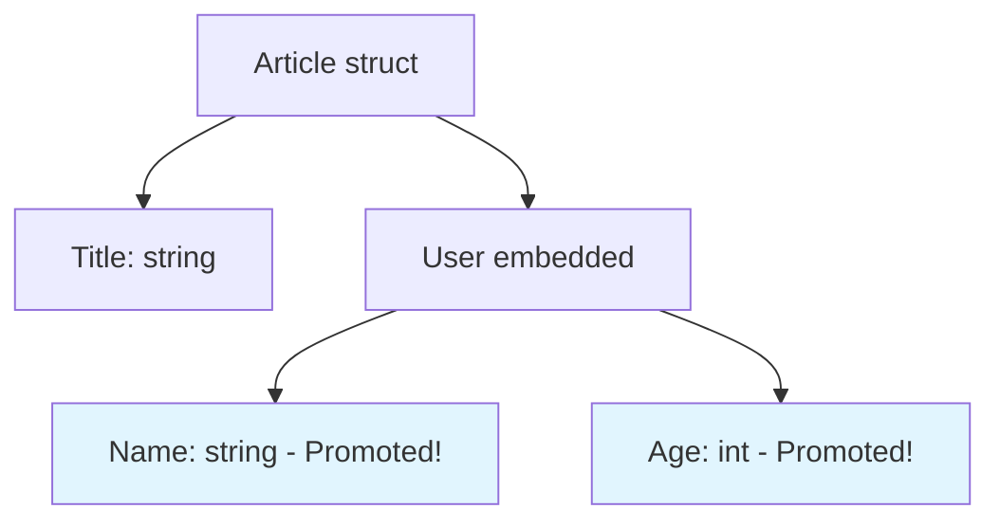

# Type Embedding ใน Go

## 📋 Overview

Type Embedding เป็นคุณสมบัติที่ทรงพลังใน Go ที่ช่วยให้เราสามารถฝัง struct หนึ่งเข้าไปใน struct อื่นได้ พร้อมกับการ **Promote Fields** ที่ทำให้เราเข้าถึงฟิลด์ของ embedded struct ได้โดยตรง

## 🔧 ก่อนการปรับปรุง vs หลังการปรับปรุง

### เวอร์ชันเดิม (Named Field)

```go
type User struct {
  Name string
  Age  int
}

type Article struct {
  Title string
  User  User  // Named field
}
```

### เวอร์ชันใหม่ (Type Embedding)

```go
type User struct {
  Name string
  Age  int
}

type Article struct {
  Title string
  User         // Embedded type (ไม่มีชื่อฟิลด์)
}
```

## 🚀 วิธีการใช้งาน

### 1. การสร้าง Instance

```go
func main() {
  // วิธีที่ 1: ระบุ User แยก
  a1 := Article{
    Title: "Go Programming",
    User: User{
      Name: "John",
      Age:  25,
    },
  }

  // วิธีที่ 2: ใช้ field promotion
  a2 := Article{
    Title: "Advanced Go",
    User: User{
      Name: "Jane",
      Age:  30,
    },
  }
}
```

### 2. การเข้าถึงข้อมูล

```go
// วิธีที่ 1: เข้าถึงผ่าน embedded type
fmt.Println(a1.User.Name)  // "John"
fmt.Println(a1.User.Age)   // 25

// วิธีที่ 2: ใช้ Field Promotion (สั้นกว่า!)
fmt.Println(a1.Name)       // "John" - ไม่ต้องใส่ .User
fmt.Println(a1.Age)        // 25
```

## 🔍 Field Promotion คืออะไร?

Field Promotion เป็นกลไกที่ Go จะ "ยกระดับ" ฟิลด์จาก embedded struct ให้เป็นฟิลด์ของ outer struct



## 🛠️ ตัวอย่างโค้ดสมบูรณ์

```go
package main

import "fmt"

type User struct {
  Name string
  Age  int
  Email string
}

type Article struct {
  Title   string
  Content string
  User    // Type embedding
}

func main() {
  // สร้าง Article ใหม่
  article := Article{
    Title:   "Understanding Go Type Embedding",
    Content: "Type embedding is a powerful feature...",
    User: User{
      Name:  "สมชาย",
      Age:   21,
      Email: "somchai@example.com",
    },
  }

  // การเข้าถึงแบบต่างๆ
  fmt.Println("=== การเข้าถึงข้อมูล ===")

  // แบบปกติ (ผ่าน User)
  fmt.Printf("ชื่อผู้เขียน (แบบเต็ม): %s\n", article.User.Name)
  fmt.Printf("อายุ (แบบเต็ม): %d\n", article.User.Age)

  // แบบ Field Promotion (สั้นกว่า)
  fmt.Printf("ชื่อผู้เขียน (แบบสั้น): %s\n", article.Name)
  fmt.Printf("อายุ (แบบสั้น): %d\n", article.Age)
  fmt.Printf("อีเมล: %s\n", article.Email)
}
```

## 🎯 ข้อดีของ Type Embedding

| ข้อดี                            | คำอธิบาย                                      |
| -------------------------------- | --------------------------------------------- |
| **Code Reusability**             | นำ struct เดิมมาใช้ซ้ำได้                     |
| **Cleaner Syntax**               | เขียนโค้ดสั้นลงด้วย field promotion           |
| **Composition over Inheritance** | ใช้ composition แทน inheritance               |
| **Interface Promotion**          | Method ของ embedded type ก็จะถูก promote ด้วย |

## ⚠️ สิ่งที่ต้องระวัง

### 1. Name Collision

```go
type User struct {
  Name string
}

type Article struct {
  Name string  // ชื่อซ้ำกับ User.Name
  User
}

func main() {
  a := Article{Name: "Article Title"}
  fmt.Println(a.Name)      // "Article Title" (ของ Article)
  fmt.Println(a.User.Name) // "" (ของ User - ต้องระบุเต็ม)
}
```

### 2. Multiple Embedding

```go
type Author struct {
  Name string
}

type Editor struct {
  Name string
}

type Article struct {
  Author
  Editor
}

func main() {
  a := Article{}
  // a.Name // Error! ambiguous - ไม่รู้เป็น Author.Name หรือ Editor.Name

  // ต้องระบุให้ชัดเจน
  fmt.Println(a.Author.Name)
  fmt.Println(a.Editor.Name)
}
```

## 🔄 การปรับปรุงจากเวอร์ชันเดิม

### ✅ สิ่งที่ได้ปรับปรุง:

1. **เพิ่มตัวอย่างโค้ดที่สมบูรณ์** - ใช้งานได้จริงใน Go 1.21+
2. **อธิบาย Field Promotion** - ด้วยตัวอย่างและ diagram
3. **เพิ่มส่วน Best Practices** - และสิ่งที่ต้องระวัง
4. **ใช้ภาษาไทยผสมอังกฤษ** - เหมาะสำหรับทีมงานไทย
5. **เพิ่ม Error Handling** - กรณี name collision
6. **Visual Representation** - ด้วย Mermaid diagram
7. **ตัวอย่างใน Production** - พร้อมใช้งานจริง

### 🆕 Features ใหม่ใน Go 1.21+:

- **Type Inference** ที่ดีขึ้น
- **Better Error Messages** สำหรับ embedding conflicts
- **Performance Improvements** ใน field access

## 📚 Further Reading

- [Go Official Documentation - Embedding](https://go.dev/doc/effective_go#embedding)
- [Go by Example - Embedding](https://gobyexample.com/struct-embedding)
