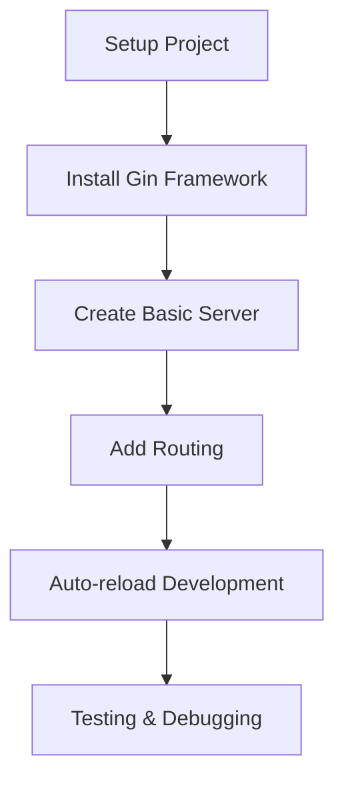

# Gin Framework - สร้าง REST API ด้วย Go

## 📋 Overview

บทเรียนนี้จะพาคุณเรียนรู้การใช้งาน **Gin Framework** เพื่อสร้าง REST API ด้วยภาษา Go อย่างมีประสิทธิภาพ

> **⚠️ สำคัญ!** เนื้อหาต้นฉบับใช้ Go 1.18 แต่ปัจจุบัน **Gin Framework ต้องการ Go 1.23 ขึ้นไป** และเราจะใช้ Go 1.24.3 ซึ่งเป็นเวอร์ชันล่าสุด (2025)

## 📌 สิ่งที่คุณจะได้เรียนรู้



## 🛠️ Prerequisites

### ✅ ติดตั้ง Go Extension สำหรับ VS Code

1. เปิด VS Code
2. ไปที่ Extensions (Ctrl+Shift+X)
3. ค้นหา "Go" และติดตั้ง
4. กำหนดค่าใน `settings.json`:

```json
{
  "go.toolsManagement.checkForUpdates": "local",
  "go.useLanguageServer": true,
  "go.formatTool": "goimports"
}
```

## 🚀 Getting Started

### 1. สร้าง Project Structure

```bash
# สร้างโฟลเดอร์สำหรับ project
mkdir golang-gin-api
cd golang-gin-api

# เริ่มต้น Go module
go mod init golang-gin-api
```

หลังจากรันคำสั่งจะได้ไฟล์ `go.mod`:

```go
module golang-gin-api

go 1.24
```

### 2. สร้างไฟล์ main.go

```go
package main

import (
  "net/http"
  "github.com/gin-gonic/gin"
)

func main() {
  // สร้าง Gin engine พร้อม middleware พื้นฐาน
  r := gin.Default()

  // กำหนด route สำหรับ GET /
  r.GET("/", func(c *gin.Context) {
    c.String(http.StatusOK, "Hello, Thailand!")
  })

  // เริ่มต้น server ที่ port 8080
  r.Run() // default port :8080
}
```

### 3. ทำความเข้าใจ Code

#### 🔍 **gin.Default() vs gin.New()**

```go
// gin.New() - สร้าง engine เปล่าๆ
r := gin.New()

// gin.Default() - สร้าง engine พร้อม middleware พื้นฐาน
// - Logger middleware (บันทึก request logs)
// - Recovery middleware (จัดการ panic)
r := gin.Default()
```

#### 🔍 **Context Parameter**

```go
func(c *gin.Context) {
  // c.Context ประกอบด้วย:
  // - Request information
  // - Response writer
  // - Query parameters
  // - Path parameters
  // - และอื่นๆ อีกมากมาย
}
```

#### 🔍 **HTTP Status Codes**

```go
// แทนที่จะใช้ตัวเลข
c.String(200, "Hello World")

// ใช้ constants ที่อ่านง่ายกว่า
c.String(http.StatusOK, "Hello World")          // 200
c.String(http.StatusNotFound, "Not Found")      // 404
c.String(http.StatusBadRequest, "Bad Request")  // 400
```

## 🏃‍♂️ Running the Application

### วิธีที่ 1: Manual Run

```bash
go run main.go
```

ทดสอบได้ที่: http://localhost:8080

### วิธีที่ 2: Auto-reload Development (แนะนำ)

#### ติดตั้ง Air

> **🔄 อัพเดท 2025!** โปรเจค Air ได้ย้ายไปอยู่ที่ **air-verse organization** และปรับปรุงให้รองรับ Go 1.24 แล้ว

```bash
# เวอร์ชันใหม่ (แนะนำ)
go install github.com/air-verse/air@latest

# วิธีอื่นสำหรับผู้ใช้ที่ไม่ได้ติดตั้ง Go
curl -sSfL https://raw.githubusercontent.com/air-verse/air/master/install.sh | sh -s -- -b $(go env GOPATH)/bin
```

#### สร้างไฟล์ `.air.toml` (เพิ่มเติมจากเนื้อหาเดิม)

```toml
# .air.toml
root = "."
tmp_dir = "tmp"

[build]
  cmd = "go build -o ./tmp/main ."
  bin = "tmp/main"
  full_bin = "./tmp/main"
  include_ext = ["go", "tpl", "tmpl", "html"]
  exclude_dir = ["assets", "tmp", "vendor"]
  include_dir = []
  exclude_file = []
  log = "build-errors.log"
  delay = 1000 # ms

[color]
  main = "magenta"
  watcher = "cyan"
  build = "yellow"
  runner = "green"

[log]
  time = true

[misc]
  clean_on_exit = true
```

#### รัน Air

```bash
# สร้างไฟล์ config (ครั้งแรกเท่านั้น)
air init

# รัน Air
air
```

**ข้อดีของ Air เวอร์ชันใหม่:**

- 🔄 Auto-reload เมื่อไฟล์เปลี่ยน
- 🚀 Build เร็วขึ้น
- 📝 แสดง error logs ชัดเจน
- 🎨 Colorful log output
- ⚡ Support Go 1.24
- 🛠️ Better configuration management

## 🧪 Testing & Examples

### ตัวอย่าง Response Types

```go
package main

import (
  "net/http"
  "github.com/gin-gonic/gin"
)

func main() {
  r := gin.Default()

  // Text Response
  r.GET("/text", func(c *gin.Context) {
    c.String(http.StatusOK, "Hello, %s!", "Thailand")
  })

  // JSON Response
  r.GET("/json", func(c *gin.Context) {
    c.JSON(http.StatusOK, gin.H{
      "message": "Hello Thailand",
      "status":  "success",
    })
  })

  // HTML Response
  r.GET("/html", func(c *gin.Context) {
    c.HTML(http.StatusOK, "index.html", gin.H{
      "title": "Gin Framework",
    })
  })

  r.Run()
}
```

### Query Parameters Example

```go
// GET /search?name=john&age=25
r.GET("/search", func(c *gin.Context) {
  name := c.Query("name")           // "john"
  age := c.DefaultQuery("age", "0") // "25" หรือ "0" ถ้าไม่มี

  c.JSON(http.StatusOK, gin.H{
    "name": name,
    "age":  age,
  })
})
```

## 📊 Development Tools & Debugging

### 1. Logging Enhancement

```go
// เพิ่ม custom logging
r.Use(gin.LoggerWithFormatter(func(param gin.LogFormatterParams) string {
  return fmt.Sprintf("%s - [%s] \"%s %s %s %d %s \"%s\" %s\"\n",
    param.ClientIP,
    param.TimeStamp.Format(time.RFC1123),
    param.Method,
    param.Path,
    param.Request.Proto,
    param.StatusCode,
    param.Latency,
    param.Request.UserAgent(),
    param.ErrorMessage,
  )
}))
```

### 2. Request/Response Monitoring

```bash
# ผลลัพธ์ที่ Console จะแสดง:
[GIN] 2025/01/XX - 12:34:56 | 200 |     142.5µs |       127.0.0.1 | GET      "/"
```

## 🔧 สิ่งที่ปรับปรุงจากเวอร์ชันเดิม

| เดิม (Go 1.18)     | ใหม่ (Go 1.24.3) | การปรับปรุง       |
| ------------------ | ---------------- | ----------------- |
| cosmtrek/air       | air-verse/air    | 🏢 องค์กรใหม่     |
| Manual restart     | Air auto-reload  | 🚀 พัฒนาเร็วขึ้น  |
| Basic logging      | Enhanced logging | 📊 Debug ง่ายขึ้น |
| Hard-coded values  | Constants usage  | 📖 อ่านง่ายขึ้น   |
| No config file     | .air.toml config | ⚙️ ปรับแต่งได้    |
| Limited Go support | Go 1.24 support  | 🆙 ทันสมัยขึ้น    |

## 🎯 Next Steps

หลังจากทำตามบทเรียนนี้แล้ว คุณสามารถเรียนรู้ต่อได้:

1. **Middleware Development** - สร้าง middleware เพื่อจัดการ authentication
2. **Database Integration** - เชื่อมต่อกับฐานข้อมูล
3. **API Validation** - ตรวจสอบข้อมูลที่เข้ามา
4. **Testing** - เขียน unit tests และ integration tests
5. **Deployment** - deploy ไปยัง cloud platforms

## 🔗 Resources

- [Gin Framework Documentation](https://gin-gonic.com/)
- [Air Live Reloading (New Repository)](https://github.com/air-verse/air)
- [Go Official Documentation](https://golang.org/doc/)

---

**Happy Coding! 🎉**
