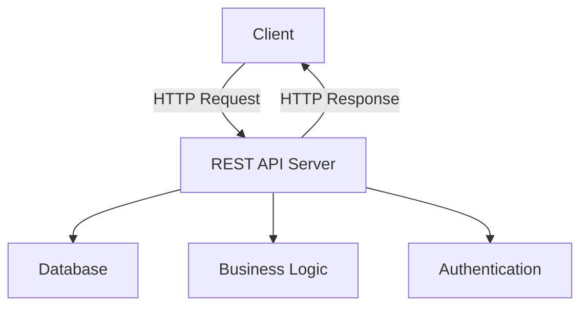

# RESTful API with Go - Complete Guide 🚀

เรียนรู้หลักการออกแบบและการพัฒนา RESTful API ด้วย Go อย่างครบถ้วน

## 📋 สารบัญ

- [ความเข้าใจพื้นฐานเกี่ยวกับ REST](#ความเข้าใจพื้นฐานเกี่ยวกับ-rest)
- [สถาปัตยกรรม Client-Server](#สถาปัตยกรรม-client-server)
- [HTTP Methods และ Resource Management](#http-methods-และ-resource-management)
- [HTTP Status Codes](#http-status-codes)
- [Content Types และ Response Format](#content-types-และ-response-format)
- [ตัวอย่างการใช้งานจริง](#ตัวอย่างการใช้งานจริง)
- [Best Practices สำหรับ Go 1.21+](#best-practices-สำหรับ-go-121)

---

## ความเข้าใจพื้นฐานเกี่ยวกับ REST

### 🔍 REST คืออะไร?

**REST** ย่อมาจาก **Representational State Transfer** เป็นสถาปัตยกรรมการออกแบบ Web Services ที่มีหลักการสำคัญดังนี้:



### 📊 หลักการสำคัญของ REST

1. **Stateless** - Server ไม่เก็บข้อมูล session ของ client
2. **Resource-based** - ทุกอย่างคือ resource ที่สามารถระบุได้ด้วย URL
3. **HTTP Methods** - ใช้ HTTP methods เพื่อกำหนดการดำเนินการ
4. **Representation** - ข้อมูลสามารถแสดงในรูปแบบต่างๆ (JSON, XML, etc.)

---

## สถาปัตยกรรม Client-Server

### 🏗️ โครงสร้างการทำงาน

```
┌─────────────┐         ┌─────────────────┐         ┌─────────────┐
│   Client    │ ───────▶│   REST Server   │────────▶│  Database   │
│ (Frontend)  │         │   (Backend)     │         │             │
│             │◀────────│                 │◀────────│             │
└─────────────┘         └─────────────────┘         └─────────────┘
```

### 🎯 การทำงานของ Client-Server

- **Client**: ผู้ขอใช้บริการ (เช่น Web Browser, Mobile App)
- **Server**: ผู้ให้บริการและเก็บรักษาทรัพยากร (Resources)
- **Resource**: ข้อมูลหรือบริการที่ Client ต้องการเข้าถึง

---

## HTTP Methods และ Resource Management

### 🔧 HTTP Methods หลัก

| Method   | การใช้งาน       | ตัวอย่าง URL      | ผลลัพธ์                   |
| -------- | --------------- | ----------------- | ------------------------- |
| `GET`    | ดึงข้อมูล       | `GET /users`      | รายการ users ทั้งหมด      |
| `GET`    | ดึงข้อมูลเฉพาะ  | `GET /users/1`    | ข้อมูล user ID 1          |
| `POST`   | สร้างข้อมูลใหม่ | `POST /users`     | สร้าง user ใหม่           |
| `PUT`    | อัปเดตทั้งหมด   | `PUT /users/1`    | อัปเดต user ID 1 ทั้งหมด  |
| `PATCH`  | อัปเดตบางส่วน   | `PATCH /users/1`  | อัปเดต user ID 1 บางฟิลด์ |
| `DELETE` | ลบข้อมูล        | `DELETE /users/1` | ลบ user ID 1              |

### 📝 ตัวอย่างการออกแบบ URL

```go
// ✅ Good REST URL Design
GET    /api/v1/users           // ดึงรายการ users ทั้งหมด
GET    /api/v1/users/123       // ดึงข้อมูล user ID 123
POST   /api/v1/users           // สร้าง user ใหม่
PUT    /api/v1/users/123       // อัปเดต user ID 123 ทั้งหมด
PATCH  /api/v1/users/123       // อัปเดต user ID 123 บางส่วน
DELETE /api/v1/users/123       // ลบ user ID 123

// การจัดการ relationships
GET    /api/v1/users/123/posts // ดึง posts ของ user ID 123
POST   /api/v1/users/123/posts // สร้าง post ใหม่สำหรับ user ID 123
```

### 🚫 URL Design ที่ไม่ควรทำ

```go
// ❌ Bad REST URL Design
GET    /api/v1/getUsers        // ไม่ควรใส่ action ใน URL
POST   /api/v1/createUser      // ใช้ HTTP method แทน
GET    /api/v1/deleteUser/123  // DELETE method ควรใช้แทน
```

---

## HTTP Status Codes

### 📊 รหัสสถานะที่ใช้บ่อย

#### 🟢 2xx - Success

| Code             | ความหมาย             | เมื่อไหร่ใช้                           |
| ---------------- | -------------------- | -------------------------------------- |
| `200 OK`         | สำเร็จ               | GET, PUT, PATCH ที่มีการ return ข้อมูล |
| `201 Created`    | สร้างสำเร็จ          | POST ที่สร้างข้อมูลใหม่สำเร็จ          |
| `204 No Content` | สำเร็จแต่ไม่มีข้อมูล | DELETE หรือ PUT ที่ไม่ return ข้อมูล   |

#### 🟡 4xx - Client Error

| Code                       | ความหมาย                 | เมื่อไหร่ใช้                   |
| -------------------------- | ------------------------ | ------------------------------ |
| `400 Bad Request`          | ข้อมูลไม่ถูกต้อง         | ข้อมูลที่ส่งมาผิด format       |
| `401 Unauthorized`         | ไม่ได้รับอนุญาต          | ไม่มี token หรือ token หมดอายุ |
| `403 Forbidden`            | ห้ามเข้าถึง              | มี token แต่ไม่มีสิทธิ์        |
| `404 Not Found`            | หาไม่เจอ                 | resource ที่ขอไม่มีอยู่        |
| `422 Unprocessable Entity` | ข้อมูลไม่ผ่าน validation | ข้อมูลถูก format แต่ไม่ผ่านกฎ  |

#### 🔴 5xx - Server Error

| Code                        | ความหมาย             | เมื่อไหร่ใช้                 |
| --------------------------- | -------------------- | ---------------------------- |
| `500 Internal Server Error` | ข้อผิดพลาดของ server | เกิด error ที่ไม่คาดคิด      |
| `503 Service Unavailable`   | บริการไม่พร้อม       | server ไม่สามารถให้บริการได้ |

### 💡 ตัวอย่างการใช้งาน Status Codes

```go
// ตัวอย่างใน Go
func getUserHandler(w http.ResponseWriter, r *http.Request) {
  userID := r.URL.Path[len("/users/"):]

  user, err := database.GetUser(userID)
  if err != nil {
    if err == sql.ErrNoRows {
      // ไม่พบข้อมูล
      w.WriteHeader(http.StatusNotFound)
      json.NewEncoder(w).Encode(map[string]string{
        "error": "User not found",
      })
      return
    }
    // เกิดข้อผิดพลาดในระบบ
    w.WriteHeader(http.StatusInternalServerError)
    json.NewEncoder(w).Encode(map[string]string{
      "error": "Internal server error",
    })
    return
  }

  // สำเร็จ
  w.WriteHeader(http.StatusOK)
  json.NewEncoder(w).Encode(user)
}
```

---

## Content Types และ Response Format

### 📄 Content-Type Headers

```go
// JSON Response (มาตรฐานสำหรับ REST API)
w.Header().Set("Content-Type", "application/json")

// XML Response
w.Header().Set("Content-Type", "application/xml")

// Plain Text
w.Header().Set("Content-Type", "text/plain")

// HTML
w.Header().Set("Content-Type", "text/html")
```

### 🎨 รูปแบบ JSON Response ที่แนะนำ

```go
// ✅ Success Response
{
  "success": true,
  "data": {
    "id": 1,
    "name": "John Doe",
    "email": "john@example.com"
  },
  "message": "User retrieved successfully"
}

// ✅ Error Response
{
  "success": false,
  "error": {
    "code": "USER_NOT_FOUND",
    "message": "User with ID 1 not found",
    "details": {}
  }
}

// ✅ List Response with Pagination
{
  "success": true,
  "data": [
    {"id": 1, "name": "John"},
    {"id": 2, "name": "Jane"}
  ],
  "pagination": {
    "page": 1,
    "limit": 10,
    "total": 25,
    "has_next": true
  }
}
```

---

## ตัวอย่างการใช้งานจริง

### 🛠️ การสร้าง Simple REST API ด้วย Go

```go
package main

import (
  "encoding/json"
  "fmt"
  "log"
  "net/http"
  "strconv"
  "strings"
)

type User struct {
  ID    int    `json:"id"`
  Name  string `json:"name"`
  Email string `json:"email"`
}

type Response struct {
  Success bool        `json:"success"`
  Data    interface{} `json:"data,omitempty"`
  Error   interface{} `json:"error,omitempty"`
  Message string      `json:"message,omitempty"`
}

// In-memory storage (ในการใช้งานจริงควรใช้ database)
var users = []User{
  {ID: 1, Name: "John Doe", Email: "john@example.com"},
  {ID: 2, Name: "Jane Smith", Email: "jane@example.com"},
}
var nextID = 3

func main() {
  // Routes
  http.HandleFunc("/api/users", usersHandler)
  http.HandleFunc("/api/users/", userHandler)

  // CORS Middleware (สำหรับ frontend)
  http.HandleFunc("/", func(w http.ResponseWriter, r *http.Request) {
    w.Header().Set("Access-Control-Allow-Origin", "*")
    w.Header().Set("Access-Control-Allow-Methods", "GET, POST, PUT, PATCH, DELETE, OPTIONS")
    w.Header().Set("Access-Control-Allow-Headers", "Content-Type, Authorization")

    if r.Method == "OPTIONS" {
      w.WriteHeader(http.StatusOK)
      return
    }

    http.NotFound(w, r)
  })

  fmt.Println("Server starting on :8080...")
  log.Fatal(http.ListenAndServe(":8080", nil))
}

// Handle /api/users
func usersHandler(w http.ResponseWriter, r *http.Request) {
  w.Header().Set("Content-Type", "application/json")

  switch r.Method {
  case "GET":
    // GET /api/users - ดึงรายการ users ทั้งหมด
    response := Response{
      Success: true,
      Data:    users,
      Message: "Users retrieved successfully",
    }
    w.WriteHeader(http.StatusOK)
    json.NewEncoder(w).Encode(response)

  case "POST":
    // POST /api/users - สร้าง user ใหม่
    var newUser User
    if err := json.NewDecoder(r.Body).Decode(&newUser); err != nil {
      response := Response{
        Success: false,
        Error:   "Invalid JSON format",
      }
      w.WriteHeader(http.StatusBadRequest)
      json.NewEncoder(w).Encode(response)
      return
    }

    // Simple validation
    if newUser.Name == "" || newUser.Email == "" {
      response := Response{
        Success: false,
        Error:   "Name and email are required",
      }
      w.WriteHeader(http.StatusUnprocessableEntity)
      json.NewEncoder(w).Encode(response)
      return
    }

    // สร้าง user ใหม่
    newUser.ID = nextID
    nextID++
    users = append(users, newUser)

    response := Response{
      Success: true,
      Data:    newUser,
      Message: "User created successfully",
    }
    w.WriteHeader(http.StatusCreated)
    json.NewEncoder(w).Encode(response)

  default:
    response := Response{
      Success: false,
      Error:   "Method not allowed",
    }
    w.WriteHeader(http.StatusMethodNotAllowed)
    json.NewEncoder(w).Encode(response)
  }
}

// Handle /api/users/{id}
func userHandler(w http.ResponseWriter, r *http.Request) {
  w.Header().Set("Content-Type", "application/json")

  // Extract ID from URL
  idStr := strings.TrimPrefix(r.URL.Path, "/api/users/")
  id, err := strconv.Atoi(idStr)
  if err != nil {
    response := Response{
      Success: false,
      Error:   "Invalid user ID",
    }
    w.WriteHeader(http.StatusBadRequest)
    json.NewEncoder(w).Encode(response)
    return
  }

  // Find user index
  userIndex := -1
  for i, user := range users {
    if user.ID == id {
      userIndex = i
      break
    }
  }

  switch r.Method {
  case "GET":
    // GET /api/users/{id} - ดึงข้อมูล user เฉพาะ
    if userIndex == -1 {
      response := Response{
        Success: false,
        Error:   "User not found",
      }
      w.WriteHeader(http.StatusNotFound)
      json.NewEncoder(w).Encode(response)
      return
    }

    response := Response{
      Success: true,
      Data:    users[userIndex],
      Message: "User retrieved successfully",
    }
    w.WriteHeader(http.StatusOK)
    json.NewEncoder(w).Encode(response)

  case "PUT":
    // PUT /api/users/{id} - อัปเดต user ทั้งหมด
    if userIndex == -1 {
      response := Response{
        Success: false,
        Error:   "User not found",
      }
      w.WriteHeader(http.StatusNotFound)
      json.NewEncoder(w).Encode(response)
      return
    }

    var updatedUser User
    if err := json.NewDecoder(r.Body).Decode(&updatedUser); err != nil {
      response := Response{
        Success: false,
        Error:   "Invalid JSON format",
      }
      w.WriteHeader(http.StatusBadRequest)
      json.NewEncoder(w).Encode(response)
      return
    }

    updatedUser.ID = id
    users[userIndex] = updatedUser

    response := Response{
      Success: true,
      Data:    updatedUser,
      Message: "User updated successfully",
    }
    w.WriteHeader(http.StatusOK)
    json.NewEncoder(w).Encode(response)

  case "DELETE":
    // DELETE /api/users/{id} - ลบ user
    if userIndex == -1 {
      response := Response{
        Success: false,
        Error:   "User not found",
      }
      w.WriteHeader(http.StatusNotFound)
      json.NewEncoder(w).Encode(response)
      return
    }

    // ลบ user จาก slice
    users = append(users[:userIndex], users[userIndex+1:]...)

    response := Response{
      Success: true,
      Message: "User deleted successfully",
    }
    w.WriteHeader(http.StatusOK)
    json.NewEncoder(w).Encode(response)

  default:
    response := Response{
      Success: false,
      Error:   "Method not allowed",
    }
    w.WriteHeader(http.StatusMethodNotAllowed)
    json.NewEncoder(w).Encode(response)
  }
}
```

---

## Best Practices สำหรับ Go 1.21+

### 🆕 การปรับปรุงจากเวอร์ชันเดิม

#### 1. ใช้ `http.ServeMux` แบบใหม่ (Go 1.22+)

```go
// ✅ Go 1.22+ - รองรับ HTTP methods และ path parameters
mux := http.NewServeMux()
mux.HandleFunc("GET /api/users", getUsersHandler)
mux.HandleFunc("POST /api/users", createUserHandler)
mux.HandleFunc("GET /api/users/{id}", getUserHandler)
mux.HandleFunc("PUT /api/users/{id}", updateUserHandler)
mux.HandleFunc("DELETE /api/users/{id}", deleteUserHandler)

// ดึง path parameter
func getUserHandler(w http.ResponseWriter, r *http.Request) {
  id := r.PathValue("id") // ใหม่ใน Go 1.22
  // ...
}
```

#### 2. ใช้ `context.Context` ให้เต็มที่

```go
func getUserHandler(w http.ResponseWriter, r *http.Request) {
  ctx := r.Context()

  // ใช้ context สำหรับ database operations
  user, err := database.GetUserWithContext(ctx, userID)
  if err != nil {
    // Handle error
  }
}
```

#### 3. Structured Logging ด้วย `slog` (Go 1.21+)

```go
import "log/slog"

func main() {
  // สร้าง structured logger
  logger := slog.New(slog.NewJSONHandler(os.Stdout, nil))

  http.HandleFunc("/api/users", func(w http.ResponseWriter, r *http.Request) {
    logger.Info("Request received",
      "method", r.Method,
      "path", r.URL.Path,
      "user_agent", r.UserAgent(),
    )
    // Handle request...
  })
}
```

#### 4. Error Handling แบบใหม่

```go
type APIError struct {
  Code    string `json:"code"`
  Message string `json:"message"`
  Details any    `json:"details,omitempty"`
}

func (e APIError) Error() string {
  return e.Message
}

// Custom error types
var (
  ErrUserNotFound = APIError{
    Code:    "USER_NOT_FOUND",
    Message: "User not found",
  }
  ErrInvalidInput = APIError{
    Code:    "INVALID_INPUT",
    Message: "Invalid input data",
  }
)
```

#### 5. Middleware Pattern

```go
// CORS Middleware
func corsMiddleware(next http.Handler) http.Handler {
  return http.HandlerFunc(func(w http.ResponseWriter, r *http.Request) {
    w.Header().Set("Access-Control-Allow-Origin", "*")
    w.Header().Set("Access-Control-Allow-Methods", "GET, POST, PUT, DELETE, OPTIONS")
    w.Header().Set("Access-Control-Allow-Headers", "Content-Type, Authorization")

    if r.Method == "OPTIONS" {
      w.WriteHeader(http.StatusOK)
      return
    }

    next.ServeHTTP(w, r)
  })
}

// Logging Middleware
func loggingMiddleware(next http.Handler) http.Handler {
  return http.HandlerFunc(func(w http.ResponseWriter, r *http.Request) {
    start := time.Now()

    next.ServeHTTP(w, r)

    slog.Info("Request completed",
      "method", r.Method,
      "path", r.URL.Path,
      "duration", time.Since(start),
    )
  })
}

// การใช้งาน
func main() {
  mux := http.NewServeMux()
  mux.HandleFunc("GET /api/users", getUsersHandler)

  // ใช้ middleware
  handler := corsMiddleware(loggingMiddleware(mux))

  http.ListenAndServe(":8080", handler)
}
```

### 📈 Performance Improvements

#### 1. Connection Pooling

```go
import (
  "database/sql"
  _ "github.com/lib/pq"
)

func setupDatabase() *sql.DB {
  db, err := sql.Open("postgres", connectionString)
  if err != nil {
    log.Fatal(err)
  }

  // ปรับแต่ง connection pool
  db.SetMaxOpenConns(25)
  db.SetMaxIdleConns(5)
  db.SetConnMaxLifetime(5 * time.Minute)

  return db
}
```

#### 2. Rate Limiting

```go
import "golang.org/x/time/rate"

var limiter = rate.NewLimiter(10, 20) // 10 requests per second, burst of 20

func rateLimitMiddleware(next http.Handler) http.Handler {
  return http.HandlerFunc(func(w http.ResponseWriter, r *http.Request) {
    if !limiter.Allow() {
      w.WriteHeader(http.StatusTooManyRequests)
      json.NewEncoder(w).Encode(Response{
        Success: false,
        Error:   "Rate limit exceeded",
      })
      return
    }
    next.ServeHTTP(w, r)
  })
}
```

---

## 🎯 สรุปการปรับปรุงสำหรับปี 2025

### ✨ สิ่งที่เพิ่มใหม่:

1. **Enhanced ServeMux** - รองรับ HTTP methods และ path parameters โดยตรง
2. **Structured Logging** - ใช้ `slog` package ใหม่
3. **Better Error Handling** - Error types ที่มีโครงสร้างชัดเจน
4. **Middleware Pattern** - การจัดการ cross-cutting concerns
5. **Performance Optimizations** - Connection pooling, rate limiting
6. **Context Usage** - ใช้ context ให้เต็มศักยภาพ

### 🔄 การอัปเกรดจากเวอร์ชันเก่า:

- อัปเกรด Go เป็น 1.21+ เพื่อใช้ `slog`
- อัปเกรด Go เป็น 1.22+ เพื่อใช้ enhanced `ServeMux`
- เปลี่ยนจาก `log` package เป็น `slog`
- ใช้ middleware pattern แทนการเขียน logic ซ้ำ
- เพิ่ม error handling ที่มีโครงสร้าง

การปรับปรุงเหล่านี้จะทำให้ REST API ของเรามีประสิทธิภาพดีขึ้น, maintainable มากขึ้น, และทันสมัยกับมาตรฐานปัจจุบัน! 🚀
