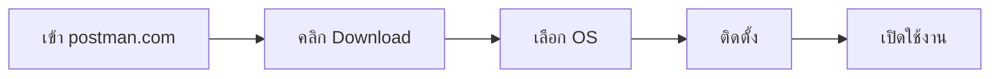

# การทดสอบ API ด้วย Postman - คู่มือฉบับสมบูรณ์

> 📝 **บทนำ**: เรียนรู้การใช้โปรแกรม Postman เพื่อทดสอบ RESTful API อย่างมืออาชีพ พร้อมเทคนิคการจัดระเบียบและการใช้งานที่เหมาะสำหรับทีมพัทนา

## 🎯 สารบัญ

- [การติดตั้ง Postman](#การติดตั้ง-postman)
- [การสร้าง Collection และ Folder](#การสร้าง-collection-และ-folder)
- [การสร้างและจัดการ Request](#การสร้างและจัดการ-request)
- [การทดสอบ API Endpoints](#การทดสอบ-api-endpoints)
- [Best Practices](#best-practices)

---

## 📥 การติดตั้ง Postman

### ทำไมต้องใช้ Postman?

การทดสอบ API ผ่าน Web Browser มีข้อจำกัด เช่น:

- ❌ ไม่สามารถส่ง HTTP Methods อื่นๆ นอกจาก GET และ POST
- ❌ ยากในการจัดการ Headers และ Authentication
- ❌ ไม่มีการเก็บประวัติ Request
- ❌ ไม่สามารถสร้าง Test Scripts ได้

### วิธีการติดตั้ง

1. **เข้าไปที่**: [postman.com](https://postman.com)
2. **คลิก**: ปุ่ม "Download"
3. **เลือก**: เวอร์ชันที่เหมาะกับระบบปฏิบัติการของคุณ
4. **ติดตั้ง**: ตามขั้นตอนปกติ



> 💡 **หมายเหตุ**: เวอร์ชันปัจจุบัน (2024) รองรับการซิงค์ข้อมูลแบบ Cloud และมี AI Assistant ในตัว

---

## 📁 การสร้าง Collection และ Folder

### Collection คืออะไร?

**Collection** = กลุ่มของ Request ที่จัดระเบียบไว้ด้วยกัน เหมาะสำหรับ:

- 🗂️ จัดกลุ่ม API ตามโปรเจค
- 🔄 แชร์งานกับทีม
- 📊 รัน Tests แบบ Batch
- 📋 สร้าง Documentation

### ขั้นตอนการสร้าง Collection

#### 1. สร้าง Collection หลัก

```
1. คลิก "New" (หรือกด Ctrl+Alt+N)
2. เลือก "Collection"
3. ตั้งชื่อ: "Articles API"
4. คลิก "Create"
```

#### 2. สร้าง Folder ย่อย

เพื่อจัดระเบียบ Endpoints ตามหน้าที่:

```
Articles API/
├── 📁 Articles Management
│   ├── GET /api/v1/articles
│   ├── POST /api/v1/articles
│   ├── PUT /api/v1/articles/{id}
│   └── DELETE /api/v1/articles/{id}
├── 📁 Categories Management
│   ├── GET /api/v1/categories
│   └── POST /api/v1/categories
└── 📁 Authentication
  ├── POST /auth/login
  └── POST /auth/refresh
```

### วิธีสร้าง Folder:

1. **คลิกขวา** ที่ Collection name
2. **เลือก** "Add Folder"
3. **ตั้งชื่อ**: ตามหน้าที่ของ API Group
4. **คลิก** "Create"

---

## 🚀 การสร้างและจัดการ Request

### การสร้าง Request แรก

#### ขั้นตอนสร้าง Request:

1. **คลิกขวา** ที่ Folder "Articles Management"
2. **เลือก** "Add Request"
3. **ตั้งชื่อ**: `GET All Articles`
4. **คลิก** "Save to Articles Management"

#### การกำหนด Request Details:

```http
Method: GET
URL: http://127.0.0.1:8080/api/v1/articles
Headers:
  Content-Type: application/json
  Accept: application/json
```

### 🔧 การปรับปรุงจากเวอร์ชันเดิม

#### สิ่งที่ได้ปรับปรุง:

1. **URL Structure**: ใช้ `127.0.0.1` แทน `localhost` เพื่อความชัดเจน
2. **Headers Management**: เพิ่ม Headers ที่จำเป็น
3. **Naming Convention**: ใช้การตั้งชื่อที่สื่อความหมายชัดเจน
4. **Environment Variables**: แนะนำการใช้ Variables

#### ตัวอย่าง Environment Variables (ใหม่!):

```json
{
  "base_url": "http://127.0.0.1:8080",
  "api_version": "v1",
  "full_url": "{{base_url}}/api/{{api_version}}"
}
```

---

## 🧪 การทดสอบ API Endpoints

### การส่ง Request และอ่านผลลัพธ์

#### 1. ส่ง GET Request:

```http
GET {{full_url}}/articles
```

#### ผลลัพธ์ที่คาดหวัง:

```json
{
  "status": "success",
  "data": {
    "articles": [
      {
        "id": 1,
        "title": "บทความแรก",
        "content": "เนื้อหาบทความ...",
        "author": "ผู้เขียน",
        "created_at": "2024-01-15T10:30:00Z"
      }
    ]
  },
  "meta": {
    "total": 1,
    "page": 1,
    "per_page": 10
  }
}
```

### การสร้าง Request สำหรับ HTTP Methods อื่นๆ

#### DELETE Request Example:

```http
Method: DELETE
URL: {{full_url}}/articles/{{article_id}}
Headers:
  Authorization: Bearer {{auth_token}}
  Content-Type: application/json
```

#### ✨ ฟีเจอร์ใหม่ใน Postman 2024:

- **Auto-sync**: การซิงค์อัตโนมัติระหว่างทีม
- **AI-powered suggestions**: แนะนำ Headers และ Parameters
- **Advanced Scripting**: Pre-request และ Test scripts ที่ทรงพลังขึ้น

---

## 📋 Best Practices

### 1. การตั้งชื่อ Request

```
✅ ดี: "GET All Articles"
✅ ดี: "POST Create New Article"
✅ ดี: "DELETE Article by ID"

❌ ไม่ดี: "Get"
❌ ไม่ดี: "API Call"
❌ ไม่ดี: "Test Request"
```

### 2. การใช้ Environment Variables

```javascript
// แทนการเขียน URL เต็ม
http://127.0.0.1:8080/api/v1/articles

// ใช้ Variables
{{base_url}}/{{api_path}}/articles
```

### 3. การเพิ่ม Tests (ใหม่!)

```javascript
// Test Script ตัวอย่าง
pm.test("Status code is 200", function () {
  pm.response.to.have.status(200);
});

pm.test("Response has articles array", function () {
  const jsonData = pm.response.json();
  pm.expect(jsonData.data).to.have.property("articles");
  pm.expect(jsonData.data.articles).to.be.an("array");
});
```

### 4. การใช้ Pre-request Scripts

```javascript
// สร้าง timestamp สำหรับ request
pm.globals.set("timestamp", new Date().toISOString());

// Generate random ID
pm.globals.set("random_id", Math.floor(Math.random() * 1000));
```

---

## 🎨 Visualization และการแสดงผล

### Response Viewer Options:

- **Pretty**: JSON ที่จัดรูปแบบแล้ว
- **Raw**: ข้อมูลดิบ
- **Preview**: แสดงผลเป็น HTML (ถ้ามี)
- **Visualize**: แสดงผลเป็นกราฟ (ใหม่!)

### การสร้าง Custom Visualization:

```html
<script>
  var template = `
<div style="background-color: #f0f0f0; padding: 10px;">
  <h3>📊 API Response Summary</h3>
  <p><strong>Total Articles:</strong> {{total}}</p>
  <p><strong>Response Time:</strong> {{responseTime}}ms</p>
  <p><strong>Status:</strong> <span style="color: green;">{{status}}</span></p>
</div>
`;

  pm.visualizer.set(template, {
    total: pm.response.json().meta.total,
    responseTime: pm.response.responseTime,
    status: pm.response.json().status,
  });
</script>
```

---

## 🔄 สิ่งที่เปลี่ยนแปลงจากเวอร์ชันเดิม

### ✅ การปรับปรุงที่ทำ:

1. **Structure**: จัดโครงสร้างเอกสารให้ชัดเจนขึ้น
2. **Best Practices**: เพิ่มแนวทางปฏิบัติที่ดี
3. **Modern Features**: เพิ่มฟีเจอร์ใหม่ของ Postman 2024
4. **Testing**: เพิ่มการเขียน Test Scripts
5. **Environment Variables**: แนะนำการใช้ Variables
6. **Visualization**: เพิ่มการแสดงผลขั้นสูง
7. **Team Collaboration**: เน้นการทำงานเป็นทีม

### 🆕 ฟีเจอร์ใหม่ที่แนะนำ:

- **Postman Flows**: Visual API workflow builder
- **Mock Servers**: จำลอง API Server
- **API Documentation**: สร้าง Docs อัตโนมัติ
- **Monitoring**: ตรวจสอบ API Health
- **Newman CLI**: รัน Collection ผ่าน Command Line

---

## 📚 การเรียนรู้เพิ่มเติม

### Resources ที่แนะนำ:

- 📖 [Postman Learning Center](https://learning.postman.com/)
- 🎥 [Postman YouTube Channel](https://youtube.com/postman)
- 📘 [API Testing Best Practices](https://postman.com/api-testing/)
- 🛠️ [Newman CLI Documentation](https://github.com/postmanlabs/newman)

> 💡 **เคล็ดลับ**: ใช้ Postman ร่วมกับ Git เพื่อ Version Control ของ API Collections และแชร์กับทีมได้ง่ายขึ้น!
