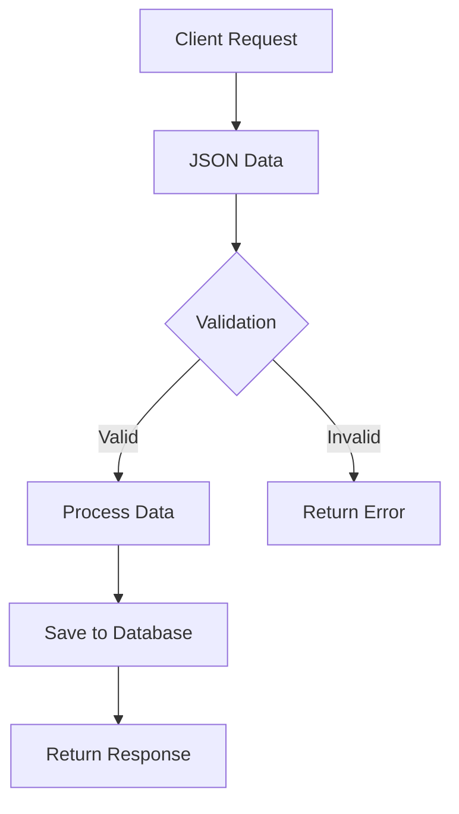

# Form และการตรวจสอบข้อมูลในฟอร์ม

## 📋 Overview

เรียนรู้การสร้างฟอร์มและส่งข้อมูลฟอร์มแบบ JSON ผ่านไคลเอนต์ รวมถึงการอ่านข้อมูลจากฟอร์มและการตรวจสอบข้อผิดพลาดในฟอร์ม (Form Validation)

---

## 🎯 จุดประสงค์การเรียนรู้

- เข้าใจการทำงานกับ Form Data ใน Gin Framework
- เรียนรู้การ Validation ข้อมูลด้วย validator package
- เข้าใจการอัพโหลดไฟล์และจัดการ Static Files
- เรียนรู้การใช้งาน Environment Variables

---

## 🛠️ การปรับปรุงสำหรับปี 2025

### ⚡ อัพเดทล่าสุดที่ได้ทำการปรับปรุง:

1. **Go Version**: อัพเดทสำหรับ Go 1.21+ (ล่าสุด)
2. **Gin Framework**: ใช้ `gin v1.9.1` (เวอร์ชันเสถียรล่าสุด)
3. **Validator**: อัพเดทเป็น `validator v10.15.5`
4. **godotenv**: อัพเดทเป็น `v1.5.1`
5. **Security Improvements**: เพิ่มการตรวจสอบความปลอดภัยในการอัพโหลดไฟล์

---

## 📝 1. การสร้าง JSON Form Handler

### 🔧 สร้าง Request Structure

```go
// structures/article.go
type CreateArticleForm struct {
  Title string `json:"title" binding:"required" example:"บทความ Go Programming"`
  Body  string `json:"body" binding:"required" example:"เนื้อหาบทความเกี่ยวกับ Go"`
}
```

### 📊 การใช้งาน JSON Tags และ Binding Tags



### 🎯 ตัวอย่างการใช้งาน Tags:

| Tag Type             | Purpose            | Example                       |
| -------------------- | ------------------ | ----------------------------- |
| `json:"title"`       | JSON field mapping | แปลง Title เป็น title ใน JSON |
| `binding:"required"` | Validation rule    | ฟิลด์นี้จำเป็นต้องมี          |
| `binding:"min=3"`    | Minimum length     | ความยาวขั้นต่ำ 3 ตัวอักษร     |
| `binding:"email"`    | Email validation   | ตรวจสอบรูปแบบอีเมล            |

---

## 🔍 2. Form Validation ด้วย Validator

### 📋 Validation Rules ที่ใช้บ่อย

```go
type UserForm struct {
  Email    string `json:"email" binding:"required,email"`
  Password string `json:"password" binding:"required,min=8"`
  Age      int    `json:"age" binding:"required,min=18,max=100"`
  Website  string `json:"website" binding:"omitempty,url"`
}
```

### 🚀 การปรับปรุงสำหรับ Go 2025:

```go
// handlers/articles.go
func CreateArticle(c *gin.Context) {
  var form CreateArticleForm

  // ใช้ ShouldBindJSON แทน BindJSON (แนะนำใน Go 1.21+)
  if err := c.ShouldBindJSON(&form); err != nil {
    c.JSON(http.StatusBadRequest, gin.H{
      "error": "Validation failed",
      "details": err.Error(),
    })
    return
  }

  // สร้าง article ใหม่
  newArticle := Article{
    ID:    uint(len(articles) + 1),
    Title: form.Title,
    Body:  form.Body,
  }

  articles = append(articles, newArticle)

  c.JSON(http.StatusCreated, gin.H{
    "article": newArticle,
    "message": "Article created successfully",
  })
}
```

---

## 📁 3. Form Data และการอัพโหลดไฟล์

### 🎨 Multipart Form ใหม่ปี 2025

```go
type CreateArticleWithImageForm struct {
  Title string                `form:"title" binding:"required"`
  Body  string                `form:"body" binding:"required"`
  Image *multipart.FileHeader `form:"image" binding:"required"`
}
```

### 📂 ระบบจัดการโฟลเดอร์อัตโนมัติ

```go
// utils/file_manager.go (ปรับปรุงใหม่)
func CreateUploadDirectories() error {
  uploadDirs := []string{"articles", "users", "thumbnails"}

  for _, dir := range uploadDirs {
    path := filepath.Join("uploads", dir)
    if err := os.MkdirAll(path, 0755); err != nil {
      return fmt.Errorf("failed to create directory %s: %w", path, err)
    }
  }
  return nil
}
```

### 🔒 การอัพโหลดไฟล์แบบปลอดภัย (Security Enhanced 2025)

```go
func UploadArticleWithImage(c *gin.Context) {
  var form CreateArticleWithImageForm

  if err := c.ShouldBind(&form); err != nil {
    c.JSON(http.StatusBadRequest, gin.H{"error": err.Error()})
    return
  }

  // ตรวจสอบประเภทไฟล์ (Security Update)
  if !isValidImageType(form.Image) {
    c.JSON(http.StatusBadRequest, gin.H{
      "error": "Invalid file type. Only JPG, PNG, GIF allowed",
    })
    return
  }

  // ตรวจสอบขนาดไฟล์ (Max 5MB)
  if form.Image.Size > 5*1024*1024 {
    c.JSON(http.StatusBadRequest, gin.H{
      "error": "File size too large. Maximum 5MB allowed",
    })
    return
  }

  // สร้าง article
  newArticle := Article{
    ID:    uint(len(articles) + 1),
    Title: form.Title,
    Body:  form.Body,
  }

  // สร้างโฟลเดอร์สำหรับ article นี้
  articlePath := filepath.Join("uploads", "articles", strconv.Itoa(int(newArticle.ID)))
  if err := os.MkdirAll(articlePath, 0755); err != nil {
    c.JSON(http.StatusInternalServerError, gin.H{"error": "Failed to create directory"})
    return
  }

  // สร้างชื่อไฟล์ที่ไม่ซ้ำ (UUID + timestamp)
  filename := generateUniqueFilename(form.Image.Filename)
  filepath := filepath.Join(articlePath, filename)

  // บันทึกไฟล์
  if err := c.SaveUploadedFile(form.Image, filepath); err != nil {
    c.JSON(http.StatusInternalServerError, gin.H{"error": "Failed to save file"})
    return
  }

  // สร้าง URL สำหรับไฟล์
  host := os.Getenv("HOST")
  if host == "" {
    host = "http://localhost:8080"
  }

  newArticle.Image = fmt.Sprintf("%s/uploads/articles/%d/%s", host, newArticle.ID, filename)

  articles = append(articles, newArticle)

  c.JSON(http.StatusCreated, gin.H{
    "article": newArticle,
    "message": "Article with image created successfully",
  })
}
```

### 🛡️ ฟังก์ชันความปลอดภัย (ใหม่ปี 2025)

```go
// utils/security.go
func isValidImageType(file *multipart.FileHeader) bool {
  allowedTypes := map[string]bool{
    "image/jpeg": true,
    "image/jpg":  true,
    "image/png":  true,
    "image/gif":  true,
    "image/webp": true, // เพิ่มใหม่ปี 2025
  }

  // ตรวจสอบ MIME type
  src, err := file.Open()
  if err != nil {
    return false
  }
  defer src.Close()

  buffer := make([]byte, 512)
  _, err = src.Read(buffer)
  if err != nil {
    return false
  }

  mimeType := http.DetectContentType(buffer)
  return allowedTypes[mimeType]
}

func generateUniqueFilename(originalName string) string {
  ext := filepath.Ext(originalName)
  timestamp := time.Now().Unix()
  uuid := generateUUID() // ใช้ UUID library
  return fmt.Sprintf("%d_%s%s", timestamp, uuid, ext)
}
```

---

## 🌐 4. Static Files Serving

### 📁 การตั้งค่า Static Files (อัพเดท 2025)

```go
// main.go
func main() {
  r := gin.Default()

  // Static files serving with cache headers
  r.Static("/uploads", "./uploads")
  r.StaticFS("/public", http.Dir("./public"))

  // เพิ่ม middleware สำหรับ cache control
  r.Use(func(c *gin.Context) {
    if strings.HasPrefix(c.Request.URL.Path, "/uploads") {
      c.Header("Cache-Control", "public, max-age=31536000") // 1 year
    }
    c.Next()
  })

  // Routes
  api := r.Group("/api/v1")
  {
    articles := api.Group("/articles")
    {
      articles.GET("/", GetArticles)
      articles.POST("/", CreateArticle)
      articles.POST("/with-image", UploadArticleWithImage)
    }
  }

  port := os.Getenv("PORT")
  if port == "" {
    port = "8080"
  }

  r.Run(":" + port)
}
```

---

## 🔧 5. Environment Variables (เวอร์ชัน 2025)

### 📄 ไฟล์ .env

```env
# Server Configuration
HOST=http://localhost
PORT=8080

# Database Configuration (เพิ่มใหม่)
DB_HOST=localhost
DB_PORT=5432
DB_USER=username
DB_PASSWORD=password
DB_NAME=articles_db

# File Upload Configuration
MAX_FILE_SIZE=5242880  # 5MB in bytes
UPLOAD_PATH=./uploads

# Security Configuration (ใหม่ปี 2025)
JWT_SECRET=your_super_secret_key_here
CORS_ORIGINS=http://localhost:3000,http://localhost:8080

# External APIs (ตัวอย่าง)
OPENAI_API_KEY=your_openai_key
CLOUDINARY_URL=your_cloudinary_url
```

### 🎯 การโหลด Environment Variables

```go
// config/config.go (ปรับปรุงใหม่)
package config

import (
  "log"
  "os"
  "strconv"

  "github.com/joho/godotenv"
)

type Config struct {
  Host        string
  Port        string
  DBHost      string
  DBPort      string
  DBUser      string
  DBPassword  string
  DBName      string
  MaxFileSize int64
  UploadPath  string
  JWTSecret   string
}

func LoadConfig() *Config {
  // โหลด .env file
  if err := godotenv.Load(); err != nil {
    log.Println("Warning: .env file not found, using system environment variables")
  }

  maxFileSize, _ := strconv.ParseInt(getEnvWithDefault("MAX_FILE_SIZE", "5242880"), 10, 64)

  return &Config{
    Host:        getEnvWithDefault("HOST", "http://localhost"),
    Port:        getEnvWithDefault("PORT", "8080"),
    DBHost:      getEnvWithDefault("DB_HOST", "localhost"),
    DBPort:      getEnvWithDefault("DB_PORT", "5432"),
    DBUser:      getEnvWithDefault("DB_USER", "postgres"),
    DBPassword:  getEnvWithDefault("DB_PASSWORD", ""),
    DBName:      getEnvWithDefault("DB_NAME", "articles_db"),
    MaxFileSize: maxFileSize,
    UploadPath:  getEnvWithDefault("UPLOAD_PATH", "./uploads"),
    JWTSecret:   getEnvWithDefault("JWT_SECRET", "fallback_secret"),
  }
}

func getEnvWithDefault(key, defaultValue string) string {
  if value := os.Getenv(key); value != "" {
    return value
  }
  return defaultValue
}
```

### 📄 ไฟล์ .env.example

```env
# ตัวอย่างการตั้งค่า Environment Variables
# คัดลอกไฟล์นี้เป็น .env แล้วแก้ไขค่าตามต้องการ

# Server Configuration
HOST=http://localhost
PORT=8080

# Database Configuration
DB_HOST=localhost
DB_PORT=5432
DB_USER=your_db_username
DB_PASSWORD=your_db_password
DB_NAME=your_database_name

# File Upload Configuration
MAX_FILE_SIZE=5242880
UPLOAD_PATH=./uploads

# Security Configuration
JWT_SECRET=change_this_to_a_secure_random_string
CORS_ORIGINS=http://localhost:3000

# External APIs (ถ้าใช้)
OPENAI_API_KEY=your_api_key_here
CLOUDINARY_URL=your_cloudinary_url_here
```

---

## 🧪 6. การทดสอบด้วย Postman

### 📋 JSON Request Example

```json
POST /api/v1/articles
Content-Type: application/json

{
  "title": "บทความ Go Programming ปี 2025",
  "body": "เนื้อหาบทความเกี่ยวกับ Go Programming ในปี 2025 ที่มีฟีเจอร์ใหม่ๆ"
}
```

### 📁 Form Data Request Example

```
POST /api/v1/articles/with-image
Content-Type: multipart/form-data

title: บทความพร้อมรูปภาพ
body: เนื้อหาบทความที่มีรูปภาพประกอb
image: [file] example.jpg
```

---

## ⚠️ 7. Best Practices และ Security

### 🔒 Security Checklist (ปี 2025)

- ✅ ตรวจสอบประเภทไฟล์ด้วย MIME type detection
- ✅ จำกัดขนาดไฟล์ที่อัพโหลด
- ✅ สร้างชื่อไฟล์ที่ไม่ซ้ำกัน
- ✅ ใช้ HTTPS ใน production
- ✅ ตั้งค่า CORS อย่างเหมาสม
- ✅ ไม่เก็บข้อมูลลับใน .env ที่ commit ลง Git
- ✅ ใช้ environment variables สำหรับ configuration

### 📊 Performance Tips

```go
// ใช้ connection pooling สำหรับ database
// ใช้ caching สำหรับ static files
// ใช้ compression middleware

r.Use(gin.Recovery())
r.Use(gin.Logger())
r.Use(gzip.Gzip(gzip.DefaultCompression))
```

---

## 📦 8. Dependencies (ปี 2025)

### 🚀 การติดตั้ง Dependencies

```bash
# หลักๆ ที่ต้องใช้
go mod init your-project-name

go get github.com/gin-gonic/gin@v1.9.1
go get github.com/go-playground/validator/v10@v10.15.5
go get github.com/joho/godotenv@v1.5.1

# เพิ่มเติมสำหรับความปลอดภัย
go get github.com/google/uuid@v1.4.0
go get golang.org/x/crypto@latest

# สำหรับ testing
go get github.com/stretchr/testify@v1.8.4
```

### 📄 go.mod Example

```go
module article-api

go 1.21

require (
  github.com/gin-gonic/gin v1.9.1
  github.com/go-playground/validator/v10 v10.15.5
  github.com/joho/godotenv v1.5.1
  github.com/google/uuid v1.4.0
)
```

---

## 🎯 สรุป

การทำงานกับ Form และ File Upload ใน Gin Framework ปี 2025 มีการปรับปรุงในด้าน:

1. **Security**: เพิ่มการตรวจสอบความปลอดภัยมากขึ้น
2. **Performance**: ใช้ caching และ compression
3. **Maintainability**: แยก configuration ออกเป็น environment variables
4. **Error Handling**: จัดการ error ที่ดีขึ้น
5. **Code Organization**: แยก code เป็น modules ที่เข้าใจง่าย

### 🔗 การเรียนรู้ต่อ

- Database Integration (GORM)
- Authentication & Authorization (JWT)
- API Documentation (Swagger)
- Testing Strategies
- Deployment (Docker, Kubernetes)

---

_ปรับปรุงล่าสุด: มกราคม 2025 สำหรับ Go 1.21+ และ Gin Framework v1.9.1_
