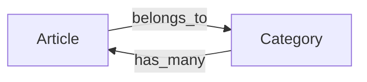

# Associations - ความสัมพันธ์ระหว่าง Models

เรียนรู้การสร้างความสัมพันธ์ระหว่าง Models แบบ **Belongs To** และ **Has Many** รวมถึงการทำ **Preloading** เพื่อเพิ่มประสิทธิภาพในการดึงข้อมูล

## 📖 ภาพรวมของความสัมพันธ์

ในบทนี้เราจะทำงานกับ 2 Models หลัก:

- **Article** (บทความ)
- **Category** (หมวดหมู่บทความ)

### 🔗 ประเภทความสัมพันธ์



1. **Article belongs to Category**: บทความ 1 ตัวสามารถอยู่ในหมวดหมู่ได้เพียง 1 หมวดหมู่เท่านั้น
2. **Category has many Articles**: หมวดหมู่ 1 หมวดหมู่สามารถมีบทความได้หลายตัว

## 🛠️ การเตรียม Database Schema

### ขั้นตอนที่ 1: สร้าง Migration สำหรับ Foreign Key

เนื่องจากเราต้องเพิ่ม `category_id` ลงใน `articles` table เราจึงต้องสร้าง migration ใหม่

```bash
# สร้าง timestamp สำหรับ migration
date +%Y%m%d%H%M%S

# สร้างไฟล์ migration ใหม่
# ตัวอย่าง: M20251201120000_add_category_id_to_articles.go
```

**ไฟล์ Migration: `M20251201120000_add_category_id_to_articles.go`**

```go
package migrations

import (
  "your-project/models"
  "gorm.io/gorm"
)

func init() {
  m := &Migration{
    ID: "M20251201120000_add_category_id_to_articles",
    Migrate: func(db *gorm.DB) error {
      // ดึงข้อมูล articles ที่มีอยู่เพื่อ set default category_id
      var articles []models.Article
      if err := db.Unscoped().Find(&articles).Error; err != nil {
        return err
      }

      // Auto migrate เพื่อเพิ่ม column category_id
      if err := db.AutoMigrate(&models.Article{}); err != nil {
        return err
      }

      // อัปเดตข้อมูลเก่าให้มี category_id (ตัวอย่างให้เป็น 2)
      for _, article := range articles {
        article.CategoryID = 2
        if err := db.Save(&article).Error; err != nil {
          return err
        }
      }

      return nil
    },
    Rollback: func(db *gorm.DB) error {
      // ลบ column category_id เมื่อ rollback
      return db.Model(&models.Article{}).DropColumn("category_id")
    },
  }

  // เพิ่ม migration เข้าไปใน list
  AllMigrations = append(AllMigrations, m)
}
```

> **⚠️ สำคัญ**: การใช้ `db.Unscoped()` จะดึงข้อมูลทั้งหมดรวมถึงที่ถูก soft delete แล้ว

### ขั้นตอนที่ 2: อัปเดต Article Model

**ไฟล์: `models/article.go`**

```go
package models

import (
  "gorm.io/gorm"
  "time"
)

type Article struct {
  ID          uint           `json:"id" gorm:"primaryKey"`
  Title       string         `json:"title"`
  Text        string         `json:"text"`
  Image       string         `json:"image"`
  CategoryID  uint           `json:"category_id"` // 🆕 เพิ่ม Foreign Key
  Category    Category       `json:"category"`    // 🆕 เพิ่ม Relationship
  CreatedAt   time.Time      `json:"created_at"`
  UpdatedAt   time.Time      `json:"updated_at"`
  DeletedAt   gorm.DeletedAt `json:"deleted_at" gorm:"index"`
}
```

### ขั้นตอนที่ 3: อัปเดต Category Model

**ไฟล์: `models/category.go`**

```go
package models

import (
  "gorm.io/gorm"
  "time"
)

type Category struct {
  ID          uint           `json:"id" gorm:"primaryKey"`
  Name        string         `json:"name"`
  Description string         `json:"description"`
  Articles    []Article      `json:"articles"` // 🆕 เพิ่ม Has Many Relationship
  CreatedAt   time.Time      `json:"created_at"`
  UpdatedAt   time.Time      `json:"updated_at"`
  DeletedAt   gorm.DeletedAt `json:"deleted_at" gorm:"index"`
}
```

## 📝 การปรับปรุง Response Structures

### Article Response with Category

**ไฟล์: `controllers/article_controller.go`**

```go
type ArticleResponse struct {
  ID         uint     `json:"id"`
  Title      string   `json:"title"`
  Text       string   `json:"text"`
  Image      string   `json:"image"`
  CategoryID uint     `json:"category_id"` // 🆕 เพิ่ม category_id
  Category   struct { // 🆕 เพิ่ม category object
    ID   uint   `json:"id"`
    Name string `json:"name"`
  } `json:"category"`
  CreatedAt time.Time `json:"created_at"`
  UpdatedAt time.Time `json:"updated_at"`
}
```

### Category Response with Articles

```go
type CategoryResponse struct {
  ID          uint   `json:"id"`
  Name        string `json:"name"`
  Description string `json:"description"`
  Articles    []struct { // 🆕 เพิ่ม articles array
    ID    uint   `json:"id"`
    Title string `json:"title"`
  } `json:"articles"`
  CreatedAt time.Time `json:"created_at"`
  UpdatedAt time.Time `json:"updated_at"`
}

// สำหรับ list ทั้งหมด (ไม่ต้องการ articles)
type CategoryListResponse struct {
  ID          uint   `json:"id"`
  Name        string `json:"name"`
  Description string `json:"description"`
}
```

## 🔄 Preloading - การโหลดข้อมูลความสัมพันธ์

### ปัญหาของ N+1 Query

```go
// ❌ ไม่ดี - จะเกิด N+1 queries
func GetArticle(c *gin.Context) {
  var article models.Article
  db.First(&article, c.Param("id")) // Query 1: ดึง article
  // เมื่อ access article.Category จะเกิด Query เพิ่ม (N+1 problem)
}
```

### การแก้ไขด้วย Preloading

```go
// ✅ ดี - ใช้ Preload เพื่อดึงข้อมูลครั้งเดียว
func GetArticle(c *gin.Context) {
  var article models.Article
  if err := db.Preload("Category").First(&article, c.Param("id")).Error; err != nil {
    c.JSON(404, gin.H{"error": "Article not found"})
    return
  }

  response := ArticleResponse{
    ID:         article.ID,
    Title:      article.Title,
    Text:       article.Text,
    Image:      article.Image,
    CategoryID: article.CategoryID,
    Category: struct {
      ID   uint   `json:"id"`
      Name string `json:"name"`
    }{
      ID:   article.Category.ID,
      Name: article.Category.Name,
    },
    CreatedAt: article.CreatedAt,
    UpdatedAt: article.UpdatedAt,
  }

  c.JSON(200, response)
}
```

### การ Preload Articles สำหรับ Category

```go
func GetCategory(c *gin.Context) {
  var category models.Category
  if err := db.Preload("Articles").First(&category, c.Param("id")).Error; err != nil {
    c.JSON(404, gin.H{"error": "Category not found"})
    return
  }

  // สร้าง articles slice สำหรับ response
  articles := make([]struct {
    ID    uint   `json:"id"`
    Title string `json:"title"`
  }, len(category.Articles))

  for i, article := range category.Articles {
    articles[i] = struct {
      ID    uint   `json:"id"`
      Title string `json:"title"`
    }{
      ID:    article.ID,
      Title: article.Title,
    }
  }

  response := CategoryResponse{
    ID:          category.ID,
    Name:        category.Name,
    Description: category.Description,
    Articles:    articles,
    CreatedAt:   category.CreatedAt,
    UpdatedAt:   category.UpdatedAt,
  }

  c.JSON(200, response)
}
```

## 🆕 การปรับปรุงสำหรับ Go Version ใหม่ (2025)

### 1. การใช้ Generic Types (Go 1.18+) (2025 -> 1.24.3)

```go
// ใช้ Generics สำหรับ Response
type BaseResponse[T any] struct {
  Data    T      `json:"data"`
  Message string `json:"message"`
  Status  string `json:"status"`
}

func GetArticle(c *gin.Context) {
  var article models.Article
  if err := db.Preload("Category").First(&article, c.Param("id")).Error; err != nil {
    c.JSON(404, BaseResponse[any]{
      Data:    nil,
      Message: "Article not found",
      Status:  "error",
    })
    return
  }

  response := BaseResponse[ArticleResponse]{
    Data:    mapArticleToResponse(article),
    Message: "Success",
    Status:  "success",
  }

  c.JSON(200, response)
}
```

### 2. การใช้ Context with Timeout

```go
import (
  "context"
  "time"
)

func GetArticle(c *gin.Context) {
  // สร้าง context với timeout
  ctx, cancel := context.WithTimeout(c.Request.Context(), 5*time.Second)
  defer cancel()

  var article models.Article
  if err := db.WithContext(ctx).Preload("Category").First(&article, c.Param("id")).Error; err != nil {
    if errors.Is(err, context.DeadlineExceeded) {
      c.JSON(408, gin.H{"error": "Request timeout"})
      return
    }
    c.JSON(404, gin.H{"error": "Article not found"})
    return
  }

  // ... rest of the code
}
```

### 3. การใช้ Structured Logging

```go
import "log/slog"

func GetArticle(c *gin.Context) {
  articleID := c.Param("id")

  slog.Info("Fetching article",
    "article_id", articleID,
    "user_ip", c.ClientIP(),
  )

  var article models.Article
  if err := db.Preload("Category").First(&article, articleID).Error; err != nil {
    slog.Error("Failed to fetch article",
      "article_id", articleID,
      "error", err,
    )
    c.JSON(404, gin.H{"error": "Article not found"})
    return
  }

  slog.Info("Article fetched successfully", "article_id", articleID)
  // ... rest of the code
}
```

## 📊 ตัวอย่าง API Response

### GET /articles/3

```json
{
  "id": 3,
  "title": "Sample Article",
  "text": "This is article content...",
  "image": "image.jpg",
  "category_id": 2,
  "category": {
    "id": 2,
    "name": "Technology"
  },
  "created_at": "2025-01-01T10:00:00Z",
  "updated_at": "2025-01-01T10:00:00Z"
}
```

### GET /categories/2

```json
{
  "id": 2,
  "name": "Technology",
  "description": "Tech related articles",
  "articles": [
    {
      "id": 2,
      "title": "Article 1"
    },
    {
      "id": 3,
      "title": "Article 2"
    },
    {
      "id": 4,
      "title": "Article 3"
    }
  ],
  "created_at": "2025-01-01T09:00:00Z",
  "updated_at": "2025-01-01T09:00:00Z"
}
```

## 📈 Performance Tips

### 1. การใช้ Select เพื่อจำกัด Fields

```go
// ดึงเฉพาะ fields ที่ต้องการ
db.Select("id", "title", "category_id").Preload("Category", func(db *gorm.DB) *gorm.DB {
  return db.Select("id", "name")
}).Find(&articles)
```

### 2. การใช้ Joins แทน Preload สำหรับข้อมูลน้อย

```go
// สำหรับ Belongs To relationships
db.Joins("Category").Find(&articles)
```

### 3. การใช้ Pagination

```go
func GetArticles(c *gin.Context) {
  page, _ := strconv.Atoi(c.DefaultQuery("page", "1"))
  limit, _ := strconv.Atoi(c.DefaultQuery("limit", "10"))
  offset := (page - 1) * limit

  var articles []models.Article
  var total int64

  db.Model(&models.Article{}).Count(&total)
  db.Preload("Category").Limit(limit).Offset(offset).Find(&articles)

  c.JSON(200, gin.H{
    "data":  articles,
    "total": total,
    "page":  page,
    "limit": limit,
  })
}
```

## 🎯 สรุป

ในบทนี้เราได้เรียนรู้:

1. **การสร้าง Associations** ระหว่าง Models แบบ Belongs To และ Has Many
2. **การเขียน Migration** เพื่อเพิ่ม Foreign Key
3. **การใช้ Preloading** เพื่อแก้ปัญหา N+1 Query
4. **การออกแบบ Response Structure** ที่เหมาะสม
5. **การปรับปรุงด้วย Go features ใหม่** สำหรับปี 2025

การทำความเข้าใจ Associations จะช่วยให้เราสามารถออกแบบ API ที่มีประสิทธิภาพและใช้งานง่ายขึ้น 🚀

เพิ่่มเติมการแก้ไขใน Gorm V2 2025 จะเกิด error ตามด้านล่างนี้
tx.Model(&models.Article{}).DropColumn undefined (type \*gorm.DB has no field or method DropColumn)

The DropColumn method doesn't exist in GORM v2, so I'll replace it with the Migrator().DropColumn method which is the correct way to drop columns in GORM v2.

จากคลิป associations นาทีที่ 6:06
ทำการแก้ไขเป็น return tx.Migrator().DropColumn(&models.Article{}, "category_id")
