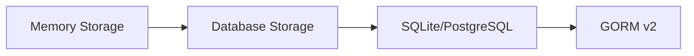

# การเชื่อมต่อฐานข้อมูลผ่าน GORM (อัปเดตเป็น Version ล่าสุด 2024)

เรียนรู้การเชื่อมต่อฐานข้อมูลประเภท RDBMS เช่น PostgreSQL และ SQLite ด้วย GORM v2

## 🎯 ภาพรวมของบทเรียน

ในบทเรียนนี้เราจะเปลี่ยนจากการใช้ข้อมูลที่เก็บในหน่วยความจำ (Memory) ไปเป็นการใช้ฐานข้อมูลจริง ซึ่งจะช่วยให้ข้อมูลไม่หายไปเมื่อปิดโปรแกรม



## 📁 โครงสร้างโปรเจค

ก่อนเริ่มต้น ให้สร้างโครงสร้างโฟลเดอร์ดังนี้:

```
golang_api/
├── config/
│   └── db.go          # การตั้งค่าฐานข้อมูล
├── documents/
├── main.go
├── .env               # ตัวแปรสภาพแวดล้อม
├── .env.example       # ตัวอย่างไฟล์ environment
└── go.mod
```

## 🔧 การติดตั้ง Dependencies

### สำหรับ SQLite (เริ่มต้นง่าย)

```bash
go get gorm.io/gorm
go get gorm.io/driver/sqlite
```

### สำหรับ PostgreSQL (Production Ready)

```bash
go get gorm.io/gorm
go get gorm.io/driver/postgres
go get github.com/joho/godotenv  # สำหรับจัดการ .env file
```

## 📝 การสร้างไฟล์ config/db.go

### เวอร์ชัน SQLite (สำหรับเริ่มต้น)

```go
package config

import (
  "log"

  "gorm.io/driver/sqlite"
  "gorm.io/gorm"
  "gorm.io/gorm/logger"
)

var db *gorm.DB

func InitDB() {
  var err error

  // เปิดการเชื่อมต่อกับ SQLite
  db, err = gorm.Open(sqlite.Open("./gorm.db"), &gorm.Config{
    Logger: logger.Default.LogMode(logger.Info),
  })

  if err != nil {
    log.Fatal("❌ ไม่สามารถเชื่อมต่อฐานข้อมูลได้:", err)
  }

  log.Println("✅ เชื่อมต่อฐานข้อมูล SQLite สำเร็จ")
}

func GetDB() *gorm.DB {
  return db
}

func CloseDB() {
  sqlDB, err := db.DB()
  if err != nil {
    log.Fatal("❌ ไม่สามารถดึง database instance ได้:", err)
  }
  sqlDB.Close()
  log.Println("🔐 ปิดการเชื่อมต่อฐานข้อมูลแล้ว")
}
```

### เวอร์ชัน PostgreSQL (Production Ready)

```go
package config

import (
  "fmt"
  "log"
  "os"

  "gorm.io/driver/postgres"
  "gorm.io/gorm"
  "gorm.io/gorm/logger"
)

var db *gorm.DB

func InitDB() {
  var err error

  // สร้าง Connection String สำหรับ PostgreSQL
  dsn := fmt.Sprintf(
    "host=%s user=%s password=%s dbname=%s port=%s sslmode=%s TimeZone=%s",
    os.Getenv("DB_HOST"),
    os.Getenv("DB_USER"),
    os.Getenv("DB_PASSWORD"),
    os.Getenv("DB_NAME"),
    os.Getenv("DB_PORT"),
    os.Getenv("DB_SSLMODE"),
    os.Getenv("DB_TIMEZONE"),
  )

  // เปิดการเชื่อมต่อกับ PostgreSQL
  db, err = gorm.Open(postgres.Open(dsn), &gorm.Config{
    Logger: logger.Default.LogMode(logger.Info),
  })

  if err != nil {
    log.Fatal("❌ ไม่สามารถเชื่อมต่อฐานข้อมูล PostgreSQL ได้:", err)
  }

  log.Println("✅ เชื่อมต่อฐานข้อมูล PostgreSQL สำเร็จ")
}

func GetDB() *gorm.DB {
  return db
}

func CloseDB() {
  sqlDB, err := db.DB()
  if err != nil {
    log.Fatal("❌ ไม่สามารถดึง database instance ได้:", err)
  }
  sqlDB.Close()
  log.Println("🔐 ปิดการเชื่อมต่อฐานข้อมูลแล้ว")
}
```

## 🌍 การตั้งค่า Environment Variables

### ไฟล์ .env

```env
# Server Configuration
HOST=http://127.0.0.1:5000
PORT=5000

# PostgreSQL Database Configuration
DB_HOST=localhost
DB_USER=your_username
DB_PASSWORD=your_password
DB_NAME=articles
DB_PORT=5432
DB_SSLMODE=disable
DB_TIMEZONE=Asia/Bangkok
```

### ไฟล์ .env.example (สำหรับทีม)

```env
# Server Configuration
HOST=http://127.0.0.1:5000
PORT=5000

# PostgreSQL Database Configuration
DB_HOST=localhost
DB_USER=your_database_username
DB_PASSWORD=your_database_password
DB_NAME=your_database_name
DB_PORT=5432
DB_SSLMODE=disable
DB_TIMEZONE=Asia/Bangkok
```

## 🚀 การเรียกใช้งานใน main.go

```go
package main

import (
  "log"
  "os"

  "your_project/config"
  "github.com/gin-gonic/gin"
  "github.com/joho/godotenv"
)

func main() {
  // โหลด environment variables
  if err := godotenv.Load(); err != nil {
    log.Println("⚠️  ไม่พบไฟล์ .env")
  }

  // เชื่อมต่อฐานข้อมูล
  config.InitDB()
  defer config.CloseDB() // ปิดการเชื่อมต่อเมื่อโปรแกรมจบ

  // สร้าง Gin router
  r := gin.Default()

  // Routes ของคุณ...

  // เริ่มต้น server
  port := os.Getenv("PORT")
  if port == "" {
    port = "8080"
  }

  log.Printf("🚀 Server เริ่มต้นที่ port %s", port)
  r.Run(":" + port)
}
```

## 🛠️ การติดตั้ง PostgreSQL

### สำหรับ macOS

```bash
# ติดตั้งผ่าน Homebrew
brew install postgresql
brew services start postgresql

# สร้างฐานข้อมูล
createdb articles
```

### สำหรับ Windows

1. ดาวน์โหลดจาก [postgresql.org](https://www.postgresql.org/download/windows/)
2. ติดตั้งตามขั้นตอน
3. ใช้ pgAdmin เป็น GUI client

### สำหรับ Linux (Ubuntu)

```bash
sudo apt update
sudo apt install postgresql postgresql-contrib
sudo systemctl start postgresql
sudo systemctl enable postgresql

# สร้างฐานข้อมูล
sudo -u postgres createdb articles
```

## 🔧 การแก้ไขปัญหา PostgreSQL บน macOS

หากเจอ error `role "postgres" does not exist` ให้ทำตามขั้นตอนนี้:

### วิธีที่ 1: สร้าง postgres user

```bash
# สร้าง postgres user (superuser)
createuser -s postgres

# สร้างฐานข้อมูล
createdb -U postgres articles

# หรือถ้าต้องการตั้งรหัสผ่าน
createuser -s -P postgres
```

### วิธีที่ 2: ใช้ username ปัจจุบัน (แนะนำ)

```bash
# ตรวจสอบ username ปัจจุบัน
whoami

# สร้างฐานข้อมูลด้วย username ปัจจุบัน
createdb articles
```

จากนั้นอัปเดตไฟล์ `.env`:

```env
HOST=http://127.0.0.1:8080
PORT=8080

# PostgreSQL Database Configuration
DB_HOST=127.0.0.1
DB_USER=itswatthachai  # ใส่ username จริงของคุณ
DB_PASSWORD=           # เว้นว่างไว้หากไม่มีรหัสผ่าน
DB_NAME=articles
DB_PORT=5432
DB_SSLMODE=disable
DB_TIMEZONE=Asia/Bangkok
```

### วิธีที่ 3: Initialize PostgreSQL อย่างถูกต้อง

```bash
# Initialize PostgreSQL
initdb /opt/homebrew/var/postgres

# เริ่ม PostgreSQL service
brew services start postgresql

# สร้าง postgres user
createuser -s postgres

# สร้างฐานข้อมูล
createdb -U postgres articles
```

## ☁️ ตัวเลือกฐานข้อมูลออนไลน์

### 🌐 PostgreSQL Cloud Services

#### 1. **Neon** (ฟรี, แนะนำ)

```env
# Neon PostgreSQL (ฟรี 0.5GB)
DB_HOST=ep-xxx-xxx.us-east-2.aws.neon.tech
DB_USER=your_username
DB_PASSWORD=your_password
DB_NAME=neondb
DB_PORT=5432
DB_SSLMODE=require
DB_TIMEZONE=Asia/Bangkok
```

ลิงก์: [neon.tech](https://neon.tech)

#### 2. **Supabase** (ฟรี, มี Dashboard)

```env
# Supabase PostgreSQL (ฟรี 500MB)
DB_HOST=db.xxx.supabase.co
DB_USER=postgres
DB_PASSWORD=your_password
DB_NAME=postgres
DB_PORT=5432
DB_SSLMODE=require
DB_TIMEZONE=Asia/Bangkok
```

ลิงก์: [supabase.com](https://supabase.com)

#### 3. **Railway** (ฟรี $5 credit)

```env
# Railway PostgreSQL
DB_HOST=containers-us-west-xxx.railway.app
DB_USER=postgres
DB_PASSWORD=your_password
DB_NAME=railway
DB_PORT=5432
DB_SSLMODE=require
DB_TIMEZONE=Asia/Bangkok
```

ลิงก์: [railway.app](https://railway.app)

#### 4. **ElephantSQL** (ฟรี 20MB)

```env
# ElephantSQL PostgreSQL
DB_HOST=raja.db.elephantsql.com
DB_USER=xxx
DB_PASSWORD=xxx
DB_NAME=xxx
DB_PORT=5432
DB_SSLMODE=require
DB_TIMEZONE=Asia/Bangkok
```

ลิงก์: [elephantsql.com](https://elephantsql.com)

### 🔄 การสลับระหว่าง Local และ Cloud

สร้างไฟล์ `.env.local` และ `.env.cloud`:

#### .env.local

```env
# Local Development
DB_HOST=127.0.0.1
DB_USER=itswatthachai
DB_PASSWORD=
DB_NAME=articles
DB_PORT=5432
DB_SSLMODE=disable
DB_TIMEZONE=Asia/Bangkok
```

#### .env.cloud

```env
# Cloud Production
DB_HOST=ep-xxx-xxx.us-east-2.aws.neon.tech
DB_USER=your_username
DB_PASSWORD=your_password
DB_NAME=neondb
DB_PORT=5432
DB_SSLMODE=require
DB_TIMEZONE=Asia/Bangkok
```

จากนั้นใน `main.go`:

```go
func main() {
  // เลือกใช้ environment file
  envFile := ".env.local"  // เปลี่ยนเป็น ".env.cloud" สำหรับ production

  if err := godotenv.Load(envFile); err != nil {
    log.Printf("⚠️  ไม่พบไฟล์ %s", envFile)
  }

  // เชื่อมต่อฐานข้อมูล
  config.InitDB()
  defer config.CloseDB()

  // ...
}
```

## 📊 เครื่องมือจัดการฐานข้อมูล

### PostgreSQL GUI Tools

- **pgAdmin** - เครื่องมือหลักของ PostgreSQL
- **PosticoApp** (macOS) - UI ที่สวยงามและใช้งานง่าย
- **TablePlus** - Multi-database client ที่ทันสมัย
- **DBeaver** - ฟรี, รองรับหลาย database

## 🔄 การเปรียบเทียบ GORM v1 vs v2

### GORM v1 (เก่า - ไม่แนะนำ)

```go
// ❌ วิธีเก่า
import "github.com/jinzhu/gorm"
import _ "github.com/jinzhu/gorm/dialects/sqlite"

db, err := gorm.Open("sqlite3", "./gorm.db")
db.LogMode(true)
db.Close()
```

### GORM v2 (ใหม่ - แนะนำ)

```go
// ✅ วิธีใหม่
import "gorm.io/gorm"
import "gorm.io/driver/sqlite"

db, err := gorm.Open(sqlite.Open("./gorm.db"), &gorm.Config{
  Logger: logger.Default.LogMode(logger.Info),
})

sqlDB, _ := db.DB()
sqlDB.Close()
```

## 🎨 การตั้งค่า Logging

```go
// การตั้งค่า logging แบบละเอียด
db, err := gorm.Open(postgres.Open(dsn), &gorm.Config{
  Logger: logger.New(
    log.New(os.Stdout, "\r\n", log.LstdFlags),
    logger.Config{
      SlowThreshold:             time.Second,   // SQL ที่ช้าเกิน 1 วินาที
      LogLevel:                  logger.Info,   // ระดับ log
      IgnoreRecordNotFoundError: true,          // ไม่ log error เมื่อไม่เจอข้อมูล
      Colorful:                  true,          // สี่ใน terminal
    },
  ),
})
```

## 🚨 การจัดการ Error และ Best Practices

### Connection Pool Settings

```go
db, err := gorm.Open(postgres.Open(dsn), &gorm.Config{})

sqlDB, err := db.DB()

// ตั้งค่า connection pool
sqlDB.SetMaxIdleConns(10)           // connection ที่เปิดทิ้งไว้
sqlDB.SetMaxOpenConns(100)          // connection สูงสุด
sqlDB.SetConnMaxLifetime(time.Hour) // อายุของ connection
```

### Health Check Function

```go
func CheckDBHealth() error {
  sqlDB, err := config.GetDB().DB()
  if err != nil {
    return err
  }
  return sqlDB.Ping()
}
```

## 📋 สิ่งที่ได้ปรับปรุงจากเดิม

### ✅ การปรับปรุงหลัก

1. **อัปเดต GORM v1 → v2**: เปลี่ยน import path และ syntax ใหม่
2. **Driver แยกแพ็คเกจ**: ใช้ `gorm.io/driver/postgres` แทน dialect แบบเก่า
3. **Configuration Object**: ใช้ `&gorm.Config{}` แทน method chain
4. **Logger ใหม่**: ระบบ logging ที่ยืดหยุ่นกว่า
5. **Connection Management**: วิธีปิด connection ที่ถูกต้อง
6. **Environment Variables**: การจัดการ config ที่ปลอดภัย
7. **Error Handling**: การจัดการ error ที่ดีขึ้น
8. **Type Safety**: การใช้ type ที่เข้มงวดขึ้น

### 🔧 Features เพิ่มเติม

- Connection pooling configuration
- Health check functionality
- Graceful shutdown
- Structured logging
- Environment-based configuration
- Cloud database integration
- Local/Cloud environment switching

## 🎯 ขั้นตอนถัดไป

หลังจากตั้งค่าฐานข้อมูลเสร็จแล้ว คุณสามารถ:

1. สร้าง Models สำหรับ database tables
2. ใช้ Auto Migration เพื่อสร้างตาราง
3. เขียน CRUD operations
4. ใช้ Query Builder ของ GORM
5. เพิ่ม Middleware สำหรับ transaction management

ตัวอย่างการใช้งานต่อไป:

```go
// ตัวอย่าง Model
type Article struct {
  ID        uint      `gorm:"primaryKey"`
  Title     string    `gorm:"not null"`
  Content   string    `gorm:"type:text"`
  CreatedAt time.Time
  UpdatedAt time.Time
}

// Auto Migration
config.GetDB().AutoMigrate(&Article{})
```
