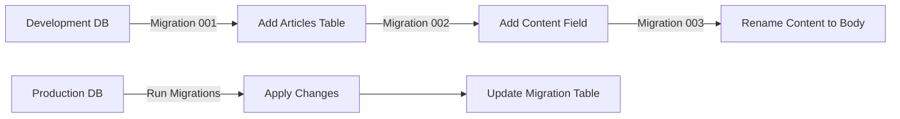

# Database Migrations with GORM

เรียนรู้การสร้าง Models และหลักการของ Database Migrations และการเปลี่ยน Schema ของฐานข้อมูล

## 📖 Overview

ในการพัฒนาแอปพลิเคชัน เราจำเป็นต้องจัดการกับการเปลี่ยนแปลงโครงสร้างฐานข้อมูล (Database Schema) อย่างเป็นระบบ GORM Migration จะช่วยให้เราทำงานนี้ได้อย่างมีประสิทธิภาพ

## 🎯 สิ่งที่จะได้เรียนรู้

- การสร้าง Model ใน GORM
- หลักการทำงานของ Database Migrations
- การจัดการ Schema Changes
- Best Practices สำหรับ Migration

## 🚀 การสร้าง Model ใน GORM

### ขั้นตอนการสร้าง Model

1. **สร้าง Struct** ที่ embed `gorm.Model`
2. **ประกาศ Fields** พร้อม GORM tags
3. **กำหนด Constraints** และ Validations

### ตัวอย่าง Model

```go
package models

import (
  "gorm.io/gorm"
)

type Article struct {
  gorm.Model
  Title   string `gorm:"unique;not null"`
  Excerpt string
  Body    string `gorm:"not null"`
  ImageURL string
}
```

### GORM Tags ที่มีประโยชน์

| Tag             | คำอธิบาย        | ตัวอย่าง                |
| --------------- | --------------- | ----------------------- |
| `unique`        | ค่าไม่ซ้ำ       | `gorm:"unique"`         |
| `not null`      | ห้ามเป็นค่าว่าง | `gorm:"not null"`       |
| `size:255`      | กำหนดขนาด       | `gorm:"size:255"`       |
| `default:value` | ค่าเริ่มต้น     | `gorm:"default:active"` |

## 🔄 หลักการ Database Migrations

### Migration คืออะไร?

Migration เป็นวิธีการจัดการการเปลี่ยนแปลงโครงสร้างฐานข้อมูลอย่างเป็นระบบ ทำให้สามารถ:

- **Track Changes**: ติดตามการเปลี่ยนแปลงทั้งหมด
- **Version Control**: จัดการเวอร์ชันของ Schema
- **Rollback**: ย้อนกลับการเปลี่ยนแปลงได้

### การทำงานของ Migration System



### Migration Table

GORM จะสร้าง table พิเศษชื่อ `migrations` เพื่อเก็บข้อมูล:

| ID                            | Applied At          |
| ----------------------------- | ------------------- |
| 20250315001_create_articles   | 2025-03-15 10:30:00 |
| 20250316002_add_content_field | 2025-03-16 14:20:00 |

## 📝 การสร้าง Migration Files

### โครงสร้าง Migration

```
migrations/
├── migration.go
└── m_20250315001_create_articles_table.go
```

### ตัวอย่าง Migration File

**migrations/m_20250315001_create_articles_table.go**

```go
package migrations

import (
  "your-project/models"
  "github.com/go-gormigrate/gormigrate/v2"
  "gorm.io/gorm"
)

func M20250315001CreateArticlesTable() *gormigrate.Migration {
  return &gormigrate.Migration{
    ID: "20250315001",
    Migrate: func(tx *gorm.DB) error {
      // สร้าง table articles
      return tx.AutoMigrate(&models.Article{})
    },
    Rollback: func(tx *gorm.DB) error {
      // ลบ table articles
      return tx.DropTable(&models.Article{})
    },
  }
}
```

### การสร้าง Timestamp

```bash
# macOS/Linux
date +%Y%m%d%H%M%S

# ผลลัพธ์: 20250315143022
```

## 🛠️ การจัดการ Migration

### Migration Manager

**migrations/migration.go**

```go
package migrations

import (
  "your-project/config"
  "github.com/go-gormigrate/gormigrate/v2"
  "gorm.io/gorm"
)

func Migrate() error {
  db := config.GetDB()

  m := gormigrate.New(db, gormigrate.DefaultOptions, []*gormigrate.Migration{
    M20250315001CreateArticlesTable(),
    // เพิ่ม migrations อื่นๆ ที่นี่
  })

  return m.Migrate()
}
```

### การเรียกใช้ใน main.go

```go
package main

import (
  "your-project/migrations"
  "log"
)

func main() {
  // Run migrations ก่อน start server
  if err := migrations.Migrate(); err != nil {
    log.Fatal("Migration failed:", err)
  }

  // เริ่ม web server
  startServer()
}
```

## 📊 GORM Migration Commands

### Auto Migrate

```go
// สร้าง/อัพเดท table อัตโนมัติ
db.AutoMigrate(&models.Article{})
```

### Manual Migration Operations

```go
// สร้าง table
tx.CreateTable(&models.Article{})

// ลบ table
tx.DropTable(&models.Article{})

// เพิ่ม column
tx.Model(&models.Article{}).AddColumn("description", "text")

// แก้ไข column
tx.Model(&models.Article{}).ModifyColumn("description", "text")

// ลบ column
tx.Model(&models.Article{}).DropColumn("description")
```

## ⚠️ ข้อควรระวัง

### Auto Migrate Limitations

- ❌ **ไม่ลบ columns** ที่ถูกเอาออกจาก model
- ❌ **ไม่เปลี่ยนชื่อ columns**
- ❌ **ไม่ลบ indexes/constraints** ที่ไม่ใช้แล้ว

### Best Practices

1. **ใช้ Manual Migrations** สำหรับ production
2. **เขียน Rollback** ให้ครบทุก migration
3. **Test migrations** ใน staging environment
4. **Backup database** ก่อน run migrations

## 🔄 การอัพเดทจากเวอร์ชันเก่า

### สิ่งที่ปรับปรุงใหม่

#### 1. GORM v2 (2025)

```go
// เก่า (GORM v1)
import "github.com/jinzhu/gorm"

// ใหม่ (GORM v2)
import "gorm.io/gorm"
import "gorm.io/driver/mysql"
```

#### 2. Gormigrate v2

```go
// ติดตั้ง
go get github.com/go-gormigrate/gormigrate/v2

// Import
import "github.com/go-gormigrate/gormigrate/v2"
```

#### 3. การเชื่อมต่อฐานข้อมูล

```go
// เก่า
db, err := gorm.Open("mysql", dsn)

// ใหม่
db, err := gorm.Open(mysql.Open(dsn), &gorm.Config{})
```

## 📈 ตัวอย่างการใช้งานจริง

### Scenario: เพิ่ม User System

**1. Migration 001: Create Users Table**

```go
func M20250315001CreateUsersTable() *gormigrate.Migration {
  return &gormigrate.Migration{
    ID: "20250315001",
    Migrate: func(tx *gorm.DB) error {
      type User struct {
        gorm.Model
        Email    string `gorm:"unique;not null"`
        Password string `gorm:"not null"`
        Name     string `gorm:"not null"`
      }
      return tx.AutoMigrate(&User{})
    },
    Rollback: func(tx *gorm.DB) error {
      return tx.DropTable("users")
    },
  }
}
```

**2. Migration 002: Add User Foreign Key to Articles**

```go
func M20250316002AddUserToArticles() *gormigrate.Migration {
  return &gormigrate.Migration{
    ID: "20250316002",
    Migrate: func(tx *gorm.DB) error {
      return tx.Exec("ALTER TABLE articles ADD COLUMN user_id INTEGER").Error
    },
    Rollback: func(tx *gorm.DB) error {
      return tx.Exec("ALTER TABLE articles DROP COLUMN user_id").Error
    },
  }
}
```

## 🎯 สรุป

Migration ใน GORM ช่วยให้เราจัดการการเปลี่ยนแปลงฐานข้อมูลได้อย่างเป็นระบบ:

- ✅ **ติดตามการเปลี่ยนแปลง** ทั้งหมด
- ✅ **Rollback ได้** เมื่อเกิดปัญหา
- ✅ **ทำงานร่วมกับทีม** ได้ง่าย
- ✅ **Deploy อย่างปลอดภัย**

การใช้ Migration อย่างถูกต้องจะทำให้การพัฒนาแอปพลิเคชันมีความเสถียรและจัดการได้ง่ายขึ้นอย่างมาก

---

_หมายเหตุ: ตัวอย่างโค้ดใน README นี้ได้ปรับปรุงให้ใช้ GORM v2 และ Gormigrate v2 ซึ่งเป็นเวอร์ชันล่าสุดในปี 2025_
