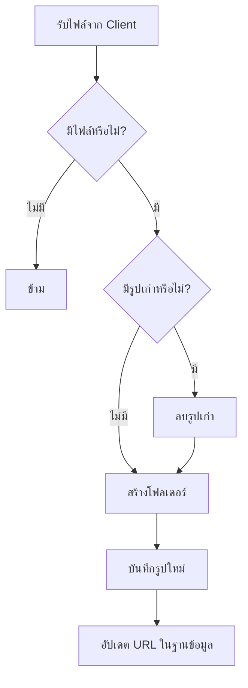

# การสร้างระบบจัดการบทความใน Go API (CRUD Operations)

เรียนรู้การพัฒนา API สำหรับการสร้าง อ่าน แก้ไข และลบบทความด้วย GORM และ Go พร้อมการจัดการรูปภาพ

## 📚 ภาพรวมของบทเรียน

ในบทเรียนนี้เราจะมาเรียนรู้วิธีการสร้างระบบ CRUD (Create, Read, Update, Delete) สำหรับบทความ โดยใช้:

- **GORM** สำหรับจัดการฐานข้อมูล
- **Gin Framework** สำหรับการจัดการ HTTP requests
- **Form Data** และ **File Upload** สำหรับข้อมูลและรูปภาพ

## 🎯 เป้าหมายการเรียนรู้

- เข้าใจการสร้างข้อมูลใหม่ด้วย GORM
- จัดการ Form Data และ File Upload
- ออกแบบ Controller Structure ให้เหมาะสม
- จัดการ Error Handling อย่างมีประสิทธิภาพ
- สร้างระบบจัดเก็บรูปภาพแบบ Dynamic

## 📋 โครงสร้างข้อมูลบทความ

```go
type Article struct {
  ID          uint   `json:"id" gorm:"primaryKey"`
  Title       string `json:"title" gorm:"not null"`
  Body        string `json:"body" gorm:"type:text"`
  ExcerptText string `json:"excerpt_text"`
  Image       string `json:"image"`
  CreatedAt   time.Time `json:"created_at"`
  UpdatedAt   time.Time `json:"updated_at"`
}
```

## 🏗️ การสร้าง Article Controller

### ปัญหาเดิม: การเข้าถึง Database ซ้ำซ้อน

```go
// ❌ วิธีเก่า - ต้องเขียนซ้ำทุกครั้ง
db := config.GetDB()
```

### ✅ วิธีใหม่: Dependency Injection Pattern

```go
type ArticleController struct {
  DB *gorm.DB
}

func NewArticleController() *ArticleController {
  db := config.GetDB()
  return &ArticleController{
    DB: db,
  }
}
```

**ประโยชน์:**

- ลดการเขียนโค้ดซ้ำ
- ง่ายต่อการทดสอบ
- โค้ดสะอาดและเข้าใจง่าย

## 📝 การสร้างข้อมูลบทความ (Create)

### 1. สร้าง Form Structure

```go
type CreateArticleForm struct {
  Title       string `form:"title" binding:"required"`
  Body        string `form:"body" binding:"required"`
  ExcerptText string `form:"excerpt_text"`
}
```

### 2. Controller Method

```go
func (a *ArticleController) Create(c *gin.Context) {
  var form CreateArticleForm

  // ขั้นตอนที่ 1: Validate Form Data
  if err := c.ShouldBind(&form); err != nil {
    c.JSON(http.StatusUnprocessableEntity, gin.H{
      "error": err.Error(),
    })
    return
  }

  // ขั้นตอนที่ 2: Copy ข้อมูลจาก Form ไป Model
  var article models.Article
  copier.Copy(&article, &form)

  // ขั้นตอนที่ 3: บันทึกลงฐานข้อมูล
  if err := a.DB.Create(&article).Error; err != nil {
    c.JSON(http.StatusUnprocessableEntity, gin.H{
      "error": err.Error(),
    })
    return
  }

  // ขั้นตอนที่ 4: จัดการรูปภาพ
  a.SetArticleImage(c, &article)

  // ขั้นตอนที่ 5: ส่งผลลัพธ์กลับ
  response := CreateArticleResponse{
    ID:    article.ID,
    Title: article.Title,
  }

  c.JSON(http.StatusCreated, response)
}
```

## 🖼️ การจัดการรูปภาพ (Image Management)

### วิธีการทำงาน



### Implementation

```go
func (a *ArticleController) SetArticleImage(c *gin.Context, article *models.Article) error {
  // 1. ดึงไฟล์จาก Form
  file, err := c.FormFile("image")
  if err != nil || file == nil {
    return nil // ไม่มีไฟล์ให้อัปโหลด
  }

  // 2. ลบรูปเก่า (ถ้ามี)
  if article.Image != "" {
    oldImagePath := strings.Replace(article.Image,
      os.Getenv("HOST"), "", 1)
    wd, _ := os.Getwd()
    os.Remove(wd + oldImagePath)
  }

  // 3. สร้างโฟลเดอร์
  uploadPath := fmt.Sprintf("uploads/articles/%d", article.ID)
  os.MkdirAll(uploadPath, 0755)

  // 4. บันทึกไฟล์ใหม่
  fileName := uploadPath + "/" + file.Filename
  if err := c.SaveUploadedFile(file, fileName); err != nil {
    return err
  }

  // 5. อัปเดต URL ในฐานข้อมูล
  article.Image = os.Getenv("HOST") + "/" + fileName
  return a.DB.Save(article).Error
}
```

## 🔧 การปรับปรุงเพิ่มเติมสำหรับปี 2024

### 1. ใช้ Generic Response Pattern

```go
type APIResponse[T any] struct {
  Success bool   `json:"success"`
  Message string `json:"message"`
  Data    T      `json:"data,omitempty"`
  Error   string `json:"error,omitempty"`
}

func SuccessResponse[T any](data T, message string) APIResponse[T] {
  return APIResponse[T]{
    Success: true,
    Message: message,
    Data:    data,
  }
}
```

### 2. Context Timeout และ Graceful Shutdown

```go
func (a *ArticleController) CreateWithTimeout(c *gin.Context) {
  ctx, cancel := context.WithTimeout(c.Request.Context(), 30*time.Second)
  defer cancel()

  // ใช้ ctx ในการทำงานกับฐานข้อมูล
  if err := a.DB.WithContext(ctx).Create(&article).Error; err != nil {
    // จัดการ error
  }
}
```

### 3. Validation ที่ดีขึ้นด้วย go-playground/validator

```go
type CreateArticleForm struct {
  Title       string `form:"title" validate:"required,min=3,max=100"`
  Body        string `form:"body" validate:"required,min=10"`
  ExcerptText string `form:"excerpt_text" validate:"max=200"`
}
```

### 4. Structured Logging

```go
import "github.com/sirupsen/logrus"

func (a *ArticleController) Create(c *gin.Context) {
  logger := logrus.WithFields(logrus.Fields{
    "controller": "ArticleController",
    "action":     "Create",
    "request_id": c.GetHeader("X-Request-ID"),
  })

  logger.Info("Creating new article")
  // ... rest of the code
}
```

## 📊 HTTP Status Codes ที่ใช้

| Status Code               | ความหมาย                 | เมื่อไหร่ใช้                   |
| ------------------------- | ------------------------ | ------------------------------ |
| 200 OK                    | สำเร็จ                   | ดึงข้อมูลสำเร็จ                |
| 201 Created               | สร้างสำเร็จ              | สร้างบทความใหม่สำเร็จ          |
| 400 Bad Request           | ข้อมูลผิดรูปแบบ          | JSON ผิด, Header ผิด           |
| 422 Unprocessable Entity  | ข้อมูลไม่ผ่าน Validation | ฟิลด์ว่าง, รูปแบบผิด           |
| 500 Internal Server Error | ข้อผิดพลาดเซิร์ฟเวอร์    | Database error, File I/O error |

## 🧪 การทดสอบด้วย Postman

### ตัวอย่าง Request

```
POST /articles
Content-Type: multipart/form-data

title: "บทความทดสอบ"
body: "เนื้อหาของบทความ..."
excerpt_text: "สรุปบทความ"
image: [ไฟล์รูปภาพ]
```

### ตัวอย่าง Response

```json
{
  "success": true,
  "message": "Article created successfully",
  "data": {
    "id": 1,
    "title": "บทความทดสอบ",
    "image": "http://localhost:5000/uploads/articles/1/image.jpg"
  }
}
```

## 📁 โครงสร้างไฟล์ที่สร้างขึ้น

```
project/
├── uploads/
│   └── articles/
│       ├── 1/
│       │   └── image.jpg
│       ├── 2/
│       │   └── photo.png
│       └── ...
├── controllers/
│   └── article_controller.go
├── models/
│   └── article.go
└── main.go
```

## 🚀 Best Practices 2024

1. **ใช้ Dependency Injection**: ทำให้โค้ดทดสอบง่าย
2. **Error Handling ที่ครอบคลุม**: จัดการทุกกรณีที่เป็นไปได้
3. **Validation หลายชั้น**: Form validation + Business logic validation
4. **File Upload Security**: ตรวจสอบ file type และ size
5. **Database Transaction**: ใช้เมื่อมีการอัปเดตหลายตาราง
6. **API Versioning**: เตรียมพร้อมสำหรับการขยาย

## 🔍 การแก้ไขปัญหาทั่วไป

### ปัญหา: Memory Leak จาก File Upload

```go
// ✅ วิธีแก้
defer file.Close() // อย่าลืม close file
```

### ปัญหา: Race Condition ในการสร้างโฟลเดอร์

```go
// ✅ ใช้ sync.Once หรือ mutex
var once sync.Once
once.Do(func() {
  os.MkdirAll(uploadPath, 0755)
})
```

นี่คือตัวอย่างการพัฒนา API ที่ทันสมัยและพร้อมใช้งานจริง! 🎉
