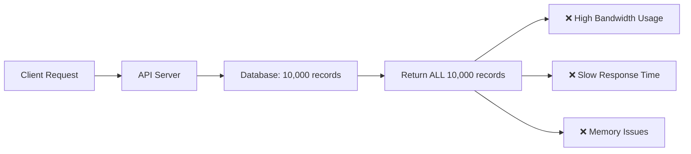
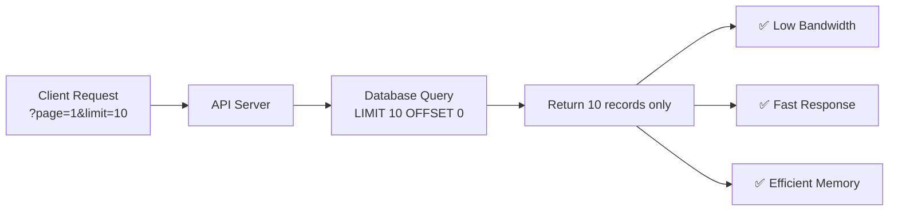
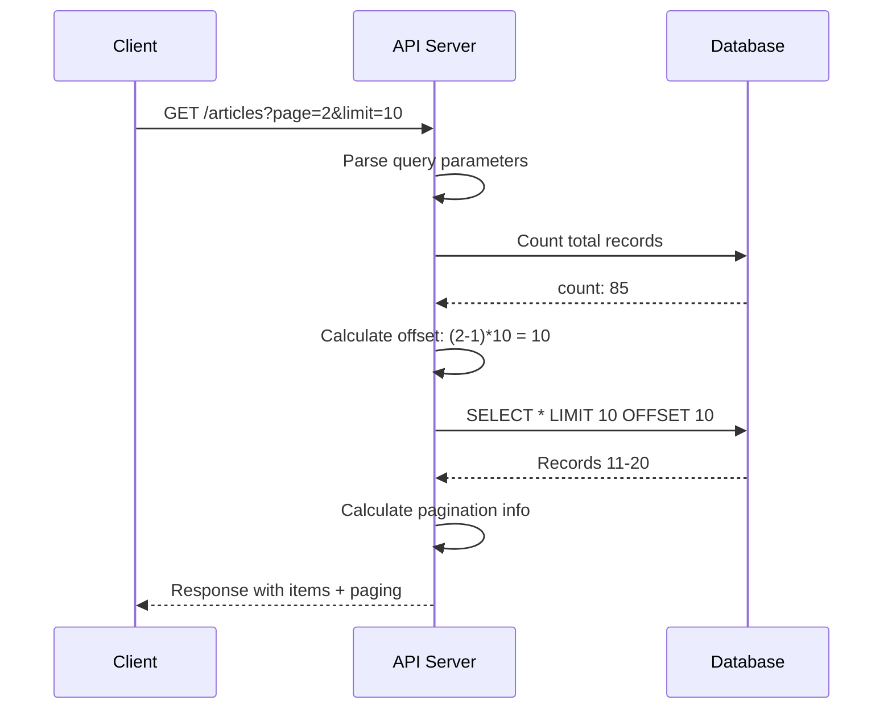

# Pagination Implementation in Go API

## 📋 ภาพรวม (Overview)

การสร้างระบบ Pagination เป็นส่วนสำคัญของ API ที่ช่วยจัดการข้อมูลจำนวนมากโดยแบ่งออกเป็นหน้าย่อยๆ เพื่อลดการใช้ bandwidth และปรับปรุงประสิทธิภาพของระบบ

### 🎯 เป้าหมาย

- เรียนรู้การสร้าง Pagination สำหรับ API
- ทำความเข้าใจการคำนวณ offset และ limit
- สร้าง response structure ที่มาตรฐาน
- ปรับปรุงประสิทธิภาพการดึงข้อมูล

## 🔍 ปัญหาที่เกิดขึ้นก่อนมี Pagination



**ปัญหา:**

- เมื่อมีบทความ 1,000 บทความ จะคืนข้อมูลทั้งหมด 1,000 บทความ
- สิ้นเปลือง bandwidth อย่างมหาศาล
- เวลาตอบสนองช้า
- ใช้ memory มากเกินจำเป็น

## ✅ การแก้ปัญหาด้วย Pagination



## 📊 โครงสร้าง Response

### เดิม (ก่อนมี Pagination)

```json
{
  "articles": [
    { "id": 1, "title": "Article 1" },
    { "id": 2, "title": "Article 2" }
    // ... all articles
  ]
}
```

### ใหม่ (หลังมี Pagination)

```json
{
  "articles": {
    "items": [
      { "id": 1, "title": "Article 1" },
      { "id": 2, "title": "Article 2" }
    ],
    "paging": {
      "page": 1,
      "limit": 2,
      "previous_page": 0,
      "next_page": 2,
      "count": 8,
      "total_pages": 4
    }
  }
}
```

## 🏗️ การสร้าง Structure

### 1. สร้าง Shared Paging Structure

สร้างไฟล์ `controller/controller.go`:

```go
package controller

// PagingResult - Structure สำหรับ pagination ที่ใช้ร่วมกันได้
// ใช้ generic interface{} เพื่อรองรับข้อมูลหลายประเภท
type PagingResult struct {
  Page         int   `json:"page"`          // หน้าปัจจุบัน
  Limit        int   `json:"limit"`         // จำนวนข้อมูลต่อหน้า
  PreviousPage int   `json:"previous_page"` // หน้าก่อนหน้า
  NextPage     int   `json:"next_page"`     // หน้าถัดไป
  Count        int64 `json:"count"`         // จำนวนข้อมูลทั้งหมด
  TotalPages   int   `json:"total_pages"`   // จำนวนหน้าทั้งหมด
}
```

**🔄 การปรับปรุงสำหรับ Go เวอร์ชันใหม่:**

- ใช้ `any` แทน `interface{}` (Go 1.18+)
- เพิ่ม Generic Type สำหรับ type safety

```go
// Go 1.18+ version with Generics
type PagingResult[T any] struct {
  Page         int   `json:"page"`
  Limit        int   `json:"limit"`
  PreviousPage int   `json:"previous_page"`
  NextPage     int   `json:"next_page"`
  Count        int64 `json:"count"`
  TotalPages   int   `json:"total_pages"`
}

type ArticlesPaging struct {
  Items  []models.ArticleResponse `json:"items"`
  Paging *PagingResult[models.ArticleResponse] `json:"paging"`
}
```

### 2. สร้าง Articles Response Structure

```go
// ArticlesPaging - Response structure สำหรับ articles พร้อม pagination
type ArticlesPaging struct {
  Items  []models.ArticleResponse `json:"items"`  // ข้อมูล articles
  Paging *PagingResult           `json:"paging"` // ข้อมูล pagination
}
```

## ⚙️ การสร้าง Pagination Function

### สูตรการคำนวณ

```mermaid
graph TD
  A[Input: page=2, limit=10] --> B[Calculate Offset]
  B --> C[offset = (page - 1) × limit]
  C --> D[offset = (2 - 1) × 10 = 10]
  D --> E[Query: LIMIT 10 OFFSET 10]
  E --> F[Result: Records 11-20]
```

### ตัวอย่างการคำนวณ Offset

| Page | Limit | Offset Calculation | Offset Value | Records Retrieved |
| ---- | ----- | ------------------ | ------------ | ----------------- |
| 1    | 10    | (1-1) × 10         | 0            | 1-10              |
| 2    | 10    | (2-1) × 10         | 10           | 11-20             |
| 3    | 10    | (3-1) × 10         | 20           | 21-30             |

### Implementation

```go
// PagingResource - สร้าง pagination result
func PagingResource(ctx *gin.Context, db *gorm.DB, records any) *PagingResult {
  // Step 1: ดึงค่า limit และ page จาก query string
  limit, _ := strconv.Atoi(ctx.DefaultQuery("limit", "12"))
  page, _ := strconv.Atoi(ctx.DefaultQuery("page", "1"))

  // Step 2: นับจำนวนข้อมูลทั้งหมด
  var count int64
  db.Model(records).Count(&count)

  // Step 3: คำนวณ offset และดึงข้อมูล
  offset := (page - 1) * limit
  db.Limit(limit).Offset(offset).Order("id desc").Find(records)

  // Step 4: คำนวณจำนวนหน้าทั้งหมด
  totalPages := int(math.Ceil(float64(count) / float64(limit)))

  // Step 5: หา next page
  var nextPage int
  if page >= totalPages {
    nextPage = totalPages
  } else {
    nextPage = page + 1
  }

  // Step 6: สร้าง PagingResult
  pagingResult := &PagingResult{
    Page:         page,
    Limit:        limit,
    Count:        count,
    PreviousPage: page - 1,
    NextPage:     nextPage,
    TotalPages:   totalPages,
  }

  return pagingResult
}
```

**🆕 เวอร์ชันปรับปรุงสำหรับ Go ใหม่:**

```go
// ใช้ Context with timeout และ error handling ที่ดีขึ้น
func PagingResource(ctx *gin.Context, db *gorm.DB, records any) (*PagingResult, error) {
  // Validate input parameters
  limit, err := strconv.Atoi(ctx.DefaultQuery("limit", "12"))
  if err != nil || limit <= 0 || limit > 100 {
    limit = 12 // default safe limit
  }

  page, err := strconv.Atoi(ctx.DefaultQuery("page", "1"))
  if err != nil || page <= 0 {
    page = 1
  }

  // Use context with timeout for database operations
  dbCtx, cancel := context.WithTimeout(ctx.Request.Context(), 30*time.Second)
  defer cancel()

  // Count with context
  var count int64
  if err := db.WithContext(dbCtx).Model(records).Count(&count).Error; err != nil {
    return nil, fmt.Errorf("failed to count records: %w", err)
  }

  // Query with context
  offset := (page - 1) * limit
  if err := db.WithContext(dbCtx).
    Limit(limit).
    Offset(offset).
    Order("id desc").
    Find(records).Error; err != nil {
    return nil, fmt.Errorf("failed to fetch records: %w", err)
  }

  // Rest of the implementation...
  return pagingResult, nil
}
```

## 🎮 การใช้งานใน Controller

```go
func (a ArticleController) FindAll(ctx *gin.Context) {
  articles := []models.ArticleResponse{}

  // เรียกใช้ pagination function
  paging := PagingResource(ctx, a.DB, &articles)

  // สร้าง response
  response := ArticlesPaging{
    Items:  articles,
    Paging: paging,
  }

  ctx.JSON(http.StatusOK, gin.H{
    "articles": response,
  })
}
```

## 🧪 การทดสอบ API

### Test Cases

```bash
# ทดสอบแบบ default (page=1, limit=12)
GET /articles

# ทดสอบกำหนด limit
GET /articles?limit=2

# ทดสอบกำหนด page
GET /articles?page=2

# ทดสอบกำหนดทั้ง page และ limit
GET /articles?page=2&limit=4
```

### Expected Responses

```json
// GET /articles?limit=2
{
  "articles": {
    "items": [
      { "id": 5, "title": "Latest Article" },
      { "id": 4, "title": "Second Latest" }
    ],
    "paging": {
      "page": 1,
      "limit": 2,
      "previous_page": 0,
      "next_page": 2,
      "count": 8,
      "total_pages": 4
    }
  }
}
```

## 🎨 Visualization



## 🚀 การปรับปรุงและเพิ่มเติม

### 1. Cursor-based Pagination (สำหรับข้อมูลขนาดใหญ่)

```go
type CursorPaging struct {
  HasNext    bool   `json:"has_next"`
  NextCursor string `json:"next_cursor,omitempty"`
  Items      any    `json:"items"`
}
```

### 2. เพิ่ม Validation และ Error Handling

```go
func ValidatePaginationParams(page, limit int) error {
  if page < 1 {
    return errors.New("page must be greater than 0")
  }
  if limit < 1 || limit > 100 {
    return errors.New("limit must be between 1 and 100")
  }
  return nil
}
```

### 3. เพิ่ม Caching

```go
// ใช้ Redis สำหรับ cache count ที่ไม่เปลี่ยนแปลงบ่อย
func getCachedCount(ctx context.Context, rdb *redis.Client, key string) (int64, error) {
  val, err := rdb.Get(ctx, key).Int64()
  if err == redis.Nil {
    return 0, nil // ไม่มีใน cache
  }
  return val, err
}
```

## 📈 Performance Tips

1. **Index Database**: สร้าง index บน columns ที่ใช้ใน ORDER BY
2. **Limit Max Page Size**: จำกัด limit สูงสุดไม่เกิน 100
3. **Use Cursor Pagination**: สำหรับข้อมูลที่มีการเปลี่ยนแปลงบ่อย
4. **Cache Count**: Cache ผลลัพธ์ของ COUNT query

## 🔧 สิ่งที่ปรับปรุงจากเดิม

### เปลี่ยนแปลงสำคัญ:

1. **Error Handling**: เพิ่ม proper error handling
2. **Context Usage**: ใช้ context สำหรับ database operations
3. **Validation**: เพิ่ม input validation
4. **Type Safety**: ใช้ generics (Go 1.18+)
5. **Performance**: เพิ่ม indexing และ caching suggestions
6. **Security**: จำกัด max limit เพื่อป้องกัน DoS

### Code Quality Improvements:

```go
// เดิม
interface{}

// ใหม่ (Go 1.18+)
any // หรือใช้ generics สำหรับ type safety
```

## 🎯 สรุป

Pagination เป็นเทคนิคสำคัญที่ช่วย:

- ลดการใช้ bandwidth
- เพิ่มความเร็วในการตอบสนอง
- ปรับปรุง user experience
- จัดการข้อมูลขนาดใหญ่ได้อย่างมีประสิทธิภาพ

การใช้งาน Pagination ที่ดีควรพิจารณาทั้ง performance, user experience, และ scalability ของระบบ
