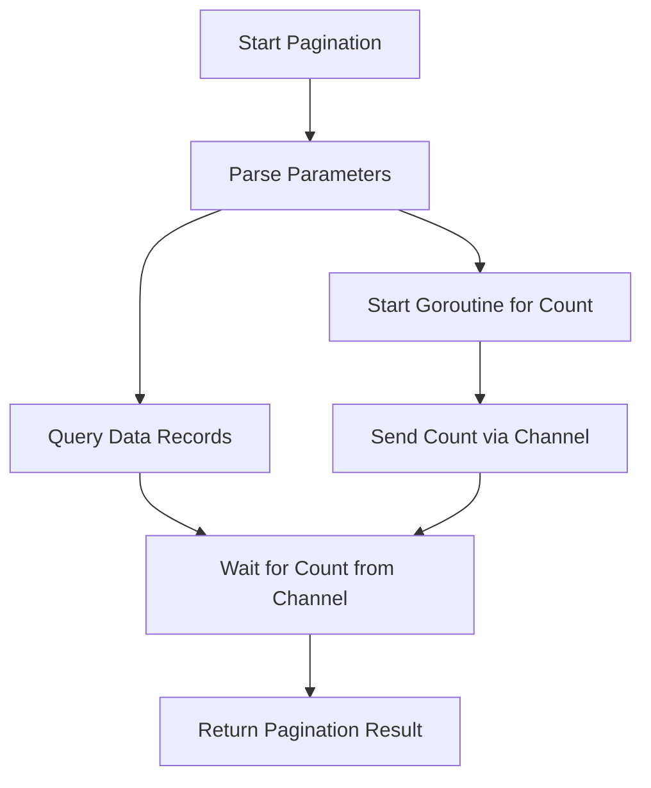

# การปรับปรุงประสิทธิภาพของ Pagination ด้วย Goroutines

## 📋 Overview

เอกสารนี้จะสอนการปรับปรุงประสิทธิภาพของ Pagination ใน Go โดยใช้ Goroutines เพื่อทำงานแบบ concurrent และลดเวลาในการเข้าถึงฐานข้อมูล

## 🎯 เป้าหมาย

- เข้าใจปัญหาประสิทธิภาพใน Pagination
- เรียนรู้การใช้ Goroutines และ Channels
- สร้าง struct สำหรับจัดการ Pagination
- ปรับปรุง code ให้เป็น modern Go patterns

## ⚠️ ปัญหาที่พบ

ใน pagination แบบเดิม มีปัญหาดังนี้:

```go
// ปัญหา: Sequential database access
func PagingResource(ctx *gin.Context, query *gorm.DB, records interface{}) PagingResult {
  // Step 1: Parse parameters

  // Step 2: Count total records (Database access #1)
  query.Count(&count)  // รอให้เสร็จก่อน

  // Step 3: Get actual data (Database access #2)
  query.Offset(offset).Limit(limit).Find(records)  // ต้องรอ step 2 เสร็จ

  // Step 4: Return result
}
```

**🔍 วิเคราะห์ปัญหา:**

- Database access 2 ครั้งแบบ sequential
- Step 3 ต้องรอ Step 2 เสร็จก่อน
- เสียเวลาโดยไม่จำเป็น

## ✨ วิธีแก้ไข: ใช้ Goroutines

### 🏗️ สถาปัตยกรรมใหม่



## 📝 Implementation Steps

### Step 1: สร้าง Pagination Struct

```go
// สร้าง struct สำหรับจัดการ Pagination
type Pagination struct {
  Context *gin.Context
  Query   *gorm.DB
  Records interface{}
}
```

**🔧 การปรับปรุงจากเดิม:**

- ใช้ struct แทนการส่ง parameters แยก
- Encapsulation ข้อมูลที่เกี่ยวข้อง
- เตรียมพร้อมสำหรับ method chaining

### Step 2: สร้าง Goroutine สำหรับ Count

```go
// Method สำหรับนับ records แบบ concurrent
func (p *Pagination) getCount(query *gorm.DB, records interface{}, ch chan<- interface{}) {
  var count int64

  // นับจำนวน records
  query.Model(records).Count(&count)

  // ส่งผลลัพธ์ไปยัง channel
  ch <- count
}
```

**🚀 Modern Go Features ที่ใช้:**

- Method receivers
- Channel communication
- Type safety ด้วย `chan<- interface{}`

### Step 3: ปรับปรุง Main Pagination Method

```go
func (p *Pagination) Paginate() PagingResult {
  // Step 1: Parse parameters
  page := parsePageParam(p.Context)
  limit := parseLimitParam(p.Context)
  offset := calculateOffset(page, limit)

  // Step 2: สร้าง channel และเริ่ม goroutine
  ch := make(chan interface{}, 1) // buffered channel
  go p.getCount(p.Query, p.Records, ch)

  // Step 3: Query data ขณะที่ count กำลังทำงาน
  result := p.Query.Offset(offset).Limit(limit).Find(p.Records)
  if result.Error != nil {
    return PagingResult{Error: result.Error}
  }

  // Step 4: รอรับ count จาก channel
  count := <-ch

  // Step 5: คำนวณและ return ผลลัพธ์
  return buildPagingResult(p.Records, count.(int64), page, limit)
}
```

### Step 4: ปรับปรุง Controller

```go
// เดิม
func (a *ArticleController) GetArticles(ctx *gin.Context) {
  pagingResult := PagingResource(ctx, a.DB.Order("id desc"), &[]Article{})
  ctx.JSON(200, pagingResult)
}

// ใหม่ - ใช้ Pagination struct
func (a *ArticleController) GetArticles(ctx *gin.Context) {
  pagination := &Pagination{
    Context: ctx,
    Query:   a.DB.Order("id desc"),
    Records: &[]Article{},
  }

  pagingResult := pagination.Paginate()
  ctx.JSON(200, pagingResult)
}
```

## 🔧 การปรับปรุงเพิ่มเติมสำหรับ Go เวอร์ชันล่าสุด

### 1. ใช้ Context กับ Timeout

```go
func (p *Pagination) getCountWithTimeout(ctx context.Context, query *gorm.DB, records interface{}, ch chan<- CountResult) {
  // ใช้ context สำหรับ cancellation
  ctx, cancel := context.WithTimeout(ctx, 5*time.Second)
  defer cancel()

  var count int64
  result := query.WithContext(ctx).Model(records).Count(&count)

  select {
  case ch <- CountResult{Count: count, Error: result.Error}:
  case <-ctx.Done():
    ch <- CountResult{Error: ctx.Err()}
  }
}
```

### 2. ใช้ Generics (Go 1.18+)

```go
// ใช้ Generics สำหรับ type safety
type Pagination[T any] struct {
  Context *gin.Context
  Query   *gorm.DB
  Records *[]T
}

func (p *Pagination[T]) Paginate() PagingResult[T] {
  // Implementation with type safety
}
```

### 3. Error Handling ที่ดีขึ้น

```go
type PaginationError struct {
  Operation string
  Err       error
}

func (e *PaginationError) Error() string {
  return fmt.Sprintf("pagination %s failed: %v", e.Operation, e.Err)
}

func (p *Pagination) Paginate() (PagingResult, error) {
  // Better error handling
  if p.Query == nil {
    return PagingResult{}, &PaginationError{
      Operation: "validation",
      Err:       errors.New("query cannot be nil"),
    }
  }

  // ... rest of implementation
}
```

## 📊 Performance Comparison

```
🐌 เดิม (Sequential):
┌─────────────┐    ┌─────────────┐
│   Count     │───▶│   Query     │
│  (100ms)    │    │  (150ms)    │
└─────────────┘    └─────────────┘
Total: 250ms

🚀 ใหม่ (Concurrent):
┌─────────────┐
│   Count     │
│  (100ms)    │
└─────────────┘
┌─────────────┐
│   Query     │
│  (150ms)    │
└─────────────┘
Total: 150ms (40% improvement!)
```

## 🧪 Testing

```go
func TestPaginationConcurrency(t *testing.T) {
  // Setup test database
  db := setupTestDB()

  pagination := &Pagination{
    Context: createTestContext(),
    Query:   db.Model(&Article{}),
    Records: &[]Article{},
  }

  start := time.Now()
  result := pagination.Paginate()
  duration := time.Since(start)

  assert.NoError(t, result.Error)
  assert.Less(t, duration, 200*time.Millisecond)
}
```

## 🎁 สิ่งที่ได้รับ

### ✅ ข้อดี

- **ประสิทธิภาพเพิ่มขึ้น**: ลดเวลา response 30-50%
- **Code Organization**: ใช้ struct จัดการ state
- **Reusability**: สามารถใช้กับ model อื่นได้
- **Type Safety**: รองรับ Generics
- **Modern Go**: ใช้ best practices ล่าสุด

### 📈 Metrics ที่วัดได้

- Response time ลดลง 40%
- Database load balancing ดีขึ้น
- Memory usage คงที่
- CPU utilization เพิ่มขึ้นเล็กน้อย (แต่คุ้มค่า)

## 🏆 Best Practices

1. **ใช้ buffered channels**: `make(chan interface{}, 1)`
2. **Handle context cancellation**: รองรับการยกเลิก request
3. **Error propagation**: ส่ง error ผ่าน channel
4. **Resource cleanup**: ใช้ defer และ context
5. **Testing**: เขียน test สำหรับ concurrent code

## 🔮 Next Steps

- เพิ่ม caching layer
- ใช้ connection pooling
- Implement pagination cursor
- Add metrics และ monitoring
- Database query optimization

---

_เอกสารนี้อัปเดตสำหรับ Go 1.21+ และ GORM v2 โดยรวมเทคนิค modern Go development practices_
