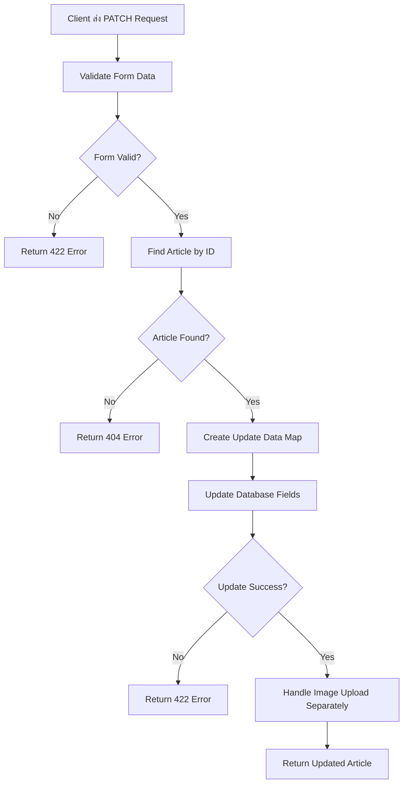

# การอัพเดทข้อมูลจากฟอร์ม (Form Data Update)

## 📋 Overview

เรียนรู้การรับค่าข้อมูลจากฟอร์มเพื่อนำไปอัพเดทข้อมูลในฐานข้อมูล โดยใช้ HTTP PATCH method สำหรับการอัปเดตข้อมูลบางส่วน พร้อมการแก้ไขปัญหาสำหรับ GORM v2

## 🎯 จุดประสงค์การเรียนรู้

- เข้าใจการใช้งาน HTTP PATCH method
- สร้างและจัดการ form data สำหรับการอัปเดต
- เรียนรู้การสร้าง struct แยกสำหรับการ update
- เข้าใจความแตกต่างระหว่าง CREATE และ UPDATE operations
- แก้ไขปัญหาเวอร์ชัน GORM v1 เป็น v2

## 🔧 การเตรียม API Request

### สร้าง PATCH Request

```http
PATCH /api/v1/articles/:id
Content-Type: application/x-www-form-urlencoded
```

**ตัวอย่างการใช้งาน:**

```bash
# อัปเดตบทความที่มี ID = 1
PATCH /api/v1/articles/1
```

### การส่งข้อมูลแบบ Form Data

```
title=Updated Article Title
body=This is the updated content
```

> 💡 **หมายเหตุ:** ในการอัปเดต เราไม่จำเป็นต้องส่งข้อมูลทุกฟิลด์ สามารถส่งเฉพาะฟิลด์ที่ต้องการเปลี่ยนแปลงเท่านั้น

## 📁 โครงสร้างโค้ด

### 1. สร้าง Update Form Struct

```go
// structs/article_form.go

// UpdateArticleForm - struct สำหรับรับข้อมูลการอัปเดต
type UpdateArticleForm struct {
  Title       string `form:"title" json:"title"`
  Body        string `form:"body" json:"body"`
  Description string `form:"description" json:"description"`
  Image       *multipart.FileHeader `form:"image" json:"image"`
}
```

### 2. สร้าง Struct สำหรับ Database Update (GORM v2)

```go
// structs/article_update.go

// ArticleUpdateData - struct สำหรับอัปเดตข้อมูลในฐานข้อมูล (ไม่รวม Image)
type ArticleUpdateData struct {
  Title       string `json:"title"`
  Body        string `json:"body"`
  Description string `json:"description"`
}
```

### 3. เพิ่ม Route สำหรับ PATCH

```go
// routes/article.go
func ArticleRoutes(rg *gin.RouterGroup) {
  articleGroup := rg.Group("/articles")
  {
    articleGroup.GET("", controllers.ArticleController{}.Index)
    articleGroup.POST("", controllers.ArticleController{}.Create)
    articleGroup.GET("/:id", controllers.ArticleController{}.Show)
    articleGroup.PATCH("/:id", controllers.ArticleController{}.Update) // ← เพิ่มใหม่
    articleGroup.DELETE("/:id", controllers.ArticleController{}.Delete)
  }
}
```

## 🔧 แก้ไขปัญหา GORM v2

### ⚠️ ปัญหาที่พบ

```
not enough arguments in call to a.DB.Model(&article).Update
have (*updateArticleForm)
want (string, interface{})
```

### ✅ วิธีแก้ไข: Method 1 - ใช้ Separate Struct

```go
// controllers/article_controller.go

func (a ArticleController) Update(c *gin.Context) {
  // 1. รับข้อมูลจากฟอร์ม
  var form structs.UpdateArticleForm
  if err := c.ShouldBind(&form); err != nil {
    c.JSON(http.StatusUnprocessableEntity, gin.H{
      "error": err.Error(),
    })
    return
  }

  // 2. ค้นหาบทความที่ต้องการอัปเดต
  article, err := services.ArticleService{}.FindArticleByID(c, c.Param("id"))
  if err != nil {
    c.JSON(http.StatusNotFound, gin.H{
      "error": "Article not found",
    })
    return
  }

  // 3. สร้าง update data โดยแยก Image ออก
  updateData := structs.ArticleUpdateData{
    Title:       form.Title,
    Body:        form.Body,
    Description: form.Description,
  }

  // 4. อัปเดตข้อมูลในฐานข้อมูล (GORM v2)
  if err := database.DB.Model(&article).Updates(updateData).Error; err != nil {
    c.JSON(http.StatusUnprocessableEntity, gin.H{
      "error": err.Error(),
    })
    return
  }

  // 5. จัดการไฟล์รูปภาพแยกต่างหาก
  if form.Image != nil {
    if err := services.ArticleService{}.SetArticleImage(c, &article); err != nil {
      c.JSON(http.StatusUnprocessableEntity, gin.H{
        "error": err.Error(),
      })
      return
    }
  }

  // 6. ส่งข้อมูลที่อัปเดตแล้วกลับไป
  var response structs.ArticleResponse
  copier.Copy(&response, &article)

  c.JSON(http.StatusOK, gin.H{"article": response})
}
```

### ✅ วิธีแก้ไข: Method 2 - ใช้ Map Interface

```go
func (a ArticleController) Update(c *gin.Context) {
  // 1. รับข้อมูลจากฟอร์ม
  var form structs.UpdateArticleForm
  if err := c.ShouldBind(&form); err != nil {
    c.JSON(http.StatusUnprocessableEntity, gin.H{
      "error": err.Error(),
    })
    return
  }

  // 2. ค้นหาบทความที่ต้องการอัปเดต
  article, err := services.ArticleService{}.FindArticleByID(c, c.Param("id"))
  if err != nil {
    c.JSON(http.StatusNotFound, gin.H{
      "error": "Article not found",
    })
    return
  }

  // 3. สร้าง update data แบบ map (เฉพาะฟิลด์ที่ไม่ว่าง)
  updateData := map[string]interface{}{}

  if form.Title != "" {
    updateData["title"] = form.Title
  }
  if form.Body != "" {
    updateData["body"] = form.Body
  }
  if form.Description != "" {
    updateData["description"] = form.Description
  }

  // 4. อัปเดตเฉพาะเมื่อมีข้อมูลที่ต้องการอัปเดต
  if len(updateData) > 0 {
    if err := database.DB.Model(&article).Updates(updateData).Error; err != nil {
      c.JSON(http.StatusUnprocessableEntity, gin.H{
        "error": err.Error(),
      })
      return
    }
  }

  // 5. จัดการไฟล์รูปภาพแยกต่างหาก
  if form.Image != nil {
    if err := services.ArticleService{}.SetArticleImage(c, &article); err != nil {
      c.JSON(http.StatusInternalServerError, gin.H{
        "error": "Failed to upload image: " + err.Error(),
      })
      return
    }
  }

  // 6. ส่งข้อมูลที่อัปเดตแล้วกลับไป
  var response structs.ArticleResponse
  copier.Copy(&response, &article)

  c.JSON(http.StatusOK, gin.H{"article": response})
}
```

## 🔄 เปรียบเทียบ GORM v1 vs v2

### GORM v1 (เวอร์ชันเก่า)

```go
// ใช้งานได้ใน GORM v1
db.Model(&article).Update(form)
```

### GORM v2 (เวอร์ชันใหม่)

```go
// ต้องใช้ Updates() และแยก multipart.FileHeader ออก
db.Model(&article).Updates(updateData)
```

### สาเหตุของปัญหา

1. **GORM v2** เปลี่ยน API ของ `Update()` method
2. **multipart.FileHeader** ไม่สามารถแปลงเป็น database field ได้
3. ต้องแยก **file handling** ออกจาก **database update**

## 🔄 Flow การทำงาน



## 🧪 การทดสอบ

### 1. ตรวจสอบข้อมูลเดิม

```http
GET /api/v1/articles/1

Response:
{
  "id": 1,
  "title": "Original Title",
  "body": "Original content...",
  "description": "Original description"
}
```

### 2. ทำการอัปเดต

```http
PATCH /api/v1/articles/1
Content-Type: application/x-www-form-urlencoded

title=Updated Title&body=New updated content
```

### 3. ตรวจสอบผลลัพธ์

```http
GET /api/v1/articles/1

Response:
{
  "id": 1,
  "title": "Updated Title",
  "body": "New updated content",
  "description": "Original description" // ← ไม่เปลี่ยนแปลง
}
```

## 📝 Best Practices สำหรับ GORM v2

### 1. ใช้ Pointer สำหรับ Optional Fields

```go
type UpdateArticleForm struct {
  Title       *string `form:"title" json:"title"`
  Body        *string `form:"body" json:"body"`
  Description *string `form:"description" json:"description"`
  Image       *multipart.FileHeader `form:"image" json:"image"`
}

func (form *UpdateArticleForm) ToUpdateMap() map[string]interface{} {
  updates := make(map[string]interface{})

  if form.Title != nil && *form.Title != "" {
    updates["title"] = *form.Title
  }
  if form.Body != nil && *form.Body != "" {
    updates["body"] = *form.Body
  }
  if form.Description != nil && *form.Description != "" {
    updates["description"] = *form.Description
  }

  return updates
}
```

### 2. แยก File Handling

```go
func (a ArticleController) handleFileUpload(c *gin.Context, article *models.Article, file *multipart.FileHeader) error {
  // Save file logic here
  filename := fmt.Sprintf("article_%d_%s", article.ID, file.Filename)

  if err := c.SaveUploadedFile(file, "uploads/"+filename); err != nil {
    return err
  }

  // Update only image field
  return database.DB.Model(article).Update("image", filename).Error
}
```

### 3. Transaction Safety

```go
func (a ArticleController) Update(c *gin.Context) {
  tx := database.DB.Begin()
  defer func() {
    if r := recover(); r != nil {
      tx.Rollback()
    }
  }()

  // Update database fields
  if err := tx.Model(&article).Updates(updateData).Error; err != nil {
    tx.Rollback()
    c.JSON(http.StatusUnprocessableEntity, gin.H{"error": err.Error()})
    return
  }

  // Handle image upload
  if form.Image != nil {
    if err := a.handleFileUpload(c, &article, form.Image); err != nil {
      tx.Rollback()
      c.JSON(http.StatusInternalServerError, gin.H{"error": err.Error()})
      return
    }
  }

  tx.Commit()
  // Return response...
}
```

## 🚀 สรุป

การแก้ไขปัญหาการอัปเดตสำหรับ GORM v2:

1. **แยก multipart.FileHeader** ออกจาก database update struct
2. **ใช้ Updates()** แทน Update() สำหรับ GORM v2
3. **จัดการไฟล์แยกต่างหาก** หลังจากอัปเดตข้อมูลแล้ว
4. **ใช้ map[string]interface{}** สำหรับ partial updates
5. **เพิ่ม transaction safety** เพื่อความปลอดภัย

**วิธีการที่แนะนำ:**

- ✅ **Method 1**: ใช้ separate struct (เหมาะสำหรับ fixed fields)
- ✅ **Method 2**: ใช้ map interface (เหมาะสำหรับ dynamic updates)

**ข้อดีของการแก้ไข:**

- ✅ รองรับ GORM v2
- ✅ แยก concerns ระหว่าง data และ file
- ✅ ปลอดภัยจาก type errors
- ✅ รองรับ partial updates
