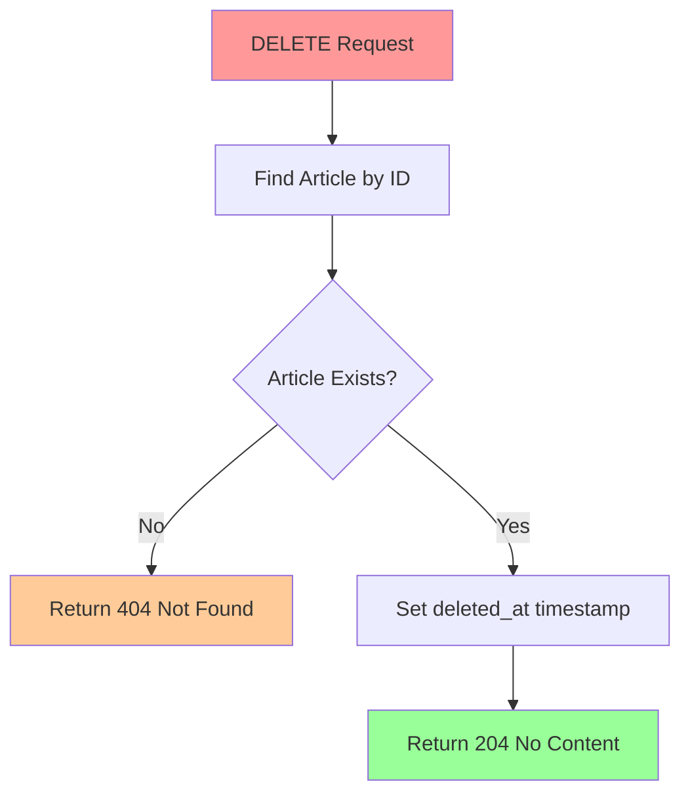

# การลบข้อมูล (DELETE Operation) ใน Go API

## 📋 Overview

ในการพัฒนา REST API ด้วย Go การลบข้อมูลเป็นหนึ่งใน CRUD operations ที่สำคัญ เอกสารนี้จะอธิบายวิธีการสร้าง DELETE endpoint และการจัดการการลบข้อมูลแบบ Soft Delete ด้วย GORM

## 🎯 เป้าหมาย

- สร้าง HTTP DELETE endpoint
- เข้าใจการทำงานของ Soft Delete ใน GORM
- การจัดการ HTTP status codes ที่เหมาะสม
- การทดสอบ API endpoint

## 🔧 การเตรียมความพร้อม

### ข้อกำหนดเบื้องต้น

- Go version 1.21+ (เวอร์ชันล่าสุด 2025 1.24.3 แต่เขียนเหมือนกัน)
- GORM v2 (เวอร์ชันล่าสุด)
- Gin Web Framework

### โครงสร้างโปรเจค

```
project/
├── controllers/
│   └── article_controller.go
├── models/
│   └── article.go
└── main.go
```

## 🚀 การสร้าง DELETE Endpoint

### 1. การสร้าง Route

```go
// main.go หรือ routes.go
func setupRoutes() *gin.Engine {
  router := gin.Default()

  api := router.Group("/api/v1")
  {
    api.DELETE("/articles/:id", controllers.DeleteArticle)
  }

  return router
}
```

### 2. การสร้าง Controller Method

```go
// controllers/article_controller.go
package controllers

import (
  "net/http"
  "strconv"

  "github.com/gin-gonic/gin"
  "your-project/models"
  "your-project/database"
)

// DeleteArticle ลบบทความตาม ID
func DeleteArticle(c *gin.Context) {
  // รับ ID จาก URL parameter
  idParam := c.Param("id")
  id, err := strconv.ParseUint(idParam, 10, 32)
  if err != nil {
    c.JSON(http.StatusBadRequest, gin.H{
      "error": "Invalid ID format",
    })
    return
  }

  // ค้นหาบทความที่ต้องการลบ
  var article models.Article
  if err := database.DB.First(&article, id).Error; err != nil {
    c.JSON(http.StatusNotFound, gin.H{
      "error": "Article not found",
    })
    return
  }

  // ลบข้อมูล (Soft Delete)
  if err := database.DB.Delete(&article).Error; err != nil {
    c.JSON(http.StatusInternalServerError, gin.H{
      "error": "Failed to delete article",
    })
    return
  }

  // ส่งกลับ status 204 No Content
  c.Status(http.StatusNoContent)
}
```

## 📊 Soft Delete ใน GORM

### ความหมายของ Soft Delete



### Model Definition

```go
// models/article.go
package models

import (
  "gorm.io/gorm"
  "time"
)

type Article struct {
  ID        uint           `json:"id" gorm:"primarykey"`
  Title     string         `json:"title"`
  Content   string         `json:"content"`
  CreatedAt time.Time      `json:"created_at"`
  UpdatedAt time.Time      `json:"updated_at"`
  DeletedAt gorm.DeletedAt `json:"-" gorm:"index"` // Soft delete field
}
```

### การทำงานของ Soft Delete

| Operation                       | SQL Generated                                         | ผลลัพธ์               |
| ------------------------------- | ----------------------------------------------------- | --------------------- |
| `db.Delete(&article)`           | `UPDATE articles SET deleted_at = NOW() WHERE id = ?` | เซ็ต timestamp        |
| `db.Find(&articles)`            | `SELECT * FROM articles WHERE deleted_at IS NULL`     | ไม่แสดงข้อมูลที่ถูกลบ |
| `db.Unscoped().Find(&articles)` | `SELECT * FROM articles`                              | แสดงข้อมูลทั้งหมด     |

## 🧪 การทดสอบ API

### ใช้ curl

```bash
# ดึงข้อมูลทั้งหมดก่อนลบ
curl -X GET http://localhost:8080/api/v1/articles

# ลบบทความ ID = 1
curl -X DELETE http://localhost:8080/api/v1/articles/1

# ตรวจสอบผลลัพธ์
curl -X GET http://localhost:8080/api/v1/articles/1  # จะได้ 404
```

### ใช้ Postman

```json
DELETE http://localhost:8080/api/v1/articles/1

Response:
Status: 204 No Content
Body: (empty)
```

## 🔍 การจัดการ Hard Delete

หากต้องการลบข้อมูลจริงๆ จากฐานข้อมูล:

```go
// Hard Delete - ลบข้อมูลถาวร
func HardDeleteArticle(c *gin.Context) {
  idParam := c.Param("id")
  id, err := strconv.ParseUint(idParam, 10, 32)
  if err != nil {
    c.JSON(http.StatusBadRequest, gin.H{
      "error": "Invalid ID format",
    })
    return
  }

  var article models.Article

  // ใช้ Unscoped() เพื่อลบข้อมูลจริง
  if err := database.DB.Unscoped().Delete(&article, id).Error; err != nil {
    c.JSON(http.StatusInternalServerError, gin.H{
      "error": "Failed to permanently delete article",
    })
    return
  }

  c.Status(http.StatusNoContent)
}
```

## ⚡ การปรับปรุงจากเวอร์ชันเดิม

### อัปเดตหลัก (2025)

1. **Go Modules**: ใช้ `go.mod` แทนการจัดการ dependencies แบบเก่า
2. **GORM v2**: มีการปรับปรุง API และประสิทธิภาพ
3. **Error Handling**: ใช้ structured error responses
4. **Validation**: เพิ่ม input validation ที่ดีขึ้น
5. **Context Support**: รองรับ context.Context สำหรับ cancellation

### ตัวอย่าง go.mod

```go
module your-project

go 1.21

require (
  github.com/gin-gonic/gin v1.9.1
  gorm.io/gorm v1.25.7
  gorm.io/driver/mysql v1.5.4
)
```

## 🛡️ Best Practices

### 1. Error Handling

```go
func DeleteArticle(c *gin.Context) {
  // Validate input
  id, err := validateID(c.Param("id"))
  if err != nil {
    c.JSON(http.StatusBadRequest, gin.H{
      "error": "Invalid ID",
      "details": err.Error(),
    })
    return
  }

  // Check authorization
  if !isAuthorized(c, id) {
    c.JSON(http.StatusForbidden, gin.H{
      "error": "Access denied",
    })
    return
  }

  // Rest of the implementation...
}
```

### 2. Logging

```go
import "log/slog"

func DeleteArticle(c *gin.Context) {
  slog.Info("Delete request received",
    "article_id", c.Param("id"),
    "user_id", getUserID(c),
  )

  // Implementation...

  slog.Info("Article deleted successfully",
    "article_id", id,
  )
}
```

### 3. Database Transaction

```go
func DeleteArticle(c *gin.Context) {
  tx := database.DB.Begin()
  defer func() {
    if r := recover(); r != nil {
      tx.Rollback()
    }
  }()

  if err := tx.Delete(&article).Error; err != nil {
    tx.Rollback()
    c.JSON(http.StatusInternalServerError, gin.H{
      "error": "Failed to delete article",
    })
    return
  }

  tx.Commit()
  c.Status(http.StatusNoContent)
}
```

## 📈 Performance Tips

1. **Indexing**: เพิ่ม index บน deleted_at column
2. **Batch Operations**: สำหรับการลบหลายๆ records
3. **Soft Delete Cleanup**: สร้าง job สำหรับลบข้อมูลเก่าจริงๆ

```sql
-- เพิ่ม index สำหรับ soft delete
ALTER TABLE articles ADD INDEX idx_deleted_at (deleted_at);
```

## 🎯 สรุป

การลบข้อมูลใน Go API มีความสำคัญในการรักษาความปลอดภัยของข้อมูล การใช้ Soft Delete ช่วยให้สามารถ recover ข้อมูลได้ในกรณีที่มีการลบผิดพลาด และการส่งกลับ HTTP status 204 No Content เป็น best practice สำหรับ DELETE operations ที่สำเร็จ
