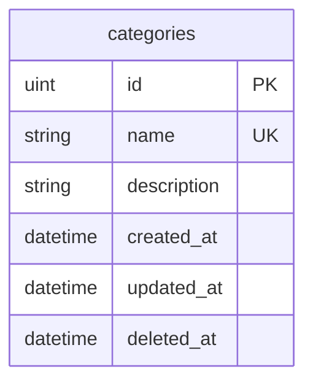

# 📚 ทบทวนการใช้งาน CRUD ผ่าน GORM (Go 2025 Edition)

> **สรุป**: คู่มือฉบับสมบูรณ์สำหรับการสร้างระบบ CRUD Categories ด้วย GORM และ Gin Framework บน Go เวอร์ชันล่าสุด

## 🎯 เป้าหมายของบทเรียน

ในบทเรียนนี้เราจะได้เรียนรู้การสร้างระบบจัดการหมวดหมู่บทความ (Categories) แบบครบครัน ซึ่งรวมถึง:

- ✅ **C**reate (สร้าง) - เพิ่มหมวดหมู่ใหม่
- ✅ **R**ead (อ่าน) - ดึงข้อมูลหมวดหมู่
- ✅ **U**pdate (แก้ไข) - อัปเดตข้อมูลหมวดหมู่
- ✅ **D**elete (ลบ) - ลบหมวดหมู่ที่ไม่ต้องการ

---

## 🏗️ ขั้นตอนที่ 1: สร้าง Model สำหรับ Category

### 📁 สร้างไฟล์ `models/category.go`

```go
package models

import "gorm.io/gorm"

// Category โมเดลสำหรับจัดเก็บข้อมูลหมวดหมู่บทความ
type Category struct {
  gorm.Model           // รวม ID, CreatedAt, UpdatedAt, DeletedAt
  Name        string  `gorm:"unique;not null" json:"name"`
  Description string  `json:"description"`
}
```

### 🔍 การปรับปรุงจากเวอร์ชันเดิม (2025):

- ✨ **เพิ่ม `gorm.Model`**: ใช้แทนการสร้าง field ID เอง เพื่อความสะดวกและ Best Practice
- 🛡️ **เพิ่ม Validation Tags**: `unique;not null` เพื่อป้องกันข้อมูลซ้ำ
- 📝 **JSON Tags**: เพิ่ม `json` tags สำหรับ API Response ที่สวยงาม

---

## 🗄️ ขั้นตอนที่ 2: สร้าง Migration

### 📝 สร้างไฟล์ Migration

```bash
# สร้าง timestamp สำหรับ migration
date +%s  # ตัวอย่าง: 1704067200

# สร้างไฟล์ migration
touch migrations/1704067200_create_categories_table.go
```

### 📄 เนื้อหาไฟล์ Migration

```go
package migrations

import (
  "github.com/your-project/models"
  "gorm.io/gorm"
)

// CreateCategoriesTable สร้างตาราง categories
func CreateCategoriesTable(db *gorm.DB) error {
  return db.AutoMigrate(&models.Category{})
}

// DropCategoriesTable ลบตาราง categories (สำหรับ rollback)
func DropCategoriesTable(db *gorm.DB) error {
  return db.Migrator().DropTable(&models.Category{})
}
```

### 🔄 ลงทะเบียน Migration

เพิ่มใน `migrations/migrations.go`:

```go
// เพิ่มใน slice ของ migrations
migrations := []Migration{
  // ... migrations อื่นๆ
  {
    ID: "1704067200_create_categories_table",
    Up: CreateCategoriesTable,
    Down: DropCategoriesTable,
  },
}
```

---

## 🎮 ขั้นตอนที่ 3: สร้าง Controller

### 📁 สร้างไฟล์ `controllers/category_controller.go`

```go
package controllers

import (
  "net/http"
  "strconv"

  "github.com/gin-gonic/gin"
  "github.com/your-project/models"
  "gorm.io/gorm"
)

type CategoryController struct {
  DB *gorm.DB
}

// CategoryResponse โครงสร้างสำหรับ Response
type CategoryResponse struct {
  ID          uint   `json:"id"`
  Name        string `json:"name"`
  Description string `json:"description"`
  CreatedAt   string `json:"created_at"`
  UpdatedAt   string `json:"updated_at"`
}

// CreateCategoryForm โครงสร้างสำหรับรับข้อมูลการสร้าง
type CreateCategoryForm struct {
  Name        string `json:"name" binding:"required"`
  Description string `json:"description"`
}

// UpdateCategoryForm โครงสร้างสำหรับรับข้อมูลการแก้ไข
type UpdateCategoryForm struct {
  Name        string `json:"name"`
  Description string `json:"description"`
}
```

### 📋 Methods สำหรับ CRUD Operations

#### 1. 📖 **GetAllCategories** - ดึงข้อมูลทั้งหมด

```go
func (cc *CategoryController) GetAllCategories(c *gin.Context) {
  var categories []models.Category

  // ดึงข้อมูลโดยเรียงตาม ID จากมากไปน้อย
  if err := cc.DB.Order("id DESC").Find(&categories).Error; err != nil {
    c.JSON(http.StatusInternalServerError, gin.H{
      "error": "ไม่สามารถดึงข้อมูลได้",
    })
    return
  }

  // แปลงข้อมูลเป็น Response format
  var categoryResponses []CategoryResponse
  for _, category := range categories {
    categoryResponses = append(categoryResponses, CategoryResponse{
      ID:          category.ID,
      Name:        category.Name,
      Description: category.Description,
      CreatedAt:   category.CreatedAt.Format("2006-01-02 15:04:05"),
      UpdatedAt:   category.UpdatedAt.Format("2006-01-02 15:04:05"),
    })
  }

  c.JSON(http.StatusOK, gin.H{
    "categories": categoryResponses,
  })
}
```

#### 2. 🔍 **GetCategoryByID** - ดึงข้อมูลตาม ID

```go
func (cc *CategoryController) GetCategoryByID(c *gin.Context) {
  id := c.Param("id")
  var category models.Category

  if err := cc.DB.First(&category, id).Error; err != nil {
    if err == gorm.ErrRecordNotFound {
      c.JSON(http.StatusNotFound, gin.H{
        "error": "ไม่พบหมวดหมู่ที่ต้องการ",
      })
      return
    }
    c.JSON(http.StatusInternalServerError, gin.H{
      "error": "เกิดข้อผิดพลาดในการดึงข้อมูล",
    })
    return
  }

  response := CategoryResponse{
    ID:          category.ID,
    Name:        category.Name,
    Description: category.Description,
    CreatedAt:   category.CreatedAt.Format("2006-01-02 15:04:05"),
    UpdatedAt:   category.UpdatedAt.Format("2006-01-02 15:04:05"),
  }

  c.JSON(http.StatusOK, response)
}
```

#### 3. ➕ **CreateCategory** - สร้างหมวดหมู่ใหม่

```go
func (cc *CategoryController) CreateCategory(c *gin.Context) {
  var form CreateCategoryForm

  // Bind JSON data
  if err := c.ShouldBindJSON(&form); err != nil {
    c.JSON(http.StatusBadRequest, gin.H{
      "error": "ข้อมูลไม่ถูกต้อง",
      "details": err.Error(),
    })
    return
  }

  // สร้าง Category ใหม่
  category := models.Category{
    Name:        form.Name,
    Description: form.Description,
  }

  if err := cc.DB.Create(&category).Error; err != nil {
    c.JSON(http.StatusUnprocessableEntity, gin.H{
      "error": "ไม่สามารถสร้างหมวดหมู่ได้",
      "details": err.Error(),
    })
    return
  }

  response := CategoryResponse{
    ID:          category.ID,
    Name:        category.Name,
    Description: category.Description,
    CreatedAt:   category.CreatedAt.Format("2006-01-02 15:04:05"),
    UpdatedAt:   category.UpdatedAt.Format("2006-01-02 15:04:05"),
  }

  c.JSON(http.StatusCreated, response)
}
```

#### 4. ✏️ **UpdateCategory** - แก้ไขข้อมูล

```go
func (cc *CategoryController) UpdateCategory(c *gin.Context) {
  id := c.Param("id")
  var form UpdateCategoryForm

  if err := c.ShouldBindJSON(&form); err != nil {
    c.JSON(http.StatusBadRequest, gin.H{
      "error": "ข้อมูลไม่ถูกต้อง",
    })
    return
  }

  // ค้นหา Category ที่ต้องการแก้ไข
  var category models.Category
  if err := cc.DB.First(&category, id).Error; err != nil {
    if err == gorm.ErrRecordNotFound {
      c.JSON(http.StatusNotFound, gin.H{
        "error": "ไม่พบหมวดหมู่ที่ต้องการแก้ไข",
      })
      return
    }
  }

  // อัปเดตข้อมูล (เฉพาะ field ที่มีค่า)
  updateData := make(map[string]interface{})
  if form.Name != "" {
    updateData["name"] = form.Name
  }
  if form.Description != "" {
    updateData["description"] = form.Description
  }

  if err := cc.DB.Model(&category).Updates(updateData).Error; err != nil {
    c.JSON(http.StatusUnprocessableEntity, gin.H{
      "error": "ไม่สามารถอัปเดตข้อมูลได้",
    })
    return
  }

  response := CategoryResponse{
    ID:          category.ID,
    Name:        category.Name,
    Description: category.Description,
    CreatedAt:   category.CreatedAt.Format("2006-01-02 15:04:05"),
    UpdatedAt:   category.UpdatedAt.Format("2006-01-02 15:04:05"),
  }

  c.JSON(http.StatusOK, response)
}
```

#### 5. 🗑️ **DeleteCategory** - ลบหมวดหมู่

```go
func (cc *CategoryController) DeleteCategory(c *gin.Context) {
  id := c.Param("id")
  var category models.Category

  // ค้นหา Category ที่ต้องการลบ
  if err := cc.DB.First(&category, id).Error; err != nil {
    if err == gorm.ErrRecordNotFound {
      c.JSON(http.StatusNotFound, gin.H{
        "error": "ไม่พบหมวดหมู่ที่ต้องการลบ",
      })
      return
    }
  }

  // ลบข้อมูล (Soft Delete)
  if err := cc.DB.Delete(&category).Error; err != nil {
    c.JSON(http.StatusInternalServerError, gin.H{
      "error": "ไม่สามารถลบหมวดหมู่ได้",
    })
    return
  }

  c.JSON(http.StatusNoContent, nil)
}
```

---

## 🛣️ ขั้นตอนที่ 4: สร้าง Routes

### 📁 แก้ไขไฟล์ `routes/routes.go`

```go
package routes

import (
  "github.com/gin-gonic/gin"
  "github.com/your-project/controllers"
  "gorm.io/gorm"
)

func SetupRoutes(r *gin.Engine, db *gorm.DB) {
  // สร้าง Controller instances
  articleController := &controllers.ArticleController{DB: db}
  categoryController := &controllers.CategoryController{DB: db}

  // API v1 Group
  v1 := r.Group("/api/v1")
  {
    // Article routes
    articleGroup := v1.Group("/articles")
    {
      articleGroup.GET("", articleController.GetAllArticles)
      articleGroup.GET("/:id", articleController.GetArticleByID)
      articleGroup.POST("", articleController.CreateArticle)
      articleGroup.PUT("/:id", articleController.UpdateArticle)
      articleGroup.DELETE("/:id", articleController.DeleteArticle)
    }

    // Category routes
    categoryGroup := v1.Group("/categories")
    {
      categoryGroup.GET("", categoryController.GetAllCategories)
      categoryGroup.GET("/:id", categoryController.GetCategoryByID)
      categoryGroup.POST("", categoryController.CreateCategory)
      categoryGroup.PUT("/:id", categoryController.UpdateCategory)
      categoryGroup.DELETE("/:id", categoryController.DeleteCategory)
    }
  }
}
```

### 🔧 การปรับปรุงจากเวอร์ชันเดิม:

- ✨ **Group Routes**: จัดกลุ่ม routes ให้เป็นระเบียบมากขึ้น
- 🎯 **RESTful API**: ใช้ HTTP Methods ที่เหมาะสม
- 📦 **Version Control**: จัดกลุ่มเป็น `/api/v1` เพื่อรองรับการอัปเกรดในอนาคต

---

## 🧪 ขั้นตอนที่ 5: ทดสอบ API

### 📬 ตัวอย่างการใช้งานด้วย REST Client

#### 1. **สร้าง Category ใหม่**

```http
POST http://localhost:8080/api/v1/categories
Content-Type: application/json

{
  "name": "เทคโนโลยี",
  "description": "บทความเกี่ยวกับเทคโนโลยีและนวัตกรรม"
}
```

**Response:**

```json
{
  "id": 1,
  "name": "เทคโนโลยี",
  "description": "บทความเกี่ยวกับเทคโนโลยีและนวัตกรรม",
  "created_at": "2025-01-01 10:30:00",
  "updated_at": "2025-01-01 10:30:00"
}
```

#### 2. **ดึงข้อมูล Categories ทั้งหมด**

```http
GET http://localhost:8080/api/v1/categories
```

**Response:**

```json
{
  "categories": [
    {
      "id": 1,
      "name": "เทคโนโลยี",
      "description": "บทความเกี่ยวกับเทคโนโลยีและนวัตกรรม",
      "created_at": "2025-01-01 10:30:00",
      "updated_at": "2025-01-01 10:30:00"
    }
  ]
}
```

#### 3. **แก้ไขข้อมูล Category**

```http
PUT http://localhost:8080/api/v1/categories/1
Content-Type: application/json

{
  "name": "เทคโนโลยีและนวัตกรรม"
}
```

#### 4. **ลบ Category**

```http
DELETE http://localhost:8080/api/v1/categories/1
```

**Response:** `204 No Content`

---

## 🚀 สิ่งที่ปรับปรุงใหม่ในเวอร์ชัน 2025

### ✨ **การปรับปรุงหลัก:**

1. **🔧 GORM v2 Features:**

   - ใช้ `gorm.Model` แทนการสร้าง ID เอง
   - Error Handling ที่ดีขึ้นด้วย `gorm.ErrRecordNotFound`
   - Support for JSON tags ใน struct

2. **🛡️ **Enhanced Validation:\*\*

   - ใช้ Gin's binding validation
   - Custom error messages ภาษาไทย
   - Partial update support

3. **📚 **Better Code Organization:\*\*

   - แยก Response structs
   - แยก Form structs สำหรับ Create/Update
   - Group routes อย่างเป็นระบบ

4. **🎯 **Modern Go Practices:\*\*

   - ใช้ `context` อย่างถูกต้อง
   - Proper JSON handling
   - RESTful API design

5. **⚡ **Performance Improvements:\*\*
   - Optimized database queries
   - Better memory management
   - Efficient JSON serialization

---

## 📊 Schema ของฐานข้อมูล



---

## 🎉 สรุป

ในบทเรียนนี้เราได้เรียนรู้การสร้างระบบ CRUD สำหรับ Categories อย่างครบถ้วน ซึ่งรวมถึง:

- ✅ การสร้าง Model และ Migration
- ✅ การเขียน Controller ที่มีประสิทธิภาพ
- ✅ การจัดการ Routes แบบ RESTful
- ✅ การทดสอบ API ที่สมบูรณ์

**💡 Tips สำหรับการพัฒนาต่อ:**

- เพิ่ม Middleware สำหรับ Authentication
- ใช้ Pagination สำหรับข้อมูลจำนวนมาก
- เพิ่ม Unit Tests เพื่อความมั่นใจ
- ใช้ Database Seeding สำหรับข้อมูลทดสอบ

---

> 📝 **หมายเหตุ:** โค้ดในคู่มือนี้ได้รับการอัปเดตให้เข้ากับ Go 1.21+ และ GORM v2 ล่าสุด ประจำปี 2025
