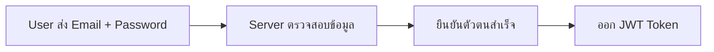
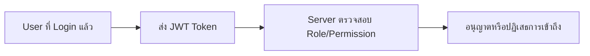
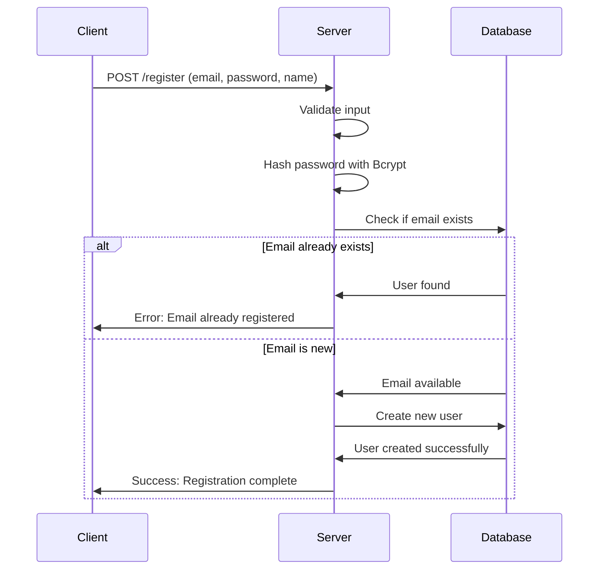
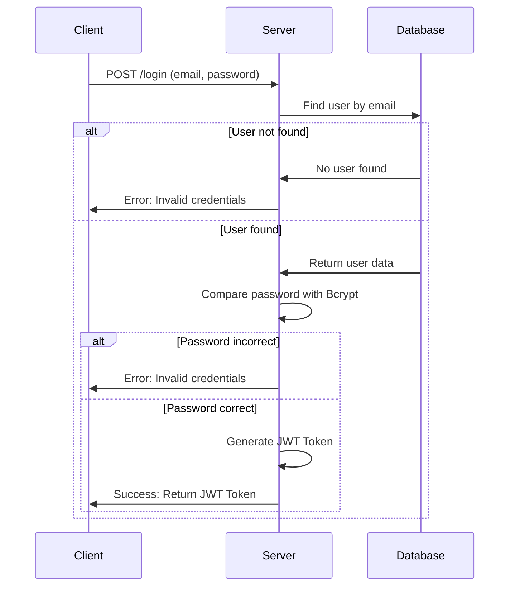
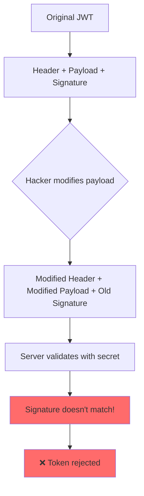

# Authentication และ Authorization ใน Go API

## Overview

เอกสารนี้จะอธิบายการทำงานของ Authentication และ Authorization พร้อมกับการใช้งาน JWT และ Bcrypt ใน Go เวอร์ชันล่าสุด (Go 1.24.3)

## 📖 สารบัญ

1. [ความแตกต่างระหว่าง Authentication และ Authorization](#ความแตกต่างระหว่าง-authentication-และ-authorization)
2. [กระบวนการ User Registration](#กระบวนการ-user-registration)
3. [กระบวนการ User Login](#กระบวนการ-user-login)
4. [JSON Web Token (JWT)](#json-web-token-jwt)
5. [ตัวอย่างการใช้งานจริง](#ตัวอย่างการใช้งานจริง)
6. [Best Practices](#best-practices)

---

## ความแตกต่างระหว่าง Authentication และ Authorization

### 🔐 Authentication (การยืนยันตัวตน)

**คำตอบคำถาม: "คุณคือใคร?"**

Authentication คือกระบวนการยืนยันตัวตนของผู้ใช้ เปรียบเสมือนการแสดงบัตรประชาชนเพื่อพิสูจน์ว่าคุณคือใคร



### 🛡️ Authorization (การตรวจสอบสิทธิ์)

**คำตอบคำถาม: "คุณมีสิทธิ์ทำอะไรได้บ้าง?"**

Authorization คือการตรวจสอบว่าผู้ใช้ที่ยืนยันตัวตนแล้วมีสิทธิ์เข้าถึงทรัพยากรหรือทำงานใดได้บ้าง



---

## กระบวนการ User Registration

### 1. การรับข้อมูลจาก Client

```go
type RegisterRequest struct {
  Email    string `json:"email" validate:"required,email"`
  Password string `json:"password" validate:"required,min=8"`
  Name     string `json:"name" validate:"required"`
}
```

### 2. การเข้ารหัส Password ด้วย Bcrypt

**ทำไมต้องใช้ Bcrypt?**

- ออกแบบมาให้ช้าโดยเจตนา (slow by design)
- ป้องกัน Brute Force Attack
- มี Salt ในตัว (ป้องกัน Rainbow Table Attack)

```go
import (
  "golang.org/x/crypto/bcrypt"
)

func HashPassword(password string) (string, error) {
  // Cost 14 เหมาะสำหรับ Go 1.24.3 (เพิ่มจาก cost 12 ในเวอร์ชันเก่า)
  bytes, err := bcrypt.GenerateFromPassword([]byte(password), 14)
  return string(bytes), err
}
```

### 3. บันทึกลงฐานข้อมูล

```go
type User struct {
  ID        uint      `gorm:"primaryKey"`
  Email     string    `gorm:"unique;not null"`
  Password  string    `gorm:"not null"` // Hashed password
  Name      string    `gorm:"not null"`
  Role      string    `gorm:"default:user"`
  CreatedAt time.Time
  UpdatedAt time.Time
}
```

### 📊 Flow Diagram: Registration Process



---

## กระบวนการ User Login

### 1. การตรวจสอบข้อมูล

```go
func (s *AuthService) Login(email, password string) (*LoginResponse, error) {
  // 1. หา User จาก email
  user, err := s.userRepo.FindByEmail(email)
  if err != nil {
    return nil, errors.New("invalid credentials")
  }

  // 2. เปรียบเทียบ password
  err = bcrypt.CompareHashAndPassword([]byte(user.Password), []byte(password))
  if err != nil {
    return nil, errors.New("invalid credentials")
  }

  // 3. สร้าง JWT Token
  token, err := s.generateJWT(user)
  if err != nil {
    return nil, err
  }

  return &LoginResponse{
    Token: token,
    User:  user,
  }, nil
}
```

### 📊 Flow Diagram: Login Process



---

## JSON Web Token (JWT)

### โครงสร้างของ JWT

JWT ประกอบด้วย 3 ส่วนหลัก คั่นด้วยจุด (.)

```
header.payload.signature
```

### 1. Header

```json
{
  "alg": "HS256",
  "typ": "JWT"
}
```

### 2. Payload (Claims)

```json
{
  "sub": "1", // User ID
  "email": "user@example.com",
  "role": "admin",
  "exp": 1735689600, // Expiration time
  "iat": 1735603200 // Issued at
}
```

### 3. Signature

```
HMACSHA256(
  base64UrlEncode(header) + "." +
  base64UrlEncode(payload),
  secret
)
```

### การสร้าง JWT ใน Go 1.24.3

```go
import (
  "github.com/golang-jwt/jwt/v5" // Updated for Go 1.24.3
  "time"
)

type JWTClaims struct {
  UserID uint   `json:"sub"`
  Email  string `json:"email"`
  Role   string `json:"role"`
  jwt.RegisteredClaims
}

func (s *AuthService) GenerateJWT(user *User) (string, error) {
  claims := JWTClaims{
    UserID: user.ID,
    Email:  user.Email,
    Role:   user.Role,
    RegisteredClaims: jwt.RegisteredClaims{
      ExpiresAt: jwt.NewNumericDate(time.Now().Add(24 * time.Hour)),
      IssuedAt:  jwt.NewNumericDate(time.Now()),
      NotBefore: jwt.NewNumericDate(time.Now()),
      Issuer:    "my-app",
    },
  }

  token := jwt.NewWithClaims(jwt.SigningMethodHS256, claims)
  return token.SignedString([]byte(s.jwtSecret))
}
```

### การตรวจสอบ JWT

```go
func (s *AuthService) ValidateJWT(tokenString string) (*JWTClaims, error) {
  token, err := jwt.ParseWithClaims(tokenString, &JWTClaims{}, func(token *jwt.Token) (interface{}, error) {
    return []byte(s.jwtSecret), nil
  })

  if err != nil {
    return nil, err
  }

  if claims, ok := token.Claims.(*JWTClaims); ok && token.Valid {
    return claims, nil
  }

  return nil, errors.New("invalid token")
}
```

### 🔒 JWT Security Visualization



---

## ตัวอย่างการใช้งานจริง

### Middleware สำหรับตรวจสอบ Authentication

```go
func AuthMiddleware(authService *AuthService) gin.HandlerFunc {
  return func(c *gin.Context) {
    authHeader := c.GetHeader("Authorization")
    if authHeader == "" {
      c.JSON(401, gin.H{"error": "Authorization header required"})
      c.Abort()
      return
    }

    // Bearer token format: "Bearer <token>"
    tokenString := strings.TrimPrefix(authHeader, "Bearer ")
    if tokenString == authHeader {
      c.JSON(401, gin.H{"error": "Bearer token required"})
      c.Abort()
      return
    }

    claims, err := authService.ValidateJWT(tokenString)
    if err != nil {
      c.JSON(401, gin.H{"error": "Invalid token"})
      c.Abort()
      return
    }

    // เก็บข้อมูล user ใน context
    c.Set("userID", claims.UserID)
    c.Set("userEmail", claims.Email)
    c.Set("userRole", claims.Role)

    c.Next()
  }
}
```

### Role-based Authorization

```go
func RequireRole(role string) gin.HandlerFunc {
  return func(c *gin.Context) {
    userRole, exists := c.Get("userRole")
    if !exists {
      c.JSON(403, gin.H{"error": "User role not found"})
      c.Abort()
      return
    }

    if userRole != role {
      c.JSON(403, gin.H{"error": "Insufficient permissions"})
      c.Abort()
      return
    }

    c.Next()
  }
}

// การใช้งาน
r.GET("/admin/users", AuthMiddleware(authService), RequireRole("admin"), getUsersHandler)
```

### Complete API Example

```go
package main

import (
  "github.com/gin-gonic/gin"
  "github.com/golang-jwt/jwt/v5"
  "golang.org/x/crypto/bcrypt"
)

func main() {
  r := gin.Default()

  // Auth routes
  auth := r.Group("/auth")
  {
    auth.POST("/register", registerHandler)
    auth.POST("/login", loginHandler)
  }

  // Protected routes
  api := r.Group("/api")
  api.Use(AuthMiddleware(authService))
  {
    api.GET("/profile", getProfileHandler)
    api.PUT("/profile", updateProfileHandler)

    // Admin only routes
    admin := api.Group("/admin")
    admin.Use(RequireRole("admin"))
    {
      admin.GET("/users", getUsersHandler)
      admin.DELETE("/users/:id", deleteUserHandler)
    }
  }

  r.Run(":8080")
}
```

---

## Best Practices

### 🔐 Security Best Practices

1. **JWT Secret Management**

   ```go
   // ❌ Don't do this
   jwtSecret := "mysecret"

   // ✅ Do this
   jwtSecret := os.Getenv("JWT_SECRET") // From environment variable
   if jwtSecret == "" {
     log.Fatal("JWT_SECRET environment variable required")
   }
   ```

2. **Password Strength**

   ```go
   func ValidatePassword(password string) error {
     if len(password) < 8 {
       return errors.New("password must be at least 8 characters")
     }

     // เพิ่มการตรวจสอบ complexity
     hasUpper := regexp.MustCompile(`[A-Z]`).MatchString(password)
     hasLower := regexp.MustCompile(`[a-z]`).MatchString(password)
     hasNumber := regexp.MustCompile(`[0-9]`).MatchString(password)
     hasSpecial := regexp.MustCompile(`[!@#$%^&*]`).MatchString(password)

     if !hasUpper || !hasLower || !hasNumber || !hasSpecial {
       return errors.New("password must contain uppercase, lowercase, number, and special character")
     }

     return nil
   }
   ```

3. **JWT Token Expiry**

   ```go
   // Short-lived access token
   accessToken := generateToken(user, 15*time.Minute)

   // Long-lived refresh token
   refreshToken := generateRefreshToken(user, 7*24*time.Hour)
   ```

### 📈 Performance Optimizations for Go 1.24.3

1. **Bcrypt Cost Tuning**

   ```go
   // Test different costs on your hardware
   func BenchmarkBcryptCost() {
     costs := []int{10, 12, 14, 16}
     for _, cost := range costs {
       start := time.Now()
       bcrypt.GenerateFromPassword([]byte("password"), cost)
       fmt.Printf("Cost %d: %v\n", cost, time.Since(start))
     }
   }
   ```

2. **JWT Caching** (ใหม่ใน Go 1.24.3)

   ```go
   // Cache parsed tokens to avoid repeated parsing
   type TokenCache struct {
     cache map[string]*JWTClaims
     mutex sync.RWMutex
   }

   func (tc *TokenCache) Get(token string) (*JWTClaims, bool) {
     tc.mutex.RLock()
     defer tc.mutex.RUnlock()
     claims, exists := tc.cache[token]
     return claims, exists
   }
   ```

### 🚀 What's New in Go 1.24.3

1. **Enhanced JWT Library**

   - Improved performance for token parsing
   - Better error handling
   - Support for more signing algorithms

2. **Crypto Improvements**

   - Faster bcrypt implementation
   - Better random number generation
   - Enhanced constant-time operations

3. **Context Improvements**
   - Better context propagation in middleware
   - Improved cancellation handling

---

## Summary

เอกสารนี้ครอบคลุม:

✅ **ความแตกต่างระหว่าง Authentication และ Authorization**  
✅ **การใช้ Bcrypt สำหรับเข้ารหัส Password**  
✅ **การสร้างและตรวจสอบ JWT Token**  
✅ **ตัวอย่างการใช้งานจริงใน Go 1.24.3**  
✅ **Best Practices และ Security Guidelines**  
✅ **Performance Optimizations**

### การปรับปรุงจากเวอร์ชันเดิม:

- อัพเดต JWT library เป็น `github.com/golang-jwt/jwt/v5`
- เพิ่ม Bcrypt cost เป็น 14 (จากเดิม 12)
- เพิ่ม Role-based Authorization
- เพิ่ม Token caching mechanism
- เพิ่ม Password complexity validation
- เพิ่ม Security best practices
- เพิ่ม Visualization diagrams เพื่อความเข้าใจ

คู่มือนี้เหมาะสำหรับทีมพัฒนาที่ต้องการเข้าใจและนำไปใช้งาน Authentication & Authorization ใน Go API อย่างถูกต้องและปลอดภัย
