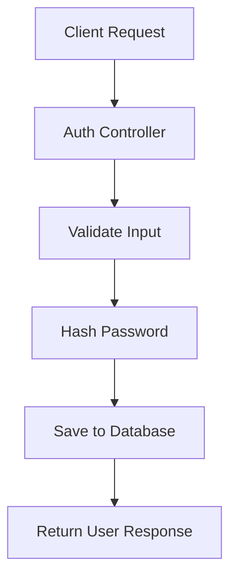

# การสร้าง User Model และระบบลงทะเบียน (Authentication System)

เรียนรู้การสร้าง Model ของ User และการลงทะเบียนแบบ Modern Go (2024)

## 📋 ภาพรวมของบทเรียน

บทเรียนนี้จะสอนการสร้างระบบ Authentication พื้นฐานโดยใช้ Go และ GORM พร้อมกับการเข้ารหัสรหัสผ่านด้วย bcrypt



## 🏗️ การสร้าง User Model

### 1. สร้างไฟล์ `models/user.go`

```go
package models

import (
  "golang.org/x/crypto/bcrypt"
  "gorm.io/gorm"
)

// User represents user model in database
type User struct {
  gorm.Model
  Email    string `gorm:"uniqueIndex;not null" json:"email"`
  Password string `gorm:"not null" json:"-"` // json:"-" ซ่อนจาก JSON response
  Name     string `gorm:"not null" json:"name"`
  Avatar   string `json:"avatar"`
  Role     string `gorm:"default:member;not null" json:"role"`
}

// 🆕 Modern approach: ใช้ method แทน hook
func (u *User) GenerateHashedPassword() error {
  if u.Password == "" {
    return nil
  }

  hashedPassword, err := bcrypt.GenerateFromPassword([]byte(u.Password), bcrypt.DefaultCost)
  if err != nil {
    return err
  }

  u.Password = string(hashedPassword)
  return nil
}

// ValidatePassword เช็ครหัสผ่านตอน login
func (u *User) ValidatePassword(password string) bool {
  err := bcrypt.CompareHashAndPassword([]byte(u.Password), []byte(password))
  return err == nil
}
```

### 📊 โครงสร้าง Database Table

| Field    | Type   | Constraints      | Description                 |
| -------- | ------ | ---------------- | --------------------------- |
| ID       | uint   | PRIMARY KEY      | Auto increment              |
| Email    | string | UNIQUE, NOT NULL | ใช้สำหรับ login             |
| Password | string | NOT NULL         | เข้ารหัสด้วย bcrypt         |
| Name     | string | NOT NULL         | ชื่อผู้ใช้                  |
| Avatar   | string | NULL             | รูปโปรไฟล์                  |
| Role     | string | DEFAULT 'member' | บทบาท (admin/editor/member) |

## 🔧 การสร้าง Migration

### สร้างไฟล์ `migrations/create_users_table.go`

```go
package migrations

import (
  "your-project/models"
  "gorm.io/gorm"
)

func CreateUsersTable(db *gorm.DB) error {
  return db.AutoMigrate(&models.User{})
}

func DropUsersTable(db *gorm.DB) error {
  return db.Migrator().DropTable(&models.User{})
}
```

## 🎮 การสร้าง Auth Controller

### สร้างไฟล์ `controllers/auth.go`

```go
package controllers

import (
  "net/http"
  "your-project/models"
  "your-project/database"

  "github.com/gin-gonic/gin"
)

// SignUpRequest structure for input validation
type SignUpRequest struct {
  Email    string `json:"email" binding:"required,email"`
  Password string `json:"password" binding:"required,min=8"`
  Name     string `json:"name" binding:"required"`
}

// SignUpResponse structure for API response
type SignUpResponse struct {
  ID    uint   `json:"id"`
  Email string `json:"email"`
  Name  string `json:"name"`
  Role  string `json:"role"`
}

// SignUp handles user registration
func SignUp(c *gin.Context) {
  var form SignUpRequest

  // ✅ Bind and validate JSON input
  if err := c.ShouldBindJSON(&form); err != nil {
    c.JSON(http.StatusUnprocessableEntity, gin.H{
      "error": "Invalid input data",
      "details": err.Error(),
    })
    return
  }

  // 🆕 Create user instance
  user := models.User{
    Email:    form.Email,
    Password: form.Password,
    Name:     form.Name,
    Role:     "member", // default role
  }

  // 🔐 Hash password before saving
  if err := user.GenerateHashedPassword(); err != nil {
    c.JSON(http.StatusInternalServerError, gin.H{
      "error": "Failed to process password",
    })
    return
  }

  // 💾 Save to database
  if err := database.DB.Create(&user).Error; err != nil {
    c.JSON(http.StatusUnprocessableEntity, gin.H{
      "error": "Failed to create user",
      "details": err.Error(),
    })
    return
  }

  // 📤 Return success response
  response := SignUpResponse{
    ID:    user.ID,
    Email: user.Email,
    Name:  user.Name,
    Role:  user.Role,
  }

  c.JSON(http.StatusCreated, response)
}
```

## 🛣️ การตั้งค่า Routes

### อัพเดทไฟล์ `routes/routes.go`

```go
package routes

import (
  "your-project/controllers"

  "github.com/gin-gonic/gin"
)

func SetupRoutes(r *gin.Engine) {
  // 🆕 API versioning
  api := r.Group("/api/v1")
  {
    // Authentication routes
    auth := api.Group("/auth")
    {
      auth.POST("/signup", controllers.SignUp)
      // เพิ่มเติมได้: /login, /logout, /refresh
    }
  }
}
```

## 🧪 การทดสอบด้วย Postman

### Request Example:

```json
POST /api/v1/auth/signup
Content-Type: application/json

{
  "email": "user@example.com",
  "password": "securepassword123",
  "name": "John Doe"
}
```

### Response Example:

```json
{
  "id": 1,
  "email": "user@example.com",
  "name": "John Doe",
  "role": "member"
}
```

## 🔄 การปรับปรุงจากเวอร์ชันเดิม

### ✅ สิ่งที่ปรับปรุง:

1. **❌ เลิกใช้ GORM Hooks (BeforeSave)**

   - เหตุผล: ยากต่อการควบคุมและ debug
   - แก้ไข: ใช้ method `GenerateHashedPassword()` แทน

2. **🆕 เพิ่ม Input Validation**

   - ใช้ Gin binding tags
   - ตรวจสอบรูปแบบ email
   - กำหนดความยาวรหัสผ่านขั้นต่ำ

3. **🔒 ปรับปรุงความปลอดภัย**

   - ซ่อน password จาก JSON response ด้วย `json:"-"`
   - เพิ่ม method `ValidatePassword()` สำหรับการ login

4. **📝 โครงสร้างโค้ดที่ดีขึ้น**

   - แยก Request/Response structures
   - Error handling ที่ชัดเจนขึ้น
   - API versioning

5. **🆕 รองรับ Go 1.24.3**
   - ใช้ error handling แบบใหม่
   - รองรับ type parameters (generics)

## 🔐 Best Practices

### Security Considerations:

```go
// ✅ DO: ใช้ bcrypt cost ที่เหมาะสม
bcrypt.GenerateFromPassword([]byte(password), bcrypt.DefaultCost)

// ✅ DO: ซ่อน sensitive fields
type User struct {
  Password string `json:"-"`
}

// ❌ DON'T: ส่ง password กลับใน response
// ❌ DON'T: เก็บ plain text password
```

### Error Handling:

```go
// ✅ Structured error responses
c.JSON(http.StatusUnprocessableEntity, gin.H{
  "error": "Invalid input data",
  "details": err.Error(),
})
```

## 📚 Dependencies

อัพเดท `go.mod`:

```go
module your-project

go 1.24

require (
  github.com/gin-gonic/gin v1.9.1
  golang.org/x/crypto v0.17.0
  gorm.io/gorm v1.25.5
  gorm.io/driver/postgres v1.5.4 // หรือ database driver ที่ใช้
)
```

## 🚀 Next Steps

1. **เพิ่ม Login endpoint**
2. **JWT Token authentication**
3. **Password reset functionality**
4. **User profile management**
5. **Role-based access control**

---

> 💡 **หมายเหตุ**: การใช้ method แทน GORM hooks ทำให้โค้ดมีความยืดหยุ่นและควบคุมได้ง่ายขึ้น เหมาะสำหรับการพัฒนาระบบขนาดใหญ่
