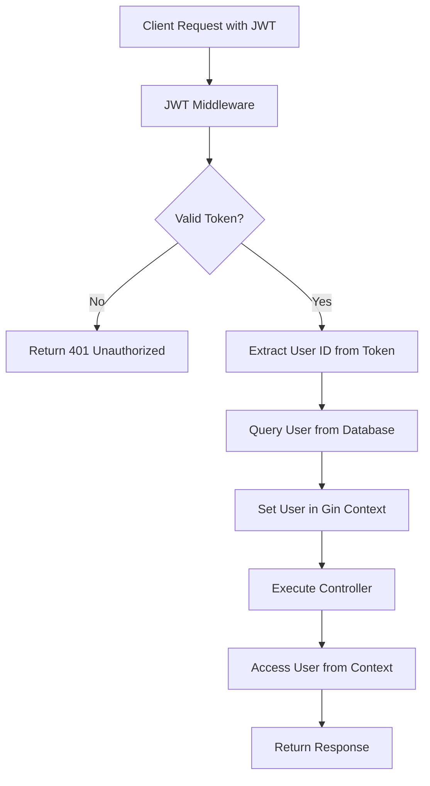

# การเข้าถึงข้อมูล Payload ของ JWT 🔐

เรียนรู้การใช้ Authentication Middleware ในการเข้าถึงค่า sub ของ JWT และการเข้าถึง user ผ่าน Context ของ Gin

## 📋 Overview

ในบทนี้เราจะเรียนรู้การสร้าง API endpoint สำหรับดึงข้อมูล Profile ของผู้ใช้งานที่ได้ทำการ login แล้ว โดยจะใช้ JWT Token ในการระบุตัวตนและดึงข้อมูลผู้ใช้จาก Database

## 🎯 วัตถุประสงค์

- สร้าง API endpoint `GET /api/v1/auth/profile` สำหรับดึงข้อมูลโปรไฟล์
- ใช้ JWT Middleware ในการตรวจสอบสิทธิ์
- เข้าถึงข้อมูล User จาก JWT payload ผ่าน Gin Context
- สร้าง API endpoint `PUT /api/v1/auth/profile` สำหรับอัพเดทโปรไฟล์
- เพิ่ม User ID ให้กับ Article เพื่อเก็บข้อมูลผู้เขียน

## 🔧 ขั้นตอนการพัฒนา

### 1. สร้าง Response Structure

สร้าง struct สำหรับ response ของ user profile:

```go
type UserResponse struct {
  ID     uint   `json:"id"`
  Email  string `json:"email"`
  Avatar string `json:"avatar"`
  Name   string `json:"name"`
  Role   string `json:"role"`
}
```

### 2. สร้าง Get Profile Handler

```go
func (ac *AuthController) GetProfile(c *gin.Context) {
  // ดึงข้อมูล User จาก Context (ถูก set โดย JWT Middleware)
  userInterface, exists := c.Get("sub")
  if !exists {
    c.JSON(http.StatusUnauthorized, gin.H{"error": "User not found"})
    return
  }

  // แปลงจาก interface{} เป็น User model
  user := userInterface.(*models.User)

  // สร้าง response structure
  var userResponse UserResponse
  copier.Copy(&userResponse, user)

  c.JSON(http.StatusOK, gin.H{
    "data": userResponse,
  })
}
```

### 3. กำหนดค่า JWT Middleware (อัพเดทเวอร์ชั่นใหม่)

ปรับปรุง authentication middleware เพื่อรองรับ Go 1.24.3:

```go
func AuthenticationMiddleware() gin.HandlerFunc {
  return gin.HandlerFunc(func(c *gin.Context) {
    authMiddleware, err := jwt.New(&jwt.GinJWTMiddleware{
      Realm:       "babel-api",
      Key:         []byte(config.GetJwtSecret()),
      Timeout:     time.Hour * 24,
      MaxRefresh:  time.Hour * 24,

      // กำหนดให้มองหา JWT จาก Authorization header
      TokenLookup: "header: Authorization",

      // กำหนด prefix ของ token (Bearer )
      TokenHeadName: "Bearer",

      // กำหนด Identity Key (ชื่อ field ใน payload)
      IdentityKey: "sub",

      // Function สำหรับดึงข้อมูล User จาก Database
      IdentityHandler: func(c *gin.Context) interface{} {
        var user models.User

        // ดึง claims จาก JWT
        claims := jwt.ExtractClaims(c)

        // ดึง User ID จาก sub claim
        userID := claims["sub"]

        // Query User จาก Database
        db := config.GetDB()
        result := db.First(&user, "id = ?", uint(userID.(float64)))

        if result.RowsAffected == 0 {
          return nil
        }

        return &user
      },

      // เพิ่ม PayloadFunc สำหรับ Go เวอร์ชั่นใหม่
      PayloadFunc: func(data interface{}) jwt.MapClaims {
        if user, ok := data.(*models.User); ok {
          return jwt.MapClaims{
            "sub": user.ID,
            "exp": time.Now().Add(time.Hour * 24).Unix(),
            "iat": time.Now().Unix(),
          }
        }
        return jwt.MapClaims{}
      },

      // กำหนด Authenticator
      Authenticator: func(c *gin.Context) (interface{}, error) {
        var loginData LoginRequest
        if err := c.ShouldBindJSON(&loginData); err != nil {
          return "", jwt.ErrMissingLoginValues
        }

        var user models.User
        db := config.GetDB()
        result := db.Where("email = ?", loginData.Email).First(&user)

        if result.RowsAffected == 0 {
          return nil, jwt.ErrFailedAuthentication
        }

        if !utils.CheckPasswordHash(loginData.Password, user.Password) {
          return nil, jwt.ErrFailedAuthentication
        }

        return &user, nil
      },

      Unauthorized: func(c *gin.Context, code int, message string) {
        c.JSON(code, gin.H{
          "error": message,
        })
      },
    })

    if err != nil {
      log.Fatal("JWT Error:" + err.Error())
    }

    authMiddleware.MiddlewareFunc()(c)
  })
}
```

### 4. เพิ่ม Routes

```go
func SetupAuthRoutes(router *gin.RouterGroup) {
  authGroup := router.Group("/auth")

  // สร้าง middleware instance
  authMiddleware := AuthenticationMiddleware()

  authGroup.POST("/login", authController.Login)
  authGroup.POST("/register", authController.Register)

  // Protected routes - ต้องมี JWT Token
  authGroup.GET("/profile", authMiddleware, authController.GetProfile)
  authGroup.PUT("/profile", authMiddleware, authController.UpdateProfile)
}
```

## 📷 การอัพเดทโปรไฟล์ (รองรับ File Upload)

### สร้าง Update Profile Handler

```go
type UpdateProfileForm struct {
  Email  string `form:"email"`
  Name   string `form:"name"`
  Avatar *multipart.FileHeader `form:"avatar"`
}

func (ac *AuthController) UpdateProfile(c *gin.Context) {
  var form UpdateProfileForm

  // Bind form data (รองรับ multipart/form-data)
  if err := c.ShouldBind(&form); err != nil {
    c.JSON(http.StatusBadRequest, gin.H{"error": err.Error()})
    return
  }

  // ดึง User จาก Context
  userInterface, _ := c.Get("sub")
  user := userInterface.(*models.User)

  // อัพเดทข้อมูล
  if form.Email != "" {
    user.Email = form.Email
  }
  if form.Name != "" {
    user.Name = form.Name
  }

  // จัดการ Avatar upload
  if form.Avatar != nil {
    SetUserImage(c, user)
  }

  // บันทึกลง Database
  db := config.GetDB()
  db.Save(user)

  var userResponse UserResponse
  copier.Copy(&userResponse, user)

  c.JSON(http.StatusOK, gin.H{
    "data": userResponse,
  })
}
```

### Function สำหรับ Upload รูปภาพ

```go
func SetUserImage(c *gin.Context, user *models.User) {
  file, err := c.FormFile("avatar")
  if err != nil {
    return
  }

  // ลบรูปเก่า (ถ้ามี)
  if user.Avatar != "" {
    oldPath := strings.Replace(user.Avatar, "/uploads/", "uploads/", 1)
    os.Remove(oldPath)
  }

  // สร้าง directory
  uploadDir := fmt.Sprintf("uploads/users/%d", user.ID)
  os.MkdirAll(uploadDir, 0755)

  // สร้างชื่อไฟล์ใหม่
  ext := filepath.Ext(file.Filename)
  filename := fmt.Sprintf("%d%s", time.Now().Unix(), ext)
  filePath := filepath.Join(uploadDir, filename)

  // บันทึกไฟล์
  if err := c.SaveUploadedFile(file, filePath); err != nil {
    return
  }

  // อัพเดท URL ใน Database
  user.Avatar = "/uploads/users/" + fmt.Sprintf("%d/%s", user.ID, filename)
}
```

## 📝 เพิ่ม User ID ให้ Article

### 1. อัพเดท Article Model

```go
type Article struct {
  ID         uint      `json:"id" gorm:"primaryKey"`
  Title      string    `json:"title"`
  Content    string    `json:"content"`
  UserID     uint      `json:"user_id"`     // เพิ่ม field นี้
  User       User      `json:"user"`        // Relationship
  CategoryID uint      `json:"category_id"`
  Category   Category  `json:"category"`
  CreatedAt  time.Time `json:"created_at"`
  UpdatedAt  time.Time `json:"updated_at"`
}
```

### 2. สร้าง Migration

สร้างไฟล์ migration ใหม่:

```bash
touch migrations/20241201000000_add_user_id_to_articles.go
```

```go
package migrations

import (
  "gorm.io/gorm"
)

func AddUserIDToArticles_20241201000000() func(*gorm.DB) error {
  return func(db *gorm.DB) error {
    return db.Exec("ALTER TABLE articles ADD COLUMN user_id INT UNSIGNED").Error
  }
}

func RollbackAddUserIDToArticles_20241201000000() func(*gorm.DB) error {
  return func(db *gorm.DB) error {
    return db.Exec("ALTER TABLE articles DROP COLUMN user_id").Error
  }
}
```

### 3. อัพเดท Article Controller

```go
func (ac *ArticleController) Create(c *gin.Context) {
  var article models.Article

  if err := c.ShouldBindJSON(&article); err != nil {
    c.JSON(http.StatusBadRequest, gin.H{"error": err.Error()})
    return
  }

  // ดึง User จาก Context
  userInterface, _ := c.Get("sub")
  user := userInterface.(*models.User)

  // กำหนด User ให้ Article
  article.User = *user  // Dereference pointer

  db := config.GetDB()
  result := db.Create(&article)

  if result.Error != nil {
    c.JSON(http.StatusInternalServerError, gin.H{"error": result.Error.Error()})
    return
  }

  // Preload relationships เพื่อ return ข้อมูลครบถ้วน
  db.Preload("User").Preload("Category").First(&article, article.ID)

  c.JSON(http.StatusCreated, gin.H{
    "data": article,
  })
}
```

### 4. อัพเดท Article Routes

```go
func SetupArticleRoutes(router *gin.RouterGroup) {
  articleGroup := router.Group("/articles")

  // Public routes
  articleGroup.GET("", articleController.FindAll)
  articleGroup.GET("/:id", articleController.FindByID)

  // Protected routes - ต้อง login
  authMiddleware := AuthenticationMiddleware()
  articleGroup.POST("", authMiddleware, articleController.Create)
  articleGroup.PUT("/:id", authMiddleware, articleController.Update)
  articleGroup.DELETE("/:id", authMiddleware, articleController.Delete)
}
```

## 🧪 การทดสอบด้วย Postman

### 1. Test Get Profile

```http
GET /api/v1/auth/profile
Authorization: Bearer <your-jwt-token>
```

**Expected Response:**

```json
{
  "data": {
    "id": 1,
    "email": "admin@example.com",
    "avatar": "/uploads/users/1/avatar.jpg",
    "name": "Admin User",
    "role": "admin"
  }
}
```

### 2. Test Update Profile

```http
PUT /api/v1/auth/profile
Authorization: Bearer <your-jwt-token>
Content-Type: multipart/form-data

Body:
- name: "Updated Name"
- avatar: [file upload]
```

### 3. Test Create Article with User

```http
POST /api/v1/articles
Authorization: Bearer <your-jwt-token>
Content-Type: application/json

{
  "title": "My Article",
  "content": "Article content...",
  "category_id": 1
}
```

**Expected Response:**

```json
{
  "data": {
    "id": 1,
    "title": "My Article",
    "content": "Article content...",
    "user_id": 1,
    "user": {
      "id": 1,
      "name": "Admin User",
      "avatar": "/uploads/users/1/avatar.jpg"
    },
    "category_id": 1,
    "category": {
      "id": 1,
      "name": "Technology"
    }
  }
}
```

## 📊 Flow Diagram



## 🆕 การปรับปรุงสำหรับ Go 1.24.3

### ความแตกต่างจากเวอร์ชั่นเก่า:

1. **JWT Library Update**: ใช้ `github.com/golang-jwt/jwt/v5` แทน `github.com/dgrijalva/jwt-go`
2. **Context Handling**: ปรับปรุงการจัดการ Context ให้เข้ากับ Gin เวอร์ชั่นใหม่
3. **Error Handling**: เพิ่ม error handling ที่ดีขึ้น
4. **Type Safety**: ใช้ type assertion ที่ปลอดภัยขึ้น
5. **File Upload**: รองรับ multipart/form-data สำหรับ file upload

### Dependencies ที่ต้องเพิ่ม:

```bash
go get github.com/golang-jwt/jwt/v5
go get github.com/jinzhu/copier
go get gorm.io/gorm
go get github.com/gin-gonic/gin
```

## 📝 สรุป

บทนี้เราได้เรียนรู้:

- ✅ การใช้ JWT Middleware ในการตรวจสอบสิทธิ์
- ✅ การเข้าถึงข้อมูล User จาก JWT payload
- ✅ การสร้าง Protected API endpoints
- ✅ การอัพเดทโปรไฟล์พร้อม file upload
- ✅ การเชื่อมโยง Article กับ User
- ✅ การปรับปรุงโค้ดให้รองรับ Go เวอร์ชั่นล่าสุด

ตอนนี้ระบบของเราสามารถระบุตัวตนผู้ใช้และเก็บข้อมูลความเป็นเจ้าของได้แล้ว! 🎉
