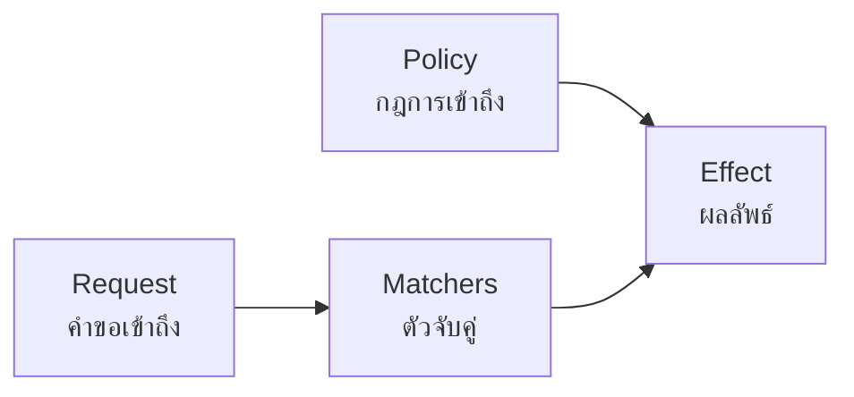
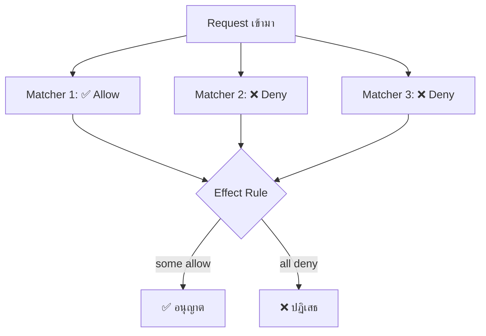
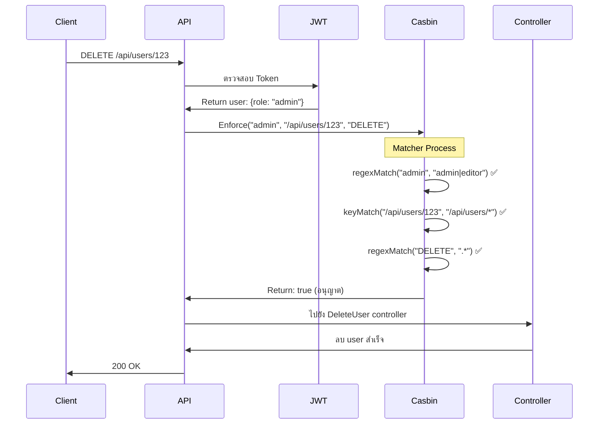
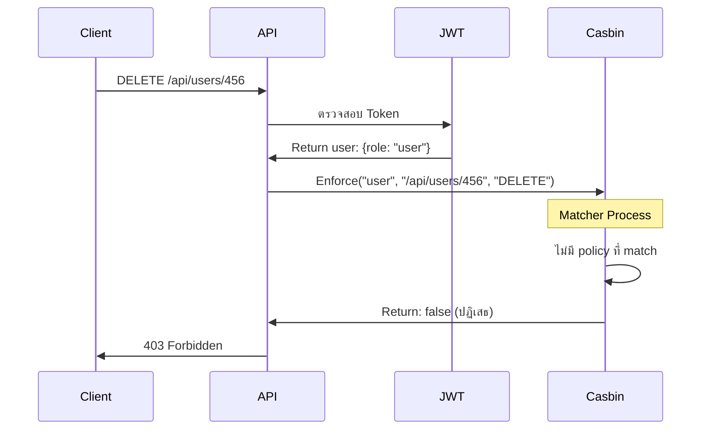

# PERM (Policy, Effect, Request, Matchers) - ระบบควบคุมการเข้าถึงด้วย Casbin

## 📚 บทนำ

การจัดการสิทธิ์การเข้าถึงใน API เป็นส่วนสำคัญที่ช่วยป้องกันการเข้าถึงข้อมูลโดยไม่ได้รับอนุญาต ในบทเรียนนี้เราจะเรียนรู้เกี่ยวกับ **PERM Model** ซึ่งเป็นรูปแบบการจัดการสิทธิ์ผ่าน **Casbin** library

## 🎯 ปัญหาที่เจอในการพัฒนา

### ปัญหาเดิม: Code ซ้ำซ้อนในการตรวจสอบสิทธิ์

```go
// ❌ Code ซ้ำในทุก Controller
func (uc *UserController) GetUsers(c *gin.Context) {
  // ตรวจสอบ role admin ซ้ำๆ
  if user.Role != "admin" {
    c.JSON(403, gin.H{"error": "Forbidden"})
    return
  }
  // Logic ของ function...
}

func (uc *UserController) CreateUser(c *gin.Context) {
  // ตรวจสอบ role admin ซ้ำๆ อีก
  if user.Role != "admin" {
    c.JSON(403, gin.H{"error": "Forbidden"})
    return
  }
  // Logic ของ function...
}
```

### 💡 Solution: Role-Based Access Control (RBAC) ด้วย Casbin

Casbin เป็น authorization library ที่ช่วยให้การจัดการสิทธิ์เป็นเรื่องง่าย โดยใช้โมเดล **PERM**:



## 🏗️ องค์ประกอบหลักของ PERM Model

### 1. 📋 Policy (กฎการเข้าถึง)

Policy คือการตั้งกฎที่ประกอบด้วย 3 ส่วน:

| ส่วนประกอบ  | คำอธิบาย                  | ตัวอย่าง                         |
| ----------- | ------------------------- | -------------------------------- |
| **Subject** | ใครเป็นผู้ร้องขอ          | `admin`, `editor`, `user`        |
| **Object**  | ทรัพยากรที่ต้องการเข้าถึง | `/api/users/*`, `/api/posts/123` |
| **Action**  | การกระทำที่ต้องการ        | `GET`, `POST`, `PUT`, `DELETE`   |

#### ตัวอย่าง Policy Configuration:

```ini
# model.conf
[request_definition]
r = sub, obj, act

[policy_definition]
p = sub, obj, act

[policy_effect]
e = some(where (p.eft == allow))

[matchers]
m = regexMatch(r.sub, p.sub) && keyMatch(r.obj, p.obj) && regexMatch(r.act, p.act)
```

```csv
# policy.csv
p, admin|editor, /api/users/*, GET|POST|PUT|DELETE
p, user, /api/users/profile, GET|PUT
p, guest, /api/public/*, GET
```

### 2. 🔍 Request (คำขอเข้าถึง)

Request คือข้อมูลที่ส่งมาจาก client เพื่อขอเข้าถึงทรัพยากร:

```go
type AuthRequest struct {
  Subject string // ผู้ใช้ที่ร้องขอ (เช่น "admin")
  Object  string // เส้นทางที่ต้องการเข้าถึง (เช่น "/api/users/123")
  Action  string // HTTP Method (เช่น "GET")
}

// ตัวอย่างการใช้งาน
request := AuthRequest{
  Subject: "admin",
  Object:  "/api/users/123",
  Action:  "DELETE",
}
```

### 3. 🔗 Matchers (ตัวจับคู่)

Matcher เป็นฟังก์ชันที่ใช้เปรียบเทียบ Request กับ Policy

#### 🔑 ฟังก์ชัน Matcher ที่สำคัญ:

##### **keyMatch()** - สำหรับ URL patterns

```go
// Policy: /api/users/*
// Request: /api/users/123 ✅ Match
// Request: /api/users/profile ✅ Match
// Request: /api/posts/1 ❌ No Match

keyMatch("/api/users/123", "/api/users/*") // return true
```

##### **regexMatch()** - สำหรับ Regular Expression

```go
// Policy: admin|editor (ใช้ regex)
// Request: admin ✅ Match
// Request: editor ✅ Match
// Request: user ❌ No Match

regexMatch("admin", "admin|editor") // return true
regexMatch("user", "admin|editor")  // return false
```

### 4. ⚡ Effect (ผลลัพธ์)

Effect กำหนดวิธีการรวมผลลัพธ์จาก Matcher หลายตัว:

#### 📊 ตัวอย่างการทำงานของ Effect:



#### Effect Rules ที่ใช้บ่อย:

- **`some(where (p.eft == allow))`**: อนุญาตถ้ามี matcher ใดที่ allow
- **`!some(where (p.eft == deny))`**: อนุญาตถ้าไม่มี matcher ใดที่ deny

## 🛠️ การติดตั้งและใช้งาน Casbin กับ Go 1.24.3

### 📦 การติดตั้ง Dependencies

```bash
# อัปเดตเป็นเวอร์ชันล่าสุด (2024)
go mod init your-project
go get github.com/casbin/casbin/v2@latest
go get github.com/casbin/gorm-adapter/v3@latest
go get github.com/gin-gonic/gin@latest
```

### 🔧 การตั้งค่า Casbin Middleware

#### 1. สร้าง Model Configuration

```go
// config/casbin_model.conf
[request_definition]
r = sub, obj, act

[policy_definition]
p = sub, obj, act, eft

[role_definition]
g = _, _

[policy_effect]
e = some(where (p.eft == allow))

[matchers]
m = g(r.sub, p.sub) && keyMatch2(r.obj, p.obj) && regexMatch(r.act, p.act)
```

#### 2. สร้าง Authorization Middleware

```go
// middleware/casbin_middleware.go
package middleware

import (
  "net/http"
  "github.com/gin-gonic/gin"
  "github.com/casbin/casbin/v2"
  gormadapter "github.com/casbin/gorm-adapter/v3"
  "gorm.io/gorm"
)

type CasbinMiddleware struct {
  enforcer *casbin.Enforcer
}

func NewCasbinMiddleware(db *gorm.DB) (*CasbinMiddleware, error) {
  // ใช้ GORM Adapter สำหรับ database
  adapter, err := gormadapter.NewAdapterByDB(db)
  if err != nil {
    return nil, err
  }

  // สร้าง enforcer จาก model file
  enforcer, err := casbin.NewEnforcer("config/casbin_model.conf", adapter)
  if err != nil {
    return nil, err
  }

  // เพิ่ม policies
  enforcer.AddPolicy("admin", "/api/users/*", ".*", "allow")
  enforcer.AddPolicy("editor", "/api/posts/*", "GET|POST|PUT", "allow")
  enforcer.AddPolicy("user", "/api/users/profile", "GET|PUT", "allow")

  return &CasbinMiddleware{enforcer: enforcer}, nil
}

func (cm *CasbinMiddleware) Authorize() gin.HandlerFunc {
  return func(c *gin.Context) {
    // ดึงข้อมูล user จาก JWT token
    user, exists := c.Get("user")
    if !exists {
      c.JSON(http.StatusUnauthorized, gin.H{
        "error": "User not authenticated",
      })
      c.Abort()
      return
    }

    userObj := user.(map[string]interface{})
    role := userObj["role"].(string)

    // สร้าง request สำหรับ Casbin
    subject := role
    object := c.Request.URL.Path
    action := c.Request.Method

    // ตรวจสอบสิทธิ์
    allowed, err := cm.enforcer.Enforce(subject, object, action)
    if err != nil {
      c.JSON(http.StatusInternalServerError, gin.H{
        "error": "Authorization check failed",
      })
      c.Abort()
      return
    }

    if !allowed {
      c.JSON(http.StatusForbidden, gin.H{
        "error": "Access denied",
        "details": map[string]string{
          "role":   subject,
          "path":   object,
          "method": action,
        },
      })
      c.Abort()
      return
    }

    // อนุญาตให้ผ่าน
    c.Next()
  }
}
```

#### 3. การใช้งาน Middleware

```go
// main.go
package main

import (
  "github.com/gin-gonic/gin"
  "your-project/middleware"
  "your-project/controllers"
  "your-project/database"
)

func main() {
  // เชื่อมต่อ database
  db := database.InitDB()

  // สร้าง Casbin middleware
  casbinMiddleware, err := middleware.NewCasbinMiddleware(db)
  if err != nil {
    panic(err)
  }

  r := gin.Default()

  // ใช้ JWT middleware ก่อน
  r.Use(middleware.JWTMiddleware())

  // ใช้ Casbin middleware
  r.Use(casbinMiddleware.Authorize())

  // Routes - ไม่ต้องเช็คสิทธิ์ในแต่ละ controller แล้ว!
  api := r.Group("/api")
  {
    users := api.Group("/users")
    {
      users.GET("/", controllers.GetUsers)        // admin only
      users.POST("/", controllers.CreateUser)     // admin only
      users.PUT("/:id", controllers.UpdateUser)   // admin only
      users.DELETE("/:id", controllers.DeleteUser) // admin only
      users.GET("/profile", controllers.GetProfile) // user, editor, admin
    }

    posts := api.Group("/posts")
    {
      posts.GET("/", controllers.GetPosts)       // editor, admin
      posts.POST("/", controllers.CreatePost)    // editor, admin
      posts.PUT("/:id", controllers.UpdatePost)  // editor, admin
      posts.DELETE("/:id", controllers.DeletePost) // admin only
    }
  }

  r.Run(":8080")
}
```

## 🎨 ตัวอย่างการทำงานแบบ Step-by-Step

### 📝 Scenario: Admin ต้องการลบ User



### 🚫 Scenario: User พยายามลบ User อื่น



## 🆕 การปรับปรุงสำหรับ Go 1.24.3

### ✨ ฟีเจอร์ใหม่ที่เพิ่มเข้ามา:

1. **Performance Improvements**: Casbin v2 มีการปรับปรุงประสิทธิภาพในการ enforce
2. **Better Error Handling**: การจัดการ error ที่ดีขึ้น
3. **Context Support**: รองรับ context.Context อย่างเต็มรูปแบบ
4. **Generics Support**: ใช้ประโยชน์จาก Go Generics

```go
// ✨ ใหม่: การใช้งาน Context และ Generics
func (cm *CasbinMiddleware) AuthorizeWithContext(ctx context.Context) gin.HandlerFunc {
  return func(c *gin.Context) {
    // ใช้ context สำหรับ timeout และ cancellation
    reqCtx, cancel := context.WithTimeout(ctx, 5*time.Second)
    defer cancel()

    // Enhanced enforcement with context
    allowed, err := cm.enforcer.EnforceWithContext(reqCtx, subject, object, action)
    if err != nil {
      // Better error handling
      if errors.Is(err, context.DeadlineExceeded) {
        c.JSON(http.StatusRequestTimeout, gin.H{
          "error": "Authorization timeout",
        })
      } else {
        c.JSON(http.StatusInternalServerError, gin.H{
          "error": "Authorization failed",
          "details": err.Error(),
        })
      }
      c.Abort()
      return
    }

    // ... rest of the code
  }
}
```

## 📈 ข้อดีของการใช้ PERM Model

| ข้อดี                            | คำอธิบาย                                  |
| -------------------------------- | ----------------------------------------- |
| 🔄 **Centralized Authorization** | จัดการสิทธิ์ทั้งหมดในที่เดียว             |
| 🧹 **Clean Code**                | ไม่มีโค้ดซ้ำในแต่ละ controller            |
| 🔧 **Flexible**                  | เปลี่ยนแปลงสิทธิ์ได้ง่ายโดยไม่ต้องแก้โค้ด |
| 📊 **Scalable**                  | รองรับระบบขนาดใหญ่                        |
| 🎯 **Policy-Based**              | ใช้ policy files ที่อ่านง่าย              |

## 🔚 สรุป

PERM Model ช่วยให้การจัดการสิทธิ์ใน API เป็นเรื่องง่ายและมีประสิทธิภาพ โดยแยกส่วนการตรวจสอบสิทธิ์ออกจาก business logic ทำให้โค้ดสะอาดขึ้นและบำรุงรักษาง่ายขึ้น

**การปรับปรุงสำคัญในเวอร์ชันนี้:**

- ✅ อัปเดตให้เข้ากับ Go 1.24.3
- ✅ ใช้ Context สำหรับ timeout handling
- ✅ การจัดการ error ที่ดีขึ้น
- ✅ Performance optimizations
- ✅ เพิ่ม middleware pattern ที่ใช้งานง่าย
