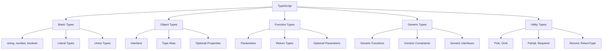

# 📚 ทบทวนการใช้งาน TypeScript

## 🎯 Overview
คู่มือการทบทวน TypeScript อย่างครบถ้วน พร้อมตัวอย่างโค้ดและอธิบายแบบละเอียดสำหรับการใช้งานใน Next.js และ React

---

## 🚀 การเริ่มต้น

### 1. การติดตั้ง TypeScript

```bash
# ติดตั้ง TypeScript
pnpm add -D typescript

# สร้างไฟล์ config
npx tsc --init
```

หลังจากรันคำสั่งแล้ว จะได้ไฟล์ `tsconfig.json` ซึ่งเป็นไฟล์สำหรับ config TypeScript

---

## 📝 การกำหนดชนิดข้อมูลพื้นฐาน

### Type Inference (การอนุมาน)
TypeScript สามารถอนุมานชนิดข้อมูลได้อัตโนมัติ

```typescript
// TypeScript จะอนุมานว่า n เป็น number
let n = 20;

// TypeScript จะอนุมานว่า str เป็น string
let str = "Hello";
```

### Literal Types
เมื่อใช้ `const` TypeScript จะถือว่าเป็น literal type

```typescript
const str = "Hello"; // ชนิดข้อมูลคือ "Hello" (ไม่ใช่ string ธรรมดา)
```

> 💡 **เคล็ดลับ**: ใช้ `const` เมื่อต้องการค่าที่แน่นอน และ `let` เมื่อต้องการเปลี่ยนค่าได้

---

## 🏗️ การใช้งาน Object และ Array

### Object Types

```typescript
const theme = {
    color: {
        primary: "#ee22ee",
        secondary: "#ffee66"
    }
} as const; // ทำให้เป็น readonly

// ผลลัพธ์: เมื่อใช้ theme.color.primary จะแสดงค่าจริงแทนที่จะเป็น string
```

### ✅ ข้อดีของ `as const`:
- แสดงค่าจริงเมื่อ hover
- ป้องกันการแก้ไขโดยไม่ตั้งใจ
- เพิ่มความแม่นยำของ type

---

## 🎭 Interface vs Type

### Interface
```typescript
interface Person {
    name: string;
    age: number;
    gender: "male" | "female"; // Union Type
    social?: {  // Optional property
        line?: string;
        facebook?: string;
    };
}

// การสืบทอด
interface Animal {
    age: number;
}

interface Person extends Animal {
    name: string;
    gender: "male" | "female";
}
```

### Type Alias
```typescript
type Animal = {
    age: number;
};

type Person = Animal & {  // Intersection Type
    name: string;
    gender: "male" | "female";
    addresses: Address[];
};

type Address = {
    latitude: number;
    longitude: number;
};
```

### 📊 เปรียบเทียบ Interface vs Type

| Feature | Interface | Type |
|---------|-----------|------|
| Inheritance | `extends` | `&` (intersection) |
| Declaration Merging | ✅ | ❌ |
| Union Types | ❌ | ✅ |
| Computed Properties | ❌ | ✅ |

---

## ⚡ Functions และ Parameters

### Function Types
```typescript
interface Option {
    x: number;
    y: number;
}

function foo(bar: number, option?: Option) {
    // bar เป็น required parameter
    // option เป็น optional parameter
}

// การเรียกใช้
foo(1); // ✅
foo(1, { x: 10, y: 20 }); // ✅
```

---

## 🔥 Generic Types

### Basic Generic
```typescript
function concatAll<T>(items: T[]): string {
    let result = "";
    for (const item of items) {
        result += "-" + item;
    }
    return result;
}

// ใช้งานได้กับทุกชนิดข้อมูล
concatAll([1, 2, 3]);        // ✅ number[]
concatAll(["a", "b", "c"]);  // ✅ string[]
```

### Generic Constraints
```typescript
function findById<T extends { id: number }>(
    items: T[], 
    id: T['id']  // ใช้ T['id'] แทน number เพื่อความยืดหยุ่น
): T | undefined {
    return items.find(item => item.id === id);
}

const products = [
    { id: 1, title: "Product 1" },
    { id: 2, title: "Product 2" }
];

const found = findById(products, 2); // ✅
```

> 🎯 **Best Practice**: ใช้ `T['key']` แทนการระบุ type ตรงๆ เพื่อให้โค้ดยืดหยุ่นมากขึ้น

---

## 🛠️ Utility Types

TypeScript มี Utility Types ที่ช่วยให้การจัดการ type ง่ายขึ้น

### Record<K, V>
```typescript
// แทนที่การเขียนแบบนี้
type Address = {
    latitude: number;
    longitude: number;
};

// ใช้ Record แทน
type Address = Record<'latitude' | 'longitude', number>;
```

### Partial<T>
```typescript
type Social = {
    line: string;
    facebook: string;
};

// ทำให้ทุก property เป็น optional
type PartialSocial = Partial<Social>;
// เท่ากับ { line?: string; facebook?: string; }
```

### Pick<T, K>
```typescript
type Person = {
    name: string;
    age: number;
    gender: "male" | "female";
    social: Social;
};

// เลือกเฉพาะ field ที่ต้องการ
type BasicInfo = Pick<Person, 'name' | 'gender'>;
// ได้ { name: string; gender: "male" | "female"; }
```

### Omit<T, K>
```typescript
// ละเว้น field ที่ไม่ต้องการ
type OtherInfo = Omit<Person, 'name' | 'gender'>;
// ได้ { age: number; social: Social; }
```

---

## 🎪 Advanced Type Operations

### ReturnType<T>
```typescript
function getTheme() {
    return {
        color: {
            primary: "#ee22ee",
            secondary: "#ffee66"
        }
    };
}

// ดึง type ของค่าที่ return จากฟังก์ชัน
type GetThemeReturn = ReturnType<typeof getTheme>;

// ดึง type ของ color
type Color = GetThemeReturn['color'];

// ดึงเฉพาะ key ของ color
type ColorKeys = keyof Color; // "primary" | "secondary"
```

### Parameters<T>
```typescript
function hello(a: number, b: string, c: boolean) {
    // function body
}

// ดึง type ของ parameters ทั้งหมด
type HelloParams = Parameters<typeof hello>;
// ได้ [number, string, boolean]
```

---

## 🎨 Visual Guide



---

## 🔍 Key Concepts สำคัญ

### 1. Type vs Value
```typescript
// Type World (จะหายไปตอน compile)
interface User {
    name: string;
}

// Value World (จะอยู่ใน JavaScript จริง)
const user = {
    name: "John"
};

// การแปลงจาก Value เป็น Type
type UserType = typeof user;
```

### 2. Compile Time vs Runtime
- **Compile Time**: TypeScript ช่วยตรวจสอบ type
- **Runtime**: เหลือแค่ JavaScript ธรรมดา

### 3. Best Practices
- ใช้ `const assertions` สำหรับค่าคงที่
- ใช้ `Generic constraints` เพื่อความปลอดภัย
- ใช้ `Utility types` แทนการเขียน type ซ้ำ
- ใช้ `typeof` เมื่อต้องการดึง type จาก value

---

## 📚 สรุป

TypeScript ช่วยให้การเขียนโค้ดมีความปลอดภัยและแม่นยำมากขึ้น โดยเฉพาะใน project ขนาดใหญ่อย่าง Next.js และ React การเข้าใจ concepts เหล่านี้จะช่วยให้การพัฒนาเป็นไปอย่างราบรื่นและมีประสิทธิภาพมากขึ้น

> 💪 **Next Steps**: ลองนำ concepts เหล่านี้ไปใช้ในโปรเจคจริง และฝึกเขียน type definitions สำหรับ API responses และ component props