# การติดตั้งและตั้งค่า ESLint และ Prettier สำหรับ Next.js

## 📋 สารบัญ
- [ภาพรวม](#ภาพรวม)
- [ความจำเป็นของเครื่องมือ](#ความจำเป็นของเครื่องมือ)
- [การสร้างโปรเจค Next.js](#การสร้างโปรเจค-nextjs)
- [การติดตั้ง Dependencies](#การติดตั้ง-dependencies)
- [การตั้งค่า ESLint](#การตั้งค่า-eslint)
- [การตั้งค่า Prettier](#การตั้งค่า-prettier)
- [การตั้งค่า Next.js](#การตั้งค่า-nextjs)
- [การตั้งค่า TypeScript](#การตั้งค่า-typescript)
- [การตั้งค่า Package.json Scripts](#การตั้งค่า-packagejson-scripts)
- [การตั้งค่า VS Code](#การตั้งค่า-vs-code)
- [Extensions ที่แนะนำ](#extensions-ที่แนะนำ)
- [การทดสอบ](#การทดสอบ)

## 🎯 ภาพรวม

การพัฒนาซอฟต์แวร์ในทีมต้องการมาตรฐานการเขียนโค้ดที่เหมือนกัน เพื่อให้โค้ดมีความสม่ำเสมอ อ่านง่าย และบำรุงรักษาได้ง่าย เราจะใช้เครื่องมือสองตัวหลัก:

```mermaid
graph TD
    A[Developer เขียนโค้ด] --> B[ESLint ตรวจสอบคุณภาพ]
    B --> C[Prettier จัดรูปแบบ]
    C --> D[โค้ดมีมาตรฐานเดียวกัน]
    
    style A fill:#e1f5fe
    style B fill:#fff3e0
    style C fill:#f3e5f5
    style D fill:#e8f5e8
```



## 🛠️ ความจำเป็นของเครื่องมือ

### ESLint (Linter)
- **หน้าที่**: ตรวจสอบคุณภาพโค้ด ตามกฎที่กำหนด
- **ประโยชน์**: 
  - หาข้อผิดพลาดในโค้ด
  - บังคับใช้มาตรฐานการเขียน
  - ป้องกัน bugs ที่อาจเกิดขึ้น

### Prettier (Code Formatter)
- **หน้าที่**: จัดรูปแบบโค้ดให้สวยงาม
- **ประโยชน์**:
  - โค้ดมีรูปแบบเดียวกันทั้งทีม
  - ประหยัดเวลาในการจัดรูปแบบ
  - ลดการ conflict ใน Git

## 🚀 การสร้างโปรเจค Next.js

### ขั้นตอนการสร้างโปรเจค (Next.js 15.3.2+)

```bash
npx create-next-app@latest
```

> **หมายเหตุ**: ใน Next.js 15.3.2+ จะมี ESLint config ที่ใช้ Flat Config format อัตโนมัติแล้ว

เมื่อรันคำสั่งแล้ว จะมีคำถามให้ตอบ:

```
✔ What is your project named? … full-stack-nextjs
✔ Would you like to use TypeScript? … Yes
✔ Would you like to use ESLint? … Yes
✔ Would you like to use Tailwind CSS? … Yes
✔ Would you like to use `src/` directory? … No
✔ Would you like to use App Router? … Yes
✔ Would you like to customize the default import alias (@/*)? … No
```

### เปิดโปรเจคใน VS Code

```bash
cd full-stack-nextjs
code .
```

## 📦 การติดตั้ง Dependencies

ติดตั้ง packages ที่จำเป็นสำหรับ ESLint และ Prettier:

```bash
npm install -D eslint-config-prettier eslint-plugin-prettier prettier prettier-plugin-tailwindcss @typescript-eslint/eslint-plugin @typescript-eslint/parser
```

### อธิบายแต่ละ Package:

| Package | หน้าที่ |
|---------|---------|
| `eslint-config-prettier` | ปิดกฎ ESLint ที่ขัดแย้งกับ Prettier |
| `eslint-plugin-prettier` | รัน Prettier เป็น ESLint rule |
| `prettier` | ตัว formatter หลัก |
| `prettier-plugin-tailwindcss` | จัดเรียง Tailwind classes อัตโนมัติ |
| `@typescript-eslint/eslint-plugin` | กฎ ESLint สำหรับ TypeScript |
| `@typescript-eslint/parser` | Parser สำหรับ TypeScript |

## ⚙️ การตั้งค่า ESLint

### การใช้งาน Flat Config ที่มีอยู่แล้ว

Next.js 15.3.2+ จะสร้างไฟล์ `eslint.config.mjs` ให้อัตโนมัติ:

```javascript
import { dirname } from "path";
import { fileURLToPath } from "url";
import { FlatCompat } from "@eslint/eslintrc";

const __filename = fileURLToPath(import.meta.url);
const __dirname = dirname(__filename);

const compat = new FlatCompat({
  baseDirectory: __dirname,
});

const eslintConfig = [
  ...compat.extends("next/core-web-vitals", "next/typescript"),
];

export default eslintConfig;
```

### แก้ไข Configuration สำหรับ Prettier และ TypeScript

แก้ไขไฟล์ `eslint.config.mjs` ให้เป็น:

```javascript
import { dirname } from "path";
import { fileURLToPath } from "url";
import { FlatCompat } from "@eslint/eslintrc";

const __filename = fileURLToPath(import.meta.url);
const __dirname = dirname(__filename);

const compat = new FlatCompat({
  baseDirectory: __dirname,
});

const eslintConfig = [
  ...compat.extends(
    "next/core-web-vitals",
    "next/typescript",
    "plugin:@typescript-eslint/recommended-type-checked",
    "plugin:@typescript-eslint/stylistic-type-checked",
    "plugin:prettier/recommended"
  ),
  {
    languageOptions: {
      parserOptions: {
        project: true,
      },
    },
    rules: {
      // กฎเหล่านี้เปิดใช้งานใน stylistic-type-checked
      '@typescript-eslint/array-type': 'off',
      '@typescript-eslint/consistent-type-definitions': 'off',
      '@typescript-eslint/prefer-nullish-coalescing': 'off',
      '@typescript-eslint/consistent-type-imports': [
        'warn',
        {
          prefer: 'type-imports',
          fixStyle: 'inline-type-imports',
        },
      ],
      '@typescript-eslint/no-unused-vars': ['warn', { argsIgnorePattern: '^_' }],
      '@typescript-eslint/no-misused-promises': [
        2,
        {
          checksVoidReturn: { attributes: false },
        },
      ],
      '@typescript-eslint/no-floating-promises': 'off',
    },
  },
];

export default eslintConfig;
```

### ความแตกต่างของ Flat Config:

- **ES Modules**: ใช้ `import` แทน `require`
- **Array format**: Configuration เป็น array ของ objects
- **compat**: ใช้ FlatCompat เพื่อใช้งาน legacy configs
- **languageOptions**: การตั้งค่า parser และ parser options

## 💅 การตั้งค่า Prettier

สร้างไฟล์ `prettier.config.mjs`:

```javascript
/** @type {import('prettier').Config & import('prettier-plugin-tailwindcss').options} */
const config = {
  plugins: ['prettier-plugin-tailwindcss'],
  singleQuote: true,
  trailingComma: 'all',
};

export default config;
```

### อธิบาย Configuration:

| ตัวเลือก | ความหมาย | ตัวอย่าง |
|----------|-----------|----------|
| `plugins` | ใช้ Tailwind plugin สำหรับจัดเรียง classes | `className="flex justify-center items-center"` |
| `singleQuote: true` | ใช้ single quote | `'hello'` แทน `"hello"` |
| `trailingComma: 'all'` | ใส่ comma ต่อท้ายทุกที่ที่เป็นไปได้ | `{ a: 1, b: 2, }` |

## 🔧 การตั้งค่า Next.js

เปลี่ยนชื่อไฟล์ `next.config.js` เป็น `next.config.mjs` และใส่:

```javascript
/** @type {import('next').NextConfig} */
const nextConfig = {
  eslint: {
    dirs: ['.'],
  },
};

export default nextConfig;
```

> **เหตุผลที่ใช้ .mjs**: ใน Next.js 15+ แนะนำให้ใช้ ES Modules (mjs) เพื่อความสอดคล้องกับระบบ module ใหม่

## 📝 การตั้งค่า TypeScript

แก้ไขไฟล์ `tsconfig.json` ในส่วน `include`:

```json
{
  "compilerOptions": {
    // ... existing options
  },
  "include": [
    "next-env.d.ts",
    "eslint.config.mjs",
    "prettier.config.mjs",
    "next.config.mjs",
    "postcss.config.js",
    "**/*.ts",
    "**/*.tsx",
    ".next/types/**/*.ts"
  ],
  "exclude": ["node_modules"]
}
```

### เหตุผลที่ต้องเพิ่มไฟล์เหล่านี้:

- **`eslint.config.mjs`**: ให้ TypeScript รู้จักไฟล์ config ของ ESLint (Flat Config)
- **`prettier.config.mjs`**: ให้ TypeScript รู้จักไฟล์ config ของ Prettier
- **`next.config.mjs`**: ให้ TypeScript รู้จักไฟล์ config ของ Next.js

## 📋 การตั้งค่า Package.json Scripts

แก้ไขส่วน `scripts` ในไฟล์ `package.json`:

```json
{
  "scripts": {
    "dev": "next dev",
    "build": "next build",
    "start": "next start",
    "lint": "next lint --fix"
  }
}
```

เพิ่ม `--fix` เพื่อให้ ESLint แก้ไขปัญหาอัตโนมัติ

## 🎨 การตั้งค่า VS Code

สร้างโฟลเดอร์ `.vscode` และไฟล์ `settings.json`:

```json
{
  "editor.tabSize": 2,
  "editor.formatOnSave": true,
  "editor.defaultFormatter": "esbenp.prettier-vscode",
  "editor.codeActionsOnSave": {
    "source.fixAll.eslint": true
  },
  "eslint.validate": [
    "javascript",
    "typescript",
    "javascriptreact",
    "typescriptreact"
  ],
  "[javascript]": {
    "editor.formatOnSave": false
  },
  "[typescript]": {
    "editor.formatOnSave": false
  },
  "[javascriptreact]": {
    "editor.formatOnSave": false
  },
  "[typescriptreact]": {
    "editor.formatOnSave": false
  },
  "[prisma]": {
    "editor.defaultFormatter": "Prisma.prisma"
  },
  "files.associations": {
    "*.css": "tailwindcss"
  },
  "files.eol": "\n",
  "typescript.preferences.importModuleSpecifier": "non-relative",
  "typescript.tsdk": "node_modules/typescript/lib"
}
```

### อธิบาย Settings เพิ่มเติม:

- **`eslint.validate`**: กำหนดไฟล์ที่ให้ ESLint ตรวจสอบ
- **`files.associations`**: ให้ VS Code รู้จักไฟล์ CSS เป็น Tailwind
- **`typescript.preferences.importModuleSpecifier`**: ใช้ absolute imports
- **`[prisma]`**: การตั้งค่าสำหรับไฟล์ Prisma (หากใช้)

## 🔌 Extensions ที่แนะนำ

### Extensions จำเป็น:

1. **ESLint** (`ms-vscode.vscode-eslint`)
2. **Prettier** (`esbenp.prettier-vscode`)
3. **Tailwind CSS IntelliSense** (`bradlc.vscode-tailwindcss`)
4. **Tailwind Fold** (`stivo.tailwind-fold`)

### การติดตั้งและเพิ่มใน Workspace:

1. ไปที่ Extensions tab
2. ค้นหาและติดตั้งแต่ละ extension
3. คลิกที่ไอคอนเฟือง → "Add to Workspace Recommendations"

สิ่งนี้จะสร้างไฟล์ `.vscode/extensions.json`:

```json
{
  "recommendations": [
    "ms-vscode.vscode-eslint",
    "esbenp.prettier-vscode",
    "bradlc.vscode-tailwindcss",
    "stivo.tailwind-fold"
  ]
}
```

### ประโยชน์ของ Workspace Recommendations:

```mermaid
graph LR
    A[คนใหม่เข้าทีม] --> B[เปิดโปรเจค]
    B --> C[VS Code แจ้งเตือน]
    C --> D[ติดตั้ง Extensions]
    D --> E[ทุกคนใช้เครื่องมือเดียวกัน]
    
    style A fill:#ffe0e0
    style E fill:#e0ffe0
```



## 🧪 การทดสอบ

### ทดสอบ ESLint:

```bash
npm run lint
```

### ทดสอบการ Format:

1. เปิดไฟล์ `app/page.tsx`
2. เปลี่ยน single quote เป็น double quote
3. เขียน Tailwind classes ไม่เรียงลำดับ
4. กด Ctrl+S (หรือ Cmd+S)
5. ดูว่าโค้ดถูก format และเรียง Tailwind classes หรือไม่

### ตัวอย่างก่อนและหลัง Format:

**ก่อน:**
```tsx
import type { NextPage } from "next"

const Home: NextPage = () => {
  const message = "Hello World"
  return (
    <div className="p-24 min-h-screen justify-between items-center flex-col flex">
      <h1>{message}</h1>
    </div>
  )
}

export default Home
```

**หลัง:**
```tsx
import type { NextPage } from 'next';

const Home: NextPage = () => {
  const message = 'Hello World';
  return (
    <div className="flex min-h-screen flex-col items-center justify-between p-24">
      <h1>{message}</h1>
    </div>
  );
};

export default Home;
```

### สิ่งที่เปลี่ยนแปลง:

- ✅ Double quotes → Single quotes
- ✅ Tailwind classes ถูกเรียงลำดับ
- ✅ Type import ถูกจัดรูปแบบ
- ✅ Semicolons ถูกเพิ่ม (ตาม config)

## 🎉 สรุป

หลังจากตั้งค่าเรียบร้อยแล้ว คุณจะได้:

✅ **โค้ดมีรูปแบบสม่ำเสมอ** - ทุกคนในทีมเขียนโค้ดแบบเดียวกัน
✅ **ตรวจสอบข้อผิดพลาดอัตโนมัติ** - ESLint จะแจ้งเตือนปัญหา
✅ **จัดรูปแบบอัตโนมัติ** - Prettier จัดรูปแบบเมื่อ save
✅ **Tailwind classes เรียงลำดับ** - Plugin จัดเรียงให้อัตโนมัติ
✅ **Type-safe imports** - บังคับใช้ type imports สำหรับ TypeScript
✅ **ทีมใช้เครื่องมือเดียวกัน** - Extension recommendations
✅ **Flat Config format** - ใช้รูปแบบ ESLint config ใหม่ล่าสุด

### ขั้นตอนสำคัญที่ต้องจำ:

1. ติดตั้ง dependencies ที่จำเป็น (รวม Tailwind plugin)
2. แก้ไข `eslint.config.mjs` ที่มีอยู่แล้วแทนการสร้างใหม่
3. ใช้ .mjs สำหรับ config files ทั้งหมด
4. เพิ่มไฟล์ config ทั้งหมดเข้าใน tsconfig.json
5. ติดตั้ง VS Code extensions
6. ทดสอบการทำงาน

### หมายเหตุสำคัญ:

- **Next.js 15.3.2+**: ใช้ Flat Config format เป็นค่าเริ่มต้น
- **ES Modules**: ใช้ .mjs สำหรับความทันสมัยและสอดคล้องกับ Next.js
- **Type-checking**: การตั้งค่าใหม่มีการตรวจสอบ type อย่างเข้มงวดมากขึ้น
- **FlatCompat**: ใช้เพื่อรองรับ legacy config formats

ตอนนี้โปรเจคของคุณพร้อมสำหรับการพัฒนาด้วยมาตรฐานที่ดีที่สุดและใช้ระบบ configuration ใหม่ล่าสุดแล้ว! 🚀
