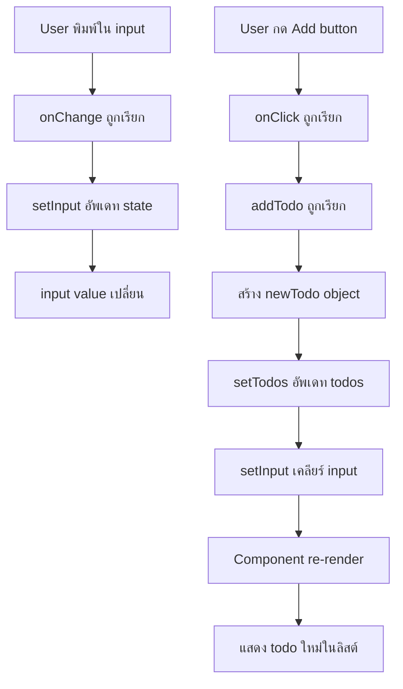

# React Fundamentals Guide 🚀

## บทนำ
เอกสารนี้จะพาคุณไปเรียนรู้พื้นฐานของ React ที่จำเป็นสำหรับการพัฒนา Next.js application อย่างเข้าใจ พร้อมตัวอย่างการทำ Todo List แบบง่ายๆ

## 📋 สารบัญ
1. [การตั้งค่าเริ่มต้น](#การตั้งค่าเริ่มต้น)
2. [JSX คืออะไร](#jsx-คืออะไร)
3. [Components และ Props](#components-และ-props)
4. [React State](#react-state)
5. [การจัดการ Events](#การจัดการ-events)
6. [Lists และ Keys](#lists-และ-keys)
7. [การสร้าง Todo List](#การสร้าง-todo-list)

---

## การตั้งค่าเริ่มต้น

### เริ่มต้นโปรเจค
```bash
pnpm dev
```

### โครงสร้างไฟล์พื้นฐาน
```
app/
├── page.tsx        # หน้าหลัก (/)
├── layout.tsx      # Layout ทั่วทั้งแอป
└── globals.css     # CSS ส่วนกลาง
```

### ไฟล์ page.tsx เบื้องต้น
```tsx
export default function HomePage() {
    return <div>Hello World</div>
}
```

> 💡 **สิ่งสำคัญ**: ใน Next.js 13+ ทุก component จะเป็น Server Component โดยค่าเริ่มต้น

---

## JSX คืออะไร

JSX (JavaScript XML) คือ syntax extension ที่ทำให้เราเขียน HTML-like syntax ใน JavaScript ได้

### กฎสำคัญของ JSX

#### 1. ต้องมี Root Element เสมอ
❌ **ผิด:**
```tsx
function MyComponent() {
    return (
        <div>Hello</div>
        <div>World</div>  // Error: หลาย root elements
    )
}
```

✅ **ถูกต้อง:**
```tsx
function MyComponent() {
    return (
        <div>
            <div>Hello</div>
            <div>World</div>
        </div>
    )
}
```

#### 2. ใช้ Fragment เพื่อหลีกเลี่ยง wrapper ที่ไม่จำเป็น
```tsx
import { Fragment } from 'react'

// วิธีที่ 1: ใช้ Fragment
function MyComponent() {
    return (
        <Fragment>
            <div>Hello</div>
            <div>World</div>
        </Fragment>
    )
}

// วิธีที่ 2: ใช้ shorthand syntax
function MyComponent() {
    return (
        <>
            <div>Hello</div>
            <div>World</div>
        </>
    )
}
```

#### 3. HTML Attributes ต้องเป็น camelCase
| HTML | JSX |
|------|-----|
| `class` | `className` |
| `onclick` | `onClick` |
| `onchange` | `onChange` |
| `for` | `htmlFor` |

```tsx
// ❌ ผิด
<div class="container" onclick="handleClick">

// ✅ ถูกต้อง  
<div className="container" onClick={handleClick}>
```

---

## Components และ Props

### การสร้าง Component

```tsx
// Component ต้องขึ้นต้นด้วยตัวใหญ่
function Header() {
    return (
        <header>
            <button>Product</button>
            <button>Article</button>
        </header>
    )
}

function Footer() {
    return <footer>Footer</footer>
}

// ใช้งาน Components
function HomePage() {
    return (
        <>
            <Header />
            <main>
                <h1>Hello World</h1>
            </main>
            <Footer />
        </>
    )
}
```

### Props และ Children

```tsx
// กำหนด type สำหรับ props
interface ContentProps {
    children: React.ReactNode
}

function Content({ children }: ContentProps) {
    return (
        <article className="p-4 border border-red-500 rounded mx-4">
            {children}
        </article>
    )
}

// การใช้งาน
function HomePage() {
    return (
        <Content>
            <div>Hello World</div>
            <div>Hello World</div>
            <div>Hello World</div>
        </Content>
    )
}
```

> 📝 **หมายเหตุ**: `{children}` คือการแสดงผลสิ่งที่อยู่ระหว่าง opening และ closing tag

---

## React State

### การใช้งาน useState

เมื่อต้องการข้อมูลที่เปลี่ยนแปลงได้ เราต้องใช้ **State**

```tsx
'use client' // จำเป็นสำหรับ Client Components

import { useState } from 'react'

interface Todo {
    id: number
    text: string
}

function TodoApp() {
    // useState คืน [ค่าปัจจุบัน, ฟังก์ชันเปลี่ยนค่า]
    const [todos, setTodos] = useState<Todo[]>([
        { id: 1, text: "Todo item 1" },
        { id: 2, text: "Todo item 2" }
    ])
    
    const [input, setInput] = useState("")

    return (
        // JSX content
    )
}
```

### Server vs Client Components

| Server Component | Client Component |
|-----------------|------------------|
| รันบน server | รันบน browser |
| ไม่สามารถใช้ useState, useEffect | ใช้ได้ทุก React hooks |
| ค่าเริ่มต้นใน Next.js 13+ | ต้องใส่ `'use client'` |
| ดีสำหรับ static content | ดีสำหรับ interactive UI |

---

## การจัดการ Events

### Input Handling

```tsx
function TodoApp() {
    const [input, setInput] = useState("")

    const handleInputChange = (event: React.ChangeEvent<HTMLInputElement>) => {
        setInput(event.target.value)
    }

    return (
        <input
            type="text"
            value={input}           // controlled component
            onChange={handleInputChange}
        />
    )
}
```

### Button Click Handling

```tsx
function TodoApp() {
    const [todos, setTodos] = useState<Todo[]>([])
    const [input, setInput] = useState("")

    const addTodo = () => {
        // สร้าง todo ใหม่
        const newTodo: Todo = {
            id: +new Date(), // ใช้ timestamp เป็น ID
            text: input
        }
        
        // อัพเดท todos (เพิ่มที่ด้านบน)
        setTodos([newTodo, ...todos])
        
        // เคลียร์ input
        setInput("")
    }

    return (
        <>
            <input
                type="text"
                value={input}
                onChange={(e) => setInput(e.target.value)}
            />
            <button onClick={addTodo}>Add</button>
        </>
    )
}
```

---

## Lists และ Keys

### ทำไมต้องใช้ Keys?

React ใช้ **Virtual DOM** เพื่อเปรียบเทียบการเปลี่ยนแปลงและอัพเดทเฉพาะส่วนที่จำเป็น

```
ปัญหาเมื่อไม่มี Keys:

เดิม: [A, B, C]
ใหม่: [D, A, B, C]

❌ React เปรียบเทียบตามตำแหน่ง:
ตำแหน่ง 0: A → D (ต่างกัน → สร้างใหม่)
ตำแหน่ง 1: B → A (ต่างกัน → สร้างใหม่)  
ตำแหน่ง 2: C → B (ต่างกัน → สร้างใหม่)
ตำแหน่ง 3: ไม่มี → C (ใหม่ → สร้าง)

ผลลัพธ์: สร้างใหม่ทั้งหมด! 😱
```

```
✅ เมื่อมี Keys:

เดิม: [A(key:a), B(key:b), C(key:c)]
ใหม่: [D(key:d), A(key:a), B(key:b), C(key:c)]

React เปรียบเทียบตาม key:
- key:a ยังอยู่ → ไม่เปลี่ยน
- key:b ยังอยู่ → ไม่เปลี่ยน  
- key:c ยังอยู่ → ไม่เปลี่ยน
- key:d ใหม่ → สร้างเฉพาะตัวนี้

ผลลัพธ์: สร้างเฉพาะ D! 🎉
```

### การใช้ Keys อย่างถูกต้อง

```tsx
// ❌ อย่าใช้ index เป็น key
todos.map((todo, index) => (
    <li key={index}>{todo.text}</li>
))

// ✅ ใช้ unique และ stable value
todos.map((todo) => (
    <li key={todo.id}>{todo.text}</li>
))
```

> ⚠️ **คำเตือน**: ใช้ index เป็น key เฉพาะเมื่อ list ไม่เปลี่ยนลำดับ และไม่มีการเพิ่ม/ลบ

---

## การสร้าง Todo List

### โค้ดสมบูรณ์

```tsx
'use client'

import { useState } from 'react'

interface Todo {
    id: number
    text: string
}

export default function TodoApp() {
    const [todos, setTodos] = useState<Todo[]>([
        { id: 1, text: "text 1" },
        { id: 2, text: "text 2" }
    ])
    const [input, setInput] = useState("")

    const addTodo = () => {
        if (input.trim() === "") return // ป้องกันการเพิ่ม empty todo
        
        const newTodo: Todo = {
            id: +new Date(),
            text: input
        }
        
        setTodos([newTodo, ...todos]) // เพิ่มด้านบน
        setInput("") // เคลียร์ input
    }

    return (
        <>
            <input
                type="text"
                value={input}
                onChange={(e) => setInput(e.target.value)}
                placeholder="Enter todo..."
            />
            <button onClick={addTodo}>Add</button>
            
            <ul>
                {todos.map((todo) => (
                    <li key={todo.id}>{todo.text}</li>
                ))}
            </ul>
        </>
    )
}
```

### Flow การทำงาน



## 🎯 สรุปสำคัญ

### 1. JSX Rules
- ต้องมี root element
- ใช้ Fragment หรือ `<>` เพื่อหลีกเลี่ยง wrapper ไม่จำเป็น
- attributes เป็น camelCase

### 2. Components
- ขึ้นต้นด้วยตัวใหญ่
- รับ props ผ่าน parameter
- `children` คือสิ่งที่อยู่ระหว่าง opening/closing tag

### 3. State Management
- ใช้ `useState` สำหรับข้อมูลที่เปลี่ยนแปลงได้
- ต้องมี `'use client'` เมื่อใช้ hooks
- การเปลี่ยน state จะทำให้ component re-render

### 4. Event Handling
- ใช้ camelCase (onClick, onChange)
- Controlled components: input value มาจาก state

### 5. Lists และ Performance
- ใส่ `key` ทุกครั้งเมื่อ render lists
- ใช้ unique และ stable value เป็น key
- หลีกเลี่ยงการใช้ index เป็น key

### 6. Best Practices
- แยก logic ออกเป็นฟังก์ชันย่อย
- ตั้งชื่อ state และ setter ให้สื่อความหมาย
- ใช้ TypeScript interfaces สำหรับ type safety

---

> 🚀 **Next Steps**: ลองปรับปรุง Todo List โดยเพิ่มฟีเจอร์ลบ todo, แก้ไข todo, หรือ filter todos ดู!
