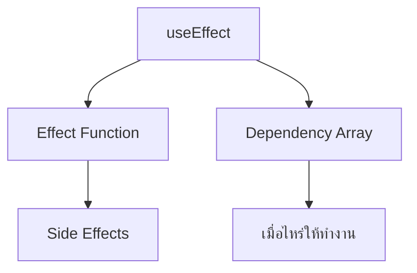

# useEffect Hook - ฟังก์ชันสำคัญสำหรับจัดการ Life Cycle ใน React

## 📋 สารบัญ
- [ความรู้เบื้องต้น](#ความรู้เบื้องต้น)
- [การตั้งค่าเบื้องต้น](#การตั้งค่าเบื้องต้น)
- [useEffect คืออะไร](#useeffect-คืออะไร)
- [Life Cycle ของ Component](#life-cycle-ของ-component)
- [Dependency List](#dependency-list)
- [Clean up Function](#clean-up-function)
- [ตัวอย่างการใช้งานจริง](#ตัวอย่างการใช้งานจริง)
- [ข้อควรระวัง](#ข้อควรระวัง)

---

## ความรู้เบื้องต้น

### useEffect คืออะไร?
`useEffect` เป็น React Hook ที่ใช้จัดการ **Side Effects** ในฟังก์ชัน Component โดยมีหน้าที่หลักในการ:
- จัดการ Component Life Cycle
- ทำงานเฉพาะฝั่ง Client (Browser) เท่านั้น
- ไม่ทำงานฝั่ง Server

### 🎯 ใช้งานเมื่อไหร่?
- เรียก API เพื่อดึงข้อมูล
- ตั้งค่า Event Listeners
- เชื่อมต่อ WebSocket
- จัดการ Timer/Interval
- เคลียร์ข้อมูลก่อน Component หายไป

---

## การตั้งค่าเบื้องต้น

### 1. เปิดใช้งาน Client Component
```tsx
"use client"  // ⚠️ จำเป็นต้องมี เพราะ useEffect ทำงานฝั่ง Client เท่านั้น

import React, { useEffect, useState } from 'react'

export default function HomePage() {
    // Component code ที่นี่
}
```

### 2. Import useEffect
```tsx
import { useEffect } from 'react'
```

---

## useEffect คืออะไร

### โครงสร้างพื้นฐาน
```tsx
useEffect(() => {
    // ฟังก์ชันที่ต้องการให้ทำงาน
    console.log('Hello from useEffect!')
}, []) // Dependency Array
```

### 📊 รูปแบบการใช้งาน



---

## Life Cycle ของ Component

React Component มี 3 สถานะหลัก:

### 1. 🟢 **Mounting** - เกิดขึ้นบนหน้าจอ
```tsx
useEffect(() => {
    console.log('Component ปรากฏบนหน้าจอแล้ว!')
    // ทำงานครั้งแรกเมื่อ component โหลดเสร็จ
}, []) // Array ว่าง = ทำงานครั้งเดียวตอน mount
```

### 2. 🔄 **Updating** - มีการอัปเดต
```tsx
const [count, setCount] = useState(0)

useEffect(() => {
    console.log('Count ถูกอัปเดตเป็น:', count)
    // ทำงานทุกครั้งที่ count เปลี่ยน
}, [count]) // เฝ้าดู count
```

### 3. 🔴 **Unmounting** - ก่อนหายไปจากหน้าจอ
```tsx
useEffect(() => {
    console.log('Component ถูกสร้างขึ้น')
    
    // Clean up function
    return () => {
        console.log('Component กำลังจะหายไป - ทำความสะอาด!')
    }
}, [])
```

---

## Dependency List

### 🎛️ รูปแบบต่างๆ ของ Dependency Array

| รูปแบบ | พฤติกรรม | ตัวอย่าง |
|--------|----------|----------|
| `[]` | ทำงานครั้งเดียวตอน mount | `useEffect(() => {}, [])` |
| `[state]` | ทำงานเมื่อ state เปลี่ยน | `useEffect(() => {}, [count])` |
| `[state1, state2]` | ทำงานเมื่อ state ใดๆ เปลี่ยน | `useEffect(() => {}, [count, name])` |
| ไม่ใส่ | ทำงานทุกครั้งที่ re-render | `useEffect(() => {})` |

### ตัวอย่างการใช้งาน
```tsx
function ExampleComponent() {
    const [count1, setCount1] = useState(0)
    const [count2, setCount2] = useState(0)

    // ทำงานครั้งเดียวตอน mount
    useEffect(() => {
        console.log('Component mounted!')
    }, [])

    // ทำงานเมื่อ count1 เปลี่ยน
    useEffect(() => {
        console.log('Count1 changed:', count1)
    }, [count1])

    // ทำงานเมื่อ count1 หรือ count2 เปลี่ยน
    useEffect(() => {
        console.log('Either count changed')
    }, [count1, count2])

    return (
        <div>
            <button onClick={() => setCount1(count1 + 1)}>
                Count1: {count1}
            </button>
            <button onClick={() => setCount2(count2 + 1)}>
                Count2: {count2}
            </button>
        </div>
    )
}
```

---

## Clean up Function

### 🧹 ทำไมต้องทำความสะอาด?

Clean up Function ป้องกัน **Memory Leaks** และ **ปัญหาประสิทธิภาพ**

### ตัวอย่าง: Chat Room Connection
```tsx
function ChatRoom({ roomId }) {
    useEffect(() => {
        // เชื่อมต่อห้องแชท
        console.log(`🔗 Connecting to room ${roomId}`)
        const connection = connectToRoom(roomId)
        
        // Clean up: ปิดการเชื่อมต่อเก่าก่อนเชื่อมต่อใหม่
        return () => {
            console.log(`❌ Disconnecting from room ${roomId}`)
            connection.close()
        }
    }, [roomId]) // เมื่อ roomId เปลี่ยน

    return <div>Connected to room {roomId}</div>
}
```

### 📈 Timeline การทำงาน
```
1. roomId = 1 → เชื่อมต่อห้อง 1
2. roomId = 2 → ปิดการเชื่อมต่อห้อง 1 (clean up) → เชื่อมต่อห้อง 2
3. Component unmount → ปิดการเชื่อมต่อห้อง 2 (clean up)
```

---

## ตัวอย่างการใช้งานจริง

### 🌐 ดึงข้อมูลจาก API
```tsx
function UserProfile({ userId }) {
    const [user, setUser] = useState(null)
    const [loading, setLoading] = useState(true)

    useEffect(() => {
        let cancelled = false // ป้องกัน race condition

        async function fetchUser() {
            try {
                setLoading(true)
                const response = await fetch(`/api/users/${userId}`)
                const userData = await response.json()
                
                if (!cancelled) {
                    setUser(userData)
                }
            } catch (error) {
                if (!cancelled) {
                    console.error('Error fetching user:', error)
                }
            } finally {
                if (!cancelled) {
                    setLoading(false)
                }
            }
        }

        fetchUser()

        // Clean up: ยกเลิกการอัปเดต state หาก component unmount
        return () => {
            cancelled = true
        }
    }, [userId]) // ดึงข้อมูลใหม่เมื่อ userId เปลี่ยน

    if (loading) return <div>Loading...</div>
    if (!user) return <div>User not found</div>
    
    return <div>Hello, {user.name}!</div>
}
```

### ⏰ Timer และ Event Listeners
```tsx
function Timer() {
    const [seconds, setSeconds] = useState(0)

    useEffect(() => {
        // ตั้งค่า interval
        const interval = setInterval(() => {
            setSeconds(prev => prev + 1)
        }, 1000)

        // Clean up: เคลียร์ interval
        return () => {
            clearInterval(interval)
        }
    }, [])

    useEffect(() => {
        // เพิ่ม event listener
        function handleKeyPress(event) {
            if (event.key === 'r') {
                setSeconds(0) // รีเซ็ตเมื่อกด 'r'
            }
        }

        window.addEventListener('keypress', handleKeyPress)

        // Clean up: ลบ event listener
        return () => {
            window.removeEventListener('keypress', handleKeyPress)
        }
    }, [])

    return (
        <div>
            <h2>Timer: {seconds} seconds</h2>
            <p>Press 'r' to reset</p>
        </div>
    )
}
```

---

## ข้อควรระวัง

### ⚠️ 1. Strict Mode ใน Development
```tsx
// ใน next.config.mjs
const nextConfig = {
    reactStrictMode: true // ❌ อย่าปิด! ช่วยตรวจจับ bugs
}
```

**Strict Mode ทำให้ useEffect ทำงาน 2 ครั้งใน development** เพื่อตรวจจับปัญหา แต่ใน production จะทำงานครั้งเดียวตามปกติ

### ⚠️ 2. Object ใน Dependency Array
```tsx
// ❌ ไม่ดี - object ใหม่ทุกครั้ง
const [user, setUser] = useState({ name: 'John', age: 30 })

useEffect(() => {
    console.log('User changed')
}, [user]) // จะทำงานทุกครั้งแม้ค่าไม่เปลี่ยน

// ✅ ดีกว่า - เฝ้าดูค่าเฉพาะ
useEffect(() => {
    console.log('User name changed')
}, [user.name]) // ทำงานเมื่อ name เปลี่ยนจริงๆ
```

### ⚠️ 3. การใช้ setState ใน useEffect
```tsx
// ❌ ไม่ดี - อาจเกิด infinite loop
const [count, setCount] = useState(0)

useEffect(() => {
    setCount(count + 1) // อันตราย!
}, [count])

// ✅ ดีกว่า - ใช้ function form
useEffect(() => {
    setCount(prev => prev + 1)
}, []) // ทำครั้งเดียว
```

---

## 🎉 สรุป

### useEffect เป็นเครื่องมือสำคัญสำหรับ:
- ✅ จัดการ Side Effects
- ✅ ติดต่อกับ External APIs
- ✅ จัดการ Component Lifecycle
- ✅ ทำความสะอาดทรัพยากร

### Remember:
1. **ใช้ "use client"** เมื่อใช้ useEffect
2. **ใส่ Dependency Array** ให้ถูกต้อง
3. **ใช้ Clean up Function** เมื่อจำเป็น
4. **ระวัง Object** ใน Dependencies
5. **อย่าปิด Strict Mode** ใน development

Happy coding! 🚀