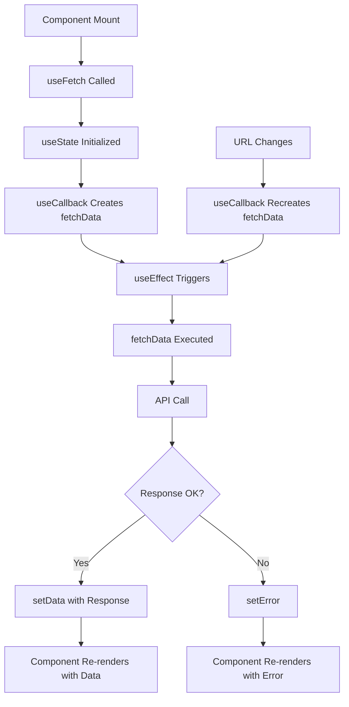

# Custom Hooks ใน Next.js: การจัดการ State และ API Calls อย่างมีประสิทธิภาพ

## 📖 บทนำ

Custom Hooks เป็นหนึ่งในฟีเจอร์ที่ทรงพลังของ React ที่ช่วยให้เราสามารถแยก logic ที่ซับซ้อนออกมาเป็นฟังก์ชันที่ใช้ซ้ำได้ ในบทเรียนนี้เราจะเรียนรู้การสร้าง Custom Hook สำหรับการดึงข้อมูลจาก API และจัดการ state ใน Next.js

## 🎯 สิ่งที่จะได้เรียนรู้

- การใช้งาน `useState` และ `useEffect` ร่วมกัน
- การสร้าง Custom Hook สำหรับดึงข้อมูล
- ความแตกต่างระหว่าง Server Component และ Client Component
- การใช้งาน `useCallback` เพื่อ optimize performance
- Best practices ในการเขียน React Hooks

## 🛠️ การเตรียมตัว

### 1. ติดตั้ง JSON Server

เราจะใช้ JSON Server เป็น mock API สำหรับการทดสอบ

```bash
pnpm add -D json-server
```

### 2. สร้างไฟล์ Database

สร้างไฟล์ `db.json` ใน root directory ของโปรเจค:

```json
{
    "articles": [
        { "id": 1, "title": "Title CH 1" },
        { "id": 2, "title": "Title CH 2" },
        { "id": 3, "title": "Title CH 3" }
    ]
}
```

### 3. เพิ่ม Script ใน package.json

```json
{
    "scripts": {
        "api:dev": "json-server --watch db.json --port 5151"
    }
}
```

### 4. รัน JSON Server

```bash
pnpm api:dev
```

API จะทำงานที่ `http://localhost:5151/articles`

## 🔄 Server Component vs Client Component

### Server Component Approach (ไม่แนะนำสำหรับ dynamic data)

```tsx
// ❌ วิธีนี้ใช้ได้แต่ไม่เหมาะสำหรับ real-time data
interface Article {
    id: number;
    title: string;
}

export default async function ArticlePage() {
    const response = await fetch('http://localhost:5151/articles');
    const articles = await response.json() as Promise<Article[]>;
    
    return (
        <ul>
            {articles.map(article => (
                <li key={article.id}>{article.title}</li>
            ))}
        </ul>
    );
}
```

**ข้อดี:**
- ⚡ Fast initial load
- 🔒 Security (API calls ทำงานบน server)
- 📦 Smaller bundle size

**ข้อเสีย:**
- 🚫 ไม่สามารถมีการโต้ตอบแบบ dynamic
- 🚫 ไม่สามารถใช้ useState, useEffect

## 🎨 Client Component Approach

### วิธีพื้นฐาน (ก่อนใช้ Custom Hook)

```tsx
'use client';

import { useState, useEffect } from 'react';

interface Article {
    id: number;
    title: string;
}

export default function ArticlePage() {
    const [articles, setArticles] = useState<Article[]>([]);

    const fetchArticles = async () => {
        const response = await fetch('http://localhost:5151/articles');
        const data = await response.json();
        setArticles(data);
    };

    useEffect(() => {
        fetchArticles();
        // eslint-disable-next-line react-hooks/exhaustive-deps
    }, []);

    return (
        <ul>
            {articles.map(article => (
                <li key={article.id}>{article.title}</li>
            ))}
        </ul>
    );
}
```

## 🎣 การสร้าง Custom Hook

### ปัญหาที่พบ

เมื่อเรามีหลายๆ component ที่ต้องดึงข้อมูลจาก API วิธีข้างต้นจะทำให้เกิด code duplication:

```tsx
// UserPage.tsx - โค้ดซ้ำ!
const [users, setUsers] = useState([]);
const fetchUsers = async () => { /* ... */ };
useEffect(() => { fetchUsers(); }, []);

// CommentPage.tsx - โค้ดซ้ำอีก!
const [comments, setComments] = useState([]);
const fetchComments = async () => { /* ... */ };
useEffect(() => { fetchComments(); }, []);
```

### 🚀 Solution: Custom Hook

สร้าง `useFetch` hook ที่ใช้ซ้ำได้:

```tsx
import { useState, useEffect, useCallback } from 'react';

function useFetch<T>(url: string) {
    const [data, setData] = useState<T[]>([]);
    const [loading, setLoading] = useState(true);
    const [error, setError] = useState<string | null>(null);

    const fetchData = useCallback(async () => {
        try {
            setLoading(true);
            setError(null);
            
            const response = await fetch(url);
            if (!response.ok) {
                throw new Error(`HTTP error! status: ${response.status}`);
            }
            
            const result = await response.json();
            setData(result);
        } catch (err) {
            setError(err instanceof Error ? err.message : 'An error occurred');
        } finally {
            setLoading(false);
        }
    }, [url]);

    useEffect(() => {
        fetchData();
    }, [fetchData]);

    return { data, loading, error, refetch: fetchData };
}
```

### 📝 การใช้งาน Custom Hook

```tsx
'use client';

interface Article {
    id: number;
    title: string;
}

export default function ArticlePage() {
    const { data: articles, loading, error } = useFetch<Article>('http://localhost:5151/articles');

    if (loading) return <div>Loading...</div>;
    if (error) return <div>Error: {error}</div>;

    return (
        <ul>
            {articles.map(article => (
                <li key={article.id}>{article.title}</li>
            ))}
        </ul>
    );
}
```

## 🎯 ทำไมต้องใช้ useCallback?

### ปัญหาที่เกิดขึ้น

```tsx
// ❌ ปัญหา: Function ถูกสร้างใหม่ทุกครั้งที่ component re-render
function useFetch<T>(url: string) {
    const [data, setData] = useState<T[]>([]);

    const fetchData = async () => {
        // Function นี้จะถูกสร้างใหม่ทุกครั้ง
        const response = await fetch(url);
        const result = await response.json();
        setData(result);
    };

    useEffect(() => {
        fetchData(); // จะ fetch ซ้ำทุกครั้งที่ component re-render!
    }, [fetchData]); // fetchData เปลี่ยนทุกครั้ง

    return { data };
}
```

### 🔧 แก้ไขด้วย useCallback

```tsx
// ✅ แก้ไข: ใช้ useCallback เพื่อ memoize function
function useFetch<T>(url: string) {
    const [data, setData] = useState<T[]>([]);

    const fetchData = useCallback(async () => {
        const response = await fetch(url);
        const result = await response.json();
        setData(result);
    }, [url]); // จะสร้างใหม่เฉพาะตอน url เปลี่ยน

    useEffect(() => {
        fetchData();
    }, [fetchData]); // จะ run เฉพาะตอน fetchData เปลี่ยน

    return { data };
}
```

## 📊 Flow Chart ของ Custom Hook



## 🏗️ Custom Hook แบบ Advanced

```tsx
import { useState, useEffect, useCallback, useRef } from 'react';

interface UseFetchOptions {
    immediate?: boolean;
    onSuccess?: (data: any) => void;
    onError?: (error: string) => void;
}

function useFetch<T>(url: string, options: UseFetchOptions = {}) {
    const [data, setData] = useState<T[]>([]);
    const [loading, setLoading] = useState(false);
    const [error, setError] = useState<string | null>(null);
    const abortControllerRef = useRef<AbortController | null>(null);

    const { immediate = true, onSuccess, onError } = options;

    const fetchData = useCallback(async () => {
        try {
            // Cancel previous request
            if (abortControllerRef.current) {
                abortControllerRef.current.abort();
            }

            abortControllerRef.current = new AbortController();
            
            setLoading(true);
            setError(null);
            
            const response = await fetch(url, {
                signal: abortControllerRef.current.signal
            });
            
            if (!response.ok) {
                throw new Error(`HTTP error! status: ${response.status}`);
            }
            
            const result = await response.json();
            setData(result);
            onSuccess?.(result);
        } catch (err) {
            if (err instanceof Error && err.name === 'AbortError') {
                return; // Request was cancelled
            }
            
            const errorMessage = err instanceof Error ? err.message : 'An error occurred';
            setError(errorMessage);
            onError?.(errorMessage);
        } finally {
            setLoading(false);
        }
    }, [url, onSuccess, onError]);

    useEffect(() => {
        if (immediate) {
            fetchData();
        }

        return () => {
            // Cleanup on unmount
            if (abortControllerRef.current) {
                abortControllerRef.current.abort();
            }
        };
    }, [fetchData, immediate]);

    const refetch = useCallback(() => {
        fetchData();
    }, [fetchData]);

    return { 
        data, 
        loading, 
        error, 
        refetch,
        isIdle: !loading && !error && data.length === 0
    };
}
```

## 🎨 การใช้งาน Advanced Hook

```tsx
'use client';

import { useFetch } from '@/hooks/useFetch';

interface Article {
    id: number;
    title: string;
}

export default function ArticlePage() {
    const { 
        data: articles, 
        loading, 
        error, 
        refetch,
        isIdle 
    } = useFetch<Article>('http://localhost:5151/articles', {
        onSuccess: (data) => {
            console.log('✅ Articles loaded:', data.length);
        },
        onError: (error) => {
            console.error('❌ Failed to load articles:', error);
        }
    });

    return (
        <div>
            <div className="flex justify-between items-center mb-4">
                <h1>Articles</h1>
                <button 
                    onClick={refetch}
                    disabled={loading}
                    className="px-4 py-2 bg-blue-500 text-white rounded disabled:opacity-50"
                >
                    {loading ? 'Loading...' : 'Refresh'}
                </button>
            </div>

            {isIdle && <div>No articles found</div>}
            {error && <div className="text-red-500">Error: {error}</div>}
            
            <ul className="space-y-2">
                {articles.map(article => (
                    <li key={article.id} className="p-2 border rounded">
                        {article.title}
                    </li>
                ))}
            </ul>
        </div>
    );
}
```

## 📋 React Hooks Rules

### ✅ ถูกต้อง

```tsx
function MyComponent() {
    // ✅ Top level - ถูกต้อง
    const [state, setState] = useState(0);
    const { data } = useFetch('/api/data');
    
    useEffect(() => {
        // Some effect
    }, []);

    return <div>{state}</div>;
}
```

### ❌ ผิด

```tsx
function MyComponent() {
    const [condition, setCondition] = useState(true);
    
    // ❌ ใน condition - ผิด!
    if (condition) {
        const [state, setState] = useState(0);
    }
    
    // ❌ ใน loop - ผิด!
    for (let i = 0; i < 3; i++) {
        useEffect(() => {}, []);
    }
    
    // ❌ ใน function - ผิด!
    const handleClick = () => {
        const [clickState, setClickState] = useState(0);
    };

    return <div>Content</div>;
}
```

## 🏆 Best Practices

### 1. 📁 การจัดระเบียบไฟล์

```
src/
├── hooks/
│   ├── useFetch.ts
│   ├── useLocalStorage.ts
│   └── index.ts
├── components/
└── pages/
```

### 2. 🔧 TypeScript Support

```tsx
// hooks/useFetch.ts
export function useFetch<T = any>(url: string): UseFetchReturn<T> {
    // Implementation
}

interface UseFetchReturn<T> {
    data: T[];
    loading: boolean;
    error: string | null;
    refetch: () => void;
}
```

### 3. 🧪 Testing Custom Hooks

```tsx
import { renderHook, waitFor } from '@testing-library/react';
import { useFetch } from './useFetch';

describe('useFetch', () => {
    it('should fetch data successfully', async () => {
        const { result } = renderHook(() => 
            useFetch('http://localhost:5151/articles')
        );

        expect(result.current.loading).toBe(true);

        await waitFor(() => {
            expect(result.current.loading).toBe(false);
            expect(result.current.data).toHaveLength(3);
        });
    });
});
```

## 🎯 สรุป

Custom Hooks เป็นเครื่องมือที่ทรงพลังในการ:
- ♻️ **Reuse Logic**: แชร์ logic ระหว่าง components
- 🧹 **Clean Code**: ทำให้โค้ดอ่านง่ายและจัดการง่าย
- 🔧 **Maintainability**: แก้ไขได้ในที่เดียว apply ทุก component
- 🧪 **Testability**: ทดสอบ logic แยกจาก UI ได้

การเข้าใจและใช้ Custom Hooks อย่างถูกต้องจะช่วยให้การพัฒนา React applications มีประสิทธิภาพมากขึ้น!

## 🔗 Resources เพิ่มเติม

- [React Hooks Documentation](https://react.dev/reference/react)
- [Next.js Client Components](https://nextjs.org/docs/app/building-your-application/rendering/client-components)
- [Custom Hooks Best Practices](https://react.dev/learn/reusing-logic-with-custom-hooks)
