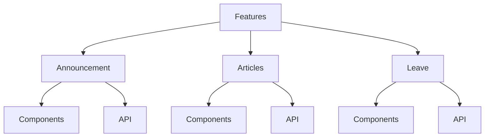
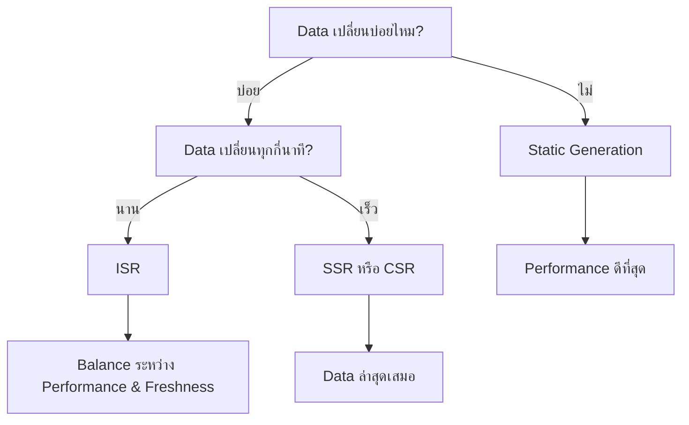

# 17. Static and Dynamic Rendering in Next.js

## 🎯 Overview
ในบทนี้เราจะศึกษาการทำงานของ Static และ Dynamic Rendering ใน Next.js โดยจะสร้างแอปพลิเคชันที่มี 3 ส่วนหลัก และใช้เทคนิคการ render ที่แตกต่างกันตามลักษณะการใช้งาน

## 📁 Project Structure
เราจะแบ่งแอปพลิเคชันออกเป็น 3 ส่วนหลัก:

```
app/
├── announcement/     # ประกาศ (Server-side Rendering)
├── articles/        # บทความ (Static Generation + ISR)
└── leave/           # การลา (Client-side Rendering)

features/
├── announcement/
│   ├── components/
│   └── api.ts
├── articles/
│   ├── components/
│   └── api.ts
└── leave/
    ├── components/
    └── api.ts
```

## 🏗️ Architecture Principles

### Feature-based Organization


**หลักการสำคัญ:**
- แยกแต่ละ feature ตาม domain
- Component แยกออกจาก Page เพื่อ reusability
- API logic แยกออกจาก Component เพื่อความยืดหยุ่น

## 🔧 Implementation Details

### 1. Announcement (Server-side Rendering)

#### Page Component
```typescript
// app/announcement/page.tsx
import { AnnouncementList } from '@/features/announcement/components/AnnouncementList'
import { findAllAnnouncements } from '@/features/announcement/api'

// บังคับให้ทำ Dynamic Rendering
export const dynamic = 'force-dynamic'

export default async function AnnouncementPage() {
  const announcements = await findAllAnnouncements()
  
  return <AnnouncementList announcements={announcements} />
}
```

#### API Layer
```typescript
// features/announcement/api.ts
import { faker } from '@faker-js/faker'

export async function findAllAnnouncements() {
  // จำลองการเชื่อมต่อฐานข้อมูล
  const length = faker.number.int({ min: 3, max: 10 })
  
  const announcements = Array.from({ length }).map(() => ({
    id: faker.number.int(),
    title: faker.lorem.sentence()
  }))
  
  // คืนค่าเป็น Promise เพื่อจำลอง async operation
  return Promise.resolve(announcements)
}
```

#### Component Layer
```typescript
// features/announcement/components/AnnouncementList.tsx
import { findAllAnnouncements } from '../api'

// ใช้ TypeScript utility type เพื่อ sync กับ API
type AnnouncementListProps = {
  announcements: Awaited<ReturnType<typeof findAllAnnouncements>>
}

export function AnnouncementList({ announcements }: AnnouncementListProps) {
  return (
    <ul>
      {announcements.map((announcement) => (
        <li key={announcement.id}>
          {announcement.title}
        </li>
      ))}
    </ul>
  )
}
```

### 2. Articles (Static Generation + ISR)

#### Page Component
```typescript
// app/articles/page.tsx
import { ArticleList } from '@/features/articles/components/ArticleList'
import { findAllArticles } from '@/features/articles/api'

// ISR: Revalidate ทุก 15 วินาที
export const revalidate = 15

export default async function ArticlesPage() {
  const articles = await findAllArticles()
  
  return <ArticleList articles={articles} />
}
```

## 📊 Rendering Methods Comparison

| Method | Use Case | Performance | Data Freshness | SEO |
|--------|----------|-------------|---------------|-----|
| **Static Generation** | บทความ, Documentation | ⭐⭐⭐⭐⭐ | ⭐⭐ | ⭐⭐⭐⭐⭐ |
| **ISR** | บทความที่อัปเดตบ่อย | ⭐⭐⭐⭐ | ⭐⭐⭐⭐ | ⭐⭐⭐⭐⭐ |
| **SSR** | ข้อมูลแบบ real-time | ⭐⭐⭐ | ⭐⭐⭐⭐⭐ | ⭐⭐⭐⭐⭐ |
| **CSR** | Interactive features | ⭐⭐ | ⭐⭐⭐⭐⭐ | ⭐⭐ |

## 🔍 Build Analysis

### การตรวจสอบ Build Output
```bash
npm run build
```

**สัญลักษณ์ที่ได้:**
- ○ (Static): Pre-rendered as static HTML
- λ (Lambda): Server-side rendered at runtime
- ƒ (Dynamic): Dynamic route

```
Route (app)                    Size     First Load JS
┌ ○ /                         142 B          87.2 kB
├ λ /announcement             1.37 kB        88.6 kB
├ ○ /articles (ISR: 15 Sec)   142 B          87.2 kB
└ ○ /leave                    142 B          87.2 kB
```

## 🎯 Best Practices

### 1. Component Separation
```typescript
// ❌ ไม่ดี - ผสม data fetching ใน component
function AnnouncementList() {
  const [data, setData] = useState([])
  
  useEffect(() => {
    fetch('/api/announcements').then(/* ... */)
  }, [])
  
  return /* JSX */
}

// ✅ ดี - แยก data fetching ออกมา
function AnnouncementList({ announcements }: Props) {
  return /* JSX */
}
```

### 2. Type Safety with API Sync
```typescript
// ✅ Type จะ sync กับ API เสมอ
type Data = Awaited<ReturnType<typeof findAllAnnouncements>>

// ❌ Type แยกจาก API - อาจไม่ sync
interface Announcement {
  id: number
  title: string
}
```

### 3. Special Next.js Variables
```typescript
// Control rendering behavior
export const dynamic = 'force-dynamic'        // Force SSR
export const dynamic = 'force-static'         // Force Static
export const dynamic = 'auto'                 // Auto-detect (default)

// ISR configuration
export const revalidate = 60                  // Revalidate every 60 seconds
export const revalidate = false               // Never revalidate
export const revalidate = 0                   // Always revalidate
```

## 🚀 Performance Tips

### 1. เลือก Rendering Method ที่เหมาะสม


### 2. Cache Strategy
```typescript
// สำหรับ fetch API
const data = await fetch('/api/data', {
  cache: 'no-store'        // ไม่ cache (SSR)
})

const data = await fetch('/api/data', {
  next: { revalidate: 60 } // ISR
})
```

## 🔧 Development vs Production

### Development Mode
- Component ถูกเรียกทุกครั้งที่ refresh
- เห็นข้อมูลใหม่ทุกครั้ง (เพราะใช้ faker)

### Production Mode
- Static routes ส่ง HTML เดิมทุกครั้ง
- Dynamic routes render ใหม่ทุก request
- ISR routes revalidate ตาม interval ที่กำหนด

## 📝 Example Use Cases

### Announcement (SSR)
```typescript
// เหมาะสำหรับ:
// - ข้อมูลที่เปลี่ยนบ่อย
// - ต้องการ real-time data
// - ข้อมูลที่แตกต่างกันตาม user
```

### Articles (Static + ISR)
```typescript
// เหมาะสำหรับ:
// - Content ที่ไม่เปลี่ยนบ่อย
// - SEO สำคัญ
// - ต้องการ performance ดี
```

## 🎉 Summary

การเลือกใช้ Rendering method ที่เหมาะสมจะช่วยให้แอปพลิเคชันมี:
- **Performance** ที่ดี
- **User Experience** ที่ลื่น
- **SEO** ที่เหมาะสม
- **Development Experience** ที่ดี

สิ่งสำคัญคือต้องเข้าใจลักษณะของข้อมูลและการใช้งานเพื่อเลือก method ที่เหมาะสมที่สุด!