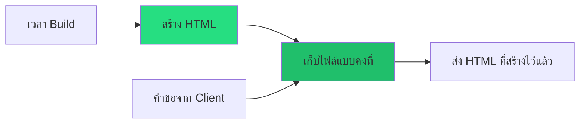
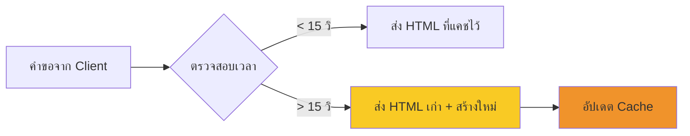
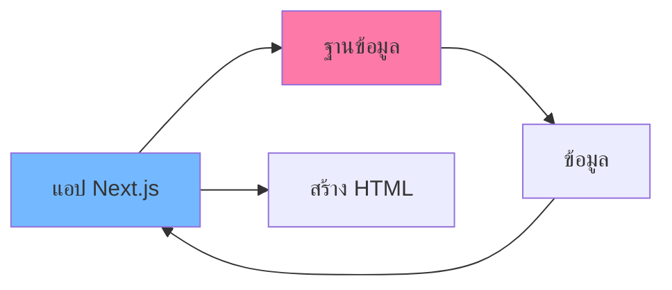
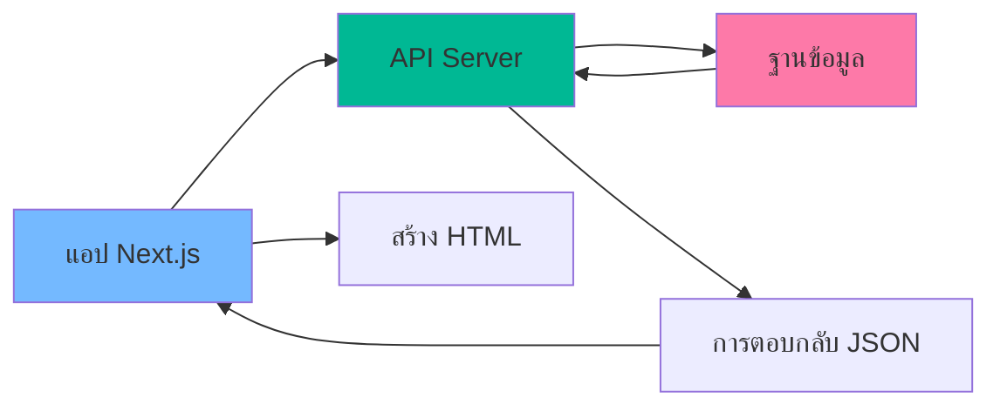
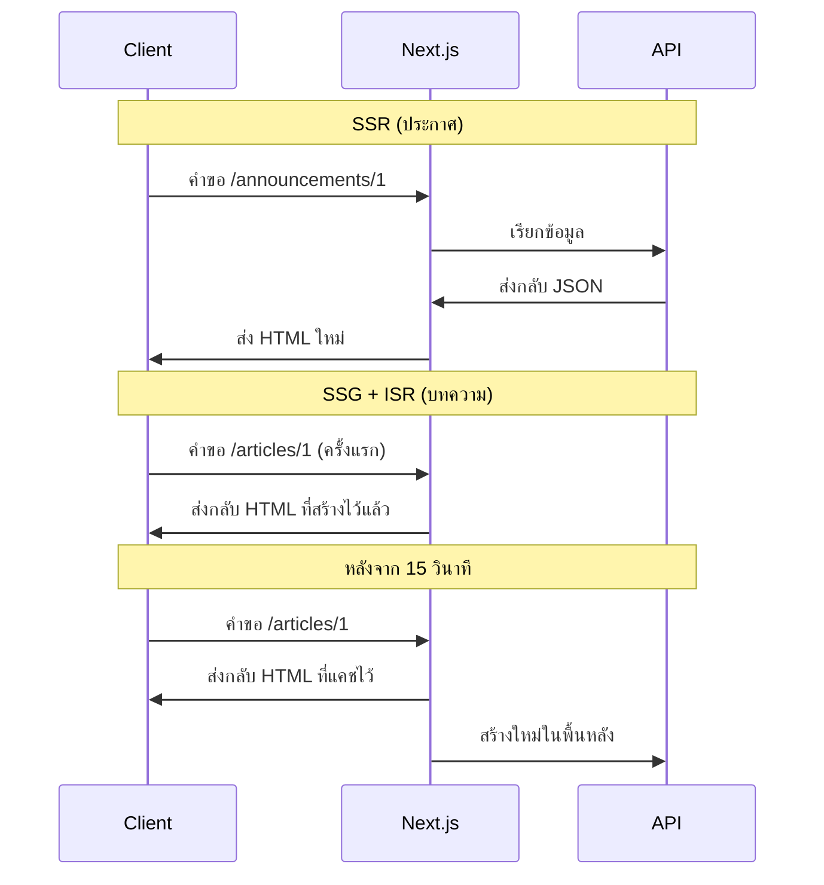
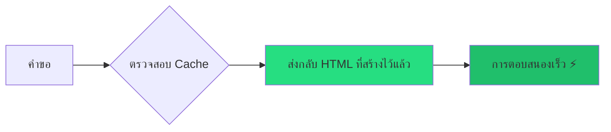
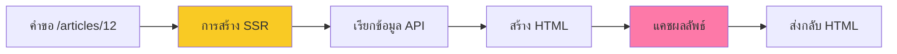
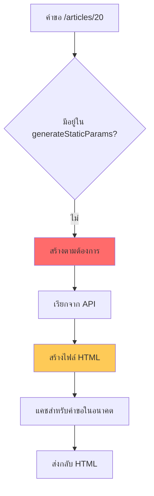

# 📚 การ Render แบบ Fetch-based ใน Next.js

## 📋 สารบัญ
- [🔄 ทบทวน: โหมดการ Render ใน Next.js](#-ทบทวน-โหมดการ-render-ใน-nextjs)
- [🌐 ภาพรวมการ Render แบบ Fetch-based](#-ภาพรวมการ-render-แบบ-fetch-based)
- [⚙️ การตั้งค่า API Server](#️-การตั้งค่า-api-server)
- [🔧 ตัวอย่างการใช้งาน](#-ตัวอย่างการใช้งาน)
- [🏗️ กระบวนการ Build และผลลัพธ์](#️-กระบวนการ-build-และผลลัพธ์)
- [⚠️ การแก้ไขปัญหา Next.js 15+](#️-การแก้ไขปัญหา-nextjs-15)
- [🎯 สิ่งสำคัญที่ได้เรียนรู้](#-สิ่งสำคัญที่ได้เรียนรู้)

---

## 🔄 ทบทวน: โหมดการ Render ใน Next.js

ก่อนที่เราจะเริ่มเรียนรู้เรื่อง Fetch-based Rendering มาทบทวนโหมดการ render ใน Next.js กันก่อน:

### 🔴 การ Render ฝั่ง Server (SSR)


**คุณสมบัติ:**
- 🔄 สร้าง HTML ทุกครั้งที่มีคำขอ
- 🚀 ได้ข้อมูลใหม่ทุกครั้ง
- ⚡ เวลาตอบสนองช้ากว่า

**การใช้งาน:**
```javascript
// ใส่ในหน้า page component
export const dynamic = 'force-dynamic'
```

### 🟢 การสร้างเว็บไซต์แบบคงที่ (SSG)


**คุณสมบัติ:**
- 🏗️ สร้าง HTML ตอน build time
- ⚡ เวลาตอบสนองเร็วมาก
- 📊 ข้อมูลไม่เปลี่ยนแปลงจนกว่าจะ build ใหม่

**การใช้งาน:**
```javascript
// ไม่ต้องใส่อะไรเพิ่ม (พฤติกรรมเริ่มต้น)
```

### 🟡 การสร้างแบบค่อยเป็นค่อยไป (ISR)


**คุณสมบัติ:**
- 🕐 สร้าง HTML ใหม่ทุก X วินาที
- 🎯 ได้ทั้งความเร็วและข้อมูลใหม่
- 🔄 คำขอแรกหลังครบเวลา = ได้ข้อมูลเก่า, คำขอถัดไป = ได้ข้อมูลใหม่

**การใช้งาน:**
```javascript
export const revalidate = 15 // สร้างใหม่ทุก 15 วินาที
```

---

## 🌐 ภาพรวมการ Render แบบ Fetch-based

### 🤔 การเชื่อมต่อฐานข้อมูล vs การเรียก API

**ก่อนหน้านี้ (การเชื่อมต่อฐานข้อมูล):**


**ตอนนี้ (การเรียก API):**


### 🎯 ความแตกต่างหลัก

| 📊 ด้าน | การเชื่อมต่อฐานข้อมูล | การเรียก API |
|-----------|-------------------|--------------|
| **การเชื่อมต่อ** | โดยตรงกับฐานข้อมูล | ผ่าน API Layer |
| **รูปแบบข้อมูล** | ข้อมูลดิบจากฐานข้อมูล | การตอบกลับ JSON |
| **ความยืดหยุ่น** | จำกัดอยู่ที่ Server | สามารถใช้ APIs ภายนอก |
| **ความสามารถในการขยาย** | ขึ้นอยู่กับฐานข้อมูล | ขึ้นอยู่กับประสิทธิภาพ API |

---

## ⚙️ การตั้งค่า API Server

### 🚀 การเริ่มต้น JSON Server

เราจะใช้ `json-server` เป็น Mock API สำหรับการทดสอบ:

```bash
# เริ่มต้น API server
npm run api:dev
```

**การตั้งค่าใน package.json:**
```json
{
  "scripts": {
  "api:dev": "json-server --watch db.json --port 5151"
  }
}
```

### 📂 API Endpoints ที่ใช้ได้

เมื่อ server ทำงานแล้ว เราจะมี endpoints ดังนี้:

```
http://localhost:5151/articles     # GET บทความทั้งหมด
http://localhost:5151/articles/1   # GET บทความตาม ID
http://localhost:5151/announcements # GET ประกาศทั้งหมด  
http://localhost:5151/announcements/1 # GET ประกาศตาม ID
```

### 📋 โครงสร้างข้อมูลตัวอย่าง

**db.json:**
```json
{
  "articles": [
  { "id": 1, "title": "บทความที่ 1" },
  { "id": 2, "title": "บทความที่ 2" },
  { "id": 3, "title": "บทความที่ 3" }
  ],
  "announcements": [
  { "id": 1, "title": "ประกาศที่ 1" },
  { "id": 2, "title": "ประกาศที่ 2" }
  ]
}
```

---

## 🔧 ตัวอย่างการใช้งาน

### 🔴 การใช้งาน SSR (ประกาศ)

#### 1. สร้าง Dynamic Route
```
📁 app/
  📁 announcements/
  📁 [id]/
    📄 page.tsx
```

#### 2. การกำหนดประเภทข้อมูล
```typescript
// types.ts
export interface Announcement {
  id: number;
  title: string;
}

// สำหรับ Next.js 14 และก่อนหน้า
export interface AnnouncementPageProps {
  params: {
  id: string; // พารามิเตอร์ URL เป็น string เสมอ
  };
}

// สำหรับ Next.js 15+
export interface AnnouncementPageProps {
  params: Promise<{
  id: string;
  }>;
}
```

#### 3. ฟังก์ชัน API
```typescript
// features/announcements/api.ts
export const findAnnouncementById = async (id: Announcement['id']): Promise<Announcement> => {
  const response = await fetch(`http://localhost:5151/announcements/${id}`, {
  cache: 'no-store' // 🔑 นี่คือสิ่งที่ทำให้เป็น SSR!
  });
  
  return response.json();
};
```

#### 4. คอมโพเนนต์หน้า (Next.js 14)
```typescript
// app/announcements/[id]/page.tsx
import { AnnouncementDetail } from '@/features/announcements/components/AnnouncementDetail';
import { findAnnouncementById } from '@/features/announcements/api';
import { AnnouncementPageProps } from '@/types';

export default async function AnnouncementPage({ params }: AnnouncementPageProps) {
  const announcement = await findAnnouncementById(+params.id); // แปลง string เป็น number
  
  return <AnnouncementDetail announcement={announcement} />;
}
```

#### 5. การใช้งานคอมโพเนนต์
```typescript
// features/announcements/components/AnnouncementDetail.tsx
interface AnnouncementDetailProps {
  announcement: Announcement;
}

export default function AnnouncementDetail({ announcement }: AnnouncementDetailProps) {
  return (
  <div>
    <h1>{announcement.title}</h1>
  </div>
  );
}
```

### 🟢 การใช้งาน SSG กับ ISR (บทความ)

#### 1. สร้างโครงสร้าง Dynamic Route
```
📁 app/
  📁 articles/
  📁 [id]/
    📄 page.tsx
```

#### 2. ฟังก์ชัน API พร้อม Revalidation
```typescript
// features/articles/api.ts
export const findArticleById = async (id: Article['id']): Promise<Article> => {
  const response = await fetch(`http://localhost:5151/articles/${id}`, {
  next: { 
    revalidate: 15 // 🔑 ตรวจสอบใหม่ทุก 15 วินาที
  }
  });
  
  return response.json();
};
```

#### 3. สร้างพารามิเตอร์แบบคงที่
```typescript
// app/articles/[id]/page.tsx
export async function generateStaticParams() {
  // 🎯 บอก Next.js ว่า ID ไหนที่ต้องสร้างล่วงหน้า
  return [
  { id: '1' },
  { id: '3' }
  ];
}
```

#### 4. คอมโพเนนต์หน้า
```typescript
export default async function ArticlePage({ params }: ArticlePageProps) {
  const article = await findArticleById(+params.id);
  
  return <ArticleDetail article={article} />;
}
```

### 🔍 การเปรียบเทียบพฤติกรรม



---

## 🏗️ กระบวนการ Build และผลลัพธ์

### 🚀 การ Build แอปพลิเคชัน

```bash
npm run build
```

### 📊 การวิเคราะห์ผลลัพธ์การ Build

เมื่อ build เสร็จ จะเห็นผลลัพธ์แบบนี้:

```
┌ ○ Static
├ ● SSG     
├ ƒ SSR     
└ λ Dynamic 

Route                           Size     First Load JS
├ ○ /                          1.2 kB   85.2 kB
├ ● /articles                  1.1 kB   85.1 kB
├ ● /articles/1                1.3 kB   85.3 kB  
├ ● /articles/3                1.3 kB   85.3 kB
└ λ /announcements/[id]        1.2 kB   85.2 kB
```

#### 🔍 ความหมายของสัญลักษณ์:
- **○ Static**: ไฟล์ HTML ธรรมดา
- **● SSG**: การสร้างเว็บไซต์แบบคงที่ (สร้างล่วงหน้า)
- **ƒ SSR**: การ Render ฝั่ง Server  
- **λ Dynamic**: การ Render แบบไดนามิก (ตามต้องการ)

### 📁 การวิเคราะห์ระบบไฟล์

หลัง build เสร็จ ให้ตรวจสอบโฟลเดอร์ `.next/server/app/`:

```
📁 .next/server/app/
  📁 articles/
  📄 1.html          # ✅ สร้างล่วงหน้า
  📄 3.html          # ✅ สร้างล่วงหน้า
  📄 [id].html       # ❌ ไม่มีการสร้างล่วงหน้า (Dynamic)
  📁 announcements/
  📄 [id].html       # ❌ ไม่มีการสร้างล่วงหน้า (SSR)
```

### 🎯 พฤติกรรมขณะทำงาน

#### เมื่อขอข้อมูลไปที่ `/articles/1` หรือ `/articles/3`:


#### เมื่อขอข้อมูลไปที่ `/articles/12` (ไม่ได้สร้างล่วงหน้า):


---

## ⚠️ การแก้ไขปัญหา Next.js 15+

### 🚨 ปัญหา Type Error

ใน Next.js 15+ มีการเปลี่ยนแปลงที่สำคัญ: `params` กลายเป็น Promise และต้อง await ก่อนใช้งาน

#### ❌ โค้ดเก่า (Next.js 14 และก่อนหน้า):
```typescript
interface AnnouncementsPageProps {
  params: {
    id: string;
  }
}

const AnnouncementsPage = async ({ params: { id } }: AnnouncementsPageProps) => {
  const announcement = await findById(+id);
  return <AnnouncementsDetails announcement={announcement} />;
};
```

#### ✅ โค้ดใหม่ (Next.js 15+):
```typescript
interface AnnouncementsPageProps {
  params: Promise<{
    id: string;
  }>
}

const AnnouncementsPage = async ({ params }: AnnouncementsPageProps) => {
  const { id } = await params; // 🔑 ต้อง await params
  const announcement = await findById(+id);
  
  return <AnnouncementsDetails announcement={announcement} />;
};
```

### 🔧 การแก้ไขสำหรับทั้งสองเวอร์ชัน

#### การใช้งานที่เข้ากันได้กับทุกเวอร์ชัน:
```typescript
// วิธีที่ 1: ใช้ Type Union
interface UniversalPageProps {
  params: { id: string } | Promise<{ id: string }>;
}

const Page = async ({ params }: UniversalPageProps) => {
  // ตรวจสอบว่าเป็น Promise หรือไม่
  const resolvedParams = await params;
  const { id } = resolvedParams;
  
  // ใช้งานต่อ...
};

// วิธีที่ 2: สร้าง Helper Function
async function resolveParams<T>(params: T | Promise<T>): Promise<T> {
  return await params;
}

const Page = async ({ params }: AnnouncementsPageProps) => {
  const { id } = await resolveParams(params);
  // ใช้งานต่อ...
};
```

### 📖 ข้อมูลอ้างอิง

สำหรับข้อมูลเพิ่มเติมเกี่ยวกับการเปลี่ยนแปลงใน Next.js 15:

- [Next.js 15 Migration Guide](https://nextjs.org/docs/app/building-your-application/upgrading/version-15)
- [Dynamic Route Segments](https://nextjs.org/docs/app/building-your-application/routing/dynamic-routes)
- [Async Request APIs](https://nextjs.org/docs/app/api-reference/functions/headers)

### 🔄 ตรวจสอบเวอร์ชัน Next.js

```bash
# ตรวจสอบเวอร์ชันปัจจุบัน
npm list next

# หรือดูใน package.json
cat package.json | grep next
```

---

## 🧪 การทดสอบและการตรวจสอบ

### 🔴 การทดสอบ SSR (ประกาศ)

1. **เปลี่ยนข้อมูลใน API:**
```json
// เปลี่ยนใน db.json
{
  "announcements": [
  { "id": 1, "title": "ประกาศที่อัปเดตแล้ว!" }
  ]
}
```

2. **รีเฟรชหน้าเว็บ:** จะเห็นข้อมูลใหม่ทันที เพราะ SSR

### 🟢 การทดสอบ SSG + ISR (บทความ)

1. **เปลี่ยนข้อมูลใน API:**
```json
{
  "articles": [
  { "id": 1, "title": "บทความที่อัปเดตแล้ว!" }
  ]
}
```

2. **รีเฟรชภายใน 15 วินาที:** จะยังเห็นข้อมูลเก่า
3. **รีเฟรชหลังครบ 15 วินาที:** จะเห็นข้อมูลใหม่

### 🔍 การทดสอบการสร้างแบบไดนามิก

เมื่อขอข้อมูล `/articles/20` (ไม่ได้สร้างล่วงหน้า):



**ผลลัพธ์:**
- สร้างไฟล์ `20.html` ใหม่ใน `.next/server/app/articles/`
- คำขอต่อไปจะใช้ cached version
- ตรวจสอบใหม่ตามการตั้งค่า (15 วินาที)

---

## 🎯 สิ่งสำคัญที่ได้เรียนรู้

### 📝 ตารางสรุป

| 🏷️ วิธีการ | 🕐 เมื่อไหร่ควรใช้ | 🎯 เหมาะสำหรับ | ⚡ ประสิทธิภาพ |
|-----------|---------------|-------------|---------------|
| **SSR** | ข้อมูลเปลี่ยนบ่อย | เนื้อหาเฉพาะผู้ใช้ | ปานกลาง |
| **SSG** | ข้อมูลไม่ค่อยเปลี่ยน | หน้าการตลาด | เร็ว |
| **ISR** | ข้อมูลเปลี่ยนเป็นระยะ | โพสต์บล็อก, ข่าว | เร็ว + ทันสมัย |

### 🛠️ รายการตรวจสอบการใช้งาน

#### ✅ สำหรับ SSR:
- [ ] เพิ่ม `cache: 'no-store'` ใน fetch
- [ ] คาดหวังเวลาตอบสนองที่ช้ากว่า
- [ ] ข้อมูลใหม่เสมอ

#### ✅ สำหรับ SSG + ISR:
- [ ] เพิ่ม `next: { revalidate: X }` ใน fetch  
- [ ] ใช้งาน `generateStaticParams()` สำหรับ dynamic routes
- [ ] สร้างหน้าสำคัญล่วงหน้า
- [ ] จัดการคำขอแบบไดนามิกอย่างเหมาะสม

#### ✅ สำหรับ generateStaticParams():
```typescript
export async function generateStaticParams() {
  // ส่งกลับอาร์เรย์ของอ็อบเจ็กต์พารามิเตอร์
  return [
  { id: '1' },
  { id: '3' }
  // เฉพาะสิ่งเหล่านี้เท่านั้นที่จะถูกสร้างล่วงหน้า
  ];
}
```

#### ✅ สำหรับ Next.js 15+:
- [ ] ใช้ `params: Promise<{ id: string }>` แทน `params: { id: string }`
- [ ] เพิ่ม `await params` ก่อนใช้งาน
- [ ] อัปเดต types ให้ตรงกับเวอร์ชัน

### 🚨 ข้อผิดพลาดที่พบบ่อย

1. **ขาด generateStaticParams()**: Dynamic routes จะไม่ถูกสร้างล่วงหน้า
2. **การตั้งค่า cache ผิด**: อาจนำไปสู่พฤติกรรม SSR/SSG ที่ไม่คาดคิด  
3. **ID แบบ String vs Number**: พารามิเตอร์ URL เป็น string เสมอ
4. **API server ไม่ทำงาน**: การเรียก Fetch จะล้มเหลวระหว่าง build
5. **Next.js 15+ params issue**: ลืม await params จะทำให้เกิด type error

### 🎉 ประโยชน์ของวิธีการนี้

- 🌐 **ขยายได้**: สามารถใช้ APIs ภายนอก
- 🔄 **ยืดหยุ่น**: ผสมกลยุทธ์การ render ที่แตกต่างกัน
- 🏗️ **ทันสมัย**: เปลี่ยนระหว่างวิธีการได้ง่าย
- 📊 **สังเกตได้**: ผลลัพธ์การ build ที่ชัดเจนแสดงสิ่งที่เกิดขึ้น

---

> 💡 **เคล็ดลับมืออาชีพ**: เริ่มด้วย SSG + ISR สำหรับส่วนใหญ่ แล้วใช้ SSR เฉพาะส่วนที่ต้องการข้อมูลแบบ real-time เท่านั้น!

> ⚠️ **สำคัญ**: ตรวจสอบเวอร์ชัน Next.js ที่ใช้งาน เพราะ Next.js 15+ มีการเปลี่ยนแปลง params เป็น Promise!
