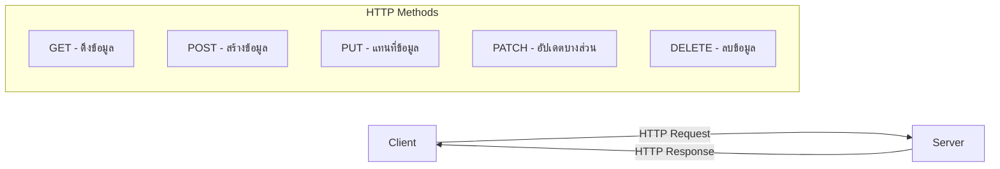
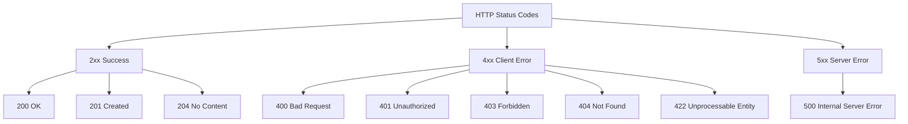

# Next.js API Routes สร้างและจัดการ API แบบครบครัน 🚀

## 📋 สารบัญ

1. [ภาพรวม API Routes ใน Next.js](#overview)
2. [การสร้าง API แบบ RESTful](#restful-api)
3. [การใช้งาน Zod สำหรับ Validation](#zod-validation)
4. [การสร้าง CRUD Operations](#crud-operations)
5. [การจัดการ Error และ Status Codes](#error-handling)
6. [ตัวอย่างการใช้งานจริง](#examples)
7. [การปรับปรุงโค้ดให้ทันสมัย](#modern-improvements)
8. [💡 Tips สำหรับยุค 2025](#modern-tips)

---

## 🎯 ภาพรวม API Routes ใน Next.js {#overview}

Next.js ช่วยให้เราสร้าง API ได้ง่ายๆ โดยการสร้างไฟล์ใน folder `app/api/` ซึ่งแตกต่างจากการใช้ JSON Server ที่เป็นเพียงการจำลอง

### 📁 โครงสร้าง Folder

```
app/
└── api/
  ├── articles/
  │   ├── route.ts          # GET /api/articles, POST /api/articles
  │   └── [id]/
  │       └── route.ts      # GET /api/articles/[id]
  └── admin/
    └── articles/
      ├── route.ts      # POST /api/admin/articles
      └── [id]/
        └── route.ts  # PATCH /api/admin/articles/[id], DELETE /api/admin/articles/[id]
```

---

## 🔄 RESTful API ใน Next.js {#restful-api}

### 📖 หลักการ RESTful API

REST (Representational State Transfer) เป็นหลักการในการออกแบบ API ที่มีมาตรฐาน:



### 🎯 HTTP Methods และ Status Codes

| Method | Purpose | Success Status | Error Status |
|--------|---------|----------------|--------------|
| GET | ดึงข้อมูล | 200 OK | 404 Not Found |
| POST | สร้างข้อมูล | 201 Created | 400 Bad Request |
| PATCH | อัปเดตบางส่วน | 200 OK | 422 Unprocessable Entity |
| DELETE | ลบข้อมูล | 204 No Content | 404 Not Found |

### 📝 ตัวอย่าง API Route พื้นฐาน

```typescript
// app/api/articles/route.ts
export async function GET() {
  const articles = [
  { id: 1, title: "บทความแรก" },
  { id: 2, title: "บทความสอง" }
  ];

  // วิธีที่ 1: ส่ง JSON โดยตรง
  return Response.json(articles);

  // วิธีที่ 2: ใช้ new Response (มีความยืดหยุ่นมากกว่า)
  return new Response(JSON.stringify(articles), {
  status: 200,
  headers: {
    'Content-Type': 'application/json'
  }
  });
}
```

---

## 🛡️ การใช้งาน Zod สำหรับ Validation {#zod-validation}

### 📦 การติดตั้ง Zod

```bash
npm add zod
```

### 🔧 การสร้าง Schema

```typescript
// features/article/validators.ts
import { z } from 'zod';

// Schema สำหรับการสร้าง Article
export const Add = z.object({
  title: z.string().min(1, "กรุณาใส่ชื่อบทความ")
});

// Schema สำหรับการอัปเดต Article (ทุก field เป็น optional)
export const Update = Add.partial();

// Type inference จาก Zod Schema
export type CreateArticleInput = z.infer<typeof Add>;
export type UpdateArticleInput = z.infer<typeof Update>;
```

### 🎨 ตัวอย่างการใช้งาน Validation

```typescript
// ตัวอย่างการ validate ข้อมูล
const userSchema = z.object({
  name: z.string(),
  gender: z.enum(['male', 'female']),
  age: z.number().min(1),
  email: z.string().email(),
  password: z.string().min(8)
});

// การใช้งาน
const userData = {
  name: "สมชาย",
  gender: "male",
  age: 24,
  email: "somchai@gmail.com",
  password: "12345678"
};

const result = userSchema.safeParse(userData);
if (result.success) {
  console.log("ข้อมูลถูกต้อง:", result.data);
} else {
  console.log("ข้อมูลผิดพลาด:", result.error);
}
```

---

## 📊 การสร้าง CRUD Operations {#crud-operations}

### 📄 ไฟล์ API Functions

#### ❌ วิธีเดิม (มีปัญหา)

```typescript
// features/article/api.ts (เวอร์ชันเก่า - มีปัญหา)
import { CreateArticleInput, UpdateArticleInput } from './types';

// ❌ ปัญหา: Global variable ไม่เสถียร
let articleList = [
  { id: 1, title: "บทความแรก" },
  { id: 2, title: "บทความสอง" }
];

// ❌ ปัญหา: ข้อมูลจะหายเมื่อ server restart
export function findAll() {
  return Promise.resolve(articleList);
}

// ❌ ปัญหา: ไม่มี async แต่ใช้ await
export function findByID(id: number) {
  const article = articleList.find(article => article.id === id);
  return Promise.resolve(article || null);
}
```

#### ✅ วิธีใหม่ (แก้ไขแล้ว)

```typescript
// features/article/api.ts (เวอร์ชันใหม่ - แก้ไขแล้ว)
import { faker } from "@faker-js/faker";
import { Article, CreateArticleInput, UpdateArticleInput } from "./types";

// ✅ วิธีที่ 1: ใช้ Global Array (สำหรับการเรียนรู้)
let articles: Article[] = [];

export const findAll = async (): Promise<Article[]> => {
  // ✅ แก้ไข: ใช้ชื่อตัวแปรที่ชัดเจน
  const length = faker.helpers.rangeToNumber({ min: 3, max: 10 });
  const generatedArticles = Array.from({ length }).map(() => ({
    id: faker.number.int(),
    title: faker.lorem.sentence(),
  }));

  return Promise.resolve(generatedArticles);
};

export const findById = async (id: Article["id"]): Promise<Article | null> => {
  // ✅ แก้ไข: เพิ่ม async และ proper typing
  const allArticles: Article[] = await findAll();
  const article = allArticles.find((article) => article.id === id);

  if (!article) return Promise.resolve(null);
  return Promise.resolve(article);
};

export const create = async (form: CreateArticleInput): Promise<Article> => {
  // ✅ แก้ไข: เพิ่ม async และ return type
  const article = {
    id: faker.number.int(),
    ...form,
  };

  articles.push(article);
  return Promise.resolve(article);
};

export const update = async (
  id: Article["id"], 
  form: UpdateArticleInput
): Promise<Article | null> => {
  // ✅ แก้ไข: เพิ่ม async และ proper error handling
  const article = await findById(id);
  if (!article) return Promise.resolve(null);

  Object.assign(article, form);
  return Promise.resolve(article);
};

export const remove = async (id: Article["id"]): Promise<boolean> => {
  // ✅ แก้ไข: แก้ไขชื่อตัวแปรและ logic
  const index = articles.findIndex((article) => article.id === id);
  
  if (index === -1) return Promise.resolve(false);
  
  const newArticles = [
    ...articles.slice(0, index),
    ...articles.slice(index + 1),
  ];

  articles = newArticles;
  return Promise.resolve(true);
};
```

#### 🚀 วิธีที่ดีที่สุด (แนะนำ)

```typescript
// features/article/api.ts (เวอร์ชันที่แนะนำ)
import { faker } from "@faker-js/faker";
import { Article, CreateArticleInput, UpdateArticleInput } from "./types";

// ✅ วิธีที่ 2: Mock Database ที่สม่ำเสมอ
const generateMockArticles = (): Article[] => {
  faker.seed(123); // ใช้ seed เพื่อข้อมูลที่สม่ำเสมอ
  const length = 5; // จำนวนคงที่
  return Array.from({ length }).map((_, index) => ({
    id: index + 1,
    title: faker.lorem.sentence(),
  }));
};

export const findAll = async (): Promise<Article[]> => {
  // จำลอง API delay
  await new Promise((resolve) => setTimeout(resolve, 100));
  return generateMockArticles();
};

export const findById = async (id: Article["id"]): Promise<Article | null> => {
  const articles = await findAll();
  const article = articles.find((article) => article.id === id);
  return article || null;
};

export const create = async (form: CreateArticleInput): Promise<Article> => {
  const articles = await findAll();
  const newArticle = {
    id: Math.max(...articles.map((a) => a.id)) + 1,
    ...form,
  };
  // ✅ ในแอปจริง จะบันทึกลง database ตรงนี้
  return newArticle;
};

export const update = async (
  id: Article["id"],
  form: UpdateArticleInput,
): Promise<Article | null> => {
  const article = await findById(id);
  if (!article) return null;

  const updatedArticle = { ...article, ...form };
  // ✅ ในแอปจริง จะอัปเดตใน database ตรงนี้
  return updatedArticle;
};

export const remove = async (id: Article["id"]): Promise<boolean> => {
  const article = await findById(id);
  if (!article) return false;

  // ✅ ในแอปจริง จะลบจาก database ตรงนี้
  return true;
};
```

### 🎯 API Routes Implementation

#### 1. GET /api/articles - ดึงข้อมูลทั้งหมด

```typescript
// app/api/articles/route.ts
import * as api from '@/features/article/api';

export async function GET() {
  const articles = await api.findAll();
  return Response.json(articles);
}
```

#### 2. GET /api/articles/[id] - ดึงข้อมูลตาม ID

```typescript
// app/api/articles/[id]/route.ts
import * as api from '@/features/article/api';

interface Params {
  params: { id: string }
}

export async function GET(_request: Request, { params }: Params) {
  const article = await api.findById(parseInt(params.id));
  
  if (!article) {
  return new Response(null, { status: 404 });
  }
  
  return Response.json(article);
}
```

#### 3. POST /api/admin/articles - สร้างข้อมูลใหม่

```typescript
// app/api/admin/articles/route.ts
import * as api from '@/features/article/api';
import * as validator from '@/features/article/validators';

export async function POST(request: Request) {
  // ดึงข้อมูลจาก request body
  const form = await request.json() as CreateArticleInput;
  
  // Validate ข้อมูล
  const formValidation = await validator.Add.safeParseAsync(form);
  
  if (!formValidation.success) {
  return new Response(JSON.stringify(formValidation.error), {
    status: 422,
    headers: { 'Content-Type': 'application/json' }
  });
  }
  
  // สร้างข้อมูล
  const article = await api.create(formValidation.data);
  
  return Response.json(article, { status: 201 });
}
```

#### 4. PATCH /api/admin/articles/[id] - อัปเดตข้อมูล

```typescript
// app/api/admin/articles/[id]/route.ts
import * as api from '@/features/article/api';
import * as validator from '@/features/article/validators';

interface Params {
  params: { id: string }
}

export async function PATCH(request: Request, { params }: Params) {
  const form = await request.json() as UpdateArticleInput;
  
  // Validate ข้อมูล
  const formValidation = await validator.Update.safeParseAsync(form);
  
  if (!formValidation.success) {
  return new Response(JSON.stringify(formValidation.error), {
    status: 422,
    headers: { 'Content-Type': 'application/json' }
  });
  }
  
  // อัปเดตข้อมูล
  const article = await api.update(parseInt(params.id), formValidation.data);
  
  if (!article) {
  return new Response(null, { status: 404 });
  }
  
  return Response.json(article);
}

export async function DELETE(_request: Request, { params }: Params) {
  const success = await api.remove(parseInt(params.id));
  
  if (!success) {
  return new Response(null, { status: 404 });
  }
  
  return new Response(null, { status: 204 });
}
```

---

## ⚠️ การจัดการ Error และ Status Codes {#error-handling}

### 📊 HTTP Status Codes ที่ควรรู้



### 🛠️ ตัวอย่างการจัดการ Error

```typescript
// ตัวอย่างการสร้าง helper function สำหรับ error response
function createErrorResponse(message: string, status: number) {
  return new Response(JSON.stringify({ error: message }), {
  status,
  headers: { 'Content-Type': 'application/json' }
  });
}

// การใช้งาน
export async function GET(request: Request) {
  try {
  const articles = await api.findAll();
  return Response.json(articles);
  } catch (error) {
  return createErrorResponse('เกิดข้อผิดพลาดในการดึงข้อมูล', 500);
  }
}
```

---

## 🧪 ตัวอย่างการใช้งานจริง {#examples}

### 📱 การทดสอบ API ด้วย curl

```bash
# GET - ดึงข้อมูลทั้งหมด
curl http://localhost:3000/api/articles

# GET - ดึงข้อมูลตาม ID
curl http://localhost:3000/api/articles/1

# POST - สร้างข้อมูลใหม่
curl -X POST http://localhost:3000/api/admin/articles \
  -H "Content-Type: application/json" \
  -d '{"title":"บทความใหม่"}'

# PATCH - อัปเดตข้อมูล
curl -X PATCH http://localhost:3000/api/admin/articles/1 \
  -H "Content-Type: application/json" \
  -d '{"title":"บทความที่แก้ไขแล้ว"}'

# DELETE - ลบข้อมูล
curl -X DELETE http://localhost:3000/api/admin/articles/1
```

### 🔧 การใช้งานในหน้า Frontend

```typescript
// การเรียกใช้ API ในหน้า React
async function fetchArticles() {
  const response = await fetch('/api/articles');
  const articles = await response.json();
  return articles;
}

async function createArticle(title: string) {
  const response = await fetch('/api/admin/articles', {
  method: 'POST',
  headers: { 'Content-Type': 'application/json' },
  body: JSON.stringify({ title })
  });
  
  if (response.status === 201) {
  const article = await response.json();
  return article;
  } else {
  throw new Error('ไม่สามารถสร้างบทความได้');
  }
}
```

---

## 🚀 การปรับปรุงโค้ดให้ทันสมัย {#modern-improvements}

### 📊 สรุปการเปลี่ยนแปลงสำคัญ

| หัวข้อ | เวอร์ชันเก่า | เวอร์ชันใหม่ | เหตุผล |
|--------|-------------|-------------|---------|
| **Function Declaration** | `function findAll()` | `const findAll = async ()` | Type safety และ consistency |
| **Async/Await** | ไม่สม่ำเสมอ | ทุก function เป็น async | Proper async handling |
| **Type Safety** | ไม่มี return types | มี return types ครบ | TypeScript best practices |
| **Error Handling** | Return -1 เมื่อ error | Return boolean | ชัดเจนกว่า |
| **Variable Naming** | `artiels`, `article` | `articles`, `generatedArticles` | ไม่มี typos |
| **Data Consistency** | Random data ทุกครั้ง | ใช้ seed สำหรับข้อมูลสม่ำเสมอ | Predictable testing |

### ⚡ ข้อดีของการปรับปรุง

#### 1. **Type Safety ที่ดีขึ้น**
```typescript
// ❌ เก่า
export function findByID(id: number) {
  // ไม่มี return type
}

// ✅ ใหม่
export const findById = async (id: Article["id"]): Promise<Article | null> => {
  // มี return type ชัดเจน
}
```

#### 2. **Consistent Async Pattern**
```typescript
// ❌ เก่า - ไม่สม่ำเสมอ
export function findAll() { /* sync */ }
export async function update() { /* async */ }

// ✅ ใหม่ - สม่ำเสมอ
export const findAll = async (): Promise<Article[]> => { /* async */ }
export const update = async (): Promise<Article | null> => { /* async */ }
```

#### 3. **Better Error Handling**
```typescript
// ❌ เก่า
export function remove(id: number) {
  // return index หรือ -1
  return Promise.resolve(index);
}

// ✅ ใหม่
export const remove = async (id: Article["id"]): Promise<boolean> => {
  // return boolean ชัดเจน
  return true; // หรือ false
}
```

#### 4. **Proper Variable Management**
```typescript
// ❌ เก่า - Global variable ไม่เสถียร
let articleList = [...];

// ✅ ใหม่ - Mock data ที่สม่ำเสมอ
const generateMockArticles = (): Article[] => {
  faker.seed(123); // ข้อมูลสม่ำเสมอ
  return [...];
}
```

### 🔧 การติดตั้ง Dependencies ที่จำเป็น

```bash
# Core dependencies
npm add zod @faker-js/faker

# Type definitions
npm add -D @types/node

# Optional: สำหรับ testing
npm add -D vitest @testing-library/react
```

### 📋 Best Practices ที่ควรปฏิบัติ

1. **ใช้ TypeScript อย่างเต็มรูปแบบ** - กำหนด types ให้ครบถ้วน
2. **Consistent Naming** - ใช้ชื่อที่สม่ำเสมอและไม่มี typos
3. **Proper Error Handling** - จัดการ errors อย่างชัดเจน
4. **Async/Await Pattern** - ใช้ async/await อย่างสม่ำเสมอ
5. **Mock Data Management** - ใช้ seeds สำหรับข้อมูลที่สม่ำเสมอ

---

## 💡 Tips สำหรับยุค Next.js 15.3.2 (2025) {#modern-tips}

### ⚠️ ไม่จำเป็นแล้วในยุคนี้!

> **คำเตือน**: การเขียน `headers: { 'Content-Type': 'application/json' }` ไม่จำเป็นแล้วในหลายกรณี!

### ✅ ไม่ต้องเขียน Content-Type Header ในกรณีเหล่านี้:

#### 1. ใช้ `Response.json()` (แนะนำ)
```typescript
// ✅ ไม่ต้องเขียน Content-Type
if (!formValidation.success) {
  return Response.json(formValidation.error, {
    status: 422,
  });
}
```

#### 2. ใช้ `NextResponse.json()` (Next.js built-in)
```typescript
import { NextResponse } from 'next/server';

// ✅ ไม่ต้องเขียน Content-Type
if (!formValidation.success) {
  return NextResponse.json(formValidation.error, {
    status: 422,
  });
}
```

### 🔧 ยังต้องเขียน Content-Type ในกรณีนี้:

เมื่อใช้ `new Response()` กับ `JSON.stringify()`

```typescript
// ❌ ต้องระบุ Content-Type
return new Response(JSON.stringify(formValidation.error), {
  status: 422,
  headers: { 'Content-Type': 'application/json' }
});

// ✅ ดีกว่า - ไม่ต้องระบุ Content-Type
return Response.json(formValidation.error, {
  status: 422,
});
```

### 📝 ตัวอย่างการใช้งานใน API Route สมัยใหม่:

```typescript
// app/api/articles/route.ts
import { NextRequest } from 'next/server';
import { create } from '@/features/articles/api';
import { add } from '@/features/articles/validators';

export async function POST(request: NextRequest) {
  const body = await request.json();
  
  const formValidation = add.safeParse(body);
  
  if (!formValidation.success) {
    // ✅ ไม่ต้องระบุ Content-Type
    return Response.json(formValidation.error, {
      status: 422,
    });
  }
  
  const article = await create(formValidation.data);
  
  // ✅ ไม่ต้องระบุ Content-Type
  return Response.json(article, {
    status: 201,
  });
}
```

### 🚀 Best Practice 2025:

1. **ใช้ `Response.json()`** แทน `new Response(JSON.stringify())`
2. **ใช้ `NextResponse.json()`** สำหรับ Next.js specific features
3. **ไม่ต้องระบุ Content-Type** เมื่อใช้ built-in JSON methods
4. **ระบุ Content-Type เฉพาะ** เมื่อส่งข้อมูลที่ไม่ใช่ JSON

### 📊 เปรียบเทียบแนวทางเก่าและใหม่:

| วิธีการ | ปี 2022-2023 | ปี 2025 | หมายเหตุ |
|---------|-------------|---------|----------|
| **JSON Response** | ต้องระบุ `Content-Type` | ไม่ต้องระบุ | Built-in methods จัดการให้ |
| **Error Handling** | Manual headers | Auto headers | ลดโอกาสผิดพลาด |
| **Code Length** | ยาวกว่า | สั้นกว่า | Clean และ readable |
| **Type Safety** | น้อยกว่า | มากกว่า | TypeScript integration |

> 💡 **สรุป**: การเปลี่ยนแปลงนี้ทำให้โค้ดสั้นลง ลดโอกาสผิดพลาด และเขียนได้ง่ายขึ้น!

---

## 🔄 สิ่งที่ได้ปรับปรุงจากเวอร์ชันเดิม

### ✨ การปรับปรุงที่สำคัญ

1. **โครงสร้างโฟลเดอร์ที่ชัดเจน** - แยก API แบบ Public กับ Admin
2. **Type Safety** - ใช้ TypeScript และ Zod เพื่อความปลอดภัย
3. **Error Handling** - จัดการ error และ validation อย่างเป็นระบบ
4. **Code Organization** - แยกโค้ดเป็นส่วนๆ ตาม feature
5. **RESTful Standards** - ปฏิบัติตามมาตรฐาน REST API
6. **Modern TypeScript Patterns** - ใช้ patterns ที่ทันสมัย
7. **2025 API Best Practices** - ใช้ built-in methods แทน manual headers

### 🎯 ข้อดีของการใช้ Next.js API Routes

- **Full-stack Development** - เขียน Frontend และ Backend ในโปรเจคเดียว
- **Type Safety** - ใช้ TypeScript ทั้งระบบ
- **Performance** - ใช้ประโยชน์จาก Next.js optimizations
- **Deployment** - Deploy ง่ายบน Vercel หรือ platforms อื่นๆ

---

## 📚 Next Steps

1. **Database Integration** - เชื่อมต่อกับ Database จริง (Prisma + PostgreSQL)
2. **Authentication** - เพิ่มระบบ login/logout
3. **Middleware** - สร้าง middleware สำหรับ authentication
4. **Testing** - เพิ่ม unit tests และ integration tests
5. **Documentation** - สร้าง API documentation ด้วย Swagger

---

> 💡 **หมายเหตุ**: ตัวอย่างนี้แสดงการเปรียบเทียบระหว่างแนวทางเก่าและใหม่ เพื่อให้เข้าใจวิธีการเขียนโค้ดที่ดีขึ้นและทันสมัยยิ่งขึ้น รวมถึงการใช้ built-in methods ของ Next.js 15.3.2 อย่างเต็มประสิทธิภาพ
