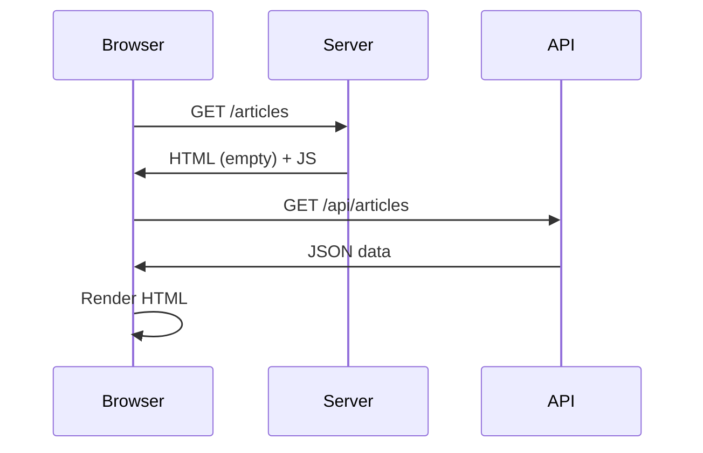
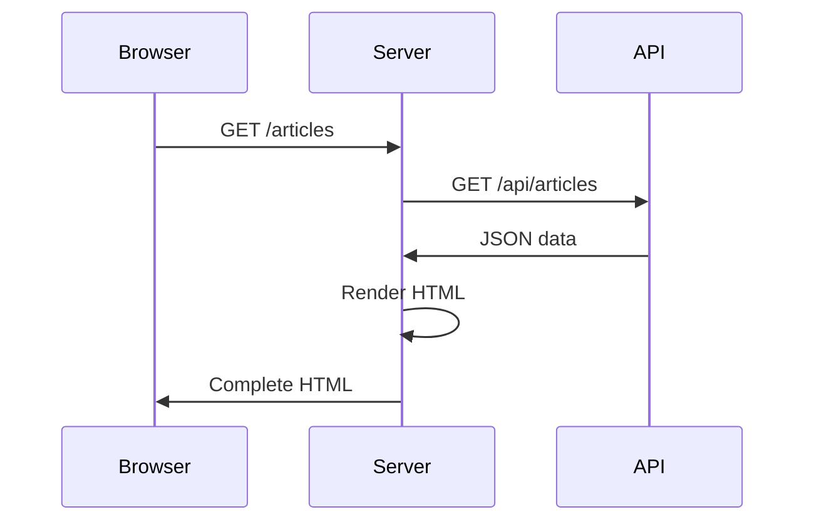

# Next.js Course Detail

## 1. NextJS Tech Stack Overview

### JavaScript ในยุคปัจจุบัน
JavaScript ไม่ได้ทำงานแค่บนเว็บเบราว์เซอร์เท่านั้น แต่สามารถใช้ในการพัฒนาระบบหลังบ้าน (Backend) และสร้าง API ได้ด้วย โดยใช้ **Node.js** เป็น Runtime Environment

### โครงสร้างของ Node.js Project

#### ไฟล์สำคัญ
- **package.json**: ไฟล์กำหนดข้อมูลโปรเจ็กต์และ dependencies
- **node_modules/**: โฟลเดอร์เก็บ libraries ที่ติดตั้ง

#### Dependencies ใน package.json
```json
{
    "dependencies": {
        // ใช้ในทุก environment (development, test, production)
    },
    "devDependencies": {
        // ใช้เฉพาะใน development และ test เท่านั้น
    }
}
```

### Package Managers เปรียบเทียบ

| Package Manager | ความเร็ว | รองรับ Windows | แนะนำใช้เมื่อ |
|-----------------|----------|----------------|---------------|
| **npm** | ช้า | ✅ | โปรเจ็กต์เล็ก |
| **yarn** | ปานกลาง | ✅ | ทีมใหญ่ |
| **pnpm** | เร็ว | ✅ | ประหยัดพื้นที่ disk |
| **bun** | เร็วที่สุด | ⚠️ ต้องใช้ WSL | โปรเจ็กต์ใหม่ (Mac/Linux) |

#### ปัญหาของ npm แบบเดิม
เมื่อมีหลายโปรเจ็กต์ที่ใช้ library เดียวกัน npm จะดาวน์โหลดซ้ำในทุกโปรเจ็กต์ ทำให้:
- node_modules ใหญ่มาก
- เสียพื้นที่ hard disk
- ซ้ำซ้อนไม่จำเป็น

#### การแก้ปัญหาด้วย pnpm
pnpm ใช้ระบบ **Hard Link** และ **Global Store**:

1. **Global Store**: เก็บ library จริงไว้ที่เดียว
2. **Hard Link**: สร้างลิงก์ชี้ไปที่ global store
3. **ประหยัดพื้นที่**: หลายโปรเจ็กต์ใช้ library เดียวกันได้โดยไม่ซ้ำ

#### คำสั่ง pnpm พื้นฐาน
```bash
# ติดตั้ง package
pnpm add lodash

# ติดตั้งเป็น devDependency
pnpm add -D typescript

# ลบ package
pnpm remove lodash
```

## 2. React Fundamentals

### Component-Based Design
React ใช้แนวคิด **Component-Based Design** เปรียบเสมือนการต่อ Lego:

- **Component**: ส่วนย่อยของ UI ที่สมบูรณ์ในตัวเอง
- **Reusable**: นำไปใช้ซ้ำได้ในหลายที่
- **Self-contained**: มี state และ lifecycle ของตัวเอง

#### ตัวอย่าง Component Hierarchy
```
App
├── Header
├── Jumbotron  
└── PostList
        └── PostItem (หลายตัว)
```

#### Component ใน React
```jsx
const App = () => {
    return (
        <div>
            <Header />
            <Jumbotron />
            <PostList />
        </div>
    );
};
```

### JSX (JavaScript XML)
- **ไม่ใช่ HTML**: ดูคล้าย HTML แต่เป็น syntax ของ React
- **ไม่ใช่ JavaScript**: เบราว์เซอร์ไม่เข้าใจ JSX โดยตรง
- **ต้องแปล**: ใช้ Transpiler แปลงเป็น JavaScript

#### Transpilers ที่นิยม
- **Babel**: เก่า แต่ stable
- **SWC**: ใหม่ เร็ว (Next.js ใช้)

## 3. Build Tools และ Bundlers

### Bundler คืออะไร?
เครื่องมือที่รวบรวมไฟล์ต่างๆ มาเป็น "ชุด" สำหรับแต่ละหน้า:

- **Entry Point**: จุดเข้าของแต่ละหน้า (เช่น /articles)
- **Bundle**: ชุดไฟล์ที่จำเป็นสำหรับหน้านั้น
- **Code Splitting**: แยกโค้ดตามหน้าเพื่อโหลดเร็ว

#### Bundlers ยนิยม
- **Webpack**: มาตรฐานเก่า
- **TurboPack**: ใหม่ เร็ว (Next.js ใช้)

## 4. Rendering Methods ใน Next.js

### 1. Client-Side Rendering (CSR)
**วิธีการทำงาน:**
1. Browser ขอหน้า `/articles`
2. Server ส่ง HTML เปล่า + JavaScript
3. JavaScript ทำงานบน browser
4. เรียก API เพื่อดึงข้อมูล
5. แสดงผลบน browser

**ข้อดี:**
- ลดภาระ server
- ผู้ใช้แบกภาระการ render

**ข้อเสีย:**
- SEO ไม่ดี (HTML เปล่า)
- Social media preview ไม่ทำงาน
- รอโหลดข้อมูลจาก API



### 2. Server-Side Rendering (SSR)
**วิธีการทำงาน:**
1. Browser ขอหน้า `/articles`
2. Server เรียก API ดึงข้อมูล
3. Server render HTML สมบูรณ์
4. ส่ง HTML สมบูรณ์กลับ browser

**ข้อดี:**
- SEO ดีเยี่ยม
- Social media preview ทำงาน
- ได้เนื้อหาทันที

**ข้อเสีย:**
- เพิ่มภาระ server
- ช้าถ้ามี user เยอะ



### 3. Static Site Generation (SSG)
**วิธีการทำงาน:**
1. **Build time**: สร้าง HTML ไว้ล่วงหน้า
2. **Run time**: ส่ง HTML ที่สร้างไว้แล้ว

**ข้อดี:**
- เร็วที่สุด (ไม่ต้อง render)
- SEO ดีเยี่ยม
- ประหยัดทรัพยากร server

**ข้อเสีย:**
- ข้อมูลไม่ update แบบ real-time
- ต้อง rebuild เมื่อข้อมูลเปลี่ยน

```bash
# Build time
npm run build
# สร้าง articles.html, about.html ไว้

# Run time - ง่ายมาก
GET /articles → ส่ง articles.html
```

### 4. Incremental Static Regeneration (ISR)
**วิธีการทำงาน:**
SSG + การ update ข้อมูลอัตโนมัติ

**กำหนด revalidate:**
```javascript
export async function getStaticProps() {
    return {
        props: { data },
        revalidate: 10 // update ทุก 10 วินาที
    };
}
```

**Timeline ตัวอย่าง:**
- วินาทีที่ 1-10: ส่ง HTML เก่า
- วินาทีที่ 11: ส่ง HTML เก่า + เริ่ม rebuild
- วินาทีที่ 12+: ส่ง HTML ใหม่

**ข้อดี:**
- เร็วเหมือน SSG
- ข้อมูล update ได้
- ควบคุมความถี่ได้

### 5. Pre-Rendering (Default)
Next.js ใช้ pre-rendering เป็นค่าเริ่มต้น:
- Generate HTML ล่วงหน้า
- คล้าย SSG แต่อัตโนมัติ

## 5. Next.js Project Structure

### รูปแบบใหม่: App Router (แนะนำ)
```
my-nextjs-app/
├── app/
│   ├── layout.tsx     # Layout หลัก
│   ├── page.tsx       # หน้าแรก (/)
│   ├── about/
│   │   └── page.tsx   # หน้า /about
│   └── api/
│       └── route.ts   # API endpoint
├── components/        # React components
├── public/           # Static files
└── package.json
```

### รูปแบบเก่า: Pages Router
```
my-nextjs-app/
├── pages/
│   ├── index.tsx     # หน้าแรก (/)
│   ├── about.tsx     # หน้า /about
│   └── api/
│       └── users.ts  # API endpoint
└── package.json
```

## 6. Full Stack Next.js Architecture

### การทำงานแบบ Full Stack
```
Browser Request
         ↓
Next.js Server
├── Frontend (React Components)
├── API Routes (Backend)
└── Database Connection
         ↓
Response กลับ Browser
```

**ข้อดี:**
- ใช้ JavaScript เพียงภาษาเดียว
- Frontend + Backend ในโปรเจ็กต์เดียว
- Deploy ง่าย
- Type safety ตลอด stack (ถ้าใช้ TypeScript)

### สิ่งที่จะได้เรียนในคอร์สนี้
1. **React Fundamentals**: Components, JSX, State Management
2. **Next.js App Router**: Routing, Layouts, Loading States
3. **API Development**: RESTful APIs, Database Integration
4. **Rendering Strategies**: CSR, SSR, SSG, ISR
5. **Styling**: CSS Modules, Tailwind CSS
6. **Authentication**: JWT, Sessions
7. **Database**: Prisma ORM, PostgreSQL/MySQL
8. **Deployment**: Vercel, Production Best Practices

### เป้าหมายของคอร์ส
สร้าง Full Stack Web Application ที่มี:
- User Authentication
- CRUD Operations
- Real-time Features
- SEO Optimization
- Production Ready

---

*คอร์สนี้เหมาะสำหรับ: Developer ที่มีพื้นฐาน JavaScript และต้องการเรียนรู้การสร้างเว็บแอพพลิเคชั่นแบบ Full Stack ด้วย Next.js*