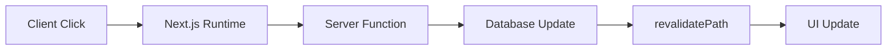

# 🚀 การใช้งาน API และ Server Actions ใน Next.js 15.3.2

## 📋 สารบัญ
1. [การทดสอบ API ด้วย Postman/Insomnia](#การทดสอบ-api)
2. [การสร้าง Custom Hooks สำหรับ API](#การสร้าง-custom-hooks)
3. [Server Actions vs Client Components](#server-actions-vs-client-components)
4. [การใช้ revalidatePath()](#การใช้-revalidatepath)
5. [การปรับปรุงจากเวอร์ชันเก่า](#การปรับปรุงจากเวอร์ชันเก่า)

---

## 🔧 การทดสอบ API

### เครื่องมือที่แนะนำ

#### 1. **Postman** 📮
- ดาวน์โหลดได้จาก [postman.com](https://www.postman.com)
- รองรับทุก OS (macOS, Windows, Linux)
- ติดตั้งผ่าน Homebrew (macOS): `brew install --cask postman`

#### 2. **Insomnia** 😴
- ทางเลือกที่ดี สำหรับ macOS และ Linux
- UI ที่สวยงามและใช้งานง่าย
- มาจากบริษัทเดียวกับ Kong (API Gateway)

### การตั้งค่า Environment Variables

```json
{
    "API_URL": "http://localhost:3000/api"
}
```

### ตัวอย่างการทดสอบ API Endpoints

```http
# GET - ดึงรายการ Articles
GET {{API_URL}}/articles

# GET - ดึง Article ตาม ID
GET {{API_URL}}/articles/[id]

# POST - สร้าง Article ใหม่
POST {{API_URL}}/admin/articles
Content-Type: application/json

{
    "title": "บทความใหม่"
}

# PATCH - แก้ไข Article
PATCH {{API_URL}}/admin/articles/[id]
Content-Type: application/json

{
    "title": "บทความที่แก้ไขแล้ว"
}

# DELETE - ลบ Article
DELETE {{API_URL}}/admin/articles/[id]
```

---

## 🎣 การสร้าง Custom Hooks สำหรับ API

### ⚠️ ปัญหาของการใช้ Static Data

```typescript
// ⚠️ ปัญหา: ข้อมูลจะ random ใหม่ทุกครั้งที่ compile
const articles = [
    { id: crypto.randomUUID(), title: "Article 1" },
    { id: crypto.randomUUID(), title: "Article 2" }
];
```

**สาเหตุ:** Next.js จะ compile API routes เมื่อมี request แรกเข้ามา ทำให้ข้อมูลเปลี่ยนแปลงไปเรื่อย ๆ

### ✅ การสร้าง Custom Hook

```typescript
// hooks/api.ts
export function useCreateArticle() {
    const mutateAsync = async (form: CreateArticleInput) => {
        const response = await fetch('http://localhost:3000/api/admin/articles', {
            method: 'POST',
            headers: {
                'Content-Type': 'application/json',
            },
            body: JSON.stringify(form),
        });
        
        if (!response.ok) {
            throw new Error('Failed to create article');
        }
        
        return response.json();
    };

    return { mutateAsync };
}
```

### 🎨 Component ที่ใช้ Hook

```tsx
'use client'; // 🔥 จำเป็นต้องใส่เพราะมี onClick event

import { useCreateArticle } from '@/hooks/api';

export default function CreateArticle() {
    const { mutateAsync } = useCreateArticle();

    const handleCreate = async () => {
        try {
            await mutateAsync({ title: 'บทความใหม่' });
            alert('สร้างสำเร็จ!');
        } catch (error) {
            alert('เกิดข้อผิดพลาด');
        }
    };

    return (
        <button onClick={handleCreate}>
            สร้างบทความ
        </button>
    );
}
```

---

## ⚡ Server Actions vs Client Components

### 🔄 แนวคิด Server Actions



### 📝 การสร้าง Server Action

```tsx
// app/articles/[id]/page.tsx
import { revalidatePath } from 'next/cache';

async function updateArticle(id: string, form: UpdateArticleInput) {
    'use server'; // 🔥 บอก Next.js ว่าต้องทำงานที่ server
    
    // อัพเดทในฐานข้อมูล (ตัวอย่าง)
    await updateInDatabase(id, form);
    
    // บอกให้ Next.js รู้ว่าหน้านี้ข้อมูลเปลี่ยนแล้ว
    revalidatePath(`/articles/${id}`);
}

export default function ArticlePage({ params }: { params: { id: string } }) {
    return (
        <div>
            <ArticleDetail 
                article={article} 
                onUpdate={updateArticle} // ส่ง server action ไป
            />
        </div>
    );
}
```

### 🎯 Client Component ที่รับ Server Action

```tsx
'use client'; // 🔥 จำเป็นเพราะมี event handler

interface ArticleDetailProps {
    article: Article;
    onUpdate: (id: string) => Promise<void>; // รับ server action
}

export default function ArticleDetail({ article, onUpdate }: ArticleDetailProps) {
    const handleUpdate = async () => {
        await onUpdate(article.id);
        // UI จะอัพเดทอัตโนมัติ! 🎉
    };

    return (
        <div>
            <h1>{article.title}</h1>
            <button onClick={handleUpdate}>
                อัพเดท
            </button>
        </div>
    );
}
```

---

## 🔄 การใช้ revalidatePath()

### 💡 แนวคิด

```typescript
import { revalidatePath } from 'next/cache';

// ใน API Route
export async function POST(request: Request) {
    // สร้างข้อมูลใหม่
    await createArticle(data);
    
    // บอกให้ Next.js รู้ว่าหน้า /articles ข้อมูลเปลี่ยนแล้ว
    revalidatePath('/articles');
    
    return Response.json({ success: true });
}
```

### 🔄 ความแตกต่างระหว่าง API Routes และ Server Actions

| วิธีการ | การอัพเดท UI | ความเร็ว | การใช้งาน |
|---------|---------------|-----------|-----------|
| **API Routes + fetch** | ต้อง refresh หรือรอ revalidate | ช้า | ซับซ้อน |
| **Server Actions** | อัพเดททันที | เร็ว | ง่าย |

### 📊 ตัวอย่างการเปรียบเทียบ

```tsx
// ❌ วิธีเก่า: ใช้ API Routes
const handleCreate = async () => {
    await fetch('/api/articles', { 
        method: 'POST', 
        body: JSON.stringify(data) 
    });
    // ต้อง refresh เพื่อเห็นข้อมูลใหม่ 😞
    window.location.reload();
};

// ✅ วิธีใหม่: ใช้ Server Actions
const handleCreate = async () => {
    await createArticleAction(data);
    // UI อัพเดทอัตโนมัติ! 🎉
};
```

---

## 🚀 การปรับปรุงจากเวอร์ชันเก่า (อัพเดทล่าสุด 2025)

### 🆕 Next.js 15.3.2 Features

#### 1. **Improved Server Actions**
```tsx
// ✨ รองรับ TypeScript ดีขึ้น
async function createArticle(formData: FormData) {
    'use server';
    
    const title = formData.get('title') as string;
    // Type safety ดีขึ้น! 🔥
}
```

#### 2. **Better Error Handling**
```tsx
// ✨ Error boundary ที่ดีขึ้น
export default function ErrorBoundary({
    error,
    reset,
}: {
    error: Error & { digest?: string };
    reset: () => void;
}) {
    return (
        <div>
            <h2>เกิดข้อผิดพลาด!</h2>
            <button onClick={reset}>ลองใหม่</button>
        </div>
    );
}
```

#### 3. **Enhanced revalidatePath()**
```tsx
import { revalidatePath } from 'next/cache';

// ✨ รองรับ pattern matching
revalidatePath('/articles/[id]', 'page'); // เฉพาะ page
revalidatePath('/api/articles', 'route'); // เฉพาะ API route
```

### 🔧 การ Migration จากเวอร์ชันเก่า

#### จาก Next.js 13/14:
```bash
# อัพเกรด dependencies
npm update next@latest react@latest react-dom@latest

# ✨ ใหม่ใน 15.3.2
npm install @next/env@latest
```

#### การปรับปรุง Code:

```tsx
// ❌ เก่า (Next.js 13)
import { unstable_revalidatePath } from 'next/cache';

// ✅ ใหม่ (Next.js 15.3.2)
import { revalidatePath } from 'next/cache';
```

### 📈 Performance Improvements

```typescript
// ✨ ใหม่: Parallel Route Revalidation
await Promise.all([
    revalidatePath('/articles'),
    revalidatePath('/categories'),
    revalidatePath('/tags'),
]);
```

---

## 🎯 Best Practices

### 1. **ใช้ Server Actions สำหรับ Mutations**
```tsx
// ✅ ดี - ใช้ Server Actions
async function updateProfile(formData: FormData) {
    'use server';
    // อัพเดทข้อมูล
}

// ❌ หลีกเลี่ยง - API Routes สำหรับ simple updates
```

### 2. **จัดกลุ่ม revalidatePath ให้เหมาะสม**
```tsx
// ✅ ดี - revalidate เฉพาะที่จำเป็น
revalidatePath(`/articles/${id}`);

// ❌ หลีกเลี่ยง - revalidate ทั้งเว็บ
revalidatePath('/', 'layout');
```

### 3. **Error Handling ที่ถูกต้อง**
```tsx
async function safeServerAction(data: FormData) {
    'use server';
    
    try {
        await updateDatabase(data);
        revalidatePath('/articles');
    } catch (error) {
        // Log error และ return error state
        console.error('Update failed:', error);
        return { error: 'อัพเดทไม่สำเร็จ' };
    }
}
```

---

## 🔗 Navigation Components

### ใช้ Link แทน <a> tags
```tsx
import Link from 'next/link';

// ✅ ดี - ไม่มี page refresh
<Link href={`/articles/${article.id}`}>
    {article.title}
</Link>

// ❌ หลีกเลี่ยง - จะ refresh ทั้งหน้า
<a href={`/articles/${article.id}`}>
    {article.title}
</a>
```

---

## 🏁 สรุป

การใช้งาน Next.js 15.3.2 ทำให้เราสามารถสร้าง web application ที่มี performance ดีและ user experience ที่ลื่นไหลได้ง่ายขึ้น โดยเฉพาะการใช้ **Server Actions** ที่ทำให้:

- 🚀 UI อัพเดททันทีโดยไม่ต้อง refresh
- 🔒 ความปลอดภัยสูงเพราะ logic อยู่ที่ server
- 🧹 Code ที่สะอาดและเข้าใจง่าย
- ⚡ Performance ที่ดีกว่าการใช้ API Routes แบบเดิม

**หมายเหตุ:** การอัพเดทนี้ปรับปรุงจากวิดีโอต้นฉบับเพื่อให้เข้ากับ Next.js 15.3.2 และเพิ่มเติมความเข้าใจในการใช้งานจริง 🎉
