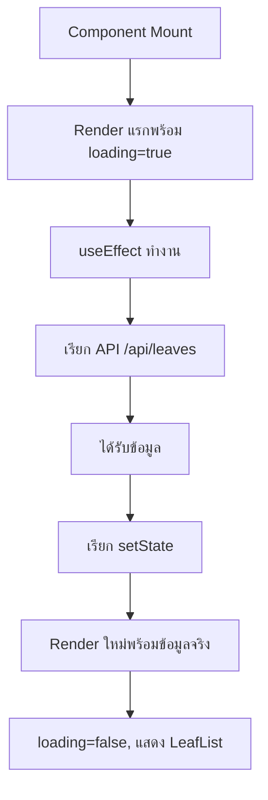

# Client-Side Rendering (CSR) in Next.js 15.3.2

## 📋 Overview
ในบทนี้เราจะมาเรียนรู้เกี่ยวกับ **Client-Side Rendering (CSR)** ซึ่งเป็นเทคนิคการ render ที่แตกต่างจาก SSR, SSG, และ ISR ที่เราได้เรียนมาก่อนหน้านี้

## 🎯 Learning Objectives
- เข้าใจหลักการทำงานของ Client-Side Rendering
- สร้าง Custom Hooks สำหรับ API calls
- ใช้งาน useState และ useEffect อย่างถูกต้อง
- เปรียบเทียบความแตกต่างระหว่าง CSR กับ rendering methods อื่นๆ

## 🚀 What's New in Next.js 15.3.2
- ✅ ปรับปรุง Performance ของ Client Components
- ✅ เพิ่ม Type Safety ที่ดีขึ้นสำหรับ Server/Client boundaries
- ✅ Enhanced error handling สำหรับ async operations

## 📁 Project Structure
```
📦 leaves/
├── 📄 page.tsx              # Main page component
├── 📄 types.ts              # Type definitions
├── 📂 components/
│   └── 📄 LeafList.tsx      # List component
└── 📂 hooks/
    └── 📄 api.ts            # Custom API hooks

📦 api/
└── 📂 leaves/
    └── 📄 route.ts          # API endpoint
```

---

## 🔧 ขั้นตอนการสร้าง

### ขั้นตอนที่ 1: สร้าง Type Definitions

```typescript
// leaves/types.ts
export interface Leaf {
  id: number;
  reason: string;
}
```

### ขั้นตอนที่ 2: สร้าง API Endpoint

```typescript
// app/api/leaves/route.ts
export async function GET() {
  // Mock data สำหรับการสาธิต
  const leaves = [
    { id: 1, reason: "ลาป่วย" },
    { id: 2, reason: "ลากิจ" },
    { id: 3, reason: "ลาพักร้อน" }
  ];
  
  return Response.json(leaves);
}
```

### ขั้นตอนที่ 3: สร้าง Custom Hook สำหรับ API Call

```typescript
// leaves/hooks/api.ts
import { useState, useEffect } from 'react';
import { Leaf } from '../types';

export function useGetLeaves() {
  const [leaves, setLeaves] = useState<Leaf[]>([]);
  const [loading, setLoading] = useState(true);

  const fetchLeaves = async () => {
    try {
      const response = await fetch('http://localhost:3000/api/leaves');
      const data = await response.json() as Leaf[];
      setLeaves(data);
    } catch (error) {
      console.error('ไม่สามารถดึงข้อมูลได้:', error);
    } finally {
      setLoading(false);
    }
  };

  useEffect(() => {
    fetchLeaves();
  }, []);

  return { loading, leaves };
}
```

### ขั้นตอนที่ 4: สร้าง Component สำหรับแสดงรายการ

```typescript
// leaves/components/LeafList.tsx
import { Leaf } from '../types';

interface LeafListProps {
  leaves: Leaf[];
}

export default function LeafList({ leaves }: LeafListProps) {
  return (
    <ul>
      {leaves.map((leaฟอำ) => (
        <li key={leaฟอำ.id}>
          {leaฟอำ.reason}
        </li>
      ))}
    </ul>
  );
}
```

### ขั้นตอนที่ 5: Main Page Component

```typescript
// leaves/page.tsx
'use client';

import LeafList from './components/LeafList';
import { useGetLeaves } from './hooks/api';

export default function LeavesPage() {
  const { loading, leaves } = useGetLeaves();

  if (loading) {
    return <div>กำลังโหลด...</div>;
  }

  return <LeafList leaves={leaves} />;
}
```

---

## 📊 วงจรชีวิตของ CSR



---

## 🔍 แนวคิดสำคัญ

### 1. ขั้นตอนการทำงานของ Client-Side Rendering

> **สำคัญ**: CSR ใน Next.js ไม่ได้ทำงานแยกเดี่ยว แต่จะทำงานร่วมกับ Server-side rendering methods

```
┌─────────────┐    ┌──────────────┐    ┌─────────────┐
│   Server    │    │   Browser    │    │    API      │
│             │    │              │    │             │
│ 1. SSG/SSR  │───▶│ 2. Hydration │───▶│ 3. API Call │
│    render   │    │    เกิดขึ้น   │    │   ทำงาน     │
│   "Loading" │    │              │    │             │
└─────────────┘    └──────────────┘    └─────────────┘
```

### 2. ทำไมต้องใช้ useState และ useEffect?

**เปรียบเทียบกับ Server Components:**

| Server Components | Client Components (CSR) |
|-------------------|-------------------------|
| ✅ ไม่ต้องใช้ useState/useEffect | ❌ ต้องใช้ useState/useEffect |
| ✅ ดึงข้อมูลได้โดยตรง | ❌ ต้องจัดการ async state |
| ✅ เป็นมิตรกับ SEO | ⚠️ เนื้อหาโหลดหลัง JS |
| ❌ ไม่สามารถ interact ได้ | ✅ สามารถ interact ได้เต็มที่ |

### 3. การทำงานของ useEffect ใน CSR

```typescript
useEffect(() => {
  // 🔄 ทำงานฝั่ง client เท่านั้น
  // ⏰ ทำงานหลัง component mount
  // 🌐 ในสภาพแวดล้อม browser เท่านั้น
  fetchData();
}, []); // dependency array ว่าง = ทำงานครั้งเดียว
```

---

## 🚨 ปัญหาที่พบบ่อยและวิธีแก้ไข

### ❌ ปัญหา: Hydration Mismatch
```typescript
// อย่าทำแบบนี้ - จะทำให้เกิด hydration errors
const [mounted, setMounted] = useState(false);
```

### ✅ วิธีแก้: ใช้ Loading States ที่ถูกต้อง
```typescript
const [loading, setLoading] = useState(true);
// เริ่มต้นด้วย loading state เสมอ
```

### ❌ ปัญหา: ลืมใส่ 'use client' directive
```typescript
// จะทำให้เกิดข้อผิดพลาดใน CSR components
import { useState } from 'react';
```

### ✅ วิธีแก้: เพิ่ม directive ที่ด้านบน
```typescript
'use client';
import { useState } from 'react';
```

---

## 🔄 เปรียบเทียบ CSR กับ Rendering Methods อื่นๆ

### Static Site Generation (SSG)
```typescript
// ⚡ เร็ว, สร้างไว้ล่วงหน้าตอน build
// 📈 ดีสำหรับ SEO
// ❌ ไม่มีข้อมูลแบบ real-time
```

### Server-Side Rendering (SSR)
```typescript
// 🔄 ข้อมูลใหม่ทุกครั้งที่มี request
// 📈 เป็นมิตรกับ SEO
// ⏱️ การโหลดครั้งแรกช้ากว่า
```

### Client-Side Rendering (CSR)
```typescript
// ⚡ การนำทางครั้งต่อไปเร็ว
// 🎯 สามารถโต้ตอบได้สูง
// ⚠️ มีความท้าทายด้าน SEO
// 📱 ต้องมี loading states
```

---

## 🛠️ คุณสมบัติที่เพิ่มขึ้น (Next.js 15.3.2)

### 1. Error Boundaries สำหรับ CSR
```typescript
'use client';

import { ErrorBoundary } from 'react-error-boundary';

function ErrorFallback({error}: {error: Error}) {
  return (
    <div role="alert">
      <h2>เกิดข้อผิดพลาด:</h2>
      <pre>{error.message}</pre>
    </div>
  );
}

export default function EnhancedPage() {
  return (
    <ErrorBoundary FallbackComponent={ErrorFallback}>
      <LeavesPage />
    </ErrorBoundary>
  );
}
```

### 2. ปรับปรุง Type Safety
```typescript
// ตรวจสอบ type ที่เข้มงวดขึ้นสำหรับ API responses
const response = await fetch('/api/leaves');
if (!response.ok) {
  throw new Error(`HTTP error! status: ${response.status}`);
}
const data: Leaf[] = await response.json();
```

---

## 📈 เทคนิคการปรับปรุงประสิทธิภาพ

### 1. เพิ่มประสิทธิภาพ API Calls
```typescript
// ใช้ AbortController สำหรับการล้างข้อมูล
useEffect(() => {
  const controller = new AbortController();
  
  fetch('/api/leaves', { 
    signal: controller.signal 
  });
  
  return () => controller.abort();
}, []);
```

### 2. การใช้งาน Caching
```typescript
// การใช้งาน cache แบบง่าย
const cache = new Map();

export function useGetLeavesWithCache() {
  // การใช้งานพร้อม caching logic
}
```

---

## 🔍 การ Debug CSR

### การวิเคราะห์ Network Tab
1. เปิด Developer Tools
2. ไปที่ Network tab
3. Refresh หน้า
4. สังเกตลำดับการโหลด:
   - 📄 HTML (จาก SSG/SSR)
   - 📜 JavaScript bundles
   - 🔄 API calls

### ไทม์ไลน์การโหลด:
```
เวลา: 0ms     →  HTML เริ่มต้น (พร้อม "กำลังโหลด...")
เวลา: 100ms   →  JavaScript hydration
เวลา: 150ms   →  useEffect ทำงาน
เวลา: 200ms   →  API call เริ่มต้น
เวลา: 350ms   →  ได้รับข้อมูล, component render ใหม่
```

---

## 🎯 สรุป Best Practices

1. **ใช้ loading states เสมอ** เมื่อทำ CSR
2. **จัดการ errors อย่างเหมาะสม** ด้วย error boundaries
3. **เพิ่มประสิทธิภาพ API calls** ด้วยการล้างข้อมูลที่เหมาะสม
4. **พิจารณาผลกระทบต่อ SEO** เมื่อใช้ CSR
5. **ใช้ TypeScript** เพื่อความปลอดภัยของ type

---

## 🚀 บทต่อไป

ในบทต่อไปเราจะเรียนรู้เกี่ยวกับ:
- **กลยุทธ์ Hybrid Rendering**
- **การเพิ่มประสิทธิภาพ**
- **การจัดการ State ขั้นสูง**
- **รูปแบบการจัดการ Error**

---

*อัปเดตสำหรับ Next.js 15.3.2 - พฤษภาคม 2025*

