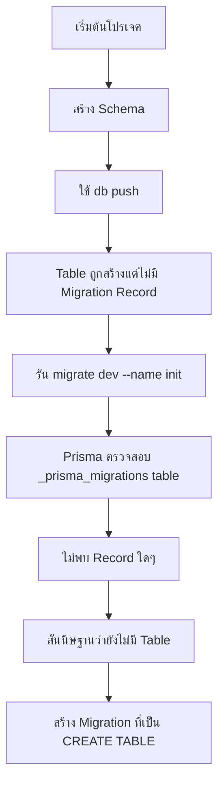
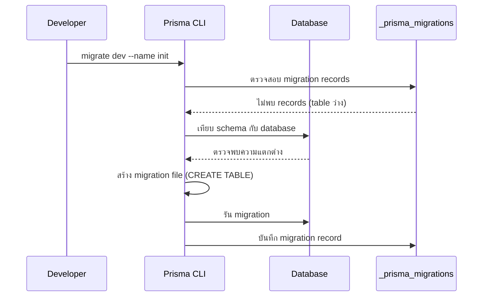
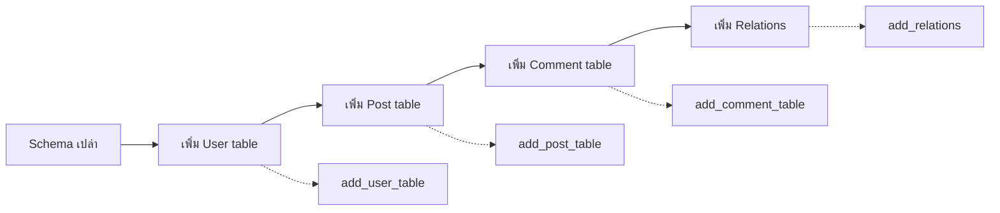
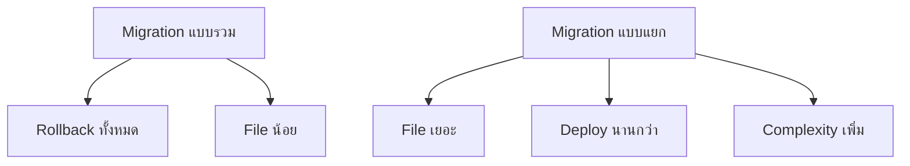
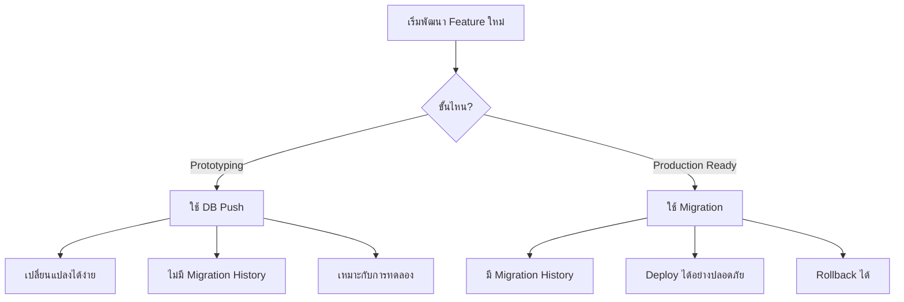

# Prisma Q&A - คู่มือการใช้งาน Migration และ Database Management

## 📝 สารบัญ

- [เหตุผลที่ Migration แสดง CREATE TABLE](#เหตุผลที่-migration-แสดง-create-table)
- [กระบวนการทำงานของ Prisma Migration](#กระบวนการทำงานของ-prisma-migration)
- [การตั้งชื่อ Migration Files](#การตั้งชื่อ-migration-files)
- [ข้อดีข้อเสียของการแยก Migration](#ข้อดีข้อเสียของการแยก-migration)
- [Database Seeding](#database-seeding)
- [ข้อจำกัดของ Prisma Schema](#ข้อจำกัดของ-prisma-schema)
- [การใช้ Prisma Client](#การใช้-prisma-client)
- [Logging Configuration](#logging-configuration)
- [DB Push vs Migration](#db-push-vs-migration)

---

## ⚡ เหตุผลที่ Migration แสดง CREATE TABLE

### 🤔 ปัญหาที่พบ

เมื่อทำการรัน migration ครั้งแรก ทำไมไฟล์ migration ถึงแสดงเป็น `CREATE TABLE` แทนที่จะเป็น `ALTER TABLE`?

### 💡 คำตอบ



**สาเหตุหลัก:**

- การใช้ `db push` จะสร้าง table โดยตรงโดยไม่บันทึกใน migration history
- Prisma ไม่ "รู้" ว่ามีการสร้าง table แล้ว
- เมื่อรัน migration ครั้งแรก Prisma จึงคิดว่าต้องสร้าง table ใหม่ทั้งหมด

---

## 🔄 กระบวนการทำงานของ Prisma Migration

### 📊 Migration Tracking Process



### 🗂️ ตัวอย่าง Migration Files

**Migration 1: `20231201_init/migration.sql`**

```sql
-- CreateTable
CREATE TABLE "User" (
    "id" SERIAL NOT NULL,
    "email" TEXT NOT NULL,
    "name" TEXT,

    CONSTRAINT "User_pkey" PRIMARY KEY ("id")
);
```

**Migration 2: `20231202_add_password/migration.sql`**

```sql
-- AlterTable
ALTER TABLE "User" ADD COLUMN "password" TEXT NOT NULL;
```

---

## 📛 การตั้งชื่อ Migration Files

### ❓ คำถาม

จำเป็นต้องใช้ชื่อ "init" สำหรับ migration แรกเสมอหรือไม่?

### ✅ คำตอบ

**ไม่จำเป็น!** สามารถใช้ชื่ออะไรก็ได้ที่อธิบายการเปลี่ยนแปลง

```bash
# ตัวอย่างชื่อ migration ที่ดี
npx prisma migrate dev --name add_user_table
npx prisma migrate dev --name add_post_table
npx prisma migrate dev --name add_user_post_relation
npx prisma migrate dev --name add_authentication_fields
```

### 🎯 Best Practice แนะนำ



**ข้อดี:**

- ✅ Rollback ได้ทีละส่วน
- ✅ Debug ง่ายกว่า
- ✅ History ชัดเจน
- ✅ Collaboration ดีกว่า

---

## 🔀 ข้อดีข้อเสียของการแยก Migration

### 💚 ข้อดี

| ด้าน            | รายละเอียด                                     |
| --------------- | ---------------------------------------------- |
| **Rollback**    | สามารถย้อนกลับได้ทีละส่วน                      |
| **Debugging**   | หาปัญหาได้ง่าย เพราะแต่ละ migration ทำงานเฉพาะ |
| **Team Work**   | Merge conflict น้อยลง                          |
| **Maintenance** | แก้ไขเฉพาะส่วนที่มีปัญหา                       |

### 🔴 ข้อเสีย



---

## 🌱 Database Seeding

### 🤔 คำถาม

หาก migration ไม่มี seeding file จะเกิดอะไรขึ้น?

### 💭 คำตอบ

**ไม่เป็นไร!** Seeding ไม่ใช่สิ่งจำเป็น

### 📋 ตัวอย่าง Seeding File

```typescript
// prisma/seed.ts
import { PrismaClient } from "@prisma/client";

const prisma = new PrismaClient();

async function main() {
  // สร้างข้อมูล User ตัวอย่าง
  const users = await prisma.user.createMany({
    data: [
      {
        email: "john@example.com",
        name: "John Doe",
        password: "hashedPassword123",
      },
      {
        email: "jane@example.com",
        name: "Jane Smith",
        password: "hashedPassword456",
      },
    ],
  });

  console.log(`Created ${users.count} users`);
}

main()
  .catch((e) => {
    console.error(e);
    process.exit(1);
  })
  .finally(async () => {
    await prisma.$disconnect();
  });
```

### 🎯 ประโยชน์ของ Seeding

- ⚡ ลดเวลา development (ไม่ต้องสร้างข้อมูลทดสอบเอง)
- 🧪 ข้อมูลสำหรับ testing
- 🚀 Demo data สำหรับ presentation

---

## ⚠️ ข้อจำกัดของ Prisma Schema

### 🚨 ปัญหาใหญ่

**ไม่สามารถแยกไฟล์ Schema ได้!**

```
❌ ไม่ได้
prisma/
├── user.prisma
├── post.prisma
└── comment.prisma

✅ ได้เฉพาะ
prisma/
└── schema.prisma (ทุกอย่างต้องอยู่ในไฟล์เดียว)
```

### 📏 ตัวอย่างไฟล์ที่ใหญ่มาก

```prisma
// schema.prisma - ระบบใหญ่ๆ อาจมี 100+ models!
generator client {
  provider = "prisma-client-js"
}

datasource db {
  provider = "postgresql"
  url      = env("DATABASE_URL")
}

model User {
  id        Int      @id @default(autoincrement())
  email     String   @unique
  name      String?
  posts     Post[]
  comments  Comment[]
  // ... อีก 20+ fields
}

model Post {
  id          Int       @id @default(autoincrement())
  title       String
  content     String?
  published   Boolean   @default(false)
  authorId    Int
  author      User      @relation(fields: [authorId], references: [id])
  comments    Comment[]
  categories  Category[]
  tags        Tag[]
  // ... อีก 15+ fields
}

// ... อีก 50+ models
```

### 🔧 **การปรับปรุงจากเดิม**: Workaround ที่แนะนำ

```typescript
// lib/schema-parts/user.ts
export const userSchema = `
model User {
  id        Int      @id @default(autoincrement())
  email     String   @unique
  name      String?
  posts     Post[]
  comments  Comment[]
}
`;

// lib/schema-parts/post.ts
export const postSchema = `
model Post {
  id          Int       @id @default(autoincrement())
  title       String
  content     String?
  published   Boolean   @default(false)
  authorId    Int
  author      User      @relation(fields: [authorId], references: [id])
}
`;

// scripts/generate-schema.ts
import { userSchema, postSchema } from "../lib/schema-parts";

const fullSchema = `
generator client {
  provider = "prisma-client-js"
}

datasource db {
  provider = "postgresql"
  url      = env("DATABASE_URL")
}

${userSchema}
${postSchema}
`;

// เขียนลงไฟล์ schema.prisma
```

---

## 🔌 การใช้ Prisma Client

### 📝 การใช้งานพื้นฐาน

```typescript
// ❌ วิธีเก่า - เรียกตรงๆ
import { PrismaClient } from "@prisma/client";

const prisma = new PrismaClient();

// ใช้งาน
const users = await prisma.user.findMany();
```

### ✨ **การปรับปรุงจากเดิม**: วิธีใหม่ที่แนะนำ

```typescript
// lib/db.ts - ไฟล์แยกสำหรับ Prisma Client
import { PrismaClient } from "@prisma/client";

const globalForPrisma = globalThis as unknown as {
  prisma: PrismaClient | undefined;
};

export const prisma =
  globalForPrisma.prisma ??
  new PrismaClient({
    log:
      process.env.NODE_ENV === "development"
        ? ["query", "error", "warn"]
        : ["error"],
  });

if (process.env.NODE_ENV !== "production") globalForPrisma.prisma = prisma;
```

**ใช้งาน:**

```typescript
// pages/api/users.ts
import { prisma } from "@/lib/db";

export default async function handler(req, res) {
  const users = await prisma.user.findMany();
  res.json(users);
}
```

### 🎯 ข้อดีของวิธีใหม่

- ✅ Configuration รวมศูนย์
- ✅ ป้องกัน connection เยอะเกิน (Development)
- ✅ Logging แยกตาม environment
- ✅ Reusable

---

## 📊 Logging Configuration

### 🔧 **การปรับปรุงจากเดิม**: Logging แบบ Advanced

```typescript
// lib/db.ts
import { PrismaClient } from "@prisma/client";

const getLogLevel = () => {
  switch (process.env.NODE_ENV) {
    case "development":
      return ["query", "error", "warn", "info"];
    case "test":
      return ["error"];
    case "production":
      return ["error", "warn"];
    default:
      return ["error"];
  }
};

export const prisma = new PrismaClient({
  log: getLogLevel(),
  errorFormat: "pretty", // Development เท่านั้น
});
```

### 📋 Log Level ตาม Environment

| Environment     | Logs                             | เหตุผล                 |
| --------------- | -------------------------------- | ---------------------- |
| **Development** | `query`, `error`, `warn`, `info` | Debug ต้องการข้อมูลครบ |
| **Test**        | `error`                          | ลด noise ในการ test    |
| **Production**  | `error`, `warn`                  | Performance + Storage  |

---

## ⚔️ DB Push vs Migration

### 🤔 เมื่อไหร่ใช้อะไร?



### 📊 เปรียบเทียบ DB Push vs Migration

| ด้าน            | DB Push     | Migration   |
| --------------- | ----------- | ----------- |
| **ความเร็ว**    | ⚡ เร็วมาก  | 🐌 ช้ากว่า  |
| **History**     | ❌ ไม่มี    | ✅ มี       |
| **Rollback**    | ❌ ยาก      | ✅ ง่าย     |
| **Production**  | ❌ ไม่แนะนำ | ✅ แนะนำ    |
| **Prototyping** | ✅ เหมาะมาก | ❌ เสียเวลา |

### 🎯 **การปรับปรุงจากเดิม**: Workflow ที่แนะนำ

```bash
# Phase 1: Prototyping
npx prisma db push    # ทดลองไปเรื่อยๆ
npx prisma db push    # เปลี่ยนแปลงอีก
npx prisma db push    # จนกว่าจะพอใจ

# Phase 2: Finalize
npx prisma migrate dev --name "initial_schema"  # สร้าง migration จริง
```

### 🔄 ตัวอย่าง Prototyping Process

**1. เริ่มต้น Schema:**

```prisma
model User {
  id    Int    @id @default(autoincrement())
  email String @unique
  firstName String  // ทดลองใช้ firstName
}
```

**2. ไม่พอใจ เปลี่ยนเป็น:**

```prisma
model User {
  id    Int    @id @default(autoincrement())
  email String @unique
  fullName String  // เปลี่ยนเป็น fullName
}
```

**3. ยังไม่พอใจ เปลี่ยนอีก:**

```prisma
model User {
  id    Int    @id @default(autoincrement())
  email String @unique
  name String  // สุดท้ายใช้ name
}
```

**หากใช้ Migration:** จะได้ 3 files!

- `add_user_with_firstname.sql`
- `change_firstname_to_fullname.sql`
- `change_fullname_to_name.sql`

**หาก ใช้ DB Push:** แล้วค่อย migrate ตอนจบ จะได้แค่ 1 file!

- `initial_user_schema.sql`

---

## 🎉 สรุป

### ✨ จุดสำคัญที่ต้องจำ

1. **🔄 Migration Tracking**: Prisma ใช้ `_prisma_migrations` table ในการ track
2. **📛 Naming**: ชื่อ migration ตั้งอะไรก็ได้ที่สื่อความหมาย
3. **📁 File Organization**: Schema ต้องอยู่ไฟล์เดียว (ข้อจำกัดของ Prisma)
4. **🌱 Seeding**: ไม่จำเป็น แต่มีประโยชน์สำหรับ development
5. **⚔️ Push vs Migration**:
   - Push สำหรับ prototyping
   - Migration สำหรับ production

### 🚀 **สิ่งที่ปรับปรุงจากเดิม**

- ✅ เพิ่ม Visualization ด้วย Mermaid diagrams
- ✅ เพิ่มตัวอย่าง Code ที่ครบถ้วน
- ✅ เพิ่ม Best Practices และ Workarounds
- ✅ เพิ่มตาราง Comparison แบบละเอียด
- ✅ เพิ่ม Advanced Logging Configuration
- ✅ เพิ่มคำแนะนำ Workflow สำหรับ Team
- ✅ เพิ่มการจัดโครงสร้างแบบ Modular

> 💡 **Pro Tip**: ใช้ DB Push ในช่วง development และสร้าง Migration เมื่อพร้อม deploy เท่านั้น!
