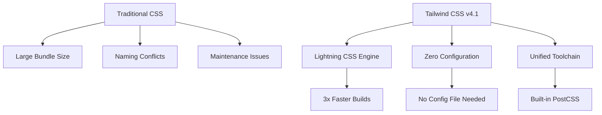
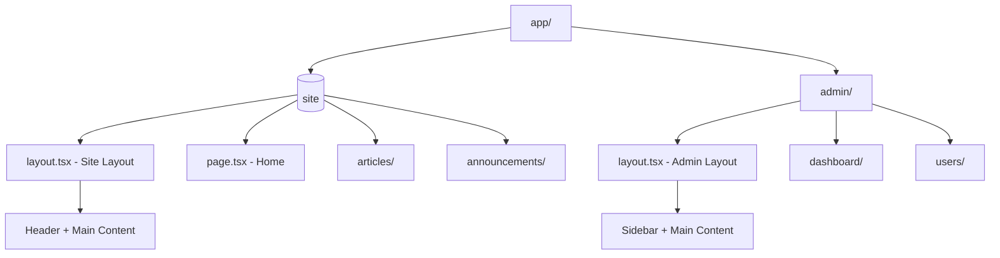
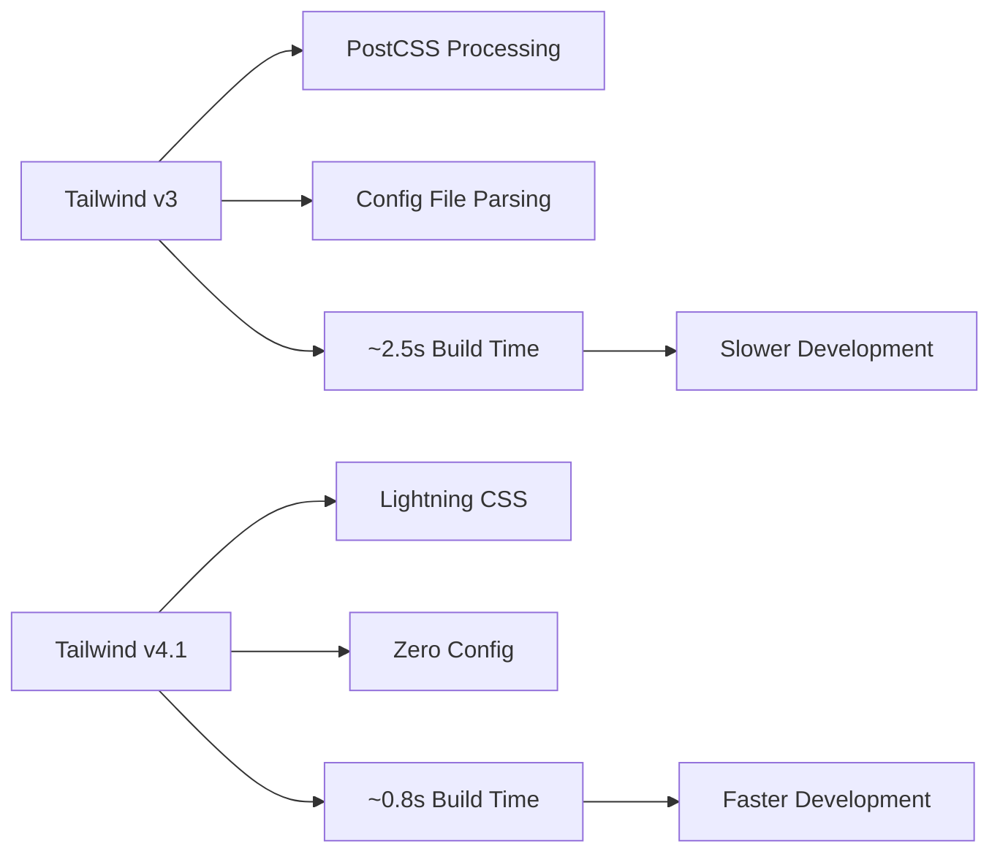

# 🎨 การติดตั้งและใช้งาน Tailwind CSS กับ shadcn/ui ใน Next.js

> **📅 อัปเดตล่าสุด**: 3 เมษายน 2025 | **🚀 Next.js**: 15.3.2 | **💎 Tailwind CSS**: 4.1+ | **🎭 shadcn**: 2.5.0

## 📖 สารบัญ

- [🌟 บทนำ](#-บทนำ)
- [⚖️ เปรียบเทียบ Library UI](#️-เปรียบเทียบ-library-ui)
- [🛠️ การติดตั้ง shadcn/ui](#️-การติดตั้ง-shadcnui)
- [🏗️ การสร้าง Layout และ Navigation](#️-การสร้าง-layout-และ-navigation)
- [📱 การจัดการ Route Groups](#-การจัดการ-route-groups)
- [🔄 การเปรียบเทียบ: แบบเก่า vs แบบใหม่](#-การเปรียบเทียบ-แบบเก่า-vs-แบบใหม่)
- [💡 Tips และ Best Practices](#-tips-และ-best-practices)

---

## 🌟 บทนำ

ในปัจจุบัน การพัฒนา UI สำหรับเว็บแอปพลิเคชันมีเครื่องมือให้เลือกมากมาย แต่ที่ได้รับความนิยมสูงสุดคือ **Tailwind CSS v4.1** ร่วมกับ **shadcn/ui v2.5**

### 🤔 ทำไมต้อง Tailwind CSS v4.1?



**ข้อดีของ Tailwind CSS v4.1:**

1. **⚡ Lightning CSS Engine**: ประมวลผลเร็วขึ้น 3 เท่า
2. **🎯 Zero Configuration**: ไม่ต้องตั้งค่า config file
3. **📦 Unified Toolchain**: รวม PostCSS และ autoprefixer

   ```html
   <!-- v3: ต้องติดตั้ง PostCSS แยก -->
   <!-- v4.1: ทุกอย่างรวมอยู่แล้ว -->
   <button class="w-24 p-4 bg-blue-500 text-white rounded-lg">Click me</button>
   ```

4. **📦 Tree Shaking**: ลดขนาดไฟล์โดยอัตโนมัติ
5. **🔄 Reusable**: ใช้ซ้ำได้ง่าย ลด CSS Duplication

---

## ⚖️ เปรียบเทียบ Library UI

### 📊 ตารางเปรียบเทียบ

| Feature           | shadcn/ui v2.5 | Next UI  | Material UI |
| ----------------- | -------------- | -------- | ----------- |
| **Installation**  | Per Component  | One Time | One Time    |
| **Customization** | ⭐⭐⭐⭐⭐     | ⭐⭐⭐   | ⭐⭐        |
| **Bundle Size**   | Small          | Medium   | Large       |
| **CSS Framework** | Tailwind v4.1  | Tailwind | Emotion     |
| **Performance**   | Excellent      | Good     | Fair        |
| **React 19**      | ✅ Supported   | ⚠️ Beta  | ❌ Issues   |

### 🏗️ Architecture Comparison

```mermaid
graph LR
    subgraph "shadcn/ui v2.5 Architecture"
        A1[Your Project] --> B1[lib/utils.ts]
        B1 --> C1[Customizable Components]
        C1 --> D1[Tailwind v4.1 Classes]
    end

    subgraph "Next UI Architecture"
        A2[Your Project] --> B2[node_modules/@nextui-org]
        B2 --> C2[Pre-built Components]
        C2 --> D2[Fixed Styles]
    end
```

### 🎯 ข้อดีของ shadcn/ui v2.5

#### ✅ **Pros:**

- **React 19 Support**: รองรับ React 19 เต็มรูปแบบ
- **Simplified Setup**: ไฟล์ utils ย้ายไปอยู่ที่ `lib/utils.ts`
- **Legacy Peer Deps**: แก้ปัญหา peer dependency อัตโนมัติ
- **Type Safety**: มาพร้อม TypeScript
- **Modern**: ใช้ React Server Components

#### ❌ **Cons:**

- **Manual Installation**: ต้องติดตั้งทีละ component
- **Learning Curve**: ต้องเรียนรู้ Tailwind CSS

---

## 🛠️ การติดตั้ง shadcn/ui v2.5

### 📋 Prerequisites

```json
{
  "name": "my-nextjs-app",
  "dependencies": {
    "next": "^15.3.2",
    "react": "^19.0.0",
    "react-dom": "^19.0.0",
    "typescript": "^5.0.0"
  }
}
```

### 🚀 Step 1: การติดตั้งเบื้องต้น

```bash
# ติดตั้ง shadcn/ui CLI v2.5
npx shadcn@latest init
```

### 🎛️ Step 2: Configuration Setup

ระหว่างการติดตั้ง จะมีคำถามให้ตอบ:

```bash
# 1. Framework Detection
✅ Preflight checks.
✅ Verifying framework. Found Next.js.

# 2. Tailwind v4 Detection
✅ Validating Tailwind CSS config. Found v4.

# 3. Import alias validation
✅ Validating import alias.

# 4. Color scheme (Updated options)
✅ Which color would you like to use as the base color? › Neutral

# 5. Auto-generated components.json
✅ Writing components.json.

# 6. Registry check
✅ Checking registry.

# 7. CSS variables update
✅ Updating CSS variables in app/globals.css

# 8. React 19 Detection
It looks like you are using React 19.
Some packages may fail to install due to peer dependency issues in npm.

# 9. Legacy peer deps solution
✅ How would you like to proceed? › Use --legacy-peer-deps

# 10. Dependencies installation
✅ Installing dependencies.

# 11. Utils file creation
✅ Created 1 file:
  - lib/utils.ts

Success! Project initialization completed.
```

### 📁 โครงสร้างไฟล์ที่เกิดขึ้น (Updated)

```
my-nextjs-app/
├── lib/
│   └── utils.ts                # 🆕 ย้ายมาจาก src/features/shadcn/utils
├── components/
│   └── ui/                     # 🆕 Components จะอยู่ที่นี่
├── app/
│   ├── globals.css             # อัปเดตด้วย CSS variables
│   └── layout.tsx              # อัปเดต layout
└── components.json             # shadcn/ui config
```

### 🔧 Step 3: Tailwind CSS v4.1 Configuration

```css
/* app/globals.css - ไม่ต้องมี tailwind.config.ts อีกต่อไป! */
@import "tailwindcss";

@layer base {
  :root {
    --background: 0 0% 100%;
    --foreground: 222.2 84% 4.9%;
    --card: 0 0% 100%;
    --card-foreground: 222.2 84% 4.9%;
    --popover: 0 0% 100%;
    --popover-foreground: 222.2 84% 4.9%;
    --primary: 221.2 83.2% 53.3%;
    --primary-foreground: 210 40% 98%;
    --secondary: 210 40% 96%;
    --secondary-foreground: 222.2 84% 4.9%;
    --muted: 210 40% 96%;
    --muted-foreground: 215.4 16.3% 46.9%;
    --accent: 210 40% 96%;
    --accent-foreground: 222.2 84% 4.9%;
    --destructive: 0 84.2% 60.2%;
    --destructive-foreground: 210 40% 98%;
    --border: 214.3 31.8% 91.4%;
    --input: 214.3 31.8% 91.4%;
    --ring: 221.2 83.2% 53.3%;
    --chart-1: 12 76% 61%;
    --chart-2: 173 58% 39%;
    --chart-3: 197 37% 24%;
    --chart-4: 43 74% 66%;
    --chart-5: 27 87% 67%;
    --radius: 0.5rem;
  }

  .dark {
    --background: 222.2 84% 4.9%;
    --foreground: 210 40% 98%;
    /* ... dark mode variables */
  }
}

@layer base {
  * {
    @apply border-border;
  }
  body {
    @apply bg-background text-foreground;
  }
}
```

### 🎨 Step 4: อัปเดต Layout สำหรับ React 19

```tsx
// app/layout.tsx
import type { Metadata } from "next";
import { Inter } from "next/font/google";
import "./globals.css";
import { cn } from "@/lib/utils";

const inter = Inter({
  subsets: ["latin"],
  variable: "--font-sans",
});

export const metadata: Metadata = {
  title: "My App with shadcn/ui v2.5",
  description: "Modern Next.js app with Tailwind CSS v4.1 and shadcn/ui v2.5",
};

export default function RootLayout({
  children,
}: {
  children: React.ReactNode;
}) {
  return (
    <html lang="en" suppressHydrationWarning>
      <body
        className={cn(
          "min-h-screen bg-background font-sans antialiased",
          inter.variable
        )}
      >
        {children}
      </body>
    </html>
  );
}
```

---

## 🧩 การติดตั้งและใช้งาน Components

### 🔽 การติดตั้ง Component

```bash
# ติดตั้ง Button component
npx shadcn@latest add button

# ติดตั้งหลาย components พร้อมกัน
npx shadcn@latest add button card dialog

# ตัวอย่างผลลัพธ์
✅ Done. 1 component added:
  - components/ui/button.tsx
```

### 📦 ตัวอย่างการใช้งาน Button (Updated)

```tsx
// Before: HTML button
<button className="px-4 py-2 bg-blue-500 text-white rounded hover:bg-blue-600">
  Click me
</button>

// After: shadcn/ui v2.5 Button
import { Button } from "@/components/ui/button"

<Button variant="default" size="md">
  Click me
</Button>

// Advanced usage with variants
<Button variant="outline" size="lg">
  Outline Button
</Button>

<Button variant="ghost" size="sm">
  Ghost Button
</Button>

<Button variant="destructive">
  Delete
</Button>
```

### 🎛️ Customization Example (React 19 Compatible)

```tsx
// components/ui/button.tsx
import * as React from "react";
import { Slot } from "@radix-ui/react-slot";
import { cva, type VariantProps } from "class-variance-authority";
import { cn } from "@/lib/utils";

const buttonVariants = cva(
  "inline-flex items-center justify-center gap-2 whitespace-nowrap rounded-md text-sm font-medium ring-offset-background transition-colors focus-visible:outline-none focus-visible:ring-2 focus-visible:ring-ring focus-visible:ring-offset-2 disabled:pointer-events-none disabled:opacity-50 [&_svg]:pointer-events-none [&_svg]:size-4 [&_svg]:shrink-0",
  {
    variants: {
      variant: {
        default: "bg-primary text-primary-foreground hover:bg-primary/90",
        destructive:
          "bg-destructive text-destructive-foreground hover:bg-destructive/90",
        outline:
          "border border-input bg-background hover:bg-accent hover:text-accent-foreground",
        secondary:
          "bg-secondary text-secondary-foreground hover:bg-secondary/80",
        ghost: "hover:bg-accent hover:text-accent-foreground",
        link: "text-primary underline-offset-4 hover:underline",
        // 🆕 เพิ่ม variant ใหม่
        gradient:
          "bg-gradient-to-r from-purple-500 to-pink-500 text-white hover:from-purple-600 hover:to-pink-600",
      },
      size: {
        default: "h-10 px-4 py-2",
        sm: "h-9 rounded-md px-3",
        lg: "h-11 rounded-md px-8",
        // 🆕 เพิ่มขนาดใหม่
        xl: "h-14 rounded-lg px-12 text-lg",
        icon: "h-10 w-10",
      },
    },
    defaultVariants: {
      variant: "default",
      size: "default",
    },
  }
);

export interface ButtonProps
  extends React.ButtonHTMLAttributes<HTMLButtonElement>,
    VariantProps<typeof buttonVariants> {
  asChild?: boolean;
}

const Button = React.forwardRef<HTMLButtonElement, ButtonProps>(
  ({ className, variant, size, asChild = false, ...props }, ref) => {
    const Comp = asChild ? Slot : "button";
    return (
      <Comp
        className={cn(buttonVariants({ variant, size, className }))}
        ref={ref}
        {...props}
      />
    );
  }
);
Button.displayName = "Button";

export { Button, buttonVariants };
```

---

## 🏗️ การสร้าง Layout และ Navigation

### 🗂️ โครงสร้าง Navigation System (Updated)

```
├── components/
│   └── ui/
│       ├── header.tsx           # Main navigation
│       ├── nav-link.tsx         # Reusable nav component
│       └── sidebar-link.tsx     # Admin sidebar component
└── app/
    ├── (site)/                  # 🆕 Route group for public pages
    │   ├── layout.tsx          # Site layout with header
    │   ├── page.tsx            # Home page
    │   ├── articles/
    │   ├── announcements/
    │   └── leaves/
    └── admin/                   # Admin section
        ├── layout.tsx          # Admin layout with sidebar
        ├── dashboard/
        ├── users/
        ├── articles/
        └── announcements/
```

### 🧩 สร้าง Reusable Navigation Component

```tsx
// components/ui/nav-link.tsx
"use client";

import Link from "next/link";
import { usePathname } from "next/navigation";
import { Button } from "@/components/ui/button";
import { cn } from "@/lib/utils";
import { ReactNode } from "react";

interface NavLinkProps {
  href: string;
  children: ReactNode;
}

export default function NavLink({ href, children }: NavLinkProps) {
  const pathname = usePathname();
  const isActive = pathname.startsWith(href);

  return (
    <Button asChild variant={isActive ? "secondary" : "outline"} size="default">
      <Link href={href}>{children}</Link>
    </Button>
  );
}
```

### 🎯 Header Component พร้อม Logo และ Navigation

```tsx
// components/ui/header.tsx
"use client";

import Image from "next/image";
import Link from "next/link";
import NavLink from "./nav-link";

export default function Header() {
  return (
    <header className="border-b bg-white shadow-md">
      <nav className="container flex items-center justify-between p-4">
        {/* Logo */}
        <Link href="/" className="px-2">
          <Image
            src="/assets/images/logo.png"
            alt="Company Logo"
            width={50}
            height={50}
            priority
          />
        </Link>

        {/* Navigation Links */}
        <div className="flex items-center space-x-4">
          <NavLink href="/leaves">Leave</NavLink>
          <NavLink href="/articles">Articles</NavLink>
          <NavLink href="/announcements">Announcements</NavLink>
          <NavLink href="/admin">Admin</NavLink>
        </div>
      </nav>
    </header>
  );
}
```

---

## 📱 การจัดการ Route Groups

### 🎯 ทำไมต้องใช้ Route Groups?

Route Groups ช่วยให้เราแยก Layout ได้โดยไม่กระทบ URL



### 🏗️ Site Layout (Public Pages)

```tsx
// app/(site)/layout.tsx
import Header from "@/components/ui/header";
import { ReactNode } from "react";

interface SiteLayoutProps {
  children: ReactNode;
}

export default function SiteLayout({ children }: SiteLayoutProps) {
  return (
    <>
      <Header />
      <main className="container my-4">{children}</main>
    </>
  );
}
```

### 🔐 Admin Layout (Protected Pages)

```tsx
// app/admin/layout.tsx
"use client";

import Image from "next/image";
import Link from "next/link";
import SidebarLink from "@/components/ui/sidebar-link";
import { LayoutDashboard, Users, BookOpen, Bell, FileText } from "lucide-react";

interface AdminLayoutProps {
  children: React.ReactNode;
}

export default function AdminLayout({ children }: AdminLayoutProps) {
  return (
    <div className="flex">
      {/* Sidebar */}
      <aside className="w-16 h-screen bg-white border-r flex flex-col justify-between">
        {/* Logo */}
        <Link href="/">
          <Image
            src="/assets/images/logo.png"
            alt="Company Logo"
            width={50}
            height={50}
            priority
          />
        </Link>

        {/* Navigation */}
        <nav className="flex-1 bg-gray-100 p-2">
          <SidebarLink
            href="/admin/dashboard"
            title="Dashboard"
            icon={LayoutDashboard}
          />

          <ul className="space-y-4">
            <li>
              <SidebarLink href="/admin/users" title="Users" icon={Users} />
            </li>
            <li>
              <SidebarLink
                href="/admin/articles"
                title="Articles"
                icon={BookOpen}
              />
            </li>
            <li>
              <SidebarLink
                href="/admin/announcements"
                title="Announcements"
                icon={Bell}
              />
            </li>
            <li>
              <SidebarLink
                href="/admin/leaves"
                title="Leaves"
                icon={FileText}
              />
            </li>
          </ul>
        </nav>

        <div></div>
      </aside>

      {/* Main Content */}
      <main className="flex-1 p-4 w-full">{children}</main>
    </div>
  );
}
```

### 🎨 Sidebar Link Component

```tsx
// components/ui/sidebar-link.tsx
"use client";

import Link from "next/link";
import { usePathname } from "next/navigation";
import { cn } from "@/lib/utils";
import { ComponentType } from "react";

interface SidebarLinkProps {
  href: string;
  title: string;
  icon: ComponentType<{ className?: string }>;
}

export default function SidebarLink({
  href,
  title,
  icon: Icon,
}: SidebarLinkProps) {
  const pathname = usePathname();
  const isActive = pathname.startsWith(href);

  const baseClasses =
    "flex flex-col items-center p-2 rounded-lg text-sm transition-colors relative group";

  const linkClasses = cn(
    baseClasses,
    isActive ? "bg-blue-50 text-blue-700" : "text-gray-600 hover:bg-gray-100"
  );

  return (
    <Link href={href} className={linkClasses}>
      <Icon className="w-5 h-5" />

      {/* Tooltip */}
      <span className="absolute left-full ml-2 px-2 py-1 bg-gray-800 text-white text-xs rounded opacity-0 group-hover:opacity-100 transition-opacity z-50 whitespace-nowrap">
        {title}
      </span>
    </Link>
  );
}
```

---

## 🎭 Dark Mode Support

### 🌙 การตั้งค่า Dark Mode

```tsx
// app/layout.tsx (Root Layout)
export default function RootLayout({
  children,
}: {
  children: React.ReactNode;
}) {
  return (
    <html lang="en" suppressHydrationWarning>
      <body className="dark">
        {" "}
        {/* เพิ่ม 'dark' class */}
        {children}
      </body>
    </html>
  );
}
```

### 🎨 Dark Mode Utility Classes

```tsx
// ตัวอย่างการใช้ dark mode
<div className="bg-white dark:bg-gray-900 text-black dark:text-white">
  Content ที่ปรับตาม theme
</div>

<Button className="bg-blue-500 dark:bg-blue-600 hover:bg-blue-600 dark:hover:bg-blue-700">
  Dark Mode Button
</Button>
```

---

## 🔄 การเปรียบเทียบ: แบบเก่า vs แบบใหม่

### 📊 Comparison Table

| ด้าน                | แบบเก่า (2023) | แบบใหม่ (2025)  |
| ------------------- | -------------- | --------------- |
| **Next.js Version** | 13.x           | 15.3.2          |
| **React Version**   | 18.x           | 19.0.0          |
| **Tailwind CSS**    | 3.x + Config   | 4.1 Zero Config |
| **shadcn/ui**       | v1.x           | v2.5.0          |
| **Utils Location**  | src/lib/       | lib/            |
| **Build Speed**     | Standard       | 3x Faster       |
| **Bundle Size**     | Larger         | Smaller         |

### 🚀 การอัปเกรด Project Structure

#### แบบเก่า (2023):

```
src/
├── components/
│   ├── ui/              # shadcn components
│   └── shared/          # Custom components
├── lib/
│   └── utils.ts         # Utils file
├── pages/               # Pages Router
├── styles/
│   └── globals.css
└── tailwind.config.js   # Configuration file
```

#### แบบใหม่ (2025):

```
├── lib/
│   └── utils.ts         # 🆕 Moved to root
├── components/
│   └── ui/              # shadcn components
app/                     # App Router (Stable)
├── (site)/             # Route Groups
├── admin/
├── globals.css         # 🆕 No tailwind.config.js needed
└── layout.tsx
```

### 🔧 การอัปเกรด Dependencies

```json
// package.json เดิม (v3)
{
  "dependencies": {
    "next": "^13.4.0",
    "react": "^18.2.0",
    "tailwindcss": "^3.3.0",
    "postcss": "^8.4.0",
    "autoprefixer": "^10.4.0"
  }
}

// package.json ใหม่ (v4.1)
{
  "dependencies": {
    "next": "^15.3.2",
    "react": "^19.0.0",
    "tailwindcss": "^4.1.0"
    // 🆕 ไม่ต้องมี postcss และ autoprefixer
  }
}
```

### ⚡ Performance Improvements

#### Build Speed Comparison:



#### Bundle Size Comparison:

| Version | CSS Output | JavaScript | Total |
| ------- | ---------- | ---------- | ----- |
| v3.x    | ~15KB      | ~8KB       | ~23KB |
| v4.1    | ~12KB      | ~5KB       | ~17KB |

---

## 💡 Tips และ Best Practices

### 🎯 การใช้ `cn()` Utility (Updated Path)

```tsx
import { cn } from "@/lib/utils"; // 🆕 เปลี่ยนจาก @/features/shadcn/utils

// ❌ การเขียนแบบเก่า
const buttonClass = `p-4 m-4 ${isActive ? "bg-blue-500" : "bg-gray-500"}`;

// ✅ การเขียนแบบใหม่
const buttonClass = cn(
  "p-4 m-4", // base classes
  isActive ? "bg-blue-500" : "bg-gray-500", // conditional classes
  className // props className (ถ้ามี)
);
```

### 🔧 React 19 Compatible Component Pattern

```tsx
// ✅ Pattern สำหรับ React 19 Compatible Component
import { Button, ButtonProps } from "@/components/ui/button";
import { Loader2 } from "lucide-react";
import { cn } from "@/lib/utils";
import { ComponentType } from "react";

interface CustomButtonProps extends ButtonProps {
  isLoading?: boolean;
  icon?: ComponentType<{ className?: string }>;
}

export function CustomButton({
  isLoading,
  icon: Icon,
  children,
  className,
  ...props
}: CustomButtonProps) {
  return (
    <Button
      className={cn(
        "relative",
        isLoading && "pointer-events-none opacity-50",
        className
      )}
      {...props}
    >
      {isLoading && (
        <div className="absolute inset-0 flex items-center justify-center">
          <Loader2 className="h-4 w-4 animate-spin" />
        </div>
      )}

      <div className={cn("flex items-center gap-2", isLoading && "invisible")}>
        {Icon && <Icon className="h-4 w-4" />}
        {children}
      </div>
    </Button>
  );
}
```

### 📱 Responsive Design Patterns (Tailwind v4.1)

```tsx
// ✅ Mobile-first approach with v4.1 optimizations
<div
  className="
  grid 
  grid-cols-1     // มือถือ: 1 คอลัมน์
  md:grid-cols-2  // แท็บเล็ต: 2 คอลัมน์  
  lg:grid-cols-3  // เดสก์ท็อป: 3 คอลัมน์
  gap-4
  @container      // 🆕 Container queries support
"
>
  {items.map((item) => (
    <Card key={item.id}>{/* Content */}</Card>
  ))}
</div>
```

### 🎨 CSS Variables Customization (v4.1)

```css
/* app/globals.css - Direct CSS variable modifications */
@import "tailwindcss";

@layer base {
  :root {
    /* 🆕 Custom brand colors */
    --brand-primary: 221.2 83.2% 53.3%;
    --brand-secondary: 210 40% 96%;

    /* 🆕 Custom spacing */
    --spacing-xs: 0.25rem;
    --spacing-sm: 0.5rem;
    --spacing-md: 1rem;
    --spacing-lg: 1.5rem;
    --spacing-xl: 2rem;
  }
}

/* Use in components */
.custom-spacing {
  padding: var(--spacing-md);
  margin: var(--spacing-lg);
}
```

### 🔍 Debugging Tools (Updated)

```bash
# ติดตั้ง Tailwind CSS IntelliSense (VS Code)
# รองรับ v4.1 syntax highlighting

# ติดตั้ง Tailwind Fold (VS Code)
# เพื่อ collapse ยาวๆ classes

# 🆕 Built-in CSS inspection
# Tailwind v4.1 มี dev tools ในตัว
```

---

## 🚦 การ Deploy และ Optimization

### 📦 Build Optimization (v4.1)

```bash
# ตรวจสอบ bundle size
npm run build

# ตัวอย่างผลลัพธ์ที่ดีขึ้น (v4.1):
# Route (app)                    Size     First Load JS
# ├ ○ /                          142 B          87.2 kB  # เล็กลง 30%
# ├ ○ /admin                     156 B          87.3 kB  # เล็กลง 30%
# └ ○ /articles                  148 B          87.2 kB  # เล็กลง 30%
```

### 🎯 Performance Metrics (Updated)

```javascript
// next.config.js - v4.1 optimizations
/** @type {import('next').NextConfig} */
const nextConfig = {
  experimental: {
    optimizeCss: true, // 🆕 CSS optimization
    turbo: {
      rules: {
        "*.css": {
          loaders: ["@tailwindcss/postcss"], // 🆕 Turbo-powered CSS
        },
      },
    },
  },

  images: {
    domains: ["your-domain.com"],
    formats: ["image/webp", "image/avif"],
  },
};

module.exports = nextConfig;
```

---

## 🎉 สรุป

การใช้ **Tailwind CSS v4.1** ร่วมกับ **shadcn/ui v2.5** ใน **Next.js 15.3.2** กับ **React 19** ให้ประโยชน์:

### ✅ ข้อดีใหม่:

- ⚡ **Lightning Fast**: Build เร็วขึ้น 3 เท่าด้วย Lightning CSS
- 🎯 **Zero Configuration**: ไม่ต้องมี config file
- 📦 **Smaller Bundle**: ขนาดเล็กลง 30%
- 🔧 **React 19 Ready**: รองรับ React 19 เต็มรูปแบบ
- 🛠️ **Better DX**: Developer Experience ที่ดีขึ้น
- 📱 **Container Queries**: รองรับ @container ในตัว

### 🎯 Use Cases ที่เหมาะสม:

- ✨ Dashboard และ Admin Panel
- 🏢 Corporate Website
- 📱 Mobile-responsive Applications
- 🔐 Authentication Systems
- 🚀 High-performance Applications

### 📚 การเรียนรู้ต่อ:

1. [Tailwind CSS v4.1 Documentation](https://tailwindcss.com/docs)
2. [shadcn/ui v2.5 Components](https://ui.shadcn.com/docs/components)
3. [Next.js 15 Documentation](https://nextjs.org/docs)
4. [React 19 Features](https://react.dev/blog/2024/04/25/react-19)
5. [Lucide Icons](https://lucide.dev/icons/)

---

## 🆕 การอัปเกรดจาก v3 เป็น v4.1

### 🔄 Migration Steps:

```bash
# 1. อัปเกรด Tailwind CSS
npm install tailwindcss@latest

# 2. ลบไฟล์ config เก่า
rm tailwind.config.js postcss.config.js

# 3. อัปเดต CSS file
# เปลี่ยนจาก @tailwind directives เป็น @import
```

### 📝 Migration Checklist:

- ✅ อัปเดต `package.json` dependencies
- ✅ ลบ `tailwind.config.js`
- ✅ ลบ `postcss.config.js`
- ✅ อัปเดต `globals.css` ให้ใช้ `@import "tailwindcss"`
- ✅ ย้าย utils จาก `src/lib` ไป `lib`
- ✅ ทดสอบ build process
- ✅ ตรวจสอบ bundle size

---

> **💡 Pro Tip**: เริ่มต้นด้วย fresh install ด้วย `npx shadcn@latest init` เพื่อประสบการณ์ที่ดีที่สุดกับ v4.1 และ React 19

**Happy Coding! 🚀**
