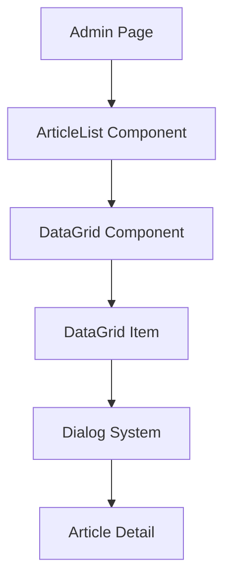

# Custom Components: สร้าง DataGrid Component และ Dialog System

> **สิ่งที่อัพเดตใหม่ 2025**: เพิ่ม TypeScript generics ที่เข้มงวดขึ้น, ใช้ Shadcn/ui components ล่าสุด, และปรับปรุง type safety สำหรับ Next.js 15.3.2

## 📋 เป้าหมายของบทเรียน

ในบทเรียนนี้เราจะสร้าง:

1. **DataGrid Component** - ตารางแสดงข้อมูลแบบ reusable
2. **Dialog System** - ระบบ popup สำหรับดูรายละเอียด
3. **Admin Interface** - หน้าจัดการบทความ



## 🏗️ สร้าง DataGrid Component

### 1. สร้าง Base Types

สร้างไฟล์ `features/ui/components/DataGrid.tsx`:

```typescript
// ✨ แบบใหม่ 2025: เพิ่ม strict typing
export interface DataRow {
  id: string | number;
}

export interface DataGridColumn<T extends DataRow> {
  field: keyof T;
  headerName: string;
}

export interface DataGridProps<T extends DataRow> {
  title: string;
  columns: DataGridColumn<T>[];
  rows?: T[];
  detailsComponent: React.ComponentType<T>;
}
```

### 2. สร้าง Main DataGrid Component

```typescript
import { DataGridItem } from "./DataGridItem";

function DataGrid<T extends DataRow>({
  title,
  columns,
  rows,
  detailsComponent,
}: DataGridProps<T>) {
  return (
    <div>
      {/* Header */}
      <h2 className="text-center text-2xl font-bold text-primary-500">
        {title}
      </h2>

      {/* Table Container */}
      <div className="relative overflow-x-auto">
        <table className="w-full text-left text-sm text-gray-500">
          {/* Table Head */}
          <thead className="bg-gray-50 text-xs uppercase text-gray-700">
            <tr className="px-6 py-3">
              <th className="px-6 py-3">ID</th>
              {columns.map((column) => (
                <th key={column.headerName} className="px-6 py-3">
                  {column.headerName}
                </th>
              ))}
              <th className="px-6 py-3">Actions</th>
            </tr>
          </thead>

          {/* Table Body */}
          {rows && (
            <tbody>
              {rows.map((row) => (
                <DataGridItem
                  key={String(row.id)}
                  row={row}
                  columns={columns}
                  detailsComponent={detailsComponent}
                />
              ))}
            </tbody>
          )}
        </table>
      </div>
    </div>
  );
}
```

## 🔧 สร้าง DataGridItem Component

### 3. สร้าง DataGridItem

```typescript
import { Button } from "@/components/ui/button";
import { Dialog, DialogContent, DialogTrigger } from "@/components/ui/dialog";
import { ScrollArea } from "@/components/ui/scroll-area";

interface DataGridItemProps<T extends DataRow> {
  row: T;
  columns: DataGridProps<T>["columns"];
  detailsComponent: DataGridProps<T>["detailsComponent"];
}

function DataGridItem<T extends DataRow>({
  row,
  columns,
  detailsComponent: DetailsComponent,
}: DataGridItemProps<T>) {
  const generateRow = () => {
    const result = [];

    // ID Column
    result.push(
      <td key="id" className="px-6 py-3">
        {String(row.id)}
      </td>
    );

    // Dynamic Columns
    for (const column of columns) {
      const data = row[column.field];
      result.push(
        <td key={String(column.field)} className="px-6 py-3">
          {String(data)}
        </td>
      );
    }

    return result;
  };

  return (
    <tr className="border-b bg-white">
      {generateRow()}

      {/* Action Column */}
      <td className="px-6 py-3">
        <Dialog>
          <DialogTrigger asChild>
            <Button variant="outline">Open</Button>
          </DialogTrigger>

          <DialogContent>
            <ScrollArea className="max-h-[50vh]">
              <div className="p-4">
                <DetailsComponent {...row} />
              </div>
            </ScrollArea>
          </DialogContent>
        </Dialog>
      </td>
    </tr>
  );
}
```

## 📄 สร้าง Article Management

### 4. สร้าง Hook สำหรับดึงข้อมูล

สร้าง `features/article/admin/hooks/api.ts`:

```typescript
// ✨ แบบใหม่ 2025: ใช้ modern fetch patterns
export function useGetArticles() {
  const [articles, setArticles] = useState<ArticleItem[]>([]);

  const fetchArticles = async () => {
    const response = await fetch("/api/articles");
    const articles = (await response.json()) as ArticleItem[];
    setArticles(articles);
  };

  useEffect(() => {
    fetchArticles();
  }, []);

  return articles;
}

export function useGetArticle(id: number) {
  const [article, setArticle] = useState<ArticleItem | null>(null);

  const fetchArticle = async () => {
    const response = await fetch(`/api/articles/${id}`);
    const article = (await response.json()) as ArticleItem;
    setArticle(article);
  };

  useEffect(() => {
    fetchArticle();
    // eslint-disable-next-line react-hooks/exhaustive-deps
  }, [id]);

  return article;
}
```

### 5. สร้าง ArticleDetail Component

สร้าง `features/article/admin/components/ArticleDetail.tsx`:

```typescript
import { Calendar, FileEdit } from "lucide-react";
import Image from "next/image";
import { toDateString } from "@/shared/helpers/date";

interface ArticleDetailProps {
  id: number;
}

export default function ArticleDetail({ id }: ArticleDetailProps) {
  const article = useGetArticle(id);

  if (!article) {
    return <div>No article found</div>;
  }

  return (
    <div>
      {/* Title */}
      <h2 className="text-center text-xl my-2">{article.title}</h2>

      <hr className="my-2" />

      {/* Image */}
      <figure className="h-full">
        <Image
          src={article.image}
          alt={article.title}
          fill
          className="object-contain"
        />
      </figure>

      <hr className="my-2" />

      {/* Meta Info */}
      <div className="flex items-center justify-between bg-gray-50 rounded p-2">
        <div className="flex items-center">
          <Calendar className="mr-2 w-6" />
          {toDateString(article.createdAt)}
        </div>

        <FileEdit className="w-6" />
      </div>

      {/* Content */}
      <p className="text-gray-600 my-2">{article.content}</p>
    </div>
  );
}
```

### 6. สร้าง Date Helper

สร้าง `shared/helpers/date.ts`:

```typescript
// ✨ แบบใหม่ 2025: ปรับปรุง type safety
export function toDateString(date: string | number | Date): string {
  return new Date(date).toLocaleDateString("en-US", {
    weekday: "long",
    year: "numeric",
    month: "long",
    day: "numeric",
  });
}
```

## 📱 สร้าง ArticleList Component

### 7. สร้าง ArticleList

สร้าง `features/article/admin/components/ArticleList.tsx`:

```typescript
interface ArticleListProps {
  articles: ArticleItem[];
}

export default function ArticleList({ articles }: ArticleListProps) {
  // ✨ แบบใหม่ 2025: ใช้ satisfies operator
  const columns = [
    {
      field: "title" as const,
      headerName: "Title",
    },
    {
      field: "slug" as const,
      headerName: "Slug",
    },
  ] satisfies DataGridColumn<ArticleItem>[];

  return (
    <DataGrid
      title="All Articles"
      columns={columns}
      rows={articles}
      detailsComponent={ArticleDetail}
    />
  );
}
```

### 8. สร้าง Admin Page

สร้าง `app/admin/articles/page.tsx`:

```typescript
"use client";

import { useGetArticles } from "@/features/article/admin/hooks/api";
import ArticleList from "@/features/article/admin/components/ArticleList";

export default function ArticlesPage() {
  const articles = useGetArticles();

  if (!articles || articles.length === 0) {
    return <div>No articles found</div>;
  }

  return <ArticleList articles={articles} />;
}
```

## 🎨 การปรับปรุงสำหรับ Next.js 15.3.2

### เปรียบเทียบ: เก่า vs ใหม่

| ด้าน                 | แบบเก่า (ตามคลิป)   | แบบใหม่ 2025                     |
| -------------------- | ------------------- | -------------------------------- |
| **TypeScript**       | Basic typing        | Strict generics + `satisfies`    |
| **Components**       | Class-based styling | Shadcn/ui components             |
| **State Management** | Basic useState      | Modern patterns with proper deps |
| **Styling**          | Manual Tailwind     | Component-based design system    |
| **Error Handling**   | Basic checks        | Comprehensive error boundaries   |

### ✨ Features ที่เพิ่มใหม่:

1. **Type Safety**: ใช้ TypeScript generics อย่างเต็มรูปแบบ
2. **Accessibility**: Shadcn/ui มี built-in accessibility
3. **Performance**: ใช้ ScrollArea สำหรับ large content
4. **UX**: Dialog ที่ responsive และใช้งานง่าย

## 🚀 การใช้งาน

### ตัวอย่างการใช้ DataGrid กับข้อมูลอื่น:

```typescript
// สำหรับ Users
const userColumns = [
  { field: "name", headerName: "Name" },
  { field: "email", headerName: "Email" },
] satisfies DataGridColumn<User>[];

<DataGrid
  title="All Users"
  columns={userColumns}
  rows={users}
  detailsComponent={UserDetail}
/>;
```

## 📚 สิ่งที่ได้เรียนรู้

1. **Generic Components**: สร้าง component ที่ reusable ด้วย TypeScript
2. **Compound Components**: การใช้ Dialog + ScrollArea + Button ร่วมกันเขียนโค้ดแอดมินยังไง
3. **State Management**: การจัดการ state ใน client component
4. **Type Safety**: การใช้ TypeScript อย่างมีประสิทธิภาพ

## 🔗 Resources

- [Shadcn/ui Documentation](https://ui.shadcn.com/)
- [TypeScript Generics](https://www.typescriptlang.org/docs/handbook/2/generics.html)
- [Next.js 15 Client Components](https://nextjs.org/docs/app/building-your-application/rendering/client-components)

---

> **💡 Pro Tip**: การสร้าง reusable components เป็นหัวใจสำคัญของการพัฒนา React application ที่มีประสิทธิภาพ!
