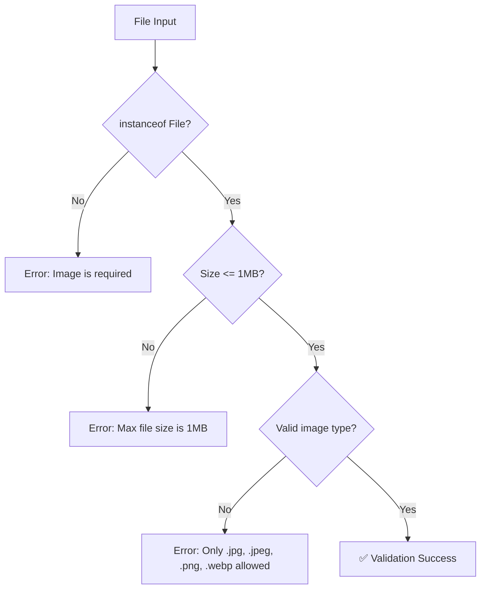
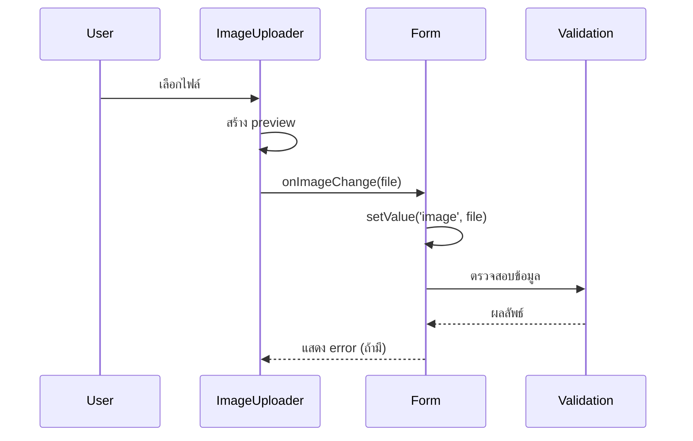

# การอัปโหลดไฟล์และ FormData ใน Next.js 15.3.2

## 📋 Overview

เอกสารนี้จะอธิบายการพัฒนาระบบอัปโหลดไฟล์รูปภาพใน Next.js พร้อมการจัดการ FormData และการแสดงผลแบบเรียลไทม์ โดยจะครอบคลุมทั้งการสร้าง component, การจัดการไฟล์ในฝั่ง server, และการตรวจสอบความถูกต้องของข้อมูล

## 🎯 เป้าหมาย

- สร้างระบบอัปโหลดรูปภาพที่สามารถ preview ได้
- จัดการข้อมูลแบบ FormData สำหรับการส่งไฟล์
- สร้าง validation สำหรับตรวจสอบไฟล์
- ออกแบบ UI/UX ที่ใช้งานง่าย

## 🛠️ การปรับปรุงจากเวอร์ชันเก่า

### ✅ สิ่งที่ปรับปรุงใหม่ (2025 / Next.js 15.3.2)

| ฟีเจอร์             | แบบเก่า (ตามคลิป)      | แบบใหม่ (2025)                         |
| ------------------- | ---------------------- | -------------------------------------- |
| **File Validation** | การตรวจสอบพื้นฐาน      | ใช้ Zod schema validation แบบ custom   |
| **Error Handling**  | Error handling แบบง่าย | Try-catch patterns ที่สมบูรณ์          |
| **Type Safety**     | TypeScript พื้นฐาน     | Function overloading + Generic types   |
| **File Storage**    | การเซฟไฟล์แบบง่าย      | UUID-based folder structure            |
| **Image Preview**   | Preview แบบพื้นฐาน     | Real-time preview พร้อม rounded option |

## 📁 โครงสร้างไฟล์

```
project/
├── src/
│   ├── shared/
│   │   ├── helper/
│   │   │   ├── file.ts           # ✨ ใหม่: ฟังก์ชันจัดการไฟล์
│   │   │   └── upload.ts         # ✨ ใหม่: ฟังก์ชัน image path
│   │   ├── validator/
│   │   │   └── image.ts          # ✨ ใหม่: Zod validation
│   │   └── ui/
│   │       └── components/
│   │           └── image-uploader.tsx  # ✨ ใหม่: Upload component
│   ├── app/
│   │   └── api/admin/article/
│   │       └── route.ts          # 🔄 อัปเดต: FormData handling
│   └── features/admin/article/
│       └── components/
│           └── article-form.tsx  # 🔄 อัปเดต: เพิ่ม image upload
```

## 🔧 การติดตั้งและ Dependencies

```bash
# Dependencies หลัก
npm install zod
npm install @hookform/resolvers
npm install react-hook-form

# TypeScript types (ถ้าจำเป็น)
npm install -D @types/node
```

## 📝 การพัฒนาแบบ Step-by-Step

### 1. สร้างฟังก์ชันจัดการไฟล์ (`file.ts`)

```typescript
// src/shared/helper/file.ts
import { mkdir, writeFile, unlink } from "fs/promises";
import { join } from "path";
import { randomUUID } from "crypto";

/**
 * ฟังก์ชันสำหรับเซฟไฟล์ลงในระบบ
 * @param file - ไฟล์ที่ต้องการเซฟ (File object)
 * @returns Promise<string> - path ของไฟล์ที่เซฟแล้ว
 */
export async function saveFile(file: File): Promise<string> {
  // แปลงไฟล์เป็น binary data
  const bytes = await file.arrayBuffer();
  const buffer = Buffer.from(bytes);

  // สร้างชื่อ folder แบบ random
  const folderName = randomUUID();
  const fileName = file.name;

  // สร้าง directory structure
  const uploadDir = join("public", "upload", folderName);
  await mkdir(uploadDir, { recursive: true });

  // เซฟไฟล์
  const filePath = join(uploadDir, fileName);
  await writeFile(filePath, buffer);

  // คืน path สำหรับใช้ใน database
  return `${folderName}/${fileName}`;
}

/**
 * ฟังก์ชันสำหรับลบไฟล์
 * @param path - path ของไฟล์ที่ต้องการลบ
 */
export async function removeFile(path: string): Promise<void> {
  const fullPath = join("public", "upload", path);
  await unlink(fullPath);
}
```

### 2. สร้าง Image Path Helper (`upload.ts`)

```typescript
// src/shared/helper/upload.ts
import { z } from "zod";

/**
 * Function overloading สำหรับ type safety
 */
export function getImagePath(file: string): string;
export function getImagePath(file: null | undefined): undefined;
export function getImagePath(
  file: string | null | undefined
): string | undefined;

/**
 * ฟังก์ชันสำหรับสร้าง image path ที่ถูกต้อง
 * @param file - ชื่อไฟล์หรือ URL
 * @returns path ที่สมบูรณ์สำหรับแสดงรูปภาพ
 */
export function getImagePath(
  file: string | null | undefined
): string | undefined {
  if (!file) return undefined;

  try {
    // ตรวจสอบว่าเป็น URL หรือไม่
    z.string().url().parse(file);
    return file; // ถ้าเป็น URL แล้ว ส่งกลับตามเดิม
  } catch {
    // ถ้าไม่ใช่ URL แสดงว่าเป็นไฟล์ของเรา ต้องเติม /upload
    return `/upload/${file}`;
  }
}
```

**💡 คำอธิบาย Function Overloading:**

```typescript
// ✅ Type-safe: ถ้าส่ง string จะได้ string กลับ
const path1 = getImagePath("image.jpg"); // Type: string

// ✅ Type-safe: ถ้าส่ง null/undefined จะได้ undefined กลับ
const path2 = getImagePath(null); // Type: undefined

// ✅ Type-safe: ถ้าไม่แน่ใจจะได้ string | undefined
const path3 = getImagePath(maybeString); // Type: string | undefined
```

### 3. สร้าง Image Validation (`image.ts`)

```typescript
// src/shared/validator/image.ts
import { z } from "zod";

// ค่าคงที่สำหรับการตรวจสอบ
const MAX_FILE_SIZE = 1 * 1000 * 1000; // 1MB
const ACCEPTED_IMAGE_TYPES = [
  "image/jpeg",
  "image/jpg",
  "image/png",
  "image/webp",
];

/**
 * Zod schema สำหรับตรวจสอบความถูกต้องของรูปภาพ
 */
export const imageValidator = z
  .custom<File | null>(
    (value) => {
      // ตรวจสอบว่าเป็น File object หรือไม่
      if (!(value instanceof File)) {
        return false;
      }
      return true;
    },
    {
      message: "Image is required",
    }
  )
  .refine(
    (image) => {
      // ตรวจสอบขนาดไฟล์
      return image && image.size <= MAX_FILE_SIZE;
    },
    {
      message: `Max file size is 1MB`,
    }
  )
  .refine(
    (image) => {
      // ตรวจสอบชนิดไฟล์
      return image && ACCEPTED_IMAGE_TYPES.includes(image.type);
    },
    {
      message: "Only .jpg, .jpeg, .png and .webp files are accepted",
    }
  );
```

**🔍 วิธีการทำงานของ Zod Validation:**



### 4. สร้าง Image Uploader Component

```typescript
// src/shared/ui/components/image-uploader.tsx
"use client";

import { ChangeEventHandler, useState } from "react";
import Image from "next/image";
import { cn } from "@/lib/utils";

interface ImageUploaderProps {
  defaultImage: string;
  onImageChange: (file: File) => void;
  error?: string;
  rounded?: boolean;
}

export default function ImageUploader({
  defaultImage,
  onImageChange,
  error,
  rounded,
}: ImageUploaderProps) {
  const [image, setImage] = useState(defaultImage);

  const previewImage = (imageFile: File) => {
    setImage(URL.createObjectURL(imageFile));
  };

  const handleImageUpload: ChangeEventHandler<HTMLInputElement> = (event) => {
    const file = event.target.files?.[0];
    if (!file) return;

    // สร้าง preview
    const imageUrl = URL.createObjectURL(file);
    previewImage(file);

    // ส่งไฟล์กลับไปยัง parent component
    onImageChange(file);
  };

  return (
    <div className="space-y-4">
      {/* Image Preview */}
      <div className="relative w-24 h-24 mx-auto">
        <Image
          src={image}
          alt="Image Upload Preview"
          fill
          priority
          className={cn(
            "object-cover border-2 border-dashed border-gray-300",
            rounded && "rounded-full"
          )}
        />
      </div>

      {/* Upload Button */}
      <label className="block cursor-pointer">
        <span className="inline-block px-4 py-2 bg-blue-500 text-white rounded hover:bg-blue-600 transition-colors">
          Select Image
        </span>
        <input
          type="file"
          accept={ACCEPTED_IMAGE_TYPES.join(",")}
          onChange={handleImageUpload}
          className="hidden"
        />
      </label>

      {/* Error Message */}
      {error && <div className="text-red-500 text-sm mt-2">{error}</div>}
    </div>
  );
}
```

**🎨 UI Components Breakdown:**

```
┌─────────────────────────┐
│    Image Preview        │
│  ┌─────────────────┐   │
│  │                 │   │
│  │   [Image Here]  │   │
│  │                 │   │
│  └─────────────────┘   │
│                         │
│   [Select Image Btn]    │
│                         │
│   ❌ Error message      │
└─────────────────────────┘
```

### 5. อัปเดต Article Form

```typescript
// src/features/admin/article/components/article-form.tsx
"use client";

import { useForm } from "react-hook-form";
import { zodResolver } from "@hookform/resolvers/zod";
import ImageUploader from "@/shared/ui/components/image-uploader";
import { getImagePath } from "@/shared/helper/upload";

// Types for different form modes
type CreateFormData = AddArticleInput;
type UpdateFormData = UpdateArticleInput;

interface ArticleFormProps {
  onSubmit: (data: CreateFormData | UpdateFormData) => void;
  article?: Article; // สำหรับ edit mode
}

export default function ArticleForm({ onSubmit, article }: ArticleFormProps) {
  // Dynamic form type based on mode
  const form = useForm<CreateFormData | UpdateFormData>({
    resolver: zodResolver(article ? updateArticleSchema : addArticleSchema),
    defaultValues: {
      title: article?.title || "",
      excerpt: article?.excerpt || "",
      content: article?.content || "",
      image: undefined, // ⚠️ ต้องเป็น undefined เพราะ File object
    },
  });

  const handleImageChange = (file: File) => {
    // Manual set value เพราะ custom component
    form.setValue("image", file, {
      shouldValidate: true, // ตรวจสอบทันทีหลังอัปโหลด
    });
  };

  return (
    <form onSubmit={form.handleSubmit(onSubmit)} className="space-y-6">
      {/* Image Upload Section */}
      <div>
        <label className="block text-sm font-medium mb-2">Article Image</label>
        <ImageUploader
          defaultImage={
            article?.image
              ? getImagePath(article.image)
              : "/assets/images/no-image.png"
          }
          onImageChange={handleImageChange}
          error={form.formState.errors.image?.message}
          rounded={false}
        />
      </div>

      {/* Other form fields... */}

      <button
        type="submit"
        className="w-full bg-blue-500 text-white py-2 rounded"
      >
        {article ? "Update" : "Create"} Article
      </button>
    </form>
  );
}
```

**🔄 การทำงานของ React Hook Form:**



### 6. อัปเดต API Route สำหรับ FormData

```typescript
// src/app/api/admin/article/route.ts
import { NextRequest, NextResponse } from "next/server";
import { saveFile } from "@/shared/helper/file";
import { addArticle } from "@/features/admin/article/api";
import { revalidatePath } from "next/cache";

export async function POST(request: NextRequest) {
  try {
    // รับข้อมูล FormData
    const formData = await request.formData();

    // ดึงข้อมูลแต่ละฟิลด์
    const title = formData.get("title") as string;
    const excerpt = formData.get("excerpt") as string;
    const content = formData.get("content") as string;
    const image = formData.get("image") as File;

    // ตรวจสอบว่ามีไฟล์หรือไม่
    if (!image) {
      return NextResponse.json({ error: "No file uploaded" }, { status: 400 });
    }

    // เซฟไฟล์และได้ path กลับมา
    const savedImagePath = await saveFile(image);

    // สร้าง article ในฐานข้อมูล
    const article = await addArticle({
      title,
      excerpt,
      content,
      image: savedImagePath,
    });

    // Revalidate cache
    revalidatePath("/article");

    return NextResponse.json(article, {
      status: 201,
      headers: { "Content-Type": "application/json" },
    });
  } catch (error) {
    console.error("Article creation error:", error);
    return NextResponse.json(
      { error: "Failed to create article" },
      { status: 500 }
    );
  }
}
```

### 7. อัปเดต Client-side API Call

```typescript
// src/features/admin/article/api/index.ts
export async function createArticleAPI(formData: AddArticleInput) {
  // สร้าง FormData object
  const form = new FormData();

  form.append("title", formData.title);
  form.append("excerpt", formData.excerpt);
  form.append("content", formData.content);

  // เฉพาะกรณีที่มีรูปภาพ
  if (formData.image) {
    form.append("image", formData.image);
  }

  // ส่งข้อมูลแบบ FormData (ไม่ต้องระบุ Content-Type)
  const response = await fetch("/api/admin/article", {
    method: "POST",
    body: form, // ⚠️ ไม่ใช่ JSON.stringify()
  });

  if (!response.ok) {
    throw new Error("Failed to create article");
  }

  return response.json();
}
```

## 🔍 การ Debug และ Testing

### เครื่องมือสำหรับ Debug

```typescript
// เพิ่มใน development mode
if (process.env.NODE_ENV === "development") {
  console.log("FormData contents:");
  for (const [key, value] of formData.entries()) {
    console.log(`${key}:`, value);
  }
}
```

### ตรวจสอบใน Browser DevTools

1. **Network Tab** - ดูว่า request เป็น `multipart/form-data`
2. **Payload** - ตรวจสอบข้อมูลที่ส่งไป
3. **Response** - ดูผลลัพธ์จาก server

```
Request Headers:
Content-Type: multipart/form-data; boundary=----WebKitFormBoundary...

Payload:
------WebKitFormBoundary...
Content-Disposition: form-data; name="title"

My Article Title
------WebKitFormBoundary...
Content-Disposition: form-data; name="image"; filename="image.jpg"
Content-Type: image/jpeg

[binary data]
```

## ⚠️ ข้อควรระวังและข้อผิดพลาดที่พบบ่อย

### 1. TypeScript Type Issues

```typescript
// ❌ ผิด: File type ไม่ตรงกับ string
const form = useForm<{ image: string }>(); // ผิด!

// ✅ ถูก: ใช้ File type สำหรับ upload
const form = useForm<{ image: File | undefined }>();
```

### 2. FormData vs JSON

```typescript
// ❌ ผิด: ส่ง File เป็น JSON
fetch("/api", {
  method: "POST",
  headers: { "Content-Type": "application/json" },
  body: JSON.stringify({ image: file }), // ❌ ทำไม่ได้!
});

// ✅ ถูก: ใช้ FormData
const formData = new FormData();
formData.append("image", file);
fetch("/api", {
  method: "POST",
  body: formData, // ✅ ไม่ต้องระบุ Content-Type
});
```

### 3. Path Resolution

```typescript
// ❌ ผิด: Missing /upload prefix
<Image src={article.image} /> // ❌ จะหาไฟล์ไม่เจอ

// ✅ ถูก: ใช้ helper function
<Image src={getImagePath(article.image)} />
```

## 🚀 การปรับปรุงเพิ่มเติมในอนาคต

### 1. Image Optimization

- ใช้ Sharp.js สำหรับ resize รูปภาพ
- สร้าง multiple sizes (thumbnails)
- WebP conversion อัตโนมัติ

### 2. Cloud Storage Integration

- AWS S3 / Cloudinary integration
- CDN สำหรับ performance
- Progressive loading

### 3. Advanced Validation

- AI-powered content moderation
- Duplicate image detection
- Metadata extraction

## 📚 เอกสารอ้างอิง

- [Next.js File Upload Documentation](https://nextjs.org/docs/app/building-your-application/routing/route-handlers#request-body)
- [Zod Validation](https://zod.dev/)
- [React Hook Form](https://react-hook-form.com/)
- [MDN FormData API](https://developer.mozilla.org/en-US/docs/Web/API/FormData)

---

**📝 สรุป:** การพัฒนาระบบอัปโหลดไฟล์ใน Next.js 15.3.2 มีการปรับปรุงที่สำคัญในเรื่องของ type safety, validation, และ error handling ทำให้ระบบมีความเสถียรและปลอดภัยมากขึ้น พร้อมกับการจัดการไฟล์ที่มีประสิทธิภาพ
