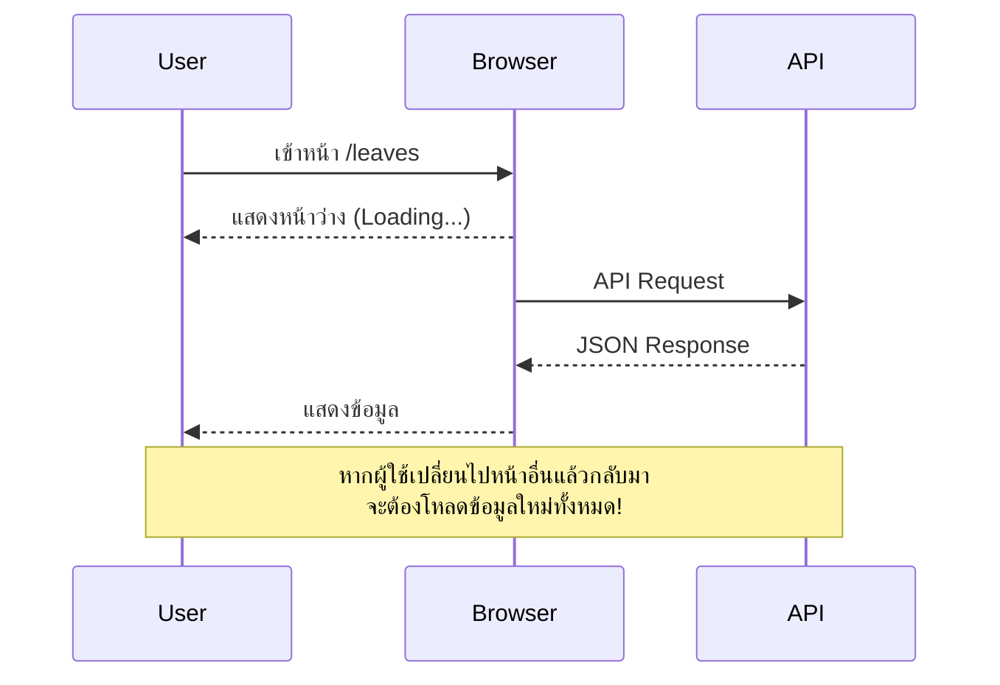
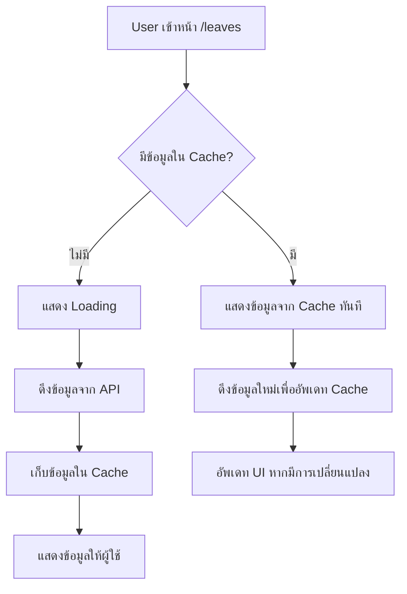
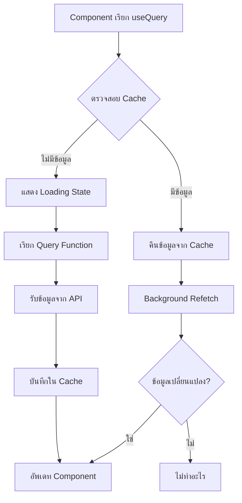
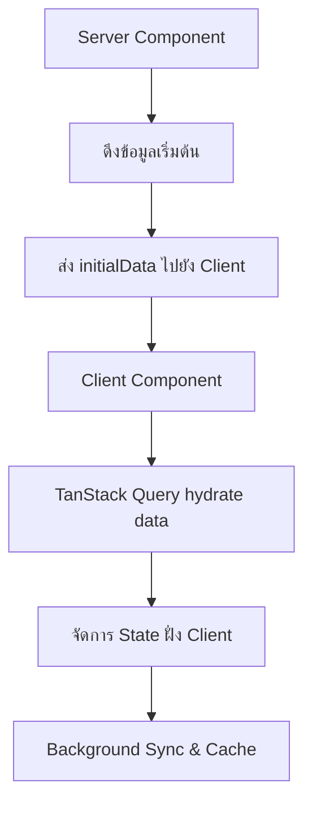

# React Query (TanStack Query) Guide - Complete Tutorial 2025

> 🚀 **บทเรียนนี้เป็นการเรียนรู้ TanStack Query (เดิมชื่อ React Query) แบบครบถ้วน พร้อมตัวอย่างการใช้งานจริงในโปรเจค Next.js 15.3.2**

## 📋 สารบัญ

- [🎯 ทำไมต้องใช้ TanStack Query](#-ทำไมต้องใช้-tanstack-query)
- [⚙️ การติดตั้งและตั้งค่า](#️-การติดตั้งและตั้งค่า)
- [🔍 Query - การดึงข้อมูล](#-query---การดึงข้อมูล)
- [✏️ Mutation - การแก้ไขข้อมูล](#️-mutation---การแก้ไขข้อมูล)
- [🔄 Cache Management](#-cache-management)
- [🌐 การทำงานร่วมกับ Next.js App Router](#-การทำงานร่วมกับ-nextjs-app-router)
- [🆚 เปรียบเทียบ แบบเก่า vs แบบใหม่](#-เปรียบเทียบ-แบบเก่า-vs-แบบใหม่)

---

## 🎯 ทำไมต้องใช้ TanStack Query?

### ❌ ปัญหาของ Client-Side Rendering แบบเดิม



### ✅ วิธีแก้ไขด้วย TanStack Query



### 🎁 ประโยชน์ที่ได้รับ

- **⚡ ประสบการณ์ผู้ใช้ดีขึ้น**: แสดงข้อมูลทันทีจาก Cache
- **🔄 ข้อมูลล่าสุดเสมอ**: อัพเดทข้อมูลใน Background
- **📡 Auto Refetch**: ดึงข้อมูลใหม่เมื่อกลับมาที่หน้าเว็บ
- **🗂️ Cache Management**: จัดการ Cache อัตโนมัติ
- **🚀 Stale-While-Revalidate**: แสดงข้อมูลเก่าทันที ดึงข้อมูลใหม่เบื้องหลัง
- **🛠️ Optimistic Updates**: อัพเดท UI ทันทีก่อนยืนยันจากเซิร์ฟเวอร์

---

## ⚙️ การติดตั้งและตั้งค่า

### 📦 ติดตั้ง Package

```bash
# TanStack Query
pnpm add @tanstack/react-query

# DevTools (สำหรับ Debug)
pnpm add @tanstack/react-query-devtools
```

### 🔧 ตั้งค่า Client Provider

> **💡 อัพเดท 2025**: ในเวอร์ชันใหม่ของ Next.js 15.3.2 เราจำเป็นต้องแยก Client Component ออกมาต่างหาก

**สร้างไฟล์ `app/providers.tsx`**

```tsx
"use client";

import { QueryClient, QueryClientProvider } from "@tanstack/react-query";
import { ReactQueryDevtools } from "@tanstack/react-query-devtools";
import React, { useState } from "react";

export function Providers({ children }: { children: React.ReactNode }) {
  // useState ช่วยให้ QueryClient ถูกสร้างขึ้นเพียงครั้งเดียว
  const [queryClient] = useState(
    () =>
      new QueryClient({
        defaultOptions: {
          queries: {
            staleTime: 1000 * 60 * 5, // ข้อมูลจะถือว่าสดเป็นเวลา 5 นาที
            retry: 3, // จำนวนครั้งที่ retry เมื่อเกิด error
            refetchOnWindowFocus: true, // refetch เมื่อกลับมาที่หน้าต่าง
          },
        },
      })
  );

  return (
    <QueryClientProvider client={queryClient}>
      {children}
      {/* DevTools จะแสดงเฉพาะใน Development */}
      <ReactQueryDevtools initialIsOpen={false} />
    </QueryClientProvider>
  );
}
```

**อัพเดท `app/layout.tsx`**

```tsx
import { Providers } from "./providers";
import "./globals.css";

export default function RootLayout({
  children,
}: {
  children: React.ReactNode;
}) {
  return (
    <html lang="th">
      <body>
        <Providers>{children}</Providers>
      </body>
    </html>
  );
}
```

---

## 🔍 Query - การดึงข้อมูล

### 🎯 หลักการทำงานของ Query

Query ใช้สำหรับการ **อ่านข้อมูล** จาก API โดยมีการ Cache ข้อมูลไว้

### 🔑 Query Key Strategies

```tsx
// ❌ แบบเก่า - Query Key ง่ายเกินไป
queryKey: ["leaves"];

// ✅ แบบใหม่ 2025 - Query Key ที่ดี
queryKey: ["leaves"]; // สำหรับรายการทั้งหมด
queryKey: ["leaves", { userId: "user123" }]; // สำหรับใบลาของ User คนนั้น
queryKey: ["leave", { leaveId: "leaveXYZ" }]; // สำหรับใบลาใบเดียว
```

### 📝 ตัวอย่าง: ระบบลางาน

**Hook สำหรับดึงข้อมูลใบลา**

```tsx
// features/leaves/hooks/useGetLeaves.ts
import { useQuery } from "@tanstack/react-query";
import { LeaveListItem } from "@/types/leave";

// ฟังก์ชันสำหรับดึงข้อมูลการลาทั้งหมด
const fetchLeaves = async (): Promise<LeaveListItem[]> => {
  const response = await fetch("/api/leaves");
  if (!response.ok) {
    throw new Error("ไม่สามารถดึงข้อมูลการลาได้");
  }
  return response.json();
};

export const useGetLeaves = () => {
  return useQuery<LeaveListItem[], Error>({
    queryKey: ["leaves"], // Key สำหรับระบุ Cache
    queryFn: fetchLeaves, // ฟังก์ชันที่ใช้ดึงข้อมูล
    staleTime: 1000 * 60 * 2, // ข้อมูลจะสดเป็นเวลา 2 นาที
  });
};
```

**การใช้งานใน Component**

```tsx
// app/leaves/page.tsx
"use client";

import { useGetLeaves } from "@/features/leaves/hooks/useGetLeaves";

export default function LeavesPage() {
  const { data: leaves, isLoading, isError, error } = useGetLeaves();

  if (isLoading) {
    return <div>กำลังโหลดข้อมูลการลา...</div>;
  }

  if (isError) {
    return <div>เกิดข้อผิดพลาด: {error?.message}</div>;
  }

  return (
    <div>
      <h1>รายการใบลา</h1>
      <ul>
        {leaves?.map((leave) => (
          <li key={leave.id}>
            <p>วันที่ลา: {leave.leaveDate}</p>
            <p>เหตุผล: {leave.reason}</p>
          </li>
        ))}
      </ul>
    </div>
  );
}
```

### 🎨 Visual: Query Flow



---

## ✏️ Mutation - การแก้ไขข้อมูล

### 🎯 หลักการทำงานของ Mutation

Mutation ใช้สำหรับการ **เปลี่ยนแปลงข้อมูล** (Create, Update, Delete)

### 📝 ตัวอย่าง: สร้างใบลาใหม่

**Hook สำหรับสร้างใบลา**

```tsx
// features/leaves/hooks/useCreateLeave.ts
import { useMutation, useQueryClient } from "@tanstack/react-query";
import { CreateLeavePayload, LeaveDetail } from "@/types/leave";

// ฟังก์ชันสำหรับส่งข้อมูลไปสร้างการลาใหม่ที่ API
const createLeaveAPI = async (
  payload: CreateLeavePayload
): Promise<LeaveDetail> => {
  const response = await fetch("/api/leaves", {
    method: "POST",
    headers: { "Content-Type": "application/json" },
    body: JSON.stringify(payload),
  });
  if (!response.ok) {
    const errorData = await response
      .json()
      .catch(() => ({ message: "ไม่สามารถสร้างรายการลาได้" }));
    throw new Error(errorData.message || "ไม่สามารถสร้างรายการลาได้");
  }
  return response.json();
};

export const useCreateLeave = () => {
  const queryClient = useQueryClient();

  return useMutation<LeaveDetail, Error, CreateLeavePayload>({
    mutationFn: createLeaveAPI,
    onSuccess: (newLeaveData) => {
      // 🔄 อัพเดท Cache หลังสร้างสำเร็จ
      queryClient.invalidateQueries({ queryKey: ["leaves"] });

      // แสดงการแจ้งเตือนสำเร็จ
      alert("สร้างรายการลาสำเร็จ!");
    },
    onError: (error) => {
      console.error("เกิดข้อผิดพลาดในการสร้างรายการลา:", error.message);
      alert(`เกิดข้อผิดพลาด: ${error.message}`);
    },
  });
};
```

**การใช้งานใน Form**

```tsx
// components/CreateLeaveForm.tsx
"use client";

import { useCreateLeave } from "@/features/leaves/hooks/useCreateLeave";
import { useRouter } from "next/navigation";

export default function CreateLeaveForm() {
  const router = useRouter();
  const { mutate: createLeave, isPending: isCreatingLeave } = useCreateLeave();

  const handleSubmit = async (formData: CreateLeavePayload) => {
    createLeave(formData, {
      onSuccess: () => {
        router.push("/leaves"); // เปลี่ยนหน้าหลังสำเร็จ
      },
    });
  };

  return (
    <form onSubmit={handleSubmit}>
      {/* Form fields */}
      <button type="submit" disabled={isCreatingLeave}>
        {isCreatingLeave ? "กำลังสร้าง..." : "สร้างใบลา"}
      </button>
    </form>
  );
}
```

### 🎨 Visual: Mutation Flow


---

## 🔄 Cache Management

### 🧠 เข้าใจ Cache Invalidation

```tsx
// ✅ แบบใหม่ 2025 - การจัดการ Cache ที่ดี
export function useEditLeave(leaveId: string) {
  const queryClient = useQueryClient();

  return useMutation({
    mutationFn: async (input: UpdateLeaveInput) => {
      const response = await fetch(`/api/leaves/${leaveId}`, {
        method: "PATCH",
        headers: { "Content-Type": "application/json" },
        body: JSON.stringify(input),
      });
      return response.json();
    },
    onSuccess: () => {
      // อัพเดททั้งรายการและรายละเอียด
      queryClient.invalidateQueries({ queryKey: ["leaves"] });
      queryClient.invalidateQueries({
        queryKey: ["leave", { leaveId }],
      });
    },
  });
}
```

### 🔄 การจัดการ Cache หลัง Mutation

```tsx
// ✅ วิธีที่ดีที่สุด - Invalidate Queries
onSuccess: () => {
  queryClient.invalidateQueries({ queryKey: ["leaves"] });
};

// 🔧 วิธีอื่น - อัพเดท Cache โดยตรง (Optimistic Update)
onSuccess: (newLeave) => {
  queryClient.setQueryData(["leaves"], (oldData: LeaveListItem[] = []) => {
    return [...oldData, newLeave];
  });
};
```

---

## 🌐 การทำงานร่วมกับ Next.js App Router

### 🏗️ แนวคิดใหม่: Server Components + TanStack Query



### 📋 เปรียบเทียบแนวทาง

| แง่มุม                   | แบบเก่า (CSR เท่านั้น)            | แบบใหม่ (RSC + TanStack Query)                 |
| ------------------------ | --------------------------------- | ---------------------------------------------- |
| **การโหลดเริ่มต้น**      | JavaScript ดึงข้อมูลหลังหน้าโหลด  | Server ดึงข้อมูลและส่ง HTML พร้อมข้อมูล        |
| **Mutations**            | `useMutation` + API Routes        | Server Actions + `revalidatePath`              |
| **Cache Invalidation**   | `invalidateQueries` ฝั่ง Client   | `revalidatePath` ฝั่ง Server + TQ ฝั่ง Client  |
| **บทบาท TanStack Query** | เครื่องมือหลักจัดการ Server State | เสริมการ Caching ฝั่ง Client + Background Sync |

### 🔧 ตัวอย่างการผสมผสาน

**Server Component (ดึงข้อมูลเริ่มต้น)**

```tsx
// app/leaves/page.tsx (Server Component)
import { getLeaves } from "@/lib/api";
import LeavesClient from "./leaves-client";

export default async function LeavesPage() {
  const initialLeaves = await getLeaves(); // ดึงข้อมูลบน Server

  return <LeavesClient initialData={initialLeaves} />;
}
```

**Client Component (จัดการ State)**

```tsx
// app/leaves/leaves-client.tsx
"use client";

import { useGetLeaves } from "@/features/leaves/hooks/useGetLeaves";
import { LeaveListItem } from "@/types/leave";

interface LeavesClientProps {
  initialData: LeaveListItem[];
}

export default function LeavesClient({ initialData }: LeavesClientProps) {
  const { data: leaves, isLoading } = useGetLeaves({
    initialData, // ใช้ข้อมูลจาก Server เป็น seed
  });

  // TanStack Query จะจัดการ Background Sync และ Cache ต่อไป
  return (
    <div>
      {leaves?.map((leave) => (
        <div key={leave.id}>{leave.reason}</div>
      ))}
    </div>
  );
}
```

---

## 🎯 Best Practices สำหรับ 2025

### 1. **Query Key Strategy**

```tsx
// ❌ แบบเก่า
queryKey: ["data"];

// ✅ แบบใหม่
queryKey: ["leaves", "list", { userId, status }];
```

### 2. **Type Safety**

```tsx
// ✅ ใช้ TypeScript เต็มรูปแบบ
interface LeaveItem {
  id: string;
  leaveDate: string;
  reason: string;
  status: "pending" | "approved" | "rejected";
}

export function useGetLeaves(): UseQueryResult<LeaveItem[]> {
  return useQuery({
    queryKey: ["leaves"],
    queryFn: fetchLeaves,
  });
}
```

### 3. **Error Handling**

```tsx
// ✅ จัดการ Error แบบสมบูรณ์
const { data, error, isLoading, isError } = useGetLeaves();

if (isError) {
  return <ErrorBoundary error={error} />;
}
```

---

## 🆚 เปรียบเทียบ แบบเก่า vs แบบใหม่

### 📊 Comparison Table

| ด้าน                   | แบบเก่า (useState + useEffect) | แบบใหม่ (TanStack Query) |
| ---------------------- | ------------------------------ | ------------------------ |
| **Cache**              | ❌ ไม่มี                       | ✅ Auto Cache            |
| **Loading State**      | 🔧 ต้องจัดการเอง               | ✅ Built-in              |
| **Error Handling**     | 🔧 ต้องจัดการเอง               | ✅ Built-in              |
| **Background Refetch** | ❌ ไม่มี                       | ✅ Auto                  |
| **Optimistic Updates** | 🔧 ยากต่อการทำ                 | ✅ ง่าย                  |
| **DevTools**           | ❌ ไม่มี                       | ✅ มี DevTools           |
| **Type Safety**        | 🔧 ต้องทำเอง                   | ✅ Built-in              |

### 🔄 Code Comparison

#### แบบเก่า (useState + useEffect)

```tsx
// ❌ แบบเก่า - ยุ่งยากและไม่มี Cache
function LeavesPage() {
  const [leaves, setLeaves] = useState<LeaveItem[]>([]);
  const [loading, setLoading] = useState(true);
  const [error, setError] = useState<Error | null>(null);

  useEffect(() => {
    async function fetchLeaves() {
      try {
        setLoading(true);
        const response = await fetch("/api/leaves");
        const data = await response.json();
        setLeaves(data);
      } catch (err) {
        setError(err as Error);
      } finally {
        setLoading(false);
      }
    }

    fetchLeaves();
  }, []);

  // จัดการ loading, error states เอง...
}
```

#### แบบใหม่ (TanStack Query)

```tsx
// ✅ แบบใหม่ - สะอาด มี Cache และ Auto Refetch
function LeavesPage() {
  const { data: leaves, isLoading, error } = useGetLeaves();

  if (isLoading) return <div>กำลังโหลด...</div>;
  if (error) return <div>เกิดข้อผิดพลาด: {error.message}</div>;

  return (
    <div>
      {leaves?.map((leave) => (
        <LeaveItem key={leave.id} leave={leave} />
      ))}
    </div>
  );
}
```

### 🚀 Migration Path (แนวทางการย้าย)

1. **Phase 1**: ติดตั้ง TanStack Query และตั้งค่า Provider
2. **Phase 2**: สร้าง Custom Hooks สำหรับ API calls
3. **Phase 3**: แทนที่ useState/useEffect ด้วย useQuery
4. **Phase 4**: เพิ่ม useMutation และ Cache Invalidation
5. **Phase 5**: Optimize Query Keys และ Error Handling
6. **Phase 6**: ผสมผสานกับ Server Components (ถ้าใช้ Next.js)

---

## 🎯 สรุป

### ✨ ประโยชน์หลัก

- **🔄 Cache Management**: จัดการ Cache อัตโนมัติ
- **⚡ Better UX**: แสดงข้อมูลทันทีจาก Cache
- **🔍 DevTools**: เครื่องมือ Debug ที่ดี
- **📱 Background Sync**: อัพเดทข้อมูลใน Background
- **🛡️ Type Safety**: รองรับ TypeScript เต็มรูปแบบ
- **🤝 Server Integration**: ทำงานร่วมกับ Server Components ได้ดี

### 🎓 สิ่งที่เรียนรู้

1. การตั้งค่า TanStack Query ใน Next.js 15.3.2
2. การใช้ useQuery สำหรับดึงข้อมูล
3. การใช้ useMutation สำหรับแก้ไขข้อมูล
4. การจัดการ Cache และ Invalidation
5. การผสมผสานกับ Server Components
6. Best Practices สำหรับปี 2025

### 🔮 อนาคต

TanStack Query กำลังพัฒนาไปสู่การเป็น "State Management" ที่ครอบคลุมมากขึ้น พร้อมกับการรองรับ React Server Components และ Suspense ในอนาคต โดยยังคงบทบาทสำคัญในการจัดการ Server State ฝั่ง Client

---

## 🎮 ตัวอย่างโครงการจริง: ระบบจัดการการลา

### 📁 โครงสร้างโฟลเดอร์

```
src/
├── features/
│   └── leaves/
│       ├── hooks/
│       │   ├── useGetLeaves.ts
│       │   ├── useCreateLeave.ts
│       │   └── useUpdateLeave.ts
│       ├── types/
│       │   └── leave.ts
│       └── components/
│           ├── LeaveList.tsx
│           └── LeaveForm.tsx
├── app/
│   ├── providers.tsx
│   ├── layout.tsx
│   └── leaves/
│       ├── page.tsx
│       └── [id]/
│           └── page.tsx
└── types/
    └── api.ts
```

### 🔧 ความสามารถที่พัฒนาขึ้น

1. **Intelligent Caching**: ข้อมูลจาก API ถูกเก็บในแคชเพื่อหลีกเลี่ยงการดึงซ้ำ
2. **Stale-While-Revalidate**: แสดงข้อมูลเก่าทันที ดึงใหม่เบื้องหลัง
3. **Background Updates**: อัพเดทอัตโนมัติเมื่อโฟกัสหน้าต่าง
4. **Query Invalidation**: ซิงค์ข้อมูลหลัง Mutation
5. **Optimistic Updates**: อัพเดท UI ก่อนยืนยันจากเซิร์ฟเวอร์
6. **Type-Safe API**: การใช้ TypeScript อย่างเต็มประสิทธิภาพ

---

> **💡 Tips**: ลองใช้ DevTools เพื่อดูการทำงานของ Cache แบบ Real-time และเข้าใจการทำงานของ TanStack Query ได้ดีขึ้น! กด `Ctrl+Shift+I` แล้วดูแท็บ "React Query" ใน DevTools
