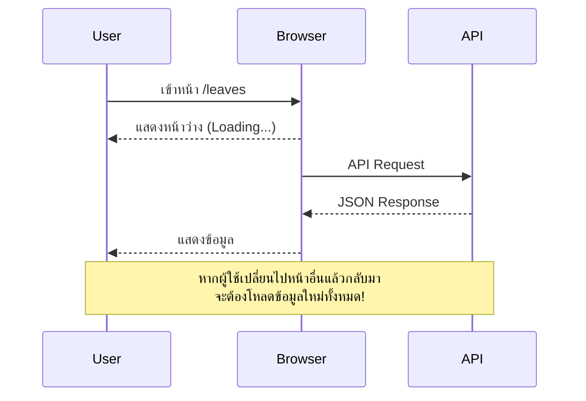
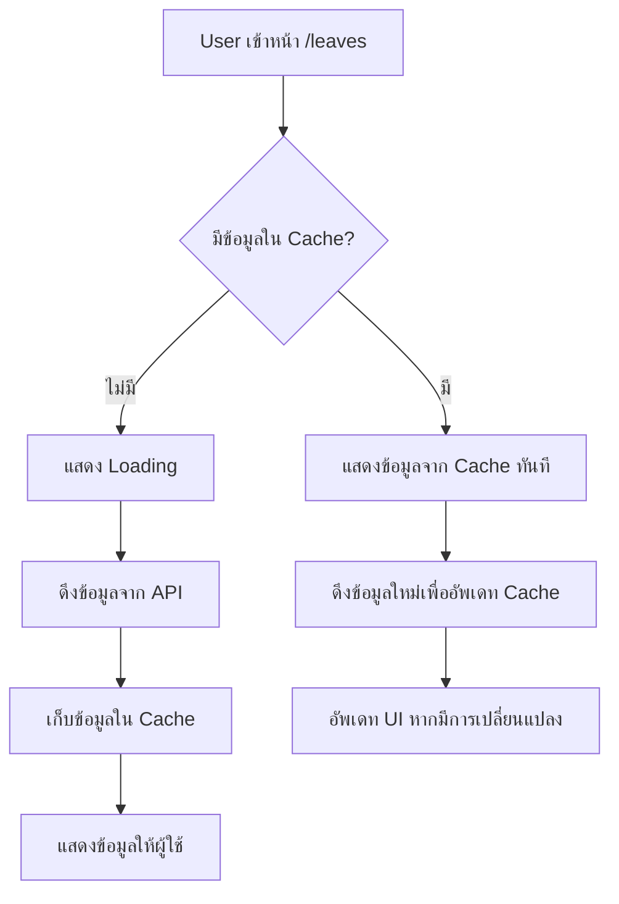
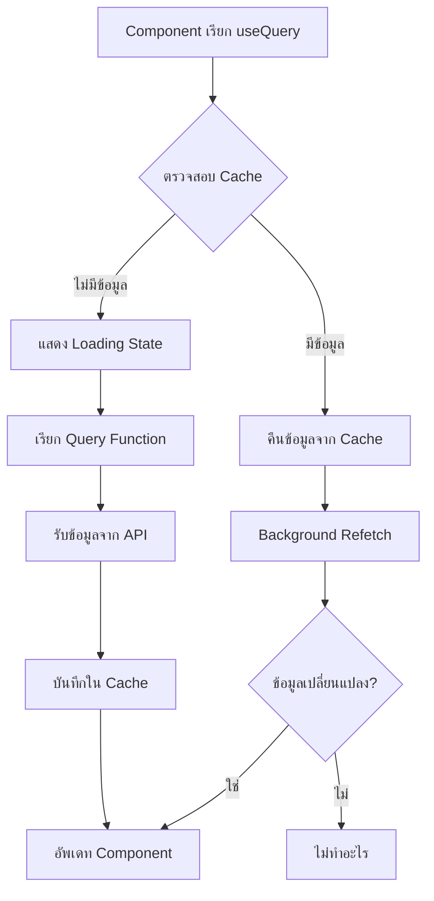
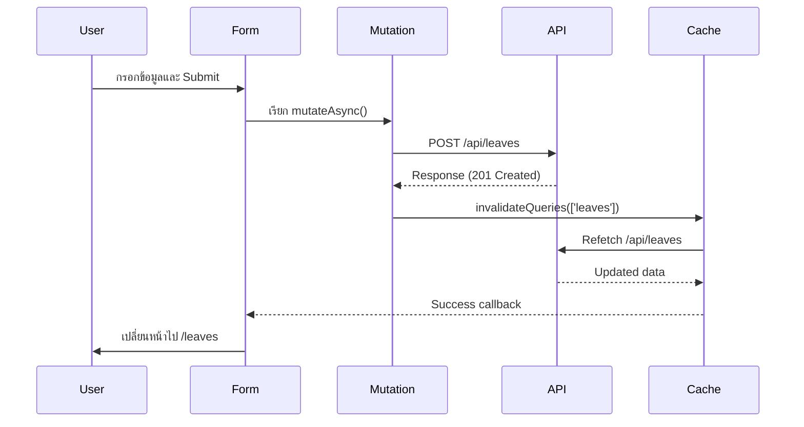

# React Query (TanStack Query) Guide - Complete Tutorial 2025

> 🚀 **บทเรียนนี้เป็นการเรียนรู้ TanStack Query (เดิมชื่อ React Query) แบบครบถ้วน พร้อมตัวอย่างการใช้งานจริงในโปรเจค Next.js 15.3.2**

## 📋 สารบัญ

- [🎯 ทำไมต้องใช้ TanStack Query](#-ทำไมต้องใช้-tanstack-query)
- [⚙️ การติดตั้งและตั้งค่า](#️-การติดตั้งและตั้งค่า)
- [🔍 Query - การดึงข้อมูล](#-query---การดึงข้อมูล)
- [✏️ Mutation - การแก้ไขข้อมูล](#️-mutation---การแก้ไขข้อมูล)
- [🔄 Cache Management](#-cache-management)
- [🆚 เปรียบเทียบ แบบเก่า vs แบบใหม่](#-เปรียบเทียบ-แบบเก่า-vs-แบบใหม่)

---

## 🎯 ทำไมต้องใช้ TanStack Query?

### ❌ ปัญหาของ Client-Side Rendering แบบเดิม



### ✅ วิธีแก้ไขด้วย TanStack Query



### 🎁 ประโยชน์ที่ได้รับ

- **⚡ ประสบการณ์ผู้ใช้ดีขึ้น**: แสดงข้อมูลทันทีจาก Cache
- **🔄 ข้อมูลล่าสุดเสมอ**: อัพเดทข้อมูลใน Background
- **📡 Auto Refetch**: ดึงข้อมูลใหม่เมื่อกลับมาที่หน้าเว็บ
- **🗂️ Cache Management**: จัดการ Cache อัตโนมัติ

---

## ⚙️ การติดตั้งและตั้งค่า

### 📦 ติดตั้ง Package

```bash
# TanStack Query
pnpm add @tanstack/react-query

# DevTools (สำหรับ Debug)
pnpm add @tanstack/react-query-devtools
```

### 🔧 ตั้งค่า Client Provider

> **💡 อัพเดท 2025**: ในเวอร์ชันใหม่ของ Next.js 15.3.2 เราจำเป็นต้องแยก Client Component ออกมาต่างหาก

**สร้างไฟล์ `app/components/client-providers.tsx`**

```tsx
"use client";

import { QueryClient, QueryClientProvider } from "@tanstack/react-query";
import { ReactQueryDevtools } from "@tanstack/react-query-devtools";
import { ReactNode } from "react";

// สร้าง Query Client
const queryClient = new QueryClient();

interface ClientProvidersProps {
  children: ReactNode;
}

export default function ClientProviders({ children }: ClientProvidersProps) {
  return (
    <QueryClientProvider client={queryClient}>
      {children}
      {/* DevTools จะแสดงเฉพาะใน Development */}
      <ReactQueryDevtools initialIsOpen={false} />
    </QueryClientProvider>
  );
}
```

**อัพเดท `app/layout.tsx`**

```tsx
import ClientProviders from "./components/client-providers";

export default function RootLayout({
  children,
}: {
  children: React.ReactNode;
}) {
  return (
    <html lang="th">
      <body>
        <ClientProviders>{children}</ClientProviders>
      </body>
    </html>
  );
}
```

---

## 🔍 Query - การดึงข้อมูล

### 🎯 หลักการทำงานของ Query

Query ใช้สำหรับการ **อ่านข้อมูล** จาก API โดยมีการ Cache ข้อมูลไว้

### 📝 ตัวอย่าง: ระบบลางาน

**Hook สำหรับดึงข้อมูลใบลา**

```tsx
// features/leave/hooks/api.ts
import { useQuery } from "@tanstack/react-query";

export function useGetLeaves() {
  return useQuery({
    queryKey: ["leaves"], // 🔑 Key สำหรับระบุ Cache
    queryFn: async () => {
      const response = await fetch("/api/leaves");
      const data = await response.json();
      return data;
    },
  });
}
```

**การใช้งานใน Component**

```tsx
// app/leaves/page.tsx
"use client";

import { useGetLeaves } from "@/features/leave/hooks/api";

export default function LeavesPage() {
  const { data: leaves, status, isLoading } = useGetLeaves();

  if (isLoading) {
    return <div>กำลังโหลด...</div>;
  }

  if (status === "error") {
    return <div>เกิดข้อผิดพลาด</div>;
  }

  return (
    <div>
      <h1>รายการใบลา</h1>
      {leaves?.map((leave) => (
        <div key={leave.id}>
          <p>วันที่ลา: {leave.leaveDate}</p>
          <p>เหตุผล: {leave.reason}</p>
        </div>
      ))}
    </div>
  );
}
```

### 🔐 Query Key Strategies

```tsx
// ❌ แบบเก่า - Query Key ง่ายเกินไป
queryKey: ["leaves"];

// ✅ แบบใหม่ 2025 - Query Key ที่ดี
queryKey: ["leaves"]; // สำหรับรายการทั้งหมด
queryKey: ["leaves", userId]; // สำหรับใบลาของ User คนนั้น
queryKey: ["leaves", "detail", leaveId]; // สำหรับใบลาใบเดียว
```

### 🎨 Visual: Query Flow



---

## ✏️ Mutation - การแก้ไขข้อมูล

### 🎯 หลักการทำงานของ Mutation

Mutation ใช้สำหรับการ **เปลี่ยนแปลงข้อมูล** (Create, Update, Delete)

### 📝 ตัวอย่าง: สร้างใบลาใหม่

**Hook สำหรับสร้างใบลา**

```tsx
// features/leave/hooks/api.ts
import { useMutation, useQueryClient } from "@tanstack/react-query";

export function useCreateLeave() {
  const queryClient = useQueryClient();

  return useMutation({
    mutationFn: async (input: CreateLeaveInput) => {
      const response = await fetch("/api/leaves", {
        method: "POST",
        headers: { "Content-Type": "application/json" },
        body: JSON.stringify(input),
      });
      return response.json();
    },
    onSuccess: () => {
      // 🔄 อัพเดท Cache หลังสร้างสำเร็จ
      queryClient.invalidateQueries({ queryKey: ["leaves"] });
    },
  });
}
```

**การใช้งานใน Form**

```tsx
// components/CreateLeaveForm.tsx
"use client";

import { useCreateLeave } from "@/features/leave/hooks/api";
import { useRouter } from "next/navigation";

export default function CreateLeaveForm() {
  const router = useRouter();
  const { mutateAsync: createLeave } = useCreateLeave();

  const handleSubmit = async (formData: CreateLeaveInput) => {
    try {
      await createLeave(formData); // รอให้สร้างเสร็จ
      router.push("/leaves"); // ค่อยเปลี่ยนหน้า
    } catch (error) {
      console.error("เกิดข้อผิดพลาด:", error);
    }
  };

  return <form onSubmit={handleSubmit}>{/* Form fields */}</form>;
}
```

### 🔄 การจัดการ Cache หลัง Mutation

```tsx
// ✅ วิธีที่ดีที่สุด - Invalidate Queries
onSuccess: () => {
  queryClient.invalidateQueries({ queryKey: ["leaves"] });
};

// 🔧 วิธีอื่น - อัพเดท Cache โดยตรง
onSuccess: (newLeave) => {
  queryClient.setQueryData(["leaves"], (oldData) => {
    return [...(oldData || []), newLeave];
  });
};
```

### 🎨 Visual: Mutation Flow



---

## 🔄 Cache Management

### 🧠 เข้าใจ Cache Invalidation

```tsx
// ✅ แบบใหม่ 2025 - การจัดการ Cache ที่ดี
export function useEditLeave(leaveId: number) {
  const queryClient = useQueryClient();

  return useMutation({
    mutationFn: async (input: UpdateLeaveInput) => {
      const response = await fetch(`/api/leaves/${leaveId}`, {
        method: "PATCH",
        headers: { "Content-Type": "application/json" },
        body: JSON.stringify(input),
      });
      return response.json();
    },
    onSuccess: () => {
      // อัพเดททั้งรายการและรายละเอียด
      queryClient.invalidateQueries({ queryKey: ["leaves"] });
      queryClient.invalidateQueries({
        queryKey: ["leaves", "detail", leaveId],
      });
    },
  });
}
```

### 🎯 Best Practices สำหรับ 2025

1. **Query Key Strategy**

   ```tsx
   // ❌ แบบเก่า
   queryKey: ["data"];

   // ✅ แบบใหม่
   queryKey: ["leaves", "list", { userId, status }];
   ```

2. **Type Safety**

   ```tsx
   // ✅ ใช้ TypeScript เต็มรูปแบบ
   interface LeaveItem {
     id: number;
     leaveDate: string;
     reason: string;
     status: "pending" | "approved" | "rejected";
   }

   export function useGetLeaves(): UseQueryResult<LeaveItem[]> {
     return useQuery({
       queryKey: ["leaves"],
       queryFn: fetchLeaves,
     });
   }
   ```

3. **Error Handling**

   ```tsx
   // ✅ จัดการ Error แบบสมบูรณ์
   const { data, error, isLoading, isError } = useGetLeaves();

   if (isError) {
     return <ErrorBoundary error={error} />;
   }
   ```

---

## 🆚 เปรียบเทียบ แบบเก่า vs แบบใหม่

### 📊 Comparison Table

| ด้าน                   | แบบเก่า (useState + useEffect) | แบบใหม่ (TanStack Query) |
| ---------------------- | ------------------------------ | ------------------------ |
| **Cache**              | ❌ ไม่มี                       | ✅ Auto Cache            |
| **Loading State**      | 🔧 ต้องจัดการเอง               | ✅ Built-in              |
| **Error Handling**     | 🔧 ต้องจัดการเอง               | ✅ Built-in              |
| **Background Refetch** | ❌ ไม่มี                       | ✅ Auto                  |
| **Optimistic Updates** | 🔧 ยากต่อการทำ                 | ✅ ง่าย                  |
| **DevTools**           | ❌ ไม่มี                       | ✅ มี DevTools           |

### 🔄 Code Comparison

#### แบบเก่า (useState + useEffect)

```tsx
// ❌ แบบเก่า - ยุ่งยากและไม่มี Cache
function LeavesPage() {
  const [leaves, setLeaves] = useState([]);
  const [loading, setLoading] = useState(true);
  const [error, setError] = useState(null);

  useEffect(() => {
    async function fetchLeaves() {
      try {
        setLoading(true);
        const response = await fetch("/api/leaves");
        const data = await response.json();
        setLeaves(data);
      } catch (err) {
        setError(err);
      } finally {
        setLoading(false);
      }
    }

    fetchLeaves();
  }, []);

  // จัดการ loading, error states เอง...
}
```

#### แบบใหม่ (TanStack Query)

```tsx
// ✅ แบบใหม่ - สะอาด มี Cache และ Auto Refetch
function LeavesPage() {
  const { data: leaves, isLoading, error } = useGetLeaves();

  if (isLoading) return <div>กำลังโหลด...</div>;
  if (error) return <div>เกิดข้อผิดพลาด</div>;

  return (
    <div>
      {leaves?.map((leave) => (
        <LeaveItem key={leave.id} leave={leave} />
      ))}
    </div>
  );
}
```

### 🚀 Migration Path (แนวทางการย้าย)

1. **Phase 1**: ติดตั้ง TanStack Query
2. **Phase 2**: สร้าง Custom Hooks
3. **Phase 3**: แทนที่ useState/useEffect
4. **Phase 4**: เพิ่ม Cache Invalidation
5. **Phase 5**: Optimize Query Keys

---

## 🎯 สรุป

### ✨ ประโยชน์หลัก

- **🔄 Cache Management**: จัดการ Cache อัตโนมัติ
- **⚡ Better UX**: แสดงข้อมูลทันทีจาก Cache
- **🔍 DevTools**: เครื่องมือ Debug ที่ดี
- **📱 Background Sync**: อัพเดทข้อมูลใน Background

### 🎓 สิ่งที่เรียนรู้

1. การตั้งค่า TanStack Query ใน Next.js 15.3.2
2. การใช้ useQuery สำหรับดึงข้อมูล
3. การใช้ useMutation สำหรับแก้ไขข้อมูล
4. การจัดการ Cache และ Invalidation
5. Best Practices สำหรับปี 2025

### 🔮 อนาคต

TanStack Query กำลังพัฒนาไปสู่การเป็น "State Management" ที่ครอบคลุมมากขึ้น พร้อมกับการรองรับ React Server Components และ Suspense ในอนาคต

---

> **💡 Tips**: ลองใช้ DevTools เพื่อดูการทำงานของ Cache แบบ Real-time และเข้าใจการทำงานของ TanStack Query ได้ดีขึ้น!
