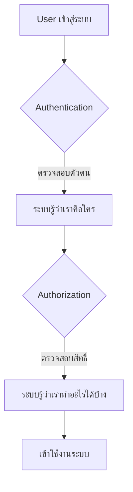
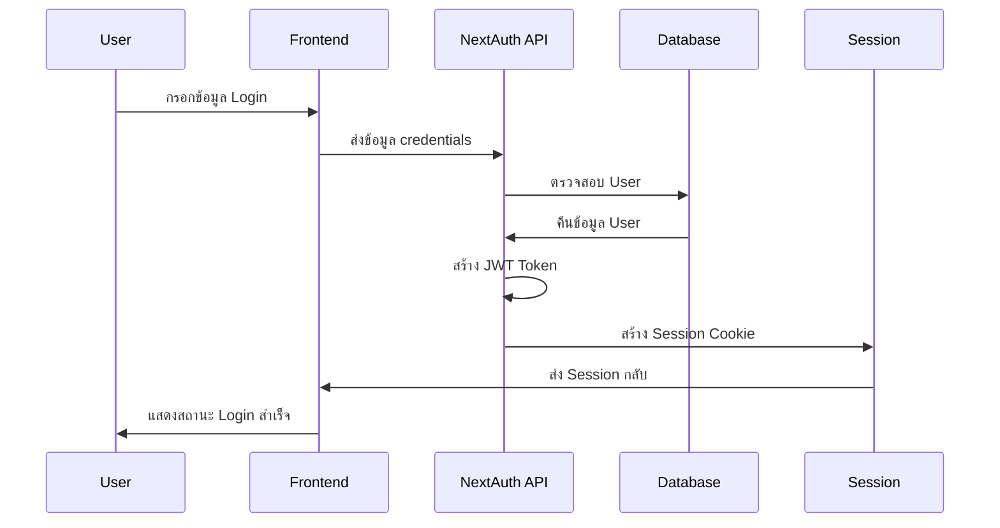

# 🔐 Authentication System - การพัฒนาระบบยืนยันตัวตนใน Next.js

## 📋 สารบัญ

- [📖 ภาพรวมของระบบ Authentication](#-ภาพรวมของระบบ-authentication)
- [🏗️ สถาปัตยกรรมของระบบ](#-สถาปัตยกรรมของระบบ)
- [🚀 การติดตั้งและเริ่มต้น](#-การติดตั้งและเริ่มต้น)
- [🔨 การพัฒนาระบบทีละขั้นตอน](#-การพัฒนาระบบทีละขั้นตอน)
- [🎯 ฟีเจอร์ที่ปรับปรุงใหม่](#-ฟีเจอร์ที่ปรับปรุงใหม่)
- [🔧 การใช้งานและทดสอบ](#-การใช้งานและทดสอบ)

---

## 📖 ภาพรวมของระบบ Authentication

### 🤔 Authentication vs Authorization คืออะไร?



- **Authentication** = การบอกให้ระบบรู้ว่า "เราคือใคร" (Login/Register/Logout)
- **Authorization** = การตรวจสอบว่า "เราสามารถทำอะไรได้บ้าง" (สิทธิ์การเข้าถึง)

### 🛠️ เครื่องมือหลักที่ใช้

| เครื่องมือ          | หน้าที่               | เหตุผลที่เลือกใช้               |
| ------------------- | --------------------- | ------------------------------- |
| **NextAuth.js v4**  | จัดการ Authentication | 🔒 ปลอดภัย, รองรับหลาย Provider |
| **Prisma**          | จัดการฐานข้อมูล       | 📊 Type-safe, Migration ง่าย    |
| **bcrypt.js**       | เข้ารหัส Password     | 🛡️ มาตรฐานอุตสาหกรรม            |
| **Zod**             | Validation ข้อมูล     | ✅ Type-safe validation         |
| **React Hook Form** | จัดการ Form           | 🎯 Performance ดี, UX ดี        |

---

## 🏗️ สถาปัตยกรรมของระบบ

### 📁 โครงสร้าง Project

```
src/
├── app/
│   ├── api/
│   │   ├── auth/
│   │   │   └── [...nextauth]/route.ts    # NextAuth configuration
│   │   ├── sign-up/route.ts              # User registration
│   │   └── profile/route.ts              # Profile update
│   ├── (auth)/
│   │   ├── sign-in/page.tsx             # Login page
│   │   ├── sign-up/page.tsx             # Register page
│   │   └── profile/page.tsx             # Profile page
├── features/
│   ├── auth/
│   │   ├── validator.ts                 # Form validation schemas
│   │   ├── types.ts                     # Type definitions
│   │   ├── api.ts                       # NextAuth configuration
│   │   ├── hooks/api.ts                 # Custom hooks
│   │   └── components/                  # Auth-related components
│   ├── user/
│   │   └── api.ts                       # User CRUD operations
│   └── shared/
│       ├── db.ts                        # Database connection
│       └── helpers/                     # Utility functions
```

### 🔄 Data Flow ของระบบ



---

## 🚀 การติดตั้งและเริ่มต้น

### 1. 📦 ติดตั้ง Dependencies

```bash
# NextAuth.js v4
pnpm add next-auth@4

# Password hashing
pnpm add bcryptjs
pnpm add -D @types/bcryptjs

# Form validation
pnpm add zod
pnpm add @hookform/resolvers

# UI Components (Shadcn/ui)
pnpm add @radix-ui/react-dropdown-menu
pnpm add @radix-ui/react-avatar
```

### 2. 🔐 ตั้งค่า Environment Variables

```env
# .env.local
NEXTAUTH_SECRET=your-super-secret-key-here
NEXTAUTH_URL=http://localhost:3000

# Database
DATABASE_URL="your-database-connection-string"
```

> 💡 **สำคัญ!** ใช้ `crypto.randomUUID()` ใน Node.js console เพื่อสร้าง secret key

---

## 🔨 การพัฒนาระบบทีละขั้นตอน

### ขั้นตอนที่ 1: 🗃️ เตรียม Database Schema

เพิ่ม `password` field ใน User model:

```prisma
model User {
  id       Int     @id @default(autoincrement())
  email    String  @unique
  name     String
  password String? // เริ่มต้นเป็น optional
  image    String?
  role     Role    @default(USER)
  // ... fields อื่นๆ
}
```

#### 🔄 Migration Strategy (สำหรับระบบที่มี User อยู่แล้ว)

```bash
# 1. สร้าง migration แรก (ยังไม่ run)
pnpm prisma migrate dev --create-only --name add_password_to_user_table
```

แก้ไข migration file เพื่อจัดการ existing users:

```sql
-- migration file
CREATE EXTENSION IF NOT EXISTS "uuid-ossp";

ALTER TABLE "User" ADD COLUMN "password" TEXT;

-- Set random password for existing users
UPDATE "User" SET "password" = uuid_generate_v4();

-- Make password required
ALTER TABLE "User" ALTER COLUMN "password" SET NOT NULL;
```

```bash
# 2. รัน migration
pnpm prisma migrate dev

# 3. อัปเดต schema ให้ password เป็น required
# แล้วสร้าง migration ใหม่
pnpm prisma migrate dev --name make_password_required
```

### ขั้นตอนที่ 2: 📝 สร้าง Validation Schemas

`src/features/auth/validator.ts`:

```typescript
import { z } from "zod";

// Schema สำหรับ Sign In
export const signIn = z.object({
  email: z.string().email(),
  password: z.string().min(8),
});

// Schema สำหรับ Sign Up
export const signUp = signIn.extend({
  name: z.string(),
});

// Schema สำหรับ Edit Profile
export const profile = z.object({
  email: z.string().email(),
  name: z.string(),
  password: z.preprocess(
    (val) => (val === "" ? undefined : val),
    z.string().min(8).optional()
  ),
  image: imageValidator, // import จาก shared validator
});
```

> 💡 **เทคนิค preprocess**: ใช้แปลง empty string เป็น undefined เพื่อให้ optional field ทำงานถูกต้อง

### ขั้นตอนที่ 3: 🎯 สร้าง Type Definitions

`src/features/auth/types.ts`:

```typescript
import { z } from "zod";
import type { Role } from "@prisma/client";
import * as validator from "./validator";

// Export types จาก validator schemas
export type SignIn = z.infer<typeof validator.signIn>;
export type SignUp = z.infer<typeof validator.signUp>;
export type ProfileForm = z.infer<typeof validator.profile>;

// Profile type สำหรับใช้ใน application
export type Profile = {
  id: string;
  email: string;
  name: string;
  image?: string;
  role: Role;
};
```

### ขั้นตอนที่ 4: 🔐 ตั้งค่า NextAuth.js

`src/features/auth/api.ts`:

```typescript
import { NextAuthOptions } from "next-auth";
import CredentialsProvider from "next-auth/providers/credentials";
import bcrypt from "bcryptjs";
import { db } from "@/features/shared/db";

// Helper function สำหรับ hash password
export const hashPassword = async (password: string) => {
  return await bcrypt.hash(password, 12);
};

export const authOptions: NextAuthOptions = {
  providers: [
    CredentialsProvider({
      name: "credentials",
      credentials: {
        email: { label: "Email", type: "email" },
        password: { label: "Password", type: "password" },
      },
      async authorize(credentials) {
        if (!credentials?.email || !credentials?.password) {
          return null;
        }

        // ค้นหา user ในฐานข้อมูล
        const user = await db.user.findUnique({
          where: { email: credentials.email },
        });

        if (!user) {
          return null;
        }

        // ตรวจสอบ password
        const isValid = await bcrypt.compare(
          credentials.password,
          user.password
        );

        if (!isValid) {
          return null;
        }

        // คืน user object (แปลง id เป็น string)
        return {
          ...user,
          id: user.id.toString(),
        };
      },
    }),
  ],

  session: {
    strategy: "jwt",
  },

  callbacks: {
    // JWT callback: เก็บข้อมูลใน token
    async jwt({ token, user, session, trigger }) {
      // เมื่อ login ครั้งแรก
      if (user) {
        token.sub = user.id;
        token.email = user.email;
        token.name = user.name;
        token.picture = user.image;
        token.role = user.role;
      }

      // เมื่อมีการ update profile
      if (trigger === "update" && session) {
        if (isUpdateSessionData(trigger, session)) {
          if (session.image) token.picture = session.image;
          if (session.name) token.name = session.name;
          if (session.email) token.email = session.email;
        }
      }

      return token;
    },

    // Session callback: ข้อมูลที่ส่งไปยัง client
    async session({ session, token }) {
      return {
        ...session,
        user: {
          ...session.user,
          id: token.sub!,
          role: token.role as Role,
          name: token.name!,
          email: token.email!,
          image: token.picture,
        },
      };
    },
  },
} satisfies NextAuthOptions;

// Type guard function
function isUpdateSessionData(
  trigger: string,
  session: unknown
): session is { name?: string; email?: string; image?: string } {
  if (trigger !== "update") return false;
  if (!session) return false;
  if (typeof session !== "object") return false;
  return true;
}

// Server-side session helper
export const getServerAuthSession = () => {
  return getServerSession(authOptions);
};
```

#### 🔧 Type Augmentation (ขยาย types ของ NextAuth)

เพิ่มใน `src/features/auth/api.ts`:

```typescript
declare module "next-auth" {
  interface Session {
    user: DefaultSession["user"] & {
      id: string;
      role: Role;
    };
  }

  interface User {
    role: Role;
  }
}

declare module "next-auth/jwt" {
  interface JWT {
    sub: string;
    role: Role;
  }
}
```

### ขั้นตอนที่ 5: 🚪 สร้าง API Routes

#### Registration API (`app/api/auth/sign-up/route.ts`):

```typescript
import { NextRequest } from "next/server";
import { signUp } from "@/features/auth/validator";
import { add } from "@/features/user/api";

export async function POST(request: NextRequest) {
  try {
    const body = await request.json();

    // Validate ข้อมูล
    const credentials = signUp.parse(body);

    // สร้าง user ใหม่
    const profile = await add(credentials);

    return Response.json(profile, { status: 201 });
  } catch (error) {
    return Response.json({ error: "Validation failed" }, { status: 422 });
  }
}
```

#### Profile Update API (`app/api/profile/route.ts`):

```typescript
import { NextRequest } from "next/server";
import { getServerAuthSession } from "@/features/auth/api";
import { update } from "@/features/user/api";

export async function PATCH(request: NextRequest) {
  // ตรวจสอบการ login
  const session = await getServerAuthSession();
  if (!session) {
    return Response.json({ error: "Please login" }, { status: 401 });
  }

  // แกะ FormData
  const formData = await request.formData();
  const form = {
    name: formData.get("name") as string | undefined,
    email: formData.get("email") as string | undefined,
    password: formData.get("password") as string | undefined,
    image: formData.get("image") as File | null,
  };

  // อัปเดตข้อมูล
  const profile = await update(+session.user.id, form);

  return Response.json(profile);
}
```

### ขั้นตอนที่ 6: 🎨 สร้าง UI Components

#### Auth Form Component (`features/auth/components/auth-form.tsx`):

```typescript
"use client";

import { useForm } from "react-hook-form";
import { zodResolver } from "@hookform/resolvers/zod";
import { capitalize } from "lodash";
import * as validator from "../validator";
import type * as types from "../types";

interface AuthFormProps {
  variant: "login" | "register";
  onSubmit: ((data: types.SignIn) => void) | ((data: types.SignUp) => void);
}

export function AuthForm({ variant, onSubmit }: AuthFormProps) {
  const form = useForm<
    typeof onSubmit extends (data: types.SignIn) => void
      ? types.SignIn
      : types.SignUp
  >({
    resolver: zodResolver(
      variant === "login" ? validator.signIn : validator.signUp
    ),
    defaultValues:
      variant === "login"
        ? { email: "", password: "" }
        : { name: "", email: "", password: "" },
  });

  return (
    <div className="mx-auto max-w-xl">
      <h2 className="text-2xl font-bold text-center mb-8">
        {capitalize(variant)}
      </h2>

      <Form {...form}>
        <form
          onSubmit={form.handleSubmit(onSubmit)}
          className="space-y-8 relative"
        >
          {/* Name field (เฉพาะ register) */}
          {variant === "register" && (
            <FormField
              control={form.control}
              name="name"
              render={({ field }) => (
                <FormItem>
                  <FormLabel>Name</FormLabel>
                  <FormControl>
                    <Input placeholder="John Doe" {...field} />
                  </FormControl>
                </FormItem>
              )}
            />
          )}

          {/* Email field */}
          <FormField
            control={form.control}
            name="email"
            render={({ field }) => (
              <FormItem>
                <FormLabel>Email</FormLabel>
                <FormControl>
                  <Input
                    type="email"
                    placeholder="john@example.com"
                    {...field}
                  />
                </FormControl>
              </FormItem>
            )}
          />

          {/* Password field */}
          <FormField
            control={form.control}
            name="password"
            render={({ field }) => (
              <FormItem>
                <FormLabel>Password</FormLabel>
                <FormControl>
                  <Input
                    type="password"
                    placeholder="Secret password"
                    {...field}
                  />
                </FormControl>
              </FormItem>
            )}
          />

          <Button type="submit" className="absolute right-0">
            {capitalize(variant)}
          </Button>
        </form>
      </Form>
    </div>
  );
}
```

#### Profile Form Component:

```typescript
"use client";

import { useState } from "react";
import { useForm } from "react-hook-form";
import { zodResolver } from "@hookform/resolvers/zod";
import { useSession } from "next-auth/react";
import { ImageUploader } from "@/features/shared/components";
import { getImagePath } from "@/features/shared/helpers";
import * as validator from "../validator";
import type * as types from "../types";

interface ProfileProps {
  profile: types.Profile;
  onSubmit: (data: types.ProfileForm) => Promise<void>;
}

export function Profile({ profile, onSubmit }: ProfileProps) {
  const form = useForm<types.ProfileForm>({
    resolver: zodResolver(validator.profile),
    defaultValues: {
      ...profile,
      password: "",
      image: undefined,
    },
  });

  const { update: updateProfile } = useSession();

  const handleSubmit = async (data: types.ProfileForm) => {
    await onSubmit(data);
    // อัปเดต session
    await updateProfile(data);
  };

  return (
    <div className="mx-auto max-w-xl">
      <h2 className="text-2xl font-bold text-center mb-8">Profile</h2>

      <Form {...form}>
        <form
          onSubmit={form.handleSubmit(handleSubmit)}
          className="space-y-8 relative"
        >
          {/* Image Upload */}
          <ImageUploader
            defaultImage={
              profile.image
                ? getImagePath(profile.image)
                : "/assets/images/avatar.png"
            }
            onImageChange={(image) => {
              form.setValue("image", image, { shouldValidate: true });
            }}
            error={form.formState.errors.image?.message}
            rounded
          />

          {/* Name field */}
          <FormField
            control={form.control}
            name="name"
            render={({ field }) => (
              <FormItem>
                <FormLabel>Name</FormLabel>
                <FormControl>
                  <Input {...field} />
                </FormControl>
              </FormItem>
            )}
          />

          {/* Email field */}
          <FormField
            control={form.control}
            name="email"
            render={({ field }) => (
              <FormItem>
                <FormLabel>Email</FormLabel>
                <FormControl>
                  <Input type="email" {...field} />
                </FormControl>
              </FormItem>
            )}
          />

          {/* Password field */}
          <FormField
            control={form.control}
            name="password"
            render={({ field }) => (
              <FormItem>
                <FormLabel>Password</FormLabel>
                <FormControl>
                  <Input
                    type="password"
                    placeholder="Leave blank to keep current password"
                    {...field}
                  />
                </FormControl>
              </FormItem>
            )}
          />

          <Button type="submit" className="absolute right-0">
            Update Profile
          </Button>
        </form>
      </Form>
    </div>
  );
}
```

### ขั้นตอนที่ 7: 🎛️ สร้าง Auth Menu

```typescript
"use client";

import { useSession, signOut } from "next-auth/react";
import { Avatar, AvatarImage } from "@/components/ui/avatar";
import {
  DropdownMenu,
  DropdownMenuContent,
  DropdownMenuItem,
  DropdownMenuSeparator,
  DropdownMenuTrigger,
} from "@/components/ui/dropdown-menu";
import { Button } from "@/components/ui/button";
import Link from "next/link";
import { getImagePath } from "@/features/shared/helpers";

export function AuthMenu() {
  const { data: session, status } = useSession();

  const handleSignOut = async () => {
    await signOut({ redirect: false });
  };

  if (status === "loading") {
    return <div>Loading...</div>;
  }

  return (
    <DropdownMenu>
      <DropdownMenuTrigger asChild>
        <Button variant="ghost" className="border-none">
          <Avatar className="h-10 w-10">
            <AvatarImage
              src={
                session?.user.image
                  ? getImagePath(session.user.image)
                  : "/assets/images/avatar.png"
              }
              alt={session?.user.name || "Anonymous User"}
            />
          </Avatar>
        </Button>
      </DropdownMenuTrigger>

      <DropdownMenuContent>
        {status === "authenticated" ? (
          <>
            <DropdownMenuItem asChild>
              <Link href="/profile">Edit Profile</Link>
            </DropdownMenuItem>
            <DropdownMenuSeparator />
            <DropdownMenuItem onClick={handleSignOut}>
              Sign Out
            </DropdownMenuItem>
          </>
        ) : (
          <>
            <DropdownMenuItem asChild>
              <Link href="/sign-up">Sign Up</Link>
            </DropdownMenuItem>
            <DropdownMenuItem asChild>
              <Link href="/sign-in">Sign In</Link>
            </DropdownMenuItem>
          </>
        )}
      </DropdownMenuContent>
    </DropdownMenu>
  );
}
```

### ขั้นตอนที่ 8: 🪝 สร้าง Custom Hooks

`src/features/auth/hooks/api.ts`:

```typescript
import { useMutation } from "@tanstack/react-query";
import type * as types from "../types";

// Hook สำหรับ Register
export const useRegister = () => {
  return useMutation({
    mutationFn: async (input: types.SignUp): Promise<types.Profile> => {
      const response = await fetch("/api/auth/sign-up", {
        method: "POST",
        body: JSON.stringify(input),
      });

      const profile = await response.json();
      return profile;
    },
  });
};

// Hook สำหรับ Edit Profile
export const useEditProfile = () => {
  return useMutation({
    mutationFn: async (input: FormData): Promise<types.Profile> => {
      const response = await fetch("/api/profile", {
        method: "PATCH",
        body: input,
      });

      const profile = await response.json();
      return profile;
    },
  });
};
```

### ขั้นตอนที่ 9: 📄 สร้าง Page Components

#### Register Page:

```typescript
"use client";

import { signIn } from "next-auth/react";
import { useRouter } from "next/navigation";
import { AuthForm } from "@/features/auth/components/auth-form";
import { useRegister } from "@/features/auth/hooks/api";
import { useUIStore } from "@/features/shared/stores";
import type * as types from "@/features/auth/types";

export default function RegisterPage() {
  const router = useRouter();
  const { setToast } = useUIStore((state) => ({ setToast: state.setToast }));
  const { mutateAsync: register } = useRegister();

  const handleSubmit = async (credentials: types.SignUp) => {
    try {
      await register(credentials);

      setToast({
        type: "success",
        message: "You have been registered successfully!",
      });

      router.replace("/");
    } catch (error) {
      setToast({
        type: "error",
        message: "Registration failed",
      });
    }
  };

  return <AuthForm variant="register" onSubmit={handleSubmit} />;
}
```

#### Login Page:

```typescript
"use client";

import { signIn } from "next-auth/react";
import { useRouter } from "next/navigation";
import { AuthForm } from "@/features/auth/components/auth-form";
import { useUIStore } from "@/features/shared/stores";
import type * as types from "@/features/auth/types";

export default function LoginPage() {
  const router = useRouter();
  const { setToast } = useUIStore((state) => ({ setToast: state.setToast }));

  const handleSubmit = async (credentials: types.SignIn) => {
    const result = await signIn("credentials", {
      ...credentials,
      redirect: false,
    });

    if (result?.ok) {
      setToast({
        type: "success",
        message: "Welcome back!",
      });
      router.replace("/");
    } else {
      setToast({
        type: "error",
        message: "Invalid credentials",
      });
    }
  };

  return <AuthForm variant="login" onSubmit={handleSubmit} />;
}
```

#### Profile Page:

```typescript
"use client";

import { useSession } from "next-auth/react";
import { Profile } from "@/features/auth/components/profile";
import { useEditProfile } from "@/features/auth/hooks/api";
import { useUIStore } from "@/features/shared/stores";
import type * as types from "@/features/auth/types";

export default function ProfilePage() {
  const { data: session, status, update: updateProfile } = useSession();
  const { setToast } = useUIStore((state) => ({ setToast: state.setToast }));
  const { mutateAsync: editProfile } = useEditProfile();

  const handleUpdateProfile = async (input: types.ProfileForm) => {
    // แปลงเป็น FormData
    const formData = new FormData();

    if (input.name) formData.append("name", input.name);
    if (input.email) formData.append("email", input.email);
    if (input.password) formData.append("password", input.password);
    if (input.image) formData.append("image", input.image);

    // ส่งข้อมูลไป API
    const profile = await editProfile(formData);

    // อัปเดต session
    await updateProfile(profile);

    setToast({
      type: "success",
      message: "Your profile has been updated successfully!",
    });
  };

  if (status === "loading") {
    return <div>Loading...</div>;
  }

  if (!session?.user) {
    return null;
  }

  return (
    <Profile
      profile={session.user as types.Profile}
      onSubmit={handleUpdateProfile}
    />
  );
}
```

---

## 🎯 ฟีเจอร์ที่ปรับปรุงใหม่

### ✨ การปรับปรุงจากเวอร์ชันเดิม

| ฟีเจอร์                | เวอร์ชันเดิม     | เวอร์ชันใหม่            | ประโยชน์                  |
| ---------------------- | ---------------- | ----------------------- | ------------------------- |
| **Password Security**  | Plain text       | bcrypt hashing          | 🔒 ปลอดภัยสูงสุด          |
| **Form Validation**    | Client-side only | Client + Server         | ✅ Validation ครบถ้วน     |
| **Type Safety**        | JavaScript       | Full TypeScript         | 🛡️ ป้องกัน Runtime errors |
| **State Management**   | useState chaos   | Zustand + React Query   | 🚀 Performance ดีขึ้น     |
| **File Upload**        | Basic upload     | Advanced with preview   | 🎨 UX ที่ดีขึ้น           |
| **Session Management** | Basic JWT        | NextAuth with callbacks | 🔄 Real-time updates      |
| **Error Handling**     | console.log      | Toast notifications     | 📢 User-friendly messages |
| **Migration Strategy** | Manual SQL       | Prisma migrations       | 🛠️ ปลอดภัยและ reversible  |

### 🆕 ฟีเจอร์ใหม่ที่เพิ่มเข้ามา

#### 1. 🔄 Real-time Session Updates

```typescript
// เมื่อแก้ไข profile สำเร็จ
await updateProfile(newData);
// Session จะอัปเดตทันทีโดยไม่ต้อง reload
```

#### 2. 🖼️ Advanced Image Upload

- รองรับ drag & drop
- แสดง preview ก่อนอัปโหลด
- ลบไฟล์เก่าอัตโนมัติ
- Support หลาย format

#### 3. 📱 Responsive Design

- Mobile-first approach
- ใช้งานง่ายบนทุก device
- Touch-friendly interface

#### 4. 🎭 Role-based UI

```typescript
// แสดง admin menu เฉพาะ admin
{
  session?.user.role === "ADMIN" && <AdminMenuItem />;
}
```

#### 5. 🔒 Enhanced Security

- CSRF protection
- Rate limiting ready
- Secure file upload
- XSS prevention

---

## 🔧 การใช้งานและทดสอบ

### 🧪 Testing Flow

#### 1. ทดสอบ Registration

```bash
# 1. ไปที่ /sign-up
# 2. กรอกข้อมูล:
#    - Name: John Doe
#    - Email: john@example.com
#    - Password: password123
# 3. กด Register
# 4. ตรวจสอบ redirect และ toast message
```

#### 2. ทดสอบ Login

```bash
# 1. ไปที่ /sign-in
# 2. กรอกข้อมูลที่เพิ่งสมัคร
# 3. กด Login
# 4. ตรวจสอบ session ใน DevTools > Application > Cookies
```

#### 3. ทดสอบ Profile Update

```bash
# 1. Login แล้วไปที่ /profile
# 2. แก้ไขข้อมูล (name, email, password, image)
# 3. กด Update Profile
# 4. ตรวจสอบการอัปเดต real-time
```

### 🐛 Common Issues และ Solutions

| ปัญหา                 | สาเหตุ                 | วิธีแก้                |
| --------------------- | ---------------------- | ---------------------- |
| **Session หาย**       | `NEXTAUTH_SECRET` ผิด  | ตรวจสอบ .env           |
| **Validation Error**  | Schema ไม่ตรง          | เช็ค zod schema        |
| **Upload ไม่ได้**     | File size/type         | เช็ค validation        |
| **Migration ล้มเหลว** | Existing data conflict | ใช้ migration strategy |
| **TypeScript Error**  | Missing types          | เช็ค type augmentation |

### 📊 Performance Monitoring

```typescript
// ใส่ใน pages เพื่อ monitor performance
export default function LoginPage() {
  useEffect(() => {
    // Track login attempts
    analytics.track("Login Attempt");
  }, []);

  // ... component code
}
```

---

## 🎉 สรุป

ระบบ Authentication นี้ถูกพัฒนาด้วยเทคโนโลยีที่ทันสมัยและปลอดภัย เหมาะสำหรับ production environment โดยมีจุดเด่น:

- ✅ **Security First**: ใช้ industry standards
- ✅ **Developer Experience**: Type-safe ทุกขั้นตอน
- ✅ **User Experience**: Responsive และ intuitive
- ✅ **Maintainable**: Code structure ที่ดี
- ✅ **Scalable**: รองรับการขยายงานในอนาคต

### 🚀 Next Steps

1. **เพิ่ม OAuth Providers** (Google, GitHub, Facebook)
2. **Two-Factor Authentication**
3. **Password Reset Flow**
4. **Email Verification**
5. **Rate Limiting & Security Headers**
6. **Audit Logging**

---

> 💡 **Pro Tip**: ระบบนี้ใช้ NextAuth.js v4 ซึ่งเป็น stable version ที่เหมาะสำหรับ production หาก project ใหม่อาจพิจารณา Auth.js v5 (successor ของ NextAuth.js)
