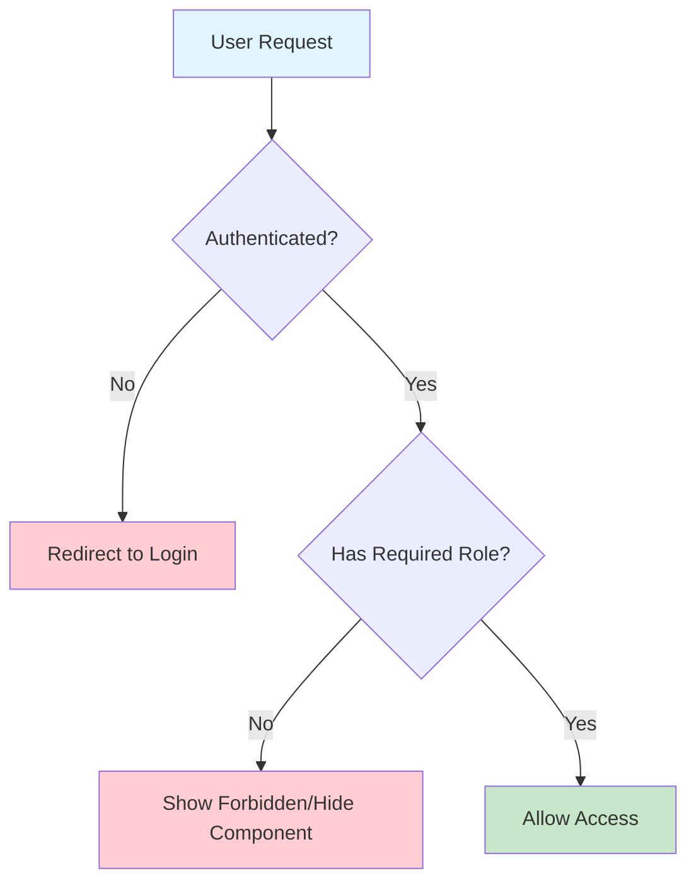
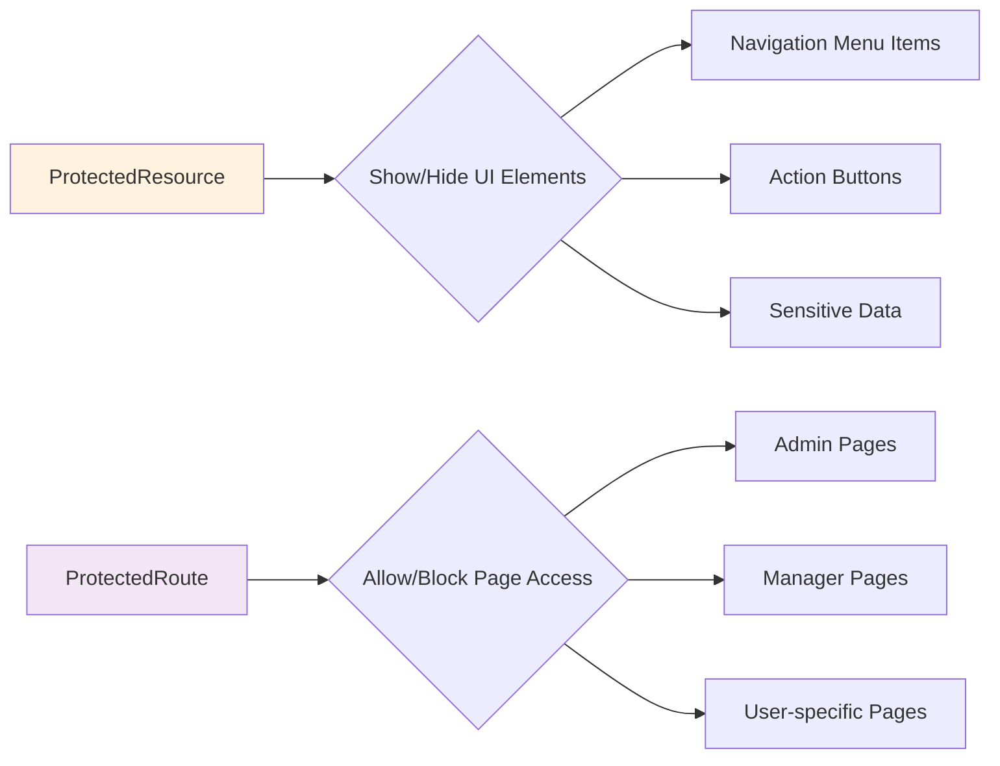

# Authorization & Access Control Implementation

## Overview

หลังจากที่เราได้ทำการ Authentication (การยืนยันตัวตน) เสร็จเรียบร้อยแล้ว ขั้นตอนถัดไปคือการจัดการ Authorization (การควบคุมสิทธิ์การเข้าถึง) เพื่อให้แต่ละผู้ใช้สามารถเข้าถึงเฉพาะข้อมูลและฟีเจอร์ที่เหมาะสมกับบทบาทของตนเท่านั้น

## 🎯 Objectives

- จำกัดการเข้าถึงข้อมูล Leave ให้เป็นของแต่ละผู้ใช้เท่านั้น
- ป้องกันไม่ให้ผู้ใช้ทั่วไปเข้าถึงพื้นที่ Admin
- สร้างระบบป้องกันการเข้าถึงทั้งในระดับ Component และ Route
- จัดการสิทธิ์ตามบทบาท (Role-based Access Control)

## 🔧 Implementation Details

### 1. การแก้ไข API สำหรับ Leave Management

#### Before: ปัญหาเดิม

```typescript
// API ส่งคืน Leave ทั้งหมดในระบบ
export async function GET() {
  const leaves = await findAll(); // ❌ ดึงข้อมูลทุกคน
  return Response.json(leaves);
}
```

#### After: การแก้ไข

```typescript
// features/leaves/api.ts
export async function GET() {
  // ✅ ตรวจสอบ Session ก่อน
  const session = await getServerSession();

  if (!session) {
    return Response.json({ error: "Please login" }, { status: 401 });
  }

  // ✅ ดึงเฉพาะ Leave ของผู้ใช้ปัจจุบัน
  const userId = +session.user.id;
  const leaves = await findAll(userId);
  return Response.json(leaves);
}

export async function POST(request: Request) {
  const session = await getServerSession();

  if (!session) {
    return Response.json({ error: "Please login" }, { status: 401 });
  }

  const data = await request.json();
  // ✅ แนบ User ID เข้ากับข้อมูลที่สร้าง
  const result = await add({
    ...data,
    userId: +session.user.id,
  });

  return Response.json(result, { status: 201 });
}
```

### 2. การสร้าง Protected Components

#### ProtectedResource Component

สำหรับซ่อน/แสดง Component ตามสิทธิ์

```typescript
// features/components/guard/protected-resource.tsx
"use client";

import { useSession } from "next-auth/react";
import { Role } from "@prisma/client";
import { ReactNode } from "react";

interface ProtectedResourceProps {
  children: ReactNode;
  roles?: Role[]; // Optional: ระบุบทบาทที่อนุญาต
}

export default function ProtectedResource({
  children,
  roles,
}: ProtectedResourceProps) {
  const { data: session, status } = useSession();

  // ⏳ กำลังโหลด
  if (status === "loading") {
    return <div>Loading...</div>;
  }

  // 🚫 ยังไม่ได้ Login
  if (status === "unauthenticated") {
    return null;
  }

  // ✅ Login แล้ว - ตรวจสอบสิทธิ์
  if (status === "authenticated") {
    // ถ้าไม่ระบุ roles = แสดงให้ทุกคนที่ login
    if (!roles) {
      return <>{children}</>;
    }

    // ตรวจสอบว่ามี role ที่อนุญาตหรือไม่
    if (session.user.role && roles.includes(session.user.role)) {
      return <>{children}</>;
    }
  }

  // 🚫 ไม่มีสิทธิ์
  return null;
}
```

#### การใช้งาน ProtectedResource

```typescript
// components/ui/header.tsx
import ProtectedResource from "@/features/components/guard/protected-resource";

export default function Header() {
  return (
    <nav>
      <Link href="/">Home</Link>
      <Link href="/leaves">My Leaves</Link>

      {/* ✅ แสดงเฉพาะ Admin และ Manager */}
      <ProtectedResource roles={["ADMIN", "MANAGER"]}>
        <Link href="/admin">Admin Panel</Link>
      </ProtectedResource>
    </nav>
  );
}
```

### 3. การสร้าง Route Protection

#### ProtectedRoute Component

สำหรับป้องกันการเข้าถึง Page โดยตรงผ่าน URL

```typescript
// features/components/guard/protected-route.tsx
"use client";

import { useSession } from "next-auth/react";
import { useRouter } from "next/navigation";
import { useState, useEffect, ReactNode } from "react";
import { Role } from "@prisma/client";
import { useUIStore } from "@/stores/ui-store";

interface ProtectedRouteProps {
  children: ReactNode;
  roles?: Role[];
}

export default function ProtectedRoute({
  children,
  roles,
}: ProtectedRouteProps) {
  const { data: session, status } = useSession();
  const router = useRouter();
  const [isAllowed, setIsAllowed] = useState(false);
  const { setToast } = useUIStore();

  useEffect(() => {
    // ⏳ รอการโหลดเสร็จ
    if (status === "loading") return;

    // 🚫 ไม่ได้ Login -> Redirect ไป Login
    if (status === "unauthenticated") {
      setToast({
        type: "error",
        message: "Please login before accessing this page",
      });
      router.replace("/auth/signin");
      return;
    }

    // ✅ Login แล้ว
    if (status === "authenticated") {
      // ถ้าไม่ระบุ roles = อนุญาตทุกคนที่ login
      if (!roles) {
        setIsAllowed(true);
        return;
      }

      // ตรวจสอบ role
      if (session && session.user.role && roles.includes(session.user.role)) {
        setIsAllowed(true);
      } else {
        // 🚫 ไม่มีสิทธิ์ -> Redirect ไป Forbidden
        setToast({
          type: "error",
          message: "You are not allowed to access this page",
        });
        router.replace("/forbidden");
      }
    }
  }, [status, session, roles, router, setToast]);

  // แสดง Loading ระหว่างตรวจสอบ
  if (status === "loading") {
    return <div>Loading...</div>;
  }

  // แสดงเนื้อหาเมื่อได้รับอนุญาต
  return isAllowed ? <>{children}</> : null;
}
```

#### การใช้งาน ProtectedRoute

```typescript
// app/admin/dashboard/page.tsx
import ProtectedRoute from "@/features/components/guard/protected-route";

export default function AdminDashboard() {
  return (
    <ProtectedRoute roles={["ADMIN", "MANAGER"]}>
      <div>
        <h1>Admin Dashboard</h1>
        <p>Welcome to admin panel!</p>
      </div>
    </ProtectedRoute>
  );
}
```

### 4. การสร้างหน้า Forbidden

```typescript
// app/forbidden/page.tsx
export default function ForbiddenPage() {
  return (
    <div className="min-h-screen flex items-center justify-center">
      <div className="text-center">
        <h1 className="text-6xl font-bold text-red-500 mb-4">403</h1>
        <h2 className="text-2xl font-semibold mb-2">Access Forbidden</h2>
        <p className="text-gray-600 mb-4">
          You don't have permission to access this page.
        </p>
        <Link href="/" className="text-blue-500 hover:underline">
          Go back to home
        </Link>
      </div>
    </div>
  );
}
```

### 5. การปรับปรุง Layout สำหรับ Admin

```typescript
// app/admin/layout.tsx
import ProtectedResource from "@/features/components/guard/protected-resource";

export default function AdminLayout({
  children,
}: {
  children: React.ReactNode;
}) {
  return (
    <div className="flex min-h-screen">
      {/* Sidebar */}
      <aside className="w-64 bg-gray-800 text-white p-4">
        <nav className="space-y-2">
          <ProtectedResource roles={["ADMIN", "MANAGER"]}>
            <Link href="/admin/dashboard">Dashboard</Link>
          </ProtectedResource>

          <ProtectedResource roles={["ADMIN"]}>
            <Link href="/admin/users">User Management</Link>
          </ProtectedResource>

          <ProtectedResource roles={["ADMIN", "MANAGER"]}>
            <Link href="/admin/leaves">Leave Management</Link>
          </ProtectedResource>

          <ProtectedResource roles={["ADMIN", "MANAGER"]}>
            <Link href="/admin/articles">Article Management</Link>
          </ProtectedResource>
        </nav>
      </aside>

      {/* Main Content */}
      <main className="flex-1 p-6">{children}</main>
    </div>
  );
}
```

## 🎨 Visual Flow Diagrams

### Authorization Flow



### Component Protection Strategy



## 🔄 Changes Made from Previous Version

### ✨ New Features Added:

1. **Session-based API Protection** - ทุก API endpoint ตรวจสอบ authentication
2. **Role-based Component Rendering** - แสดง/ซ่อน UI ตามสิทธิ์
3. **Route-level Protection** - ป้องกันการเข้าถึงหน้าผ่าน URL
4. **Forbidden Page** - หน้าแจ้งเตือนเมื่อไม่มีสิทธิ์
5. **Toast Notifications** - แจ้งเตือนเมื่อมีปัญหาสิทธิ์

### 🛠️ Improvements Made:

1. **Better Error Handling** - จัดการ error cases ทั้งหมด
2. **User Experience** - Loading states และ feedback ที่ชัดเจน
3. **Security** - ป้องกันการเข้าถึงข้อมูลแบบ bypass
4. **Code Organization** - แยก guard components เป็น module

### 🎯 Usage Examples

#### ตัวอย่างการใช้งานในแอปพลิเคชันจริง:

**1. ปกป้องเมนู Navigation:**

```typescript
<ProtectedResource roles={["ADMIN"]}>
  <AdminMenuItem />
</ProtectedResource>
```

**2. ปกป้องทั้งหน้า:**

```typescript
<ProtectedRoute roles={["ADMIN", "MANAGER"]}>
  <AdminDashboard />
</ProtectedRoute>
```

**3. ปกป้อง API Endpoints:**

```typescript
// ตรวจสอบ session ในทุก API call
const session = await getServerSession();
if (!session) return unauthorizedResponse();
```

## 📋 Testing Scenarios

| Scenario                              | Expected Behavior          |
| ------------------------------------- | -------------------------- |
| 🔓 Not logged in + Access `/admin`    | Redirect to `/auth/signin` |
| 👤 Regular user + Access admin menu   | Menu hidden                |
| 👤 Regular user + Direct URL to admin | Redirect to `/forbidden`   |
| 👑 Admin user + Access admin features | Full access granted        |
| 📊 User + Access own leaves           | Only own data shown        |
| 📊 User + Access others' leaves       | Blocked by API             |

## 🎉 Final Result

ระบบ Authorization ที่สมบูรณ์นี้ให้การคุมครองที่ครอบคลุมในหลายระดับ:

- **Component Level** - ซ่อน/แสดง UI elements
- **Route Level** - ป้องกันการเข้าถึงหน้าผ่าน URL
- **API Level** - ป้องกันการเรียกใช้ API โดยตรง
- **Data Level** - จำกัดข้อมูลตาม user context

ทำให้แอปพลิเคชันมีความปลอดภัยสูงและผู้ใช้ได้รับประสบการณ์ที่เหมาะสมตามบทบาทของตนเอง! 🚀
