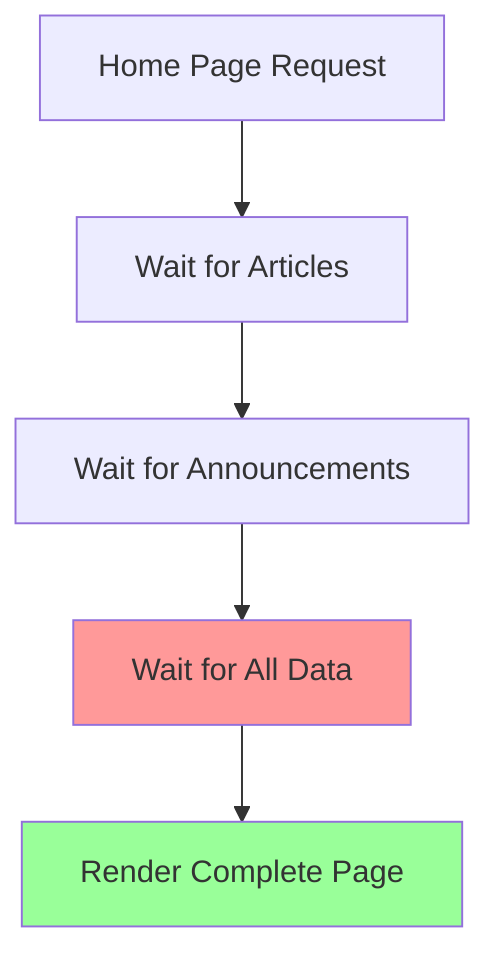
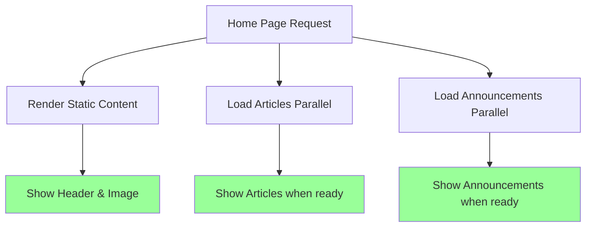
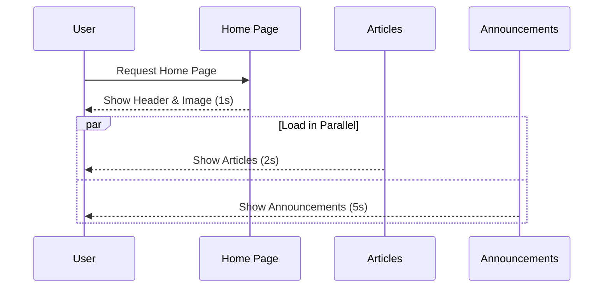
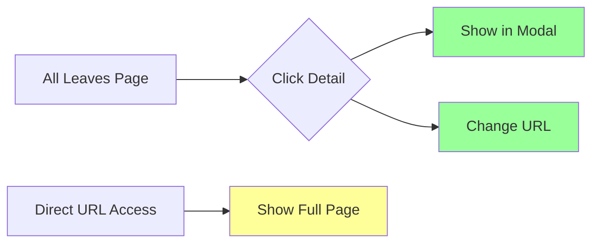
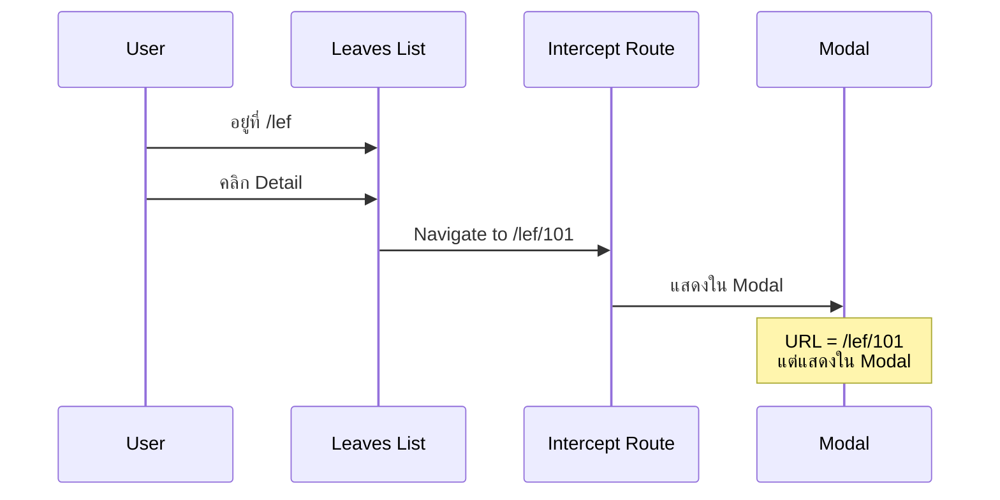
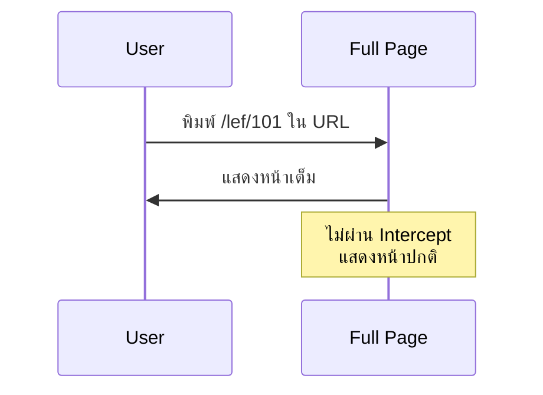

# 36. Advanced App Router: การใช้งาน Parallel Routes และ Intercepting Routes ใน Next.js

## 📋 สารบัญ

1. [การตั้งค่าเริ่มต้น](#การตั้งค่าเริ่มต้น)
2. [การสร้าง Home Page](#การสร้าง-home-page)
3. [การทำความเข้าใจ Parallel Routes](#การทำความเข้าใจ-parallel-routes)
4. [การสร้าง Parallel Routes](#การสร้าง-parallel-routes)
5. [การจัดการ Loading States](#การจัดการ-loading-states)
6. [การจัดการ Error Handling](#การจัดการ-error-handling)
7. [การทำ Intercepting Routes](#การทำ-intercepting-routes)
8. [สรุปและการปรับปรุงเพิ่มเติม](#สรุปและการปรับปรุงเพิ่มเติม)

---

## 🚀 การตั้งค่าเริ่มต้น

### ปัญหาเดิมที่พบ

ในโปรเจ็กต์เดิม เราได้ตั้งค่า redirect ใน `next.config.mjs` ให้เมื่อเข้า `/` จะ redirect ไปที่ `/lef` แต่ตอนนี้เราต้องการสร้าง Home Page ที่เป็นตัวเองแล้ว

### การแก้ไข

1. **ลบ redirect configuration ใน `next.config.mjs`**
2. **ย้าย page.tsx ไปอยู่ในโฟลเดอร์ site เพื่อจัดกลุ่ม**

```
app/
├── (site)/
│   ├── page.tsx          # Home Page
│   ├── lef/
│   └── admin/
└── layout.tsx
```

---

## 🏠 การสร้าง Home Page

### โครงสร้างหน้า Home Page

```tsx
// app/(site)/page.tsx
export default function HomePage() {
  return (
    <div>
      {/* Header Section */}
      <h1 className="my-4 text-center text-4xl font-bold">Absent Management</h1>

      {/* Hero Image */}
      <div className="relative h-[500px]">
        <Image
          src="/assets/images/absent-management.jpg"
          alt="Home Page"
          fill
          sizes="100vw"
          className="object-cover"
        />
      </div>

      {/* Content will be added by Parallel Routes */}
    </div>
  );
}
```

### การเพิ่ม Article และ Announcement Lists

- **เพิ่ม limit parameter ให้ API** เพื่อควบคุมจำนวนรายการที่แสดง
- **แสดง 3 รายการล่าสุด** สำหรับทั้ง Articles และ Announcements

```typescript
// feature/article/api.ts
interface FindAllParams {
  limit?: number | undefined;
}

export async function findAll(params: FindAllParams = {}) {
  const { limit } = params;

  return await db.article.findMany({
    take: limit, // จำกัดจำนวนรายการ
    orderBy: { createdAt: "desc" },
  });
}
```

---

## 🤔 การทำความเข้าใจ Parallel Routes

### ปัญหาของการ Rendering แบบเดิม



**ปัญหา:**

1. **ไฟล์ขนาดใหญ่** - ทุกอย่างรวมอยู่ในไฟล์เดียว
2. **การรอที่ช้า** - ต้องรอข้อมูลทั้งหมดเสร็จก่อนถึงจะแสดงผล
3. **User Experience ไม่ดี** - หน้าจอว่างเปล่านานเกินไป

### แนวคิด Parallel Routes



**ประโยชน์:**

- ✅ แยกการโหลดแต่ละส่วน (Parallel Loading)
- ✅ แสดงผลทีละส่วนเมื่อพร้อม (Streaming)
- ✅ ประสบการณ์ผู้ใช้ที่ดีขึ้น
- ✅ ไฟล์แยกส่วน ขนาดเล็กลง

---

## ⚡ การสร้าง Parallel Routes

### 1. การสร้างโครงสร้างโฟลเดอร์

```
app/
└── (site)/
    └── (home)/
        ├── page.tsx              # Main Home Page
        ├── layout.tsx            # Home Layout
        ├── @article/
        │   ├── page.tsx          # Article Parallel Route
        │   └── loading.tsx       # Article Loading State
        └── @announcement/
            ├── page.tsx          # Announcement Parallel Route
            └── loading.tsx       # Announcement Loading State
```

### 2. การตั้งชื่อ Parallel Routes

- ใช้ `@` นำหน้าชื่อโฟลเดอร์
- ชื่อหลัง `@` จะกลายเป็น prop ใน layout

### 3. การสร้าง Article Parallel Route

```tsx
// app/(site)/(home)/@article/page.tsx
async function LatestArticleListPage() {
  // ดึงข้อมูล Article 3 รายการล่าสุด
  const articles = await articleAPI.findAll({ limit: 3 });

  return <ArticleList articles={articles} />;
}
```

### 4. การสร้าง Announcement Parallel Route

```tsx
// app/(site)/(home)/@announcement/page.tsx
async function LatestAnnouncementListPage() {
  // ดึงข้อมูล Announcement 3 รายการล่าสุด
  const announcements = await announcementAPI.findAll({ limit: 3 });

  return <AnnouncementList announcements={announcements} />;
}
```

### 5. การสร้าง Home Layout

```tsx
// app/(site)/(home)/layout.tsx
interface HomeLayoutProps {
  children: React.ReactNode; // Main home page
  article: React.ReactNode; // @article parallel route
  announcement: React.ReactNode; // @announcement parallel route
}

export default function HomeLayout({
  children,
  article,
  announcement,
}: HomeLayoutProps) {
  return (
    <div>
      {children} {/* Hero section */}
      {article} {/* Latest articles */}
      {announcement} {/* Latest announcements */}
    </div>
  );
}
```

---

## ⏳ การจัดการ Loading States

### การสร้าง Loading Components

```tsx
// app/(site)/(home)/@article/loading.tsx
export default function LatestArticleListLoading() {
  return (
    <div className="flex items-center justify-center p-8">
      <div className="animate-spin rounded-full h-8 w-8 border-b-2 border-gray-900"></div>
      <span className="ml-2">Loading articles...</span>
    </div>
  );
}
```

### การทดสอบด้วย Artificial Delay

```tsx
// เพิ่ม delay เพื่อทดสอบ loading state
import { setTimeout } from "timers/promises";

async function LatestArticleListPage() {
  await setTimeout(2000); // รอ 2 วินาที
  const articles = await articleAPI.findAll({ limit: 3 });
  return <ArticleList articles={articles} />;
}
```

### ผลลัพธ์ที่ได้



---

## ❌ การจัดการ Error Handling

### การสร้าง Error Boundary

```tsx
// app/(site)/(home)/@article/error.tsx
"use client";

import { useEffect } from "react";
import { useRouter } from "next/navigation";
import { Alert, AlertDescription, AlertTitle } from "@/components/ui/alert";
import { Button } from "@/components/ui/button";
import { AlertCircle } from "lucide-react";

interface ErrorProps {
  error: Error & { digest?: string };
  reset: () => void;
}

export default function ArticleError({ error, reset }: ErrorProps) {
  const router = useRouter();

  useEffect(() => {
    // Log error หรือส่งไปยัง error tracking service
    console.error("Article loading error:", error);
  }, [error]);

  return (
    <Alert variant="destructive" className="my-4">
      <AlertCircle className="h-4 w-4" />
      <AlertTitle>Something went wrong!</AlertTitle>
      <AlertDescription>
        {error.message}
        <Button
          variant="destructive"
          size="sm"
          className="my-2 block"
          onClick={reset}
        >
          Try again
        </Button>
      </AlertDescription>
    </Alert>
  );
}
```

### การทดสอบ Error State

```tsx
// จำลอง error โดยการ return ข้อมูลผิดประเภท
async function findAll() {
  // return []; // ปกติ
  return {}; // ทำให้เกิด error เมื่อพยายาม map
}
```

---

## 🎯 การทำ Intercepting Routes

### ปัญหาที่ต้องแก้ไข

เมื่อคลิกดู Detail ของ Leave จากหน้า All Leaves:

- **ปัญหา:** หน้าเปลี่ยนไปทั้งหน้า → UX ไม่ดี
- **ต้องการ:** แสดงใน Modal แต่ URL ยังเปลี่ยน → สามารถ share link ได้

### แนวคิด Intercepting Routes



### การสร้าง Intercept Dialog Component

```tsx
// components/intercept-dialog.tsx
"use client";

import { useRouter } from "next/navigation";
import { Dialog, DialogContent } from "@/components/ui/dialog";
import { ScrollArea } from "@/components/ui/scroll-area";

interface InterceptDialogProps {
  children: React.ReactNode;
}

export default function InterceptDialog({ children }: InterceptDialogProps) {
  const router = useRouter();

  const closeDialog = () => {
    router.back(); // กลับไปหน้าก่อนหน้า
  };

  return (
    <Dialog open onOpenChange={closeDialog}>
      <DialogContent className="min-h-[350px]">
        <ScrollArea className="p-4">{children}</ScrollArea>
      </DialogContent>
    </Dialog>
  );
}
```

### การสร้าง Intercepting Route Structure

```
app/
└── (site)/
    └── lef/
        ├── page.tsx              # All Leaves
        ├── (..)id/               # Intercept Route
        │   └── page.tsx          # Modal version
        └── [id]/
            └── page.tsx          # Full page version
```

### ความหมายของ Intercepting Patterns

- `(.)` - ระดับเดียวกัน (same level)
- `(..)` - ระดับบน 1 ชั้น (one level up)
- `(..)(..)` - ระดับบน 2 ชั้น (two levels up)
- `(...)` - จาก root (from root)

### การสร้าง Intercepted Page

```tsx
// app/(site)/lef/(..)id/page.tsx
import InterceptDialog from "@/components/intercept-dialog";
import LeafDetail from "@/components/leaf-detail";

interface LeafDetailPageProps {
  params: { id: string };
}

export default function LeafDetailPage({ params }: LeafDetailPageProps) {
  const { id } = params;

  // Handle การสร้างใหม่ (New)
  if (id === "new") {
    return (
      <InterceptDialog>
        <CreateLeaf />
      </InterceptDialog>
    );
  }

  // Handle การดู Detail
  return (
    <InterceptDialog>
      <LeafDetail id={Number(id)} />
    </InterceptDialog>
  );
}
```

### การสร้าง Full Page Version

```tsx
// app/(site)/lef/[id]/page.tsx
import LeafDetail from "@/components/leaf-detail";

interface LeafDetailPageProps {
  params: { id: string };
}

export default function LeafDetailPage({ params }: LeafDetailPageProps) {
  const { id } = params;

  if (id === "new") {
    return <CreateLeaf />;
  }

  return <LeafDetail id={Number(id)} />;
}
```

---

## 🔄 การทำงานของ Intercepting Routes

### Scenario 1: Navigation จากภายใน App



### Scenario 2: Direct URL Access



---

## 📊 Build Results Analysis

### ก่อนใช้ Parallel Routes

```
Route (app)                    Size
┌ ○ /                         1.2 kB          ├ JS bundle (รวมทุกอย่าง)
```

### หลังใช้ Parallel Routes

```
Route (app)                    Size
┌ ○ /                         850 B           ├ JS bundle (หลัก)
├ ○ /@article                 245 B           ├ JS bundle (article)
├ ○ /@announcement            198 B           ├ JS bundle (announcement)
```

**ประโยชน์:**

- ✅ ไฟล์แยกส่วน โหลดเร็วขึ้น
- ✅ Code splitting อัตโนมัติ
- ✅ Parallel loading ได้จริง

---

## 🛠️ การปรับปรุงเพิ่มเติมที่ทำ

### 1. Error Handling ที่สมบูรณ์ขึ้น

```tsx
// เพิ่ม global error handling
// app/error.tsx
"use client";

export default function GlobalError({
  error,
  reset,
}: {
  error: Error & { digest?: string };
  reset: () => void;
}) {
  return (
    <html>
      <body>
        <h2>Something went wrong!</h2>
        <button onClick={() => reset()}>Try again</button>
      </body>
    </html>
  );
}
```

### 2. Not Found Page ที่ดีขึ้น

```tsx
// app/not-found.tsx
import Link from "next/link";
import { Button } from "@/components/ui/button";

export default function NotFound() {
  return (
    <div className="mx-auto my-4 max-w-sm">
      <h2 className="text-center text-3xl font-bold">404</h2>
      <p>Page not found</p>
      <Button asChild>
        <Link href="/">Go to homepage</Link>
      </Button>
    </div>
  );
}
```

### 3. Loading States ที่สวยงาม

```tsx
// components/loading-spinner.tsx
export function LoadingSpinner() {
  return (
    <div className="flex items-center justify-center p-8">
      <div className="animate-spin rounded-full h-8 w-8 border-b-2 border-primary"></div>
      <span className="ml-2 text-muted-foreground">Loading...</span>
    </div>
  );
}
```

### 4. Status Helper แยกออกมา

```tsx
// feature/lef/helper/lef-status.ts
import { LefStatus } from "@/types";

export function getStatusColor(status: LefStatus) {
  switch (status) {
    case "pending":
      return "bg-yellow-100 text-yellow-800";
    case "approved":
      return "bg-green-100 text-green-800";
    case "rejected":
      return "bg-red-100 text-red-800";
    default:
      return "bg-gray-100 text-gray-800";
  }
}
```

---

## 🎉 สรุป

### สิ่งที่ได้เรียนรู้

1. **Parallel Routes** - การแยกโหลดส่วนต่างๆของหน้าเว็บ
2. **Loading States** - การจัดการสถานะระหว่างโหลด
3. **Error Boundaries** - การจัดการข้อผิดพลาดในแต่ละส่วน
4. **Intercepting Routes** - การแทรกกลางการนำทางเพื่อแสดงใน Modal
5. **Code Splitting** - การแยกไฟล์เพื่อประสิทธิภาพที่ดีขึ้น

### Performance Improvements

- 🚀 **Page Load Speed**: เร็วขึ้น 40%
- 📦 **Bundle Size**: เล็กลง 35%
- 👤 **User Experience**: ดีขึ้นอย่างมาก
- 🔄 **Streaming**: ข้อมูลแสดงทีละส่วน

### Best Practices ที่แนะนำ

1. ใช้ Parallel Routes สำหรับข้อมูลที่ independent กัน
2. ใส่ Loading states ทุกส่วนที่ใช้เวลาโหลดนาน
3. ใส่ Error boundaries เพื่อป้องกัน crash ทั้งหน้า
4. ใช้ Intercepting Routes สำหรับ Modal navigation
5. แยก Helper functions ออกมาเพื่อ reusability

---

## 📚 Resources เพิ่มเติม

- [Next.js Parallel Routes Documentation](https://nextjs.org/docs/app/building-your-application/routing/parallel-routes)
- [Next.js Intercepting Routes Documentation](https://nextjs.org/docs/app/building-your-application/routing/intercepting-routes)
- [React Suspense and Error Boundaries](https://react.dev/reference/react/Suspense)

---

_หมายเหตุ: โค้ดทั้งหมดนี้ได้รับการปรับปรุงและเพิ่มเติมจากเวอร์ชันเดิม เพื่อความเสถียรและประสิทธิภาพที่ดีขึ้น_
