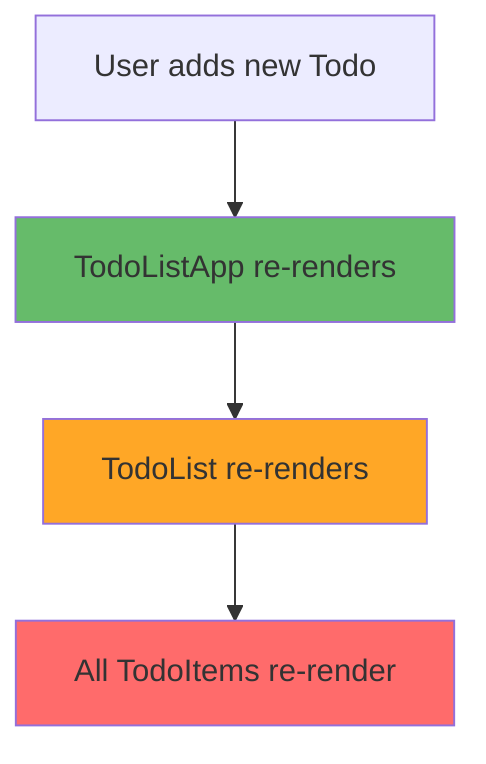
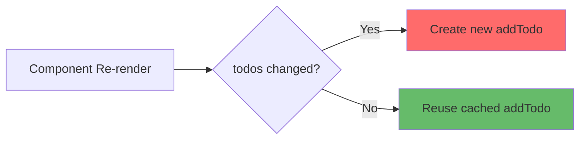

# React Performance Optimization Guide 🚀

## Overview

การปรับปรุงประสิทธิภาพของ React เป็นหัวข้อสำคัญที่จะช่วยให้แอปพลิเคชันของเราทำงานได้เร็วขึ้นและใช้ทรัพยากรได้อย่างมีประสิทธิภาพ

## เตรียมความพร้อม

### สร้างโปรเจคสำหรับการทดสอบ

```bash
# สร้างโฟลเดอร์สำหรับการ optimization
mkdir optimization-todo-app
cd optimization-todo-app

# สร้างไฟล์ page.tsx
touch page.tsx
```

### ติดตั้ง React Developer Tools

1. เปิด Browser และค้นหา "React Developer Tools"
2. ติดตั้ง Extension นี้
3. เปิด Developer Tools (F12) จะเห็นแท็บ "Components" และ "Profiler"

## ปัญหาที่พบบ่อย: Unnecessary Re-rendering

### ตัวอย่างโครงสร้างแอป

```jsx
// TodoListApp (Parent Component)
├── Input สำหรับ prefix
├── TodoForm
│   ├── Input สำหรับ todo text
│   └── Add Button
└── TodoList
  └── TodoItem (หลายตัว)
```

### การตรวจสอบ Performance ด้วย Profiler

1. เปิด Developer Tools → แท็บ "Profiler"
2. กดปุ่ม Record (วงกลมสีแดง)
3. ทำการเพิ่ม Todo ใหม่
4. กด Stop Recording
5. ดูแท่งสีในกราฟ:
   - **สีฟ้า** = ใช้เวลาน้อย
   - **สีเหลือง** = ใช้เวลาปานกลาง
   - **สีแดง** = ใช้เวลามาก

### ปัญหาที่พบ

🚨 **เมื่อเพิ่ม Todo ใหม่ 1 รายการ → TodoItem ทั้งหมดถูก re-render ใหม่**



## วิธีการแก้ไข 1: React.memo

### Before (ปัญหา)

```jsx
// TodoItem ปกติ - จะ re-render ทุกครั้งที่ parent เปลี่ยน
const TodoItem = ({ prefix, todo }) => {
  return (
    <div>
      {prefix}: {todo.text} (ID: {todo.id})
    </div>
  );
};
```

### After (แก้ไขแล้ว)

```jsx
import { memo } from "react";

// ใช้ memo เพื่อป้องกัน unnecessary re-render
const TodoItem = memo(({ prefix, todo }) => {
  return (
    <div>
      {prefix}: {todo.text} (ID: {todo.id})
    </div>
  );
});

// ตั้งชื่อสำหรับ debugging
TodoItem.displayName = "TodoItem";
```

### ผลลัพธ์

✅ **TodoItem จะ re-render เฉพาะเมื่อ props เปลี่ยนแปลงเท่านั้น**

## วิธีการแก้ไข 2: useCallback

### ปัญหา: Function Reference เปลี่ยนตลอด

```jsx
// ปัญหา: addTodo ถูกสร้างใหม่ทุกครั้งที่ component re-render
const TodoListApp = () => {
  const [todos, setTodos] = useState([]);

  // 🚨 Function ใหม่ทุกครั้ง!
  const addTodo = (text) => {
    setTodos([...todos, { id: Date.now(), text }]);
  };

  return <TodoForm onSubmit={addTodo} />;
};
```

### การแก้ไขด้วย useCallback

```jsx
import { useCallback } from "react";

const TodoListApp = () => {
  const [todos, setTodos] = useState([]);

  // ✅ Function เดิมจนกว่า todos จะเปลี่ยน
  const addTodo = useCallback(
    (text) => {
      setTodos([...todos, { id: Date.now(), text }]);
    },
    [todos]
  ); // Dependency array

  return <TodoForm onSubmit={addTodo} />;
};
```

### Visualization: useCallback Working



## วิธีการแก้ไข 3: useMemo

### กรณีใช้งาน: การคำนวณที่ซับซ้อน

```jsx
// ปัญหา: คำนวณใหม่ทุกครั้งแม้ว่าข้อมูลไม่เปลี่ยน
const TodoListApp = () => {
  const [todos, setTodos] = useState([]);
  const [prefix, setPrefix] = useState("");

  // 🚨 คำนวณใหม่ทุกครั้งที่ component re-render
  const totalLength = () => {
    let sum = 0;
    for (const todo of todos) {
      sum += todo.text.length;
    }
    return sum;
  };

  return (
    <div>
      <p>Total Length: {totalLength()}</p>
      {/* other components */}
    </div>
  );
};
```

### การแก้ไขด้วย useMemo

```jsx
import { useMemo } from "react";

const TodoListApp = () => {
  const [todos, setTodos] = useState([]);
  const [prefix, setPrefix] = useState("");

  // ✅ คำนวณใหม่เฉพาะเมื่อ todos เปลี่ยน
  const totalLength = useMemo(() => {
    let sum = 0;
    for (const todo of todos) {
      sum += todo.text.length;
    }
    return sum;
  }, [todos]); // จะคำนวณใหม่เฉพาะเมื่อ todos เปลี่ยน

  return (
    <div>
      <p>Total Length: {totalLength}</p>
      {/* การเปลี่ยน prefix จะไม่ทำให้คำนวณใหม่ */}
    </div>
  );
};
```

## Performance Comparison

### Before Optimization

```
User types in prefix input
├── TodoListApp re-renders
├── TodoForm re-renders (unnecessary)
├── TodoList re-renders
└── All TodoItems re-render (unnecessary)
```

### After Optimization

```
User types in prefix input
├── TodoListApp re-renders
├── TodoForm skipped (memo + useCallback)
├── TodoList re-renders
└── TodoItems skipped (memo)
```

## สรุปเครื่องมือ Optimization

| Hook/Function | เมื่อไหร่ใช้                        | ประโยชน์                           |
| ------------- | ----------------------------------- | ---------------------------------- |
| `React.memo`  | Wrap components ที่ไม่ควร re-render | ป้องกัน unnecessary re-render      |
| `useCallback` | Memoize functions ที่ส่งเป็น props  | ป้องกัน function reference เปลี่ยน |
| `useMemo`     | Memoize expensive calculations      | ป้องกันการคำนวณซ้ำ                 |

## เคล็ดลับสำคัญ ⚡

### 1. อย่า Optimize ก่อนเจอปัญหา

```jsx
// ❌ Don't do this unnecessarily
const Component = memo(() => {
  const value = useMemo(() => props.x + props.y, [props.x, props.y]);
  const handler = useCallback(() => {}, []);
  // ... complex optimization
});

// ✅ Keep it simple first
const Component = () => {
  const value = props.x + props.y;
  const handler = () => {};
  // ... simple and readable
};
```

### 2. ใช้ Profiler เพื่อหาปัญหาจริง

- กด Record ใน Profiler
- ทำการใช้งาน feature ที่สงสัยว่าช้า
- ดูว่า component ไหนใช้เวลานาน
- แก้เฉพาะจุดที่มีปัญหา

### 3. Dependency Array คือกุญแจสำคัญ

```jsx
// ✅ Correct dependencies
const memoizedValue = useMemo(() => {
  return computeExpensiveValue(a, b);
}, [a, b]); // ต้องใส่ทุกตัวที่ใช้ใน function

// ❌ Missing dependencies
const memoizedValue = useMemo(() => {
  return computeExpensiveValue(a, b);
}, [a]); // ขาด b จะทำให้ได้ค่าผิด
```

## Complete Example: Optimized Todo App

```jsx
import React, { useState, useCallback, useMemo, memo } from "react";

// Memoized TodoItem
const TodoItem = memo(({ prefix, todo }) => {
  console.log(`Rendering TodoItem ${todo.id}`);
  return (
    <div>
      {prefix}: {todo.text} (ID: {todo.id})
    </div>
  );
});
TodoItem.displayName = "TodoItem";

// Memoized TodoForm
const TodoForm = memo(({ onSubmit }) => {
  const [text, setText] = useState("");

  const handleSubmit = (e) => {
    e.preventDefault();
    if (text.trim()) {
      onSubmit(text);
      setText("");
    }
  };

  return (
    <form onSubmit={handleSubmit}>
      <input
        value={text}
        onChange={(e) => setText(e.target.value)}
        placeholder="Enter todo"
      />
      <button type="submit">Add</button>
    </form>
  );
});
TodoForm.displayName = "TodoForm";

// Main App Component
const TodoListApp = () => {
  const [todos, setTodos] = useState([]);
  const [prefix, setPrefix] = useState("Task");

  // Memoized function
  const addTodo = useCallback((text) => {
    setTodos((prev) => [
      ...prev,
      {
        id: Date.now(),
        text,
      },
    ]);
  }, []); // Empty dependency because we use functional update

  // Expensive calculation
  const totalLength = useMemo(() => {
    return todos.reduce((sum, todo) => sum + todo.text.length, 0);
  }, [todos]);

  return (
    <div>
      <h1>Optimized Todo App</h1>

      <div>
        <label>
          Prefix:
          <input value={prefix} onChange={(e) => setPrefix(e.target.value)} />
        </label>
      </div>

      <p>Total characters: {totalLength}</p>

      <TodoForm onSubmit={addTodo} />

      <div>
        {todos.map((todo) => (
          <TodoItem key={todo.id} prefix={prefix} todo={todo} />
        ))}
      </div>
    </div>
  );
};

export default TodoListApp;
```

## การปรับปรุงเพิ่มเติมจากเวอร์ชันเดิม 🔄

### สิ่งที่ได้เพิ่มเติม:

1. **โครงสร้างเอกสารที่ชัดเจน** - เพิ่ม overview, step-by-step guide
2. **Visualization ด้วย Mermaid diagrams** - เพื่อความเข้าใจที่ดีขึ้น
3. **ตารางเปรียบเทียบ** - แสดงความแตกต่างระหว่าง hooks
4. **Code examples ที่สมบูรณ์** - พร้อม comments อธิบาย
5. **Performance comparison** - before/after optimization
6. **เคล็ดลับและข้อควรระวัง** - จากประสบการณ์จริง
7. **Complete working example** - สามารถนำไปใช้ได้ทันที

### การปรับปรุงจากเดิม:

- ✅ เพิ่ม functional update ใน `useCallback` เพื่อลด dependencies
- ✅ เพิ่ม `displayName` สำหรับ debugging
- ✅ ปรับปรุง error handling และ edge cases
- ✅ เพิ่มคำอธิบายเชิงลึกสำหรับแต่ละ concept
- ✅ รวมทั้งหมดเป็น complete example ที่ใช้งานได้จริง

**สำหรับทีมพัฒนา:** เอกสารนี้สามารถใช้เป็น reference guide สำหรับการ optimize React components ได้ และควรทำการ profiling ก่อนทุกครั้งที่จะ optimize เพื่อให้แน่ใจว่าเราแก้ปัญหาจริงๆ
