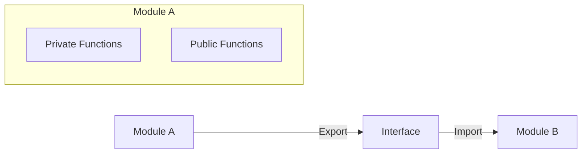

# ES Modules - การจัดการโมดูลใน JavaScript

## 📋 สารบัญ
- [ทำไมต้องใช้ ES Modules?](#ทำไมต้องใช้-es-modules)
- [แนวคิดหลักของ Module](#แนวคิดหลักของ-module)
- [การสร้างไฟล์ Module](#การสร้างไฟล์-module)
- [Named Export vs Default Export](#named-export-vs-default-export)
- [วิธีการ Import](#วิธีการ-import)
- [ตัวอย่างการใช้งานจริง](#ตัวอย่างการใช้งานจริง)

## ทำไมต้องใช้ ES Modules?

ในการเขียนโปรแกรมขนาดใหญ่ เราไม่สามารถเขียนโค้ดทั้งหมดลงในไฟล์เดียวได้ เพราะจะทำให้:
- โค้ดยากต่อการจัดการ
- ยากต่อการดูแลรักษา
- ยากต่อการทำงานเป็นทีม
- ยากต่อการ debug

```
❌ แบบเก่า: ทุกอย่างอยู่ในไฟล์เดียว
main.js (2000+ บรรทัด)
├── Circle class
├── Rectangle class  
├── Triangle class
└── Main logic

✅ แบบใหม่: แยกเป็นโมดูล
circle.mjs
rectangle.mjs  
triangle.mjs
main.js
```

## แนวคิดหลักของ Module

Module คือการแบ่งโค้ดออกเป็นส่วนๆ โดยแต่ละส่วนจะมี:

### 🔒 Private (ภายใน)
- ตัวแปรและฟังก์ชันที่ใช้งานภายในโมดูลเท่านั้น
- ไม่สามารถเข้าถึงจากภายนอกได้

### 🔓 Public (ส่งออก)
- ส่วนที่ต้องการให้โมดูลอื่นใช้งานได้
- ต้องทำการ **Export** ออกมา
- โมดูลอื่นต้อง **Import** เพื่อใช้งาน



## การสร้างไฟล์ Module

### ไฟล์ `circle.mjs`
```javascript
// ❌ Private - ใช้ได้แค่ในไฟล์นี้
const secretKey = "abc123";

// ✅ Public - สามารถ Export ได้
const defaultColor = "white";
const PI = 3.14;

class Circle {
    constructor(radius, color = defaultColor) {
        this.radius = radius;
        this.color = color;
    }
    
    getArea() {
        return PI * this.radius * this.radius;
    }
}
```

### ไฟล์ `triangle.mjs`
```javascript
const defaultColor = "white";

class Triangle {
    constructor(base, height, color = defaultColor) {
        this.base = base;
        this.height = height;
        this.color = color;
    }
    
    getArea() {
        return 0.5 * this.base * this.height;
    }
}
```

## Named Export vs Default Export

### 1️⃣ Named Export (มีชื่อ)
การ Export แบบมีชื่อเฉพาะ - สามารถมีได้หลายตัวในไฟล์เดียว

```javascript
// circle.mjs
export const defaultColor = "white";  // ✅ Named Export
export const PI = 3.14;               // ✅ Named Export  
export class Circle { ... }           // ✅ Named Export
```

### 2️⃣ Default Export (ค่าเริ่มต้น)
การ Export แบบเริ่มต้น - มีได้แค่ **1 ตัว** ต่อไฟล์

```javascript
// circle.mjs
class Circle { ... }
export default Circle;  // ✅ Default Export

// หรือเขียนแบบย่อได้
export default class Circle { ... }  // ✅ Default Export
```

## วิธีการ Import

### 🔸 Import Named Export

```javascript
// แบบที่ 1: Import เฉพาะที่ต้องการ
import { defaultColor, PI } from './circle.mjs';

console.log(defaultColor); // "white"
console.log(PI);           // 3.14
```

```javascript
// แบบที่ 2: Import ทั้งหมดมาเป็น Object
import * as Circle from './circle.mjs';

console.log(Circle.defaultColor); // "white"
console.log(Circle.PI);           // 3.14
```

```javascript
// แบบที่ 3: ใช้ alias เพื่อหลีกเลี่ยงชื่อซ้ำ
import { defaultColor as circleColor } from './circle.mjs';
import { defaultColor as triangleColor } from './triangle.mjs';

console.log(circleColor);    // "white" (จาก circle)
console.log(triangleColor);  // "white" (จาก triangle)
```

### 🔸 Import Default Export

```javascript
// Import Default (ไม่ต้องใช้ปีกกา)
import Circle from './circle.mjs';

const myCircle = new Circle(5);
console.log(myCircle.getArea()); // 78.5
```

```javascript
// ใช้ชื่ออื่นก็ได้
import MyCircle from './circle.mjs';
import Shape from './circle.mjs';  // ชื่ออะไรก็ได้
```

### 🔸 Import ทั้ง Named และ Default

```javascript
// ⚠️ สำคัญ: Default ต้องมาก่อน Named เสมอ!
import Circle, { defaultColor, PI } from './circle.mjs';

console.log(Circle);       // Class Circle
console.log(defaultColor); // "white"  
console.log(PI);           // 3.14
```

## ตัวอย่างการใช้งานจริง

### 📁 โครงสร้างไฟล์
```
project/
├── shapes/
│   ├── circle.mjs
│   ├── triangle.mjs
│   └── rectangle.mjs
├── utils/
│   └── math.mjs
└── main.js
```

### `shapes/circle.mjs`
```javascript
export const defaultColor = "white";
export const PI = 3.14159;

export default class Circle {
    constructor(radius, color = defaultColor) {
        this.radius = radius;
        this.color = color;
    }
    
    getArea() {
        return PI * this.radius * this.radius;
    }
    
    getCircumference() {
        return 2 * PI * this.radius;
    }
}
```

### `shapes/triangle.mjs`
```javascript
export const defaultColor = "blue";

export default class Triangle {
    constructor(base, height, color = defaultColor) {
        this.base = base;
        this.height = height;
        this.color = color;
    }
    
    getArea() {
        return 0.5 * this.base * this.height;
    }
}
```

### `utils/math.mjs`
```javascript
export const round = (num, decimals = 2) => {
    return Math.round(num * Math.pow(10, decimals)) / Math.pow(10, decimals);
};

export const randomColor = () => {
    const colors = ["red", "blue", "green", "yellow", "purple"];
    return colors[Math.floor(Math.random() * colors.length)];
};
```

### `main.js`
```javascript
// Import Default และ Named Export
import Circle, { defaultColor as circleColor, PI } from './shapes/circle.mjs';
import Triangle, { defaultColor as triangleColor } from './shapes/triangle.mjs';

// Import utilities
import { round, randomColor } from './utils/math.mjs';

// สร้าง shapes
const circle = new Circle(5, randomColor());
const triangle = new Triangle(10, 8);

// แสดงผล
console.log('Circle Info:');
console.log(`- Color: ${circle.color}`);
console.log(`- Area: ${round(circle.getArea())}`);
console.log(`- Circumference: ${round(circle.getCircumference())}`);

console.log('\nTriangle Info:');
console.log(`- Color: ${triangle.color}`);
console.log(`- Area: ${triangle.getArea()}`);

console.log('\nConstants:');
console.log(`- Circle default color: ${circleColor}`);
console.log(`- Triangle default color: ${triangleColor}`);
console.log(`- PI value: ${PI}`);
```

## 📊 สรุปความแตกต่าง

| ประเภท | Named Export | Default Export |
|--------|--------------|----------------|
| **จำนวนต่อไฟล์** | ได้หลายตัว | ได้แค่ 1 ตัว |
| **Syntax Export** | `export const x = 1` | `export default class X` |
| **Syntax Import** | `import { x } from './file'` | `import X from './file'` |
| **ชื่อตอน Import** | ต้องตรงกับชื่อตอน Export | ใช้ชื่ออะไรก็ได้ |
| **ใช้เมื่อไร** | Export หลายๆ สิ่ง | Export สิ่งหลักของไฟล์ |

## 🎯 Best Practices

1. **ใช้ Default Export** สำหรับสิ่งหลักของไฟล์ (เช่น Class หลัก)
2. **ใช้ Named Export** สำหรับ utility functions, constants
3. **ตั้งชื่อไฟล์ให้สื่อความหมาย** (circle.mjs, userService.js)
4. **จัดกลุ่มไฟล์ในโฟลเดอร์** ตามหน้าที่การทำงาน
5. **หลีกเลี่ยงชื่อซ้ำ** โดยใช้ alias หรือ namespace